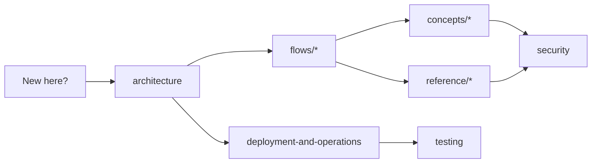
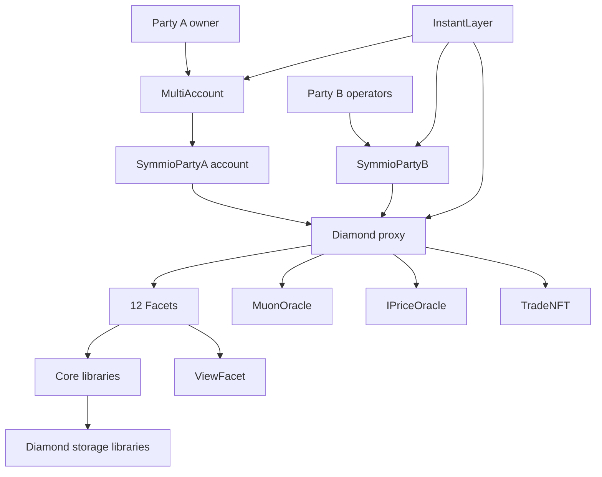

# Options Core Documentation

> [!abstract] TL;DR
> **Options Core** is an EIP-2535 Diamond protocol for on-chain options trading. Party A creates intents, Party B locks and fills them, and trades can later be partially closed, exercised at expiry, transferred, or liquidated. Every claim in these docs is anchored to a `contracts/path/file.sol:LINE` citation so it can be verified against source.

> [!info] Maintenance contract
> When contract behavior changes, **update the relevant doc in the same PR as the code change**. Stale docs in this folder are bugs.

## How To Read These Docs

> [!tip] Pick your path
>
> -   **First-time reader** → start with [[architecture]], then walk one [[open-intents|flow]] end to end.
> -   **Integrator / SDK author** → [[facets]] and [[events]].
> -   **Auditor** → [[security]] alongside the per-flow docs.
> -   **Operator** → [[deployment-and-operations]] and [[roles-and-pauses]].

## Top-Level Documents

| Document                      | What's inside                                                                            |
| ----------------------------- | ---------------------------------------------------------------------------------------- |
| [[architecture]]              | Diamond pattern, facet inventory, storage layout, library layering, helper contracts.    |
| [[security]]                  | Threat model, trust assumptions, invariants, attack surface, upgrade and oracle posture. |
| [[testing]]                   | Hardhat test layout, fixture model, run-context, how to add new behavior tests.          |
| [[deployment-and-operations]] | Hardhat tasks, deployment order, helper deploys, setup config, post-deploy checklist.    |

## Flows (life-of-a-trade)

End-to-end walkthroughs of each major lifecycle, with state machines, sequence diagrams, validation rules, accounting effects, errors, and worked numeric examples.

| Document                          | Covers                                                                                                           |
| --------------------------------- | ---------------------------------------------------------------------------------------------------------------- |
| [[account-balances]]              | Deposits, withdrawals (express, virtual, suspended), internal/external transfers, allocation, reserve.           |
| [[open-intents]]                  | Party A intent creation, Party B lock/fill, deferred Party B sell escrow, partial fills, fees, premium, cancels. |
| [[close-and-settlement]]          | Close intents, fills, settlement (PnL + exercise fees), trade NFTs, transfers.                                   |
| [[instant-actions]]               | Party A↔Party B binding, instant action mode, MultiAccount, SymmioPartyA/B, InstantLayer EIP-712 batches.       |
| [[liquidation-and-force-actions]] | Force cancellations, flag/liquidate flows, confiscation/distribution, intent cancellation in liquidation.        |

## Concepts (cross-cutting deep dives)

| Document                  | Covers                                                                                                                            |
| ------------------------- | --------------------------------------------------------------------------------------------------------------------------------- |
| [[glossary]]              | A-Z definitions of every domain term used in the codebase and docs.                                                               |
| [[margin-modes]]          | Cross vs isolated margin, including deferred Party B sell escrow, storage, restrictions, transfer rules, liquidation differences. |
| [[fee-model]]             | Open / close / exercise fees; default fee collector, affiliates, solver fees; deferred sell fee escrow; price-oracle role.        |
| [[oracle-and-signatures]] | Muon TSS + Schnorr, gateway co-sign, ECDSA/ERC-1271 verification, EIP-712, IPriceOracle.                                          |
| [[scheduled-release]]     | Two-step delayed isolated releases, sync/syncAll, manualSync, liquidation interaction.                                            |

## Reference (the API surface)

| Document              | Covers                                                                                         |
| --------------------- | ---------------------------------------------------------------------------------------------- |
| [[facets]]            | Every public/external function on every facet, with caller, modifiers, preconditions, effects. |
| [[events]]            | Every event emitted by the Diamond and helper contracts, with declaration + emission sites.    |
| [[errors]]            | Every custom error, trigger condition, and sample callsites grouped by domain.                 |
| [[types-and-storage]] | Every struct, enum, and storage library, with units, layouts, and reader/writer facets.        |
| [[roles-and-pauses]]  | Every role and pause flag, with grant chains, gated functions, and operational risk notes.     |

## Core Actors

-   **Party A** — the trader who owns open intents and trades. Either an EOA or a `SymmioPartyA` account managed by `MultiAccount`.
-   **Party B** — an active market maker / solver address configured through `ControlFacet.setPartyBConfig`.
-   **Clearing house** — address holding `CLEARING_HOUSE_ROLE` that drives liquidation flows.
-   **Admin & managers** — role bearers that configure collateral, symbols, oracles, fees, pauses, Party B settings, and emergency controls. See [[roles-and-pauses]].
-   **InstantLayer operator** — address with `OPERATOR_ROLE` on `InstantLayer` that executes signed Party A and Party B operations.
-   **Affiliates** — registered addresses that receive a configurable share of fees on intents that name them.

## High-Level Map

## Important Conventions

> [!important] Decimals
> User-facing deposits enter in collateral-token decimals and are normalized to **18 decimals** internally (`contracts/libraries/utils/LibDecimals.sol`). Almost every amount you see in balances, intents, trades, and tests is an 18-decimal value. See [[glossary]].

> [!warning] `requireSolvent` is not what it sounds like
> `LibParty.requireSolvent` only checks **"no active liquidation id exists for this `(partyA, partyB, collateral)` tuple"**. The economic insolvency check lives separately inside `LibClearingHouse`. This naming is a known surface gotcha — see [[security]].

> [!note] Cross-margin nonces
> Cross-margin paths increment **bilateral nonces** in both directions after balance-affecting fills so off-chain signatures can be invalidated. See [[account-balances]].

> [!note] Off-chain trust
> Settlement and uPnL prices come from a Muon TSS quorum, are verified Schnorr-style, and are co-signed by an off-chain gateway. See [[oracle-and-signatures]].

The repository-root `README.md` is intentionally minimal — detailed behavior lives in this folder.

## Quick Links

-   Facet selectors and upgrade flow: [[architecture#3. Upgrades|Architecture — Upgrades]]
-   Trust assumptions and invariants: [[security]]
-   Adding a new symbol or oracle: [[facets]] (`ControlFacet`)
-   Tracing a settlement: [[close-and-settlement]] → [[oracle-and-signatures]]
-   Writing a behavior test: [[testing]]
