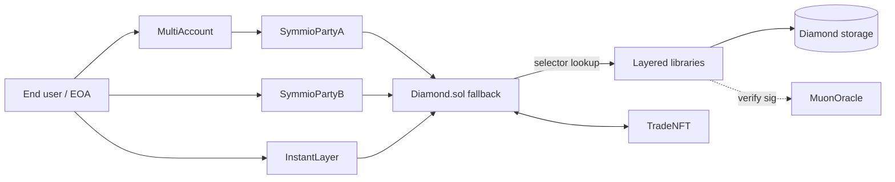
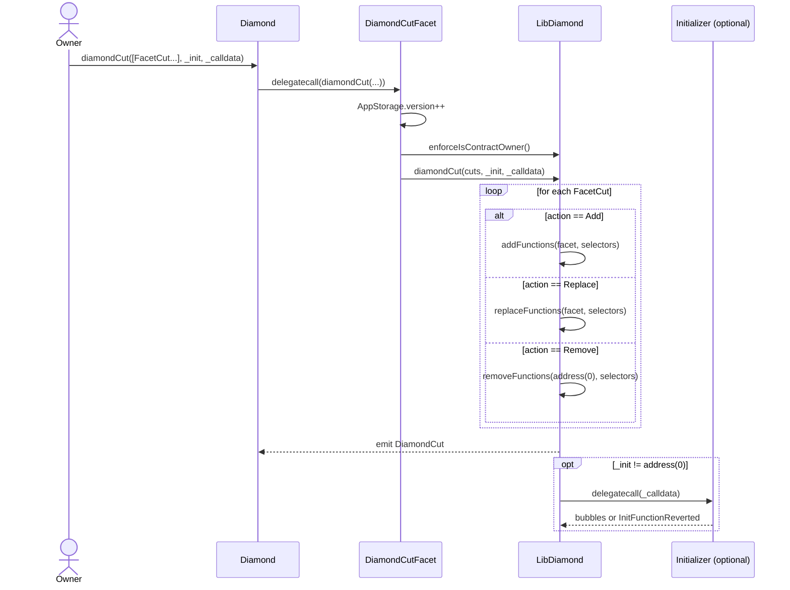
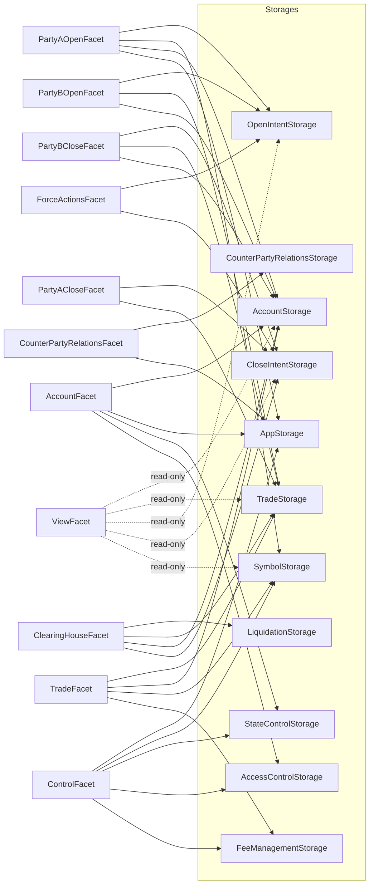
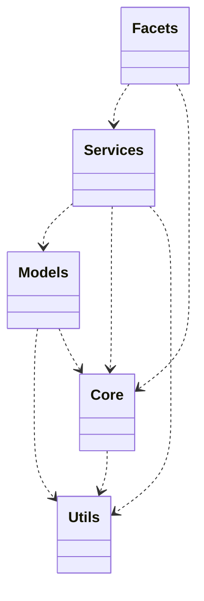
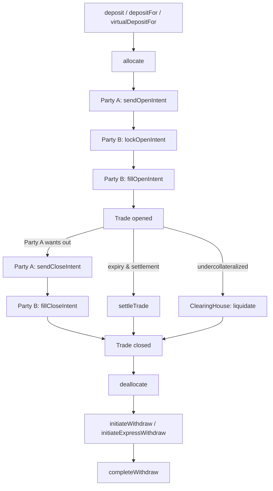

# Architecture

SYMM Options Core is an EIP-2535 Diamond options-trading protocol implemented in Solidity 0.8.19. State and behavior are split across a small set of facets sharing a single delegatecall context (`contracts/Diamond.sol`). All persistent state lives in domain-scoped diamond storage libraries; control flow is mediated by layered libraries (core, services, models, utils). This document is the entry point and orientation map for the codebase. Per-selector behavior, per-storage layout, role/pause matrices, event/error catalogs, and end-to-end flows live in the dedicated reference documents linked throughout.

Companion documents:

-   [[facets]] — per-facet, per-selector reference
-   [[types-and-storage]] — storage layouts, structs, enums, slot computation
-   [[roles-and-pauses]] — role catalog, pause flag matrix, modifiers
-   [[events]] — event catalog
-   [[errors]] — error catalog
-   [flows/](./flows) — deposit, intent, fill, settle, liquidate, withdraw end-to-end traces
-   [concepts/](./concepts) — domain concept primers (intents, trades, accounts, fees, oracles)
-   [[security]] — invariants, trust assumptions, audit-relevant notes
-   [[testing]] — test layout and execution
-   [[deployment-and-operations]] — deployment scripts and operational playbook

---

## 1. Big-Picture Overview

The on-chain surface is a single `Diamond` contract whose `fallback` resolves the call's 4-byte selector to a facet address held in `LibDiamond` storage and `delegatecall`s it. A facet is a stateless implementation contract: every read and write happens against the Diamond's storage slots, addressable via the diamond-storage pointer pattern. Around the Diamond sit a set of off-Diamond helpers — `MultiAccount`, `SymmioPartyA`, `SymmioPartyB`, `InstantLayer`, `TradeNFT`, `MuonOracle`, `SignatureVerifier` — that compose user-friendly account abstractions, signed-call execution, and oracle/signature verification on top of the raw selector surface.



The Diamond never holds the actual logic; logic always lives in facets and libraries. The Diamond never holds long-lived per-user balances in tokens — collateral is pulled in on `deposit*` and pushed out on `completeWithdraw`, and accounting happens in 18-decimal normalized units.

---

## 2. The Diamond Pattern

The Diamond implements [EIP-2535](https://eips.ethereum.org/EIPS/eip-2535). Three pieces collaborate.

### `contracts/Diamond.sol`

The constructor (`contracts/Diamond.sol:17`) sets the contract owner via `LibDiamond.setContractOwner` and registers the single `diamondCut(FacetCut[],address,bytes)` selector against the supplied `_diamondCutFacet`. Every other selector is added later via cuts. The fallback (`contracts/Diamond.sol:34`) loads the diamond-storage struct at the deterministic slot `keccak256("diamond.standard.diamond.storage")`, looks up `facetAddressAndSelectorPosition[msg.sig].facetAddress`, reverts `SystemErrors.FunctionDoesNotExist(selector)` if unknown, otherwise `delegatecall`s into the facet and bubbles return data verbatim. `receive()` is payable but the rest of the protocol does not use ETH.

### `contracts/libraries/core/LibDiamond.sol`

`LibDiamond` defines `DiamondStorage` (`contracts/libraries/core/LibDiamond.sol:20`) holding:

-   `mapping(bytes4 => FacetAddressAndSelectorPosition)` — primary selector dispatch table.
-   `bytes4[] selectors` — flat enumeration used by Loupe and removal bookkeeping.
-   `mapping(bytes4 => bool) supportedInterfaces` — ERC-165 advertisement.
-   `address contractOwner; address pendingOwner` — two-step ownership.

Ownership transfer is two-step: `transferOwnership` sets `pendingOwner` and emits `OwnershipTransferStarted`; `acceptOwnership` (called by the pending account) finalizes and emits `OwnershipTransferred`. Only `enforceIsContractOwner()` may invoke `diamondCut`. Cut helpers `addFunctions` / `replaceFunctions` / `removeFunctions` enforce: no zero facet address (Add/Replace), zero facet address required (Remove), no overwriting an existing selector with Add, no replace into the Diamond itself (immutable functions), and no replace with the same facet. After the selector mutations, `initializeDiamondCut(_init,_calldata)` runs the optional initializer via `delegatecall` so that initialization can write the Diamond's storage slots; init failure bubbles up the inner revert string or surfaces `SystemErrors.InitFunctionReverted`.

### `contracts/upgradeInitializer/DiamondInit.sol`

Run once at deployment via `diamondCut(..., _init=DiamondInit, _calldata=abi.encodeCall(DiamondInit.init,()))`. It seeds `supportedInterfaces[type(IERC165).interfaceId | type(IDiamondCut).interfaceId | type(IDiamondLoupe).interfaceId] = true`. Subsequent cuts may re-run a different initializer to migrate state.

### Selector Dispatch

Selector lookup is a pure storage read; cost is one `SLOAD` plus the delegatecall. Function selection is global across the Diamond — every facet contributes a disjoint selector set. The `DiamondLoupe` facet exposes the `selectors` array and the dispatch table for off-chain inspection.

---

## 3. Upgrades

Upgrades are performed with `DiamondCutFacet.diamondCut(FacetCut[] calldata _diamondCut, address _init, bytes calldata _calldata)` (`contracts/facets/DiamondCut/DiamondCutFacet.sol:20`). This facet entry point bumps `AppStorage.layout().version`, asserts the caller is the contract owner via `LibDiamond.enforceIsContractOwner`, and delegates to `LibDiamond.diamondCut`.

A `FacetCut` carries:

```solidity
struct FacetCut {
	address facetAddress;
	FacetCutAction action; // Add | Replace | Remove
	bytes4[] functionSelectors;
}
```



Notes on the cut semantics:

-   **Add** requires `facetAddress != 0`, requires the facet to have code, and rejects adding an already-registered selector (`CannotAddExistingFunction`).
-   **Replace** requires the new facet address to differ from the current one (`IdenticalReplace`), forbids replacing immutable functions defined on the Diamond itself (`ImmutableReplace`), and requires the selector to already exist (`NoReplaceTarget`).
-   **Remove** requires `facetAddress == address(0)` (`InvalidRemoveFacetAddress`) and uses swap-and-pop on the `selectors` array.
-   The optional `_init` runs as a `delegatecall` so it shares the Diamond's storage. Pass `_init=address(0)` and empty calldata to skip; pass either both empty or both nonzero — the mismatched cases revert `ZeroAddressWithNonemptyCalldata` / `NonZeroAddressWithEmptyCalldata`.

### Upgrade risks

-   **Storage layout drift**: every storage library uses an explicit named slot, so adding a facet does not collide. Adding/removing fields inside a `Layout` struct must respect the existing tail order, since each `Layout` occupies sequential slots starting from a single base. Initializer scripts must migrate any field that changes type or interpretation.
-   **Selector ownership**: a single selector can only be served by one facet. Renames of a Solidity function silently change the selector and orphan the old one; deployment scripts must compare against the current dispatch table.
-   **Init script idempotency**: an init script that double-flips a one-shot flag will brick subsequent cuts. Initializers should be designed for the specific cut they accompany and never reused blindly.
-   **`AppStorage.version`**: bumped on every cut; downstream off-chain consumers can watch this for cache invalidation.
-   **Owner key**: the contract owner is an unchecked single key; protect via multisig/timelock at deployment.

See also [[deployment-and-operations]] for the operational checklist.

---

## 4. Facet Inventory

Deployed facets (from `common/constants.ts`):

| Facet                        | Responsibility                                                                                                                                         | Pause flags respected                                                                                                                                                                          | Detail                                |
| ---------------------------- | ------------------------------------------------------------------------------------------------------------------------------------------------------ | ---------------------------------------------------------------------------------------------------------------------------------------------------------------------------------------------- | ------------------------------------- |
| `AccountFacet`               | Deposits, virtual deposits, internal/external transfers, withdrawal initiate/cancel/complete, express withdraw, sync, allocate/deallocate, reserve.    | `globalPaused`, `depositingPaused`, `withdrawingPaused`, `internalTransferPaused`, `externalTransferPaused`, `expressWithdrawPaused`, per-side party pause, suspension, withdrawal suspension. | [[facets#AccountFacet]]               |
| `ClearingHouseFacet`         | Liquidation flagging and execution, collateral confiscation/distribution, liquidation trade closure, liquidation intent cancellation.                  | `globalPaused`, `liquidationPaused`, `CLEARING_HOUSE_ROLE` gate.                                                                                                                               | [[facets#ClearingHouseFacet]]         |
| `ControlFacet`               | Roles, collateral whitelist, fees, symbols, oracles, timing parameters, Party B config, pause/unpause, suspension, instant-layer flag, balance limits. | Role-gated; toggles all other pause flags.                                                                                                                                                     | [[facets#ControlFacet]]               |
| `CounterPartyRelationsFacet` | Party A binding to Party B, unbinding cooldown, instant action mode activate/deactivate.                                                               | `globalPaused`, per-side party pause, suspension.                                                                                                                                              | [[facets#CounterPartyRelationsFacet]] |
| `DiamondCutFacet`            | EIP-2535 cut entry point.                                                                                                                              | Owner-gated only.                                                                                                                                                                              | [[facets#DiamondCutFacet]]            |
| `DiamondLoupeFacet`          | EIP-2535 introspection.                                                                                                                                | None.                                                                                                                                                                                          | [[facets#DiamondLoupeFacet]]          |
| `ForceActionsFacet`          | Timeout-based forced cancellation of cancel-pending open and close intents.                                                                            | `globalPaused`, third-party action pause, per-side party pause.                                                                                                                                | [[facets#ForceActionsFacet]]          |
| `PartyAOpenFacet`            | Open intent creation, expiration, Party A cancellation requests.                                                                                       | `globalPaused`, `partyAActionsPaused`, suspension, instant-mode gate.                                                                                                                          | [[facets#PartyAOpenFacet]]            |
| `PartyACloseFacet`           | Close intent creation, expiration, Party A cancellation requests.                                                                                      | `globalPaused`, `partyAActionsPaused`, suspension, instant-mode gate.                                                                                                                          | [[facets#PartyACloseFacet]]           |
| `PartyBOpenFacet`            | Party B lock, unlock, accept-cancel, fill open intents.                                                                                                | `globalPaused`, `partyBActionsPaused`, Party B emergency mode, exclusive window.                                                                                                               | [[facets#PartyBOpenFacet]]            |
| `PartyBCloseFacet`           | Party B fill close intents, accept-cancel.                                                                                                             | `globalPaused`, `partyBActionsPaused`, Party B emergency mode.                                                                                                                                 | [[facets#PartyBCloseFacet]]           |
| `TradeFacet`                 | Trade transfer, NFT-driven ownership sync, settlement execution, trade NFT minting.                                                                    | `globalPaused`, NFT-related pauses, party pause.                                                                                                                                               | [[facets#TradeFacet]]                 |
| `ViewFacet`                  | Read-only state and helper computations (PnL, fees).                                                                                                   | None.                                                                                                                                                                                          | [[facets#ViewFacet]]                  |

The exhaustive selector list (signature, modifiers, preconditions, effects, events, reverts) is in [[facets]]. Pause-flag-to-modifier mapping lives in [[roles-and-pauses]].

---

## 5. Storage Architecture

Storage uses the diamond-storage pattern: each storage library declares a `bytes32` slot derived from `keccak256("diamond.standard.storage.<domain>")` and exposes a `layout()` helper that loads a struct pointer from that slot via inline assembly. Because each domain owns its own slot, layouts can grow independently without colliding, and cuts can introduce new domains without touching existing ones. All amounts inside the Diamond are normalized to 18 decimals at the boundary of `AccountFacet`.

`AppStorage` (`contracts/storages/AppStorage.sol`) anchors global parameters: protocol `version`, `callFromInstantLayer` flag, per-collateral `balanceLimitPerUser`, `maxCloseOrdersLength`, `maxTradePerPartyA`, oracle and signature verifier addresses, whitelisted collateral, signature replay set (`isSigUsed`), Party A/B deallocation cooldowns, force-cancel timeouts, Party B exclusive window, settlement and uPnL signature validity periods, Party B configurations, and per-Party-B supported symbol type set.

Other domain-scoped libraries (referenced from `contracts/storages/`):

| Storage library                | Main data                                                                                                                      |
| ------------------------------ | ------------------------------------------------------------------------------------------------------------------------------ |
| `AppStorage`                   | Global parameters above.                                                                                                       |
| `AccountStorage`               | Isolated balances, release intervals, nonces, withdrawal records, express-withdraw provider config, external transfer targets. |
| `OpenIntentStorage`            | Open intents, active open intent indexes, last open intent id, deferred Party B sell escrows.                                  |
| `CloseIntentStorage`           | Close intents by id and by trade, last close intent id.                                                                        |
| `TradeStorage`                 | Trades, active Party A/Party B trade indexes, last trade id.                                                                   |
| `SymbolStorage`                | Oracles, symbols, symbol validity, collateral, option type, platform fees.                                                     |
| `FeeManagementStorage`         | Default fee collector, affiliate status/collectors, affiliate fee config.                                                      |
| `LiquidationStorage`           | Liquidation details, in-progress liquidation id lookup.                                                                        |
| `CounterPartyRelationsStorage` | Bound Party B, unbinding requests, instant action mode, instant mode deactivation cooldown.                                    |
| `StateControlStorage`          | Pause flags, Party B emergency modes, suspended addresses, suspended withdrawals.                                              |
| `AccessControlStorage`         | Role membership, reentrancy guard status.                                                                                      |
| `LibDiamond.DiamondStorage`    | Selector dispatch, loupe selectors array, supported interfaces, owner.                                                         |

For the full struct layouts, slot constants, and field types see [[types-and-storage]].



---

## 6. Library Architecture

Libraries under `contracts/libraries/` are layered. Higher layers depend on lower; lower layers never call upward. Service libraries are the workhorse implementation behind facet entry points; model libraries provide pure manipulators on a single struct family; core libraries provide protocol-wide primitives (Diamond, accessibility, pausing, reentrancy, Muon verification); util libraries are stateless helpers (decimals, math, signatures).



| Layer                           | Examples                                                                                                                             | Role                                                                                                                                |
| ------------------------------- | ------------------------------------------------------------------------------------------------------------------------------------ | ----------------------------------------------------------------------------------------------------------------------------------- |
| Core (`libraries/core`)         | `LibDiamond`, `LibAccessibility`, `LibPausable`, `LibMuon`, `LibReentrancy`                                                          | Diamond plumbing, role checks, pause checks, oracle signature verification, reentrancy guard.                                       |
| Services (`libraries/services`) | `AccountService`, `OpenIntentService`, `CloseIntentService`, `TradeService`, `LiquidationService`, `FeeService`, `SettlementService` | Facet-facing business operations. Each facet entry point is a thin shell that applies modifiers and forwards to a service function. |
| Models (`libraries/models`)     | `IntentModel`, `TradeModel`, `WithdrawModel`, `SymbolModel`                                                                          | Struct-local helpers (state transitions, getters, validators). Stateless w.r.t. anything outside the passed-in struct.              |
| Utils (`libraries/utils`)       | `DecimalsLib`, `LibSignature`, `LibMath`                                                                                             | Pure functions: 18-decimal normalization, EIP-712 hashing/recovery, math helpers.                                                   |

Facets should contain no inline logic beyond modifier application and a service call. Service functions perform precondition checks, mutate domain storage, and emit events.

---

## 7. Cross-Cutting Concerns

### Reentrancy

`LibReentrancy` (used through the `nonReentrant` modifier in `Accessibility`) flips a guard slot in `AccessControlStorage`. Token-touching paths — `deposit*`, `externalTransfer`, `initiateExpressWithdraw`, `completeWithdraw` — all carry `nonReentrant`. Internal accounting paths that never touch external code generally omit it; see the per-selector `Modifiers` lines in [[facets]].

### Pausing

`StateControlStorage` holds independent pause flags: global, deposit, withdraw, internal transfer, external transfer, express withdraw, Party A actions, Party B actions, third-party actions, liquidation, instant layer, plus per-side pause maps. Pause modifiers are defined on the `Pausable` base and applied on each facet selector that should respect the flag. The `PAUSER_ROLE` flips flags on; `UNPAUSER_ROLE` flips them off. Each Party B may also enter an emergency mode (per-Party-B pause). Full flag-to-selector matrix is in [[roles-and-pauses]].

### Suspension

`SUSPENDER_ROLE` may suspend an address (any incoming or outgoing user operation reverts) and may also suspend a specific withdrawal id (to halt completion of a withdrawal under dispute). `DISPUTER_ROLE` may restore disputed withdrawals.

### Decimal Normalization

User-facing token amounts enter through `AccountFacet` deposit functions and leave through `completeWithdraw`. `DecimalsLib` normalizes to 18 decimals on entry and denormalizes on exit. All storage and inter-facet arithmetic uses 18-decimal units, removing decimals as a foot-gun from the rest of the codebase.

### Bilateral Nonces

Each (Party A, Party B) pair tracks a nonce in `AccountStorage` that increments on accounting-affecting events (allocations, fills, settlements, liquidations). Off-chain signatures bound to a stale nonce are rejected. The mechanism, its rationale, and the off-chain signing protocol are documented in [[account-balances]].

### Signature Replay

`AppStorage.isSigUsed` (keyed by signature hash) marks every consumed signature to prevent replay across the system. `AppStorage.signatureVerifier` points at the active `SignatureVerifier` helper for EOA + ERC-1271 verification.

---

## 8. External Interfaces

| Interface                  | Expected behavior                                                                                                                                       | Caller inside Diamond                              | Security note                                                                                                                                                                         |
| -------------------------- | ------------------------------------------------------------------------------------------------------------------------------------------------------- | -------------------------------------------------- | ------------------------------------------------------------------------------------------------------------------------------------------------------------------------------------- |
| `IPriceOracle`             | Returns the price of the fee token denominated in collateral, used to size up-front fees on intent creation.                                            | `OpenIntentService` (during open intent creation). | Owner-set address (`AppStorage.priceOracleAddress`). Stale or manipulable pricing inflates/deflates user-paid fees; oracle must be a trusted source or apply on-chain TWAP smoothing. |
| `IExpressWithdrawProvider` | Receives an express withdraw request, immediately funds the recipient, and is repaid from the locked withdraw record on `completeWithdraw`.             | `AccountService`.                                  | Per-collateral configurable. Provider must be solvent and trusted; a malicious provider can drain the locked withdraw on completion.                                                  |
| `IExternalTransferTarget`  | Receives `deposit(collateral, user, amount)` after the Diamond pushes tokens, integrating the transfer with an external system (e.g., a bridge or CEX). | `AccountService.externalTransfer`.                 | Whitelisted per collateral. Must not re-enter the Diamond and must accept the standardized 18-decimal amount conversion done by the helper.                                           |
| `IMuonOracle`              | Verifies TSS + gateway signatures over (price, uPnL, settlement) payloads; returns recovered identity for replay checking.                              | `LibMuon` (used by settlement, uPnL checks).       | Trust root for fairness. Compromise of the Muon TSS allows arbitrary settlement/PnL forgeries.                                                                                        |
| `ITradeNFT`                | ERC-721 contract minted on trade open; its ownership transfer drives `TradeFacet.transferTradeFromNFT`, rebinding the trade to the new owner.           | `TradeFacet`.                                      | Diamond-side address is set by `SETTER_ROLE`. NFT contract must restrict mints to the Diamond and call back into `transferTradeFromNFT` synchronously.                                |
| `ISignatureVerifier`       | Verifies arbitrary EOA or ERC-1271 signatures used by InstantLayer and elsewhere.                                                                       | Many facets via `AppStorage.signatureVerifier`.    | Must implement the agreed verification semantics; replacing it with a permissive verifier opens broad signature forgery.                                                              |

---

## 9. Helper Contract Layer (Off-Diamond)

These contracts live next to the Diamond but are independent deployments. They do not share storage; they communicate via Diamond function calls, NFT transfers, and signed messages.

**MultiAccount.** Factory and router for `SymmioPartyA` smart accounts. A user creates a `SymmioPartyA` through `MultiAccount`, then calls into the Diamond by routing through `MultiAccount` (which forwards to the account, which forwards to the Diamond). It validates account-issued signatures via ERC-1271 and forwards calls originated by the user or by `InstantLayer`. See [[account-balances]].

**SymmioPartyA.** Minimal account contract that proxies calls to the Diamond as `msg.sender`. Holds NFTs (trade NFTs in particular) and may transfer them on demand. The Diamond sees `SymmioPartyA` as the user.

**SymmioPartyB.** Upgradeable executor used by the Party B operator. Restricts which selectors can be invoked, supports multicall, manages token approvals, has its own pausability, and validates signatures via ERC-1271. The Diamond sees `SymmioPartyB` as the Party B principal.

**InstantLayer.** EIP-712 operation executor. Accepts a Party-A-signed and/or Party-B-signed payload describing a Diamond call, verifies the signatures, sets `AppStorage.callFromInstantLayer = true` for the duration of the call, and dispatches into the Diamond. Templates and batches let Party A pre-authorize a class of operations. Replay protection is enforced via `AppStorage.isSigUsed`. Selectors that are sensitive to delegated execution (e.g., binding, internal transfers) reject calls when `callFromInstantLayer` is true via `whenInstantModeIsNotActive`.

**TradeNFT.** ERC-721 minted when a trade opens. Ownership of the NFT _is_ ownership of the trade: any transfer triggers a Diamond call (`TradeFacet.transferTradeFromNFT`) that updates `TradeStorage`'s active trade indexes. Used to make trades transferable / collateralizable off-protocol. See [[close-and-settlement]].

**MuonOracle.** Wraps the Muon TSS verifier. Diamond-side verification (`LibMuon`) calls into it to validate price and PnL attestations.

**SignatureVerifier.** Stateless EOA + ERC-1271 verification helper, registered at `AppStorage.signatureVerifier`.

---

## 10. Lifecycle Map

A trade's full life crosses many facets. The map below names each step and points at the flows doc that traces it in detail.



Step-by-step traces:

-   Deposit / allocate / withdraw: [[account-balances]]
-   Open intent → lock → fill: [[open-intents]]
-   Close intent → fill: [[close-and-settlement]]
-   Settlement at expiry: [[close-and-settlement]]
-   Liquidation: [[liquidation-and-force-actions]]

---

## 11. Code-Base Map

Top-level layout under `contracts/`:

| Path                            | Contents                                                                          |
| ------------------------------- | --------------------------------------------------------------------------------- |
| `contracts/Diamond.sol`         | EIP-2535 Diamond entry contract; constructor and fallback.                        |
| `contracts/facets/`             | One subdirectory per facet: each holds the facet contract and its interface(s).   |
| `contracts/libraries/core/`     | Diamond plumbing, accessibility, pausability, reentrancy, Muon verification.      |
| `contracts/libraries/services/` | Per-domain business logic invoked from facets.                                    |
| `contracts/libraries/models/`   | Struct-local helpers and state transitions.                                       |
| `contracts/libraries/utils/`    | Pure utilities: decimal normalization, math, signature recovery.                  |
| `contracts/storages/`           | One library per storage domain; each declares a fixed slot and a `Layout` struct. |
| `contracts/types/`              | Cross-domain enums and structs (intent state, trade state, etc.).                 |
| `contracts/errors/`             | Custom error catalogs (`SystemErrors`, per-domain errors).                        |
| `contracts/interfaces/`         | External-facing interfaces (`IERC165`, oracle/provider/target interfaces).        |
| `contracts/upgradeInitializer/` | One-shot initializer contracts run via `diamondCut`.                              |
| `contracts/multiAccount/`       | `MultiAccount` and `SymmioPartyA`.                                                |
| `contracts/symmioPartyB/`       | Upgradeable Party B executor.                                                     |
| `contracts/instantLayer/`       | `InstantLayer` EIP-712 dispatcher.                                                |
| `contracts/tradeNFT/`           | ERC-721 trade NFT contract.                                                       |
| `contracts/oracle/`             | `MuonOracle`, `SignatureVerifier`.                                                |
| `contracts/test/`               | Test-only mocks (oracles, providers, ERC-20s).                                    |

Off-chain:

| Path       | Contents                                                                   |
| ---------- | -------------------------------------------------------------------------- |
| `common/`  | Shared TypeScript constants and helpers (facet list, deployment metadata). |
| `scripts/` | Deployment, cut-generation, and operational scripts.                       |
| `test/`    | Hardhat test suite.                                                        |
| `docs/`    | This documentation set.                                                    |

---

## 12. Compilation and Build Context

-   **Solidity**: `0.8.19`. The version pin appears at the top of every source file as `pragma solidity >=0.8.19;`. Built-in checked arithmetic is relied upon; no SafeMath wrappers are used inside the protocol.
-   **License headers**: Diamond-pattern files inherited from Nick Mudge are `GPL-3.0-or-later` or `MIT`; protocol-original files use `SYMM-Core-Business-Source-License-1.1`. New files must carry an SPDX header consistent with the directory's existing files.
-   **Compiler settings**: optimizer is enabled with `viaIR` for the Diamond build to fit the facet code below the contract size limit; check `hardhat.config.ts` (or `foundry.toml` if present) before changing settings, since cut-generation tooling depends on stable selector and bytecode output.
-   **Toolchain**: Hardhat-based, with TypeScript scripts under `scripts/` and `common/`; see [[deployment-and-operations]] for build/deploy commands and [[testing]] for running tests.

---

## 13. Known Constraints and Design Notes

These are bounded protocol-wide guarantees that auditors and integrators should treat as load-bearing.

-   **Per-Party-A trade cap**: `AppStorage.maxTradePerPartyA` bounds the count of active trades a Party A may simultaneously hold. Hitting the cap blocks new fills until existing trades close or transfer away. Designed to bound iteration cost over `TradeStorage.partyATradeIds[]`.
-   **Max close orders cap**: `AppStorage.maxCloseOrdersLength` bounds the count of simultaneous open close intents per trade. Designed to bound iteration cost over `CloseIntentStorage.tradeCloseIntentIds[trade]`.
-   **Per-user balance limit**: `AppStorage.balanceLimitPerUser[collateral]` may cap any single user's normalized balance per collateral. `0` means unlimited. Enforced inside `deposit` paths.
-   **Cooldowns and timing windows**: `partyADeallocateCooldown`, `partyBDeallocateCooldown`, `forceCancelOpenIntentTimeout`, `forceCancelCloseIntentTimeout`, `partyBExclusiveWindow`, `settlementPriceSigValidTime`, `upnlSigValidTime` — all governed via `SETTER_ROLE`. Misconfiguration directly weakens liveness or safety.
-   **Single contract owner**: `LibDiamond.contractOwner` is a single key with two-step transfer. It alone may invoke `diamondCut`. Operationally must be a multisig or timelock.
-   **Oracle / signature trust roots**: `priceOracleAddress`, `signatureVerifier`, `tradeNftAddress`, and the Muon verifier are unilaterally settable. Compromise or misconfiguration of any of them undermines accounting integrity.
-   **Selector immutability for the Diamond itself**: functions defined directly on `Diamond.sol` (currently none beyond `fallback`/`receive`) are not replaceable via `diamondCut`. Adding a function to the Diamond contract makes it permanently uncuttable.
-   **Bilateral-nonce monotonicity**: every accounting-affecting flow must increment the (Party A, Party B) nonce. New facets that mutate balances without doing so create signature replay windows.
-   **18-decimal invariant**: any path that writes to balance state without first normalizing through `DecimalsLib` corrupts accounting silently. Do not bypass `AccountFacet` for token movement.
-   **Reentrancy boundary**: every external token transfer is wrapped in `nonReentrant`; any new facet selector that performs external calls must follow suit.
-   **Pause coverage**: every state-mutating selector must respect at minimum `globalPaused`. New selectors should be added to the matrix in [[roles-and-pauses]] at the same time as they are added to the dispatch.

For the full set of invariants, trust assumptions, and known-acceptable risks see [[security]].
