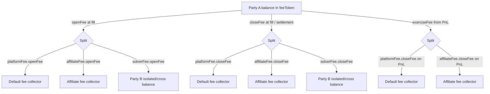

# Fee Model

Three fee events run during a trade's lifecycle in Options Core: an **open fee** reserved at intent creation and collected at fill, a **close fee** collected at every close-intent fill, and an **exercise fee** subtracted from PnL when the trade settles in-the-money. Every event splits across up to three recipients — the **default fee collector**, an optional **affiliate fee collector**, and the trade's **Party B (solver)** balance — and is denominated in a `feeToken` that may differ from the trade's collateral.

## Contents

- [Overview](#overview)
- [FeeStructure Type](#feestructure-type)
- [Fee Token Vs Collateral Token](#fee-token-vs-collateral-token)
- [Open Fee](#open-fee)
- [Close Fee](#close-fee)
- [Exercise Fee](#exercise-fee)
- [Affiliate Model](#affiliate-model)
- [Solver Fee](#solver-fee)
- [Default Fee Collector Lifecycle](#default-fee-collector-lifecycle)
- [Numeric Example](#numeric-example)
- [Errors Reference](#errors-reference)
- [Related Code Map](#related-code-map)

## Overview

A trade carries a single `feeStructure` snapshot taken when its open intent is created (`contracts/libraries/core/LibPartyAOpen.sol:99-108`). The structure exposes three rate buckets — `platformFee`, `affiliateFee`, `solverFee` — each with an `openFee` and `closeFee` field, plus a separate `exerciseFee` defined at the trade-agreement level (`contracts/types/BaseTypes.sol:17-40`).



| Event        | Trigger                                             | Code                                                                                                       |
| ------------ | --------------------------------------------------- | ---------------------------------------------------------------------------------------------------------- |
| Open fee     | `fillOpenIntent` (and reserved at `sendOpenIntent`) | `contracts/libraries/core/LibPartyBOpen.sol:323-350`, `contracts/libraries/core/LibPartyAOpen.sol:118-125` |
| Close fee    | `fillCloseIntent`                                   | `contracts/libraries/core/LibPartyBClose.sol:124-153`                                                      |
| Exercise fee | `executeTrades` for ITM trades only                 | `contracts/libraries/core/LibTradeOperations.sol:156-227`                                                  |

## FeeStructure Type

`FeeStructure` (`contracts/types/BaseTypes.sol:34-40`) is embedded in every `OpenIntent`, `CloseIntent`, and `Trade`:

| Field                    | Type    | Source                                                                                                                                               |
| ------------------------ | ------- | ---------------------------------------------------------------------------------------------------------------------------------------------------- |
| `feeToken`               | address | Caller-supplied at `sendOpenIntent` (`contracts/libraries/core/LibPartyAOpen.sol:42,100`).                                                           |
| `tokenPriceInCollateral` | uint256 | `IPriceOracle.getPrice(feeToken, symbol.collateral)` at intent creation (`contracts/libraries/core/LibPartyAOpen.sol:101-104`).                      |
| `platformFee`            | Fee     | Snapshot of `Symbol.platformFee` for `symbolId` (`contracts/types/SymbolTypes.sol:20-29`, `contracts/libraries/core/LibPartyAOpen.sol:105`).         |
| `affiliateFee`           | Fee     | `feeLayout.affiliateFees[affiliate][symbolId]` (`contracts/storages/FeeManagementStorage.sol:16`, `contracts/libraries/core/LibPartyAOpen.sol:106`). |
| `solverFee`              | Fee     | Caller-supplied at `sendOpenIntent` (`contracts/libraries/core/LibPartyAOpen.sol:42,107`).                                                           |

Each `Fee` carries an `openFee` and `closeFee` rate (`contracts/types/BaseTypes.sol:22-25`). Rates are 18-decimal scalars: `1e18` corresponds to `100% × tokenPrice / collateralPrice` per unit of `quantity * price`. The exact formula is in [Open Fee](#open-fee).

The `ExerciseFee` (`contracts/types/BaseTypes.sol:17-20`) is **not** part of `FeeStructure`. It lives in `TradeAgreements.exerciseFee` and is supplied by Party A on `sendOpenIntent` (`contracts/types/BaseTypes.sol:42-51`); the cap is bounded by `1e18` at intent validation (`contracts/libraries/core/LibPartyAOpen.sol:62`).

Once a trade is created, the snapshot is immutable. Updates to `Symbol.platformFee` (`contracts/facets/Control/ControlFacet.sol:799-809`) or `affiliateFees` (`contracts/facets/Control/ControlFacet.sol:366-381`) only affect future intents.

## Fee Token Vs Collateral Token

A trade's collateral is fixed by the `Symbol.collateral` field (`contracts/types/SymbolTypes.sol:20`). The fee token is independent and chosen per intent. The two are reconciled by reading the fee token's price in collateral once, when the open intent is registered:

```solidity
tokenPriceInCollateral: IPriceOracle(appLayout.priceOracleAddress).getPrice(
    feeToken,
    SymbolStorage.layout().symbols[tradeAgreements.symbolId].collateral
)
```

(`contracts/libraries/core/LibPartyAOpen.sol:101-104`).

`IPriceOracle.getPrice(token, collateral)` returns an 18-decimal price (`contracts/interfaces/IPriceOracle.sol:5`). Locking that snapshot at intent creation means subsequent fee math is deterministic: an oracle move between intent and fill does not change the fee owed.

The fee formulas use this price as a divisor to convert "collateral-denominated rate × notional" into "fee-token amount". Open/close fees use:

```solidity
fee = (quantity * price * rate) / (tokenPriceInCollateral * 1e18);
```

(`contracts/libraries/models/LibOpenIntent.sol:42-43`, `contracts/libraries/models/LibCloseIntent.sol:26-28`).

The exercise-fee path additionally divides PnL by the **settlement-time** `collateralPrice` from the Muon settlement signature before the same conversion (`contracts/libraries/core/LibTradeOperations.sol:198-202`).

## Open Fee

### Reserve at intent creation

Normal intents call `intent.lockFees()` immediately after constructing the intent. `lockFees` runs `_handleFees(self, FeeOp.Lock, self.price)` which:

1. Computes the three components at `self.price` using `calculateFee`.
2. Locks each component on Party A's `feeToken` balance via `_lock`. For `MarginType.ISOLATED`, the lock is `isolatedLock`; for normal `CROSS`, it is `crossLock(partyBsWhiteList[0], amount)`.

Deferred Party B sells (`SELL + CROSS + []`) cannot cross-lock open fees at creation because the Party B key is not known yet. Instead, `lockDeferredSellEscrow` locks the estimated total open fee from Party A's isolated `feeToken` and stores it in `OpenIntentEscrow.feeLockAmount`.

Normal fee locks are released by `unlockFees()` on cancel, expire, and immediately before fill. Deferred sell fee escrow is released by `releaseDeferredSellEscrow()` on cancel/expire or consumed by `consumeDeferredSellEscrow()` at fill. On partial fills, only the filled quantity's estimated fee lock is consumed; the remaining fee escrow moves to the residual child intent.

### Collection at fill

For normal intents, `fillOpenIntent` first calls `intent.unlockFees()` and then `intent.getFeesFromUser(price)`. `getFeesFromUser` runs `_handleFees(self, FeeOp.Subtract, price)`, which subtracts each component from Party A's `feeToken` balance using:

- `subForCounterParty(partyB, fee, marginType, reason)` for cross or for isolated with a single-Party-B whitelist;
- `isolatedSub(fee, reason)` for isolated with multi-Party-B whitelist (`contracts/libraries/models/LibOpenIntent.sol:308-314`).

Deferred Party B sells first consume escrow for the filled slice: the pro-rata isolated fee lock is unlocked, and the actual fill-price open fee amount is allocated into Party A's cross `feeToken` bucket against the selected Party B. Then `getFeesFromUser(price)` subtracts the fees from that cross bucket like any other cross fill. If the fill is partial, the residual child keeps the remaining `OpenIntentEscrow.feeLockAmount`; if the original intent was already `CANCEL_PENDING`, the residual child is `CANCELED` and the remaining escrow is released immediately.

Note that the actual subtraction uses the **fill price**, not the intent price. The reservation used the intent price; for BUY, fill `price ≤ intent.price`, so the actual fee is bounded by the locked amount. For SELL, fill `price ≥ intent.price`, so the actual fee may be greater than the reservation. The normal lock path handles this by unlocking then subtracting at fill; the deferred sell path handles it by allocating the actual fee amount at fill, requiring any difference to be available in Party A's isolated `feeToken`.

The amounts are then credited:

```solidity
defaultFeeCollectorBalance.instantIsolatedAdd(fees[0], IncreaseBalanceReason.PLATFORM_FEE);
affiliateFeeCollectorBalance.instantIsolatedAdd(fees[1], IncreaseBalanceReason.AFFILIATE_FEE);
// solver:
if (isolated) solverFeeCollectorBalance.instantIsolatedAdd(fees[2], IncreaseBalanceReason.SOLVER_FEE);
else          solverFeeCollectorBalance.scheduledAdd(intent.partyA, fees[2], CROSS, IncreaseBalanceReason.SOLVER_FEE);
```

(`contracts/libraries/core/LibPartyBOpen.sol:333-349`).

### Per-component formula

```
openFee_i = (quantity * fillPrice * rate_i) / (tokenPriceInCollateral * 1e18)
```

where `rate_i ∈ { feeStructure.platformFee.openFee, feeStructure.affiliateFee.openFee, feeStructure.solverFee.openFee }` and the divisor is the snapshot from intent creation.

### Cancel and expire refund

Any path that ends a normal intent without a fill calls `unlockFees()`:

- Party-A cancel of a `PENDING` intent (`contracts/libraries/core/LibPartyAOpen.sol:135`).
- Party-B accepting a `CANCEL_PENDING` intent (`contracts/libraries/core/LibPartyBOpen.sol:155`).
- `expire()` from a Party A cancel after deadline, a Party B unlock after deadline, or a force-cancel (`contracts/libraries/models/LibOpenIntent.sol:93`).

`unlockFees` reverses the original `_lock` calls one-for-one, so no fee leaks into a collector on these paths.

Deferred Party B sells call `releaseDeferredSellEscrow()` instead of `unlockFees()`. That unlocks the reserved isolated `feeToken` amount and deletes the escrow record, so canceled or expired deferred sells return to Party A's isolated account just like a normal canceled intent returns its locks. After a partial fill, the same rule applies to the residual child escrow.

## Close Fee

`CloseIntent` does **not** lock fees on `sendCloseIntent`. Party A's `feeToken` balance must simply be sufficient at fill time. The close-intent struct only carries the snapshot inherited from the trade (`contracts/libraries/core/LibPartyAClose.sol:55`).

`fillCloseIntent` collects close fees in two steps (`contracts/libraries/core/LibPartyBClose.sol:124-153`):

1. `intent.getFeesFromUser(quantity, price)` subtracts each component from Party A using `subForCounterParty(trade.partyB, fee, marginType, reason)` (`contracts/libraries/models/LibCloseIntent.sol:84-104`).
2. The amounts are credited to default collector, affiliate collector, and Party B exactly as on open-fill, with the same isolated-vs-cross branch on the solver leg.

### Per-component formula

```
closeFee_i = (quantity * fillPrice * rate_i) / (tokenPriceInCollateral * 1e18)
```

where `quantity` is the partial fill amount and `rate_i` is the matching `closeFee` field. The same `tokenPriceInCollateral` from intent creation is used.

## Exercise Fee

The exercise fee is charged inside `executeTrades` on the `exercised[i] == true` branch (`contracts/libraries/core/LibTradeOperations.sol:156-227`).

### Cap-and-rate formula

```solidity
function calculateExerciseFee(Trade memory self, uint256 settlementPrice, uint256 pnl) internal pure returns (uint256) {
	uint256 cap = (self.tradeAgreements.exerciseFee.cap * pnl) / 1e18;
	uint256 fee = (self.tradeAgreements.exerciseFee.rate * settlementPrice * getOpenAmount(self)) / 1e36;
	return cap < fee ? cap : fee;
}
```

(`contracts/libraries/models/LibTrade.sol:58-62`).

The fee is the **smaller** of:

- `cap * pnl / 1e18` — fraction of realized PnL.
- `rate * settlementPrice * openAmount / 1e36` — fraction of notional at settlement.

Validation at intent creation enforces `exerciseFee.cap ≤ 1e18` (`contracts/libraries/core/LibPartyAOpen.sol:62`); there is no on-chain bound on `rate`.

### PnL net of exercise fee

`amountToTransfer = (pnl - exerciseFee) * 1e18 / collateralPrice` is then moved between Party A and Party B in collateral units (`contracts/libraries/core/LibTradeOperations.sol:168-189`). The exercise fee itself is implicit in the differential — it is simply not paid out as PnL — and is then split across **two** collectors below.

### Recipients (default + affiliate)

After the PnL transfer, the same block converts `pnl` to collateral units and applies the **closeFee** rates from `feeStructure` to that base:

```solidity
uint256 pnlInCollateral = (pnl * 1e18) / sig.collateralPrice;
uint256[2] memory fees = [
    (pnlInCollateral * s.platformFee.closeFee)  / s.tokenPriceInCollateral,
    (pnlInCollateral * s.affiliateFee.closeFee) / s.tokenPriceInCollateral
];
for (uint8 j; j < 2; ++j)
    partyAFeeBalance.subForCounterParty(trade.partyB, fees[j], trade.tradeAgreements.marginType, decReasons[j]);
```

(`contracts/libraries/core/LibTradeOperations.sol:191-207`). Both halves are then credited to the affiliate collector and default collector via `instantIsolatedAdd` (lines 217-224).

There is **no solver-fee component at exercise** — only platform and affiliate. The economics: Party B already received the implicit exercise fee through the `pnl - exerciseFee` payout, and the explicit close-fee split is taken on top of that from Party A's fee-token balance.

### Insufficient Party A fee balance

The fee subtraction uses `subForCounterParty`, which enforces a non-negative resulting balance through `LibScheduledReleaseBalance` (`contracts/libraries/models/LibScheduledReleaseBalance.sol`). If Party A's `feeToken` balance is below `fees[0] + fees[1]` at settlement time, the entire `executeTrades` call reverts and the trade stays in `OPENED`. A fresh settlement with a refilled balance — or an external top-up of Party A's fee-token balance — is required to make progress. There is no separate insufficient-fee error: the underlying balance library reverts at the subtraction site.

## Affiliate Model

### Registration

Two roles guard affiliate state (`contracts/libraries/core/LibAccessibility.sol:17-18`):

- `AFFILIATE_MANAGER_ROLE` — toggles `affiliateStatus[affiliate]` and sets `affiliateFeeCollector[affiliate]` (`contracts/facets/Control/ControlFacet.sol:344-358`).
- `AFFILIATE_FEE_MANAGER_ROLE` (or the affiliate itself) — sets `affiliateFees[affiliate][symbolId]` via `setAffiliateFees`, gated additionally by `SETTER_ROLE` (`contracts/facets/Control/ControlFacet.sol:366-381`).

An open intent passes validation iff `affiliateStatus[affiliate] || affiliate == address(0)` (`contracts/libraries/core/LibPartyAOpen.sol:68`).

### Per-affiliate fee config

The `affiliateFees` map is `affiliate => symbolId => Fee` (`contracts/storages/FeeManagementStorage.sol:16`). At intent creation, the value at `(affiliate, symbolId)` is snapshotted into `feeStructure.affiliateFee` (`contracts/libraries/core/LibPartyAOpen.sol:106`). Unset entries default to `{ openFee: 0, closeFee: 0 }`.

### Per-affiliate collector

`affiliateFeeCollector[affiliate]` is the recipient address. The lookup at fill/settlement falls back to the default collector when unset:

```solidity
address affiliateFeeCollector = feeLayout.affiliateFeeCollector[affiliate] == address(0)
    ? feeLayout.defaultFeeCollector
    : feeLayout.affiliateFeeCollector[affiliate];
```

(`contracts/libraries/core/LibPartyBOpen.sol:312-314`, `contracts/libraries/core/LibPartyBClose.sol:131-133`, `contracts/libraries/core/LibTradeOperations.sol:212-214`).

### "Default" affiliate semantics

`affiliate == address(0)` is the implicit default. Its `affiliateFees[address(0)][symbolId]` is the zero fee unless explicitly set, and its collector falls through to `defaultFeeCollector`. This means an intent without an affiliate pays no affiliate-fee component — the affiliate slot simply collapses into the platform stream by accident.

### Inactive affiliate behavior

`setAffiliateStatus(affiliate, false)` blocks **future** open-intent creations referencing that affiliate (`contracts/libraries/core/LibPartyAOpen.sol:68` reverts with `IntentErrors.InvalidAffiliate`). Trades created while the affiliate was active continue to credit that affiliate at fill, close-fill, and settlement using the snapshotted `feeStructure.affiliateFee` and the **current** value of `affiliateFeeCollector[affiliate]` (the collector lookup is dynamic, not snapshotted). Setting the collector to `address(0)` redirects the affiliate's earned share to the default collector for all subsequent collections.

## Solver Fee

### Storage

The solver fee is credited to a `ScheduledReleaseBalance` keyed by `(intent.partyB, feeToken)`:

```solidity
ScheduledReleaseBalance storage solverFeeCollectorBalance = intent.partyB.balanceOf(feeToken);
solverFeeCollectorBalance.setup(intent.partyB, feeToken);
```

(`contracts/libraries/core/LibPartyBOpen.sol:327-328`, mirrored in `LibPartyBClose.sol:146-147`).

### Isolated vs cross routing

- `MarginType.ISOLATED` — credited via `instantIsolatedAdd(fee, SOLVER_FEE)`. The amount is immediately spendable from Party B's isolated balance for that token.
- `MarginType.CROSS` — credited via `scheduledAdd(intent.partyA, fee, CROSS, SOLVER_FEE)`. The amount enters Party B's cross schedule against Party A and clears through the standard scheduled-release pipeline.

### Composition with regular Party B balance

Because the solver fee uses the same `ScheduledReleaseBalance` as Party B's collateral position, no separate "solver fee balance" exists. The fee simply increments Party B's existing balance under the appropriate isolated or cross slot, tagged with `IncreaseBalanceReason.SOLVER_FEE` for accounting. Withdrawal then follows the normal flow: `deallocate` → wait `partyBDeallocateCooldown` → `withdraw` (see [[account-balances]]).

When `feeToken == symbol.collateral`, the solver-fee credit and the trade's premium credit accumulate into the same balance entry. When they differ, Party B accrues a separate `feeToken` balance.

## Default Fee Collector Lifecycle

`defaultFeeCollector` is a single address in `FeeManagementStorage` (`contracts/storages/FeeManagementStorage.sol:13`). It is set and updated by `SETTER_ROLE` through `ControlFacet.setDefaultFeeCollector` (`contracts/facets/Control/ControlFacet.sol:333-337`). The setter rejects `address(0)`. There is no removal — only replacement.

The collector's balance lives in the standard `ScheduledReleaseBalance` map keyed by `(defaultFeeCollector, feeToken)` and is credited via `instantIsolatedAdd`, so the address can immediately deallocate and withdraw earned fees through the normal account flow.

Updating the address mid-protocol redirects all **future** fee credits. Already-accrued fees remain in the previous collector's balance and must be withdrawn by that address.

## Numeric Example

Assume an isolated CALL trade with these inputs:

- `symbol.collateral = USDC`, `feeToken = SYMM` (different tokens).
- `tokenPriceInCollateral = 0.5e18` (1 SYMM = 0.5 USDC at intent creation).
- `quantity = 10e18`, intent `price = 100e18` (premium per unit).
- `platformFee.openFee = 0.001e18`, `affiliateFee.openFee = 0.0005e18`, `solverFee.openFee = 0.002e18`.
- Same close-fee rates.
- `exerciseFee.cap = 0.05e18`, `exerciseFee.rate = 0.0001e18`.
- Settlement `settlementPrice = 110e18`, `strikePrice = 100e18`, `collateralPrice = 1e18`.

### Open fee at fill (full quantity, fillPrice = 100e18)

```
fee_i = (10e18 * 100e18 * rate_i) / (0.5e18 * 1e18)
      = (1000e36 * rate_i) / 0.5e36
      = 2000 * rate_i  (in SYMM 18-dec units)
```

| Stream    | Rate      | Fee (SYMM) | Recipient                |
| --------- | --------- | ---------- | ------------------------ |
| Platform  | 0.001e18  | 2 SYMM     | default fee collector    |
| Affiliate | 0.0005e18 | 1 SYMM     | affiliate (or default)   |
| Solver    | 0.002e18  | 4 SYMM     | Party B isolated balance |

Party A's SYMM balance drops by 7 SYMM total at fill (after 7 SYMM was locked at intent creation).

### Close fee on a 4e18 partial close at price = 105e18

```
fee_i = (4e18 * 105e18 * rate_i) / (0.5e36) = 840 * rate_i
```

Platform: 0.84 SYMM, Affiliate: 0.42 SYMM, Solver: 1.68 SYMM. Same recipients.

### Exercise fee for the remaining 6e18 at settlement

`pnl = (110e18 - 100e18) * 6e18 / 1e18 = 60e18` (in collateral units, USDC).

```
cap  = 0.05e18 * 60e18 / 1e18 = 3e18    (3 USDC)
rate = 0.0001e18 * 110e18 * 6e18 / 1e36 = 0.066e18  (0.066 USDC)
exerciseFee = min(cap, rate) = 0.066 USDC
```

`amountToTransfer = (60e18 - 0.066e18) * 1e18 / 1e18 = 59.934 USDC` — paid from Party B to Party A as realized PnL.

The settlement-time close-fee split on the **two** non-solver streams:

```
pnlInCollateral = 60e18 * 1e18 / 1e18 = 60e18
fees[0] = 60e18 * 0.001e18 / 0.5e18 = 0.12e18   (0.12 SYMM, platform)
fees[1] = 60e18 * 0.0005e18 / 0.5e18 = 0.06e18  (0.06 SYMM, affiliate)
```

Party A's SYMM balance drops by 0.18 SYMM more. Total SYMM drained over the lifecycle: 7 + 3.36 + 0.18 = 10.54 SYMM. Party B's PnL net cash flow is `−59.934 USDC + (premium + solver-fee credits)`.

## Errors Reference

| Error                                            | Where                                                       | Cause                                                                                      |
| ------------------------------------------------ | ----------------------------------------------------------- | ------------------------------------------------------------------------------------------ |
| `IntentErrors.InvalidAffiliate(affiliate)`       | `contracts/libraries/core/LibPartyAOpen.sol:68`             | `affiliate != address(0)` and `affiliateStatus[affiliate] == false` at intent creation.    |
| `IntentErrors.InvalidExerciseFee(cap, 1e18)`     | `contracts/libraries/core/LibPartyAOpen.sol:62`             | `tradeAgreements.exerciseFee.cap > 1e18`.                                                  |
| `ValidationErrors.UnauthorizedSender(sender, x)` | `contracts/facets/Control/ControlFacet.sol:373`             | `setAffiliateFees` caller is neither the affiliate nor `AFFILIATE_FEE_MANAGER_ROLE`.       |
| `ValidationErrors.MismatchedLengths()`           | `contracts/facets/Control/ControlFacet.sol:374,800`         | `setAffiliateFees` / `setSymbolsPlatformFees` called with mismatched array lengths.        |
| `ValidationErrors.InvalidSymbol(id)`             | `contracts/facets/Control/ControlFacet.sol:804`             | `setSymbolsPlatformFees` referenced an unknown `symbolId`.                                 |
| `ValidationErrors.ZeroAddress("collector")`      | `contracts/facets/Control/ControlFacet.sol:334,355`         | `setDefaultFeeCollector` or `setAffiliateFeesCollector` called with `address(0)`.          |
| Underflow inside `subForCounterParty`            | `contracts/libraries/models/LibScheduledReleaseBalance.sol` | Party A's `feeToken` balance is below the required fee at fill, close-fill, or settlement. |

## Related Code Map

| File                                              | Role                                                                                                                       |
| ------------------------------------------------- | -------------------------------------------------------------------------------------------------------------------------- |
| `contracts/types/BaseTypes.sol`                   | `Fee`, `ExerciseFee`, `FeeStructure`, `FeeOp`.                                                                             |
| `contracts/types/SymbolTypes.sol`                 | `Symbol.platformFee`.                                                                                                      |
| `contracts/storages/FeeManagementStorage.sol`     | Default collector, affiliate status/collector/fees.                                                                        |
| `contracts/storages/SymbolStorage.sol`            | Symbol records carrying platform fee.                                                                                      |
| `contracts/storages/AppStorage.sol`               | `priceOracleAddress` used for `tokenPriceInCollateral`.                                                                    |
| `contracts/interfaces/IPriceOracle.sol`           | `getPrice(token, collateral)` interface.                                                                                   |
| `contracts/facets/Control/ControlFacet.sol`       | `setDefaultFeeCollector`, `setAffiliateStatus`, `setAffiliateFeesCollector`, `setAffiliateFees`, `setSymbolsPlatformFees`. |
| `contracts/libraries/core/LibPartyAOpen.sol`      | Snapshots `FeeStructure`, calls `lockFees`.                                                                                |
| `contracts/libraries/core/LibPartyBOpen.sol`      | `unlockFees` and open-fee collection at fill.                                                                              |
| `contracts/libraries/core/LibPartyAClose.sol`     | Inherits `FeeStructure` into the close intent.                                                                             |
| `contracts/libraries/core/LibPartyBClose.sol`     | Close-fee collection at fill.                                                                                              |
| `contracts/libraries/core/LibTradeOperations.sol` | Exercise-fee math and settlement-time close-fee split.                                                                     |
| `contracts/libraries/models/LibOpenIntent.sol`    | `calculateFee`, `_handleFees`, `lockFees`, `unlockFees`, `getFeesFromUser`.                                                |
| `contracts/libraries/models/LibCloseIntent.sol`   | `calculateFee`, `getFeesFromUser` for close intents.                                                                       |
| `contracts/libraries/models/LibTrade.sol`         | `calculateExerciseFee` (cap-vs-rate min).                                                                                  |
| `contracts/libraries/core/LibAccessibility.sol`   | `SETTER_ROLE`, `AFFILIATE_MANAGER_ROLE`, `AFFILIATE_FEE_MANAGER_ROLE`.                                                     |
| `tests/trade-settlement.ts`                       | Exercise-fee `min(cap, rate)` test scenarios.                                                                              |
| `tests/partyB-open-facet.behavior.ts`             | Open-fee fill/refund scenarios.                                                                                            |
| `tests/partyB-close-facet.behavior.ts`            | Close-fee fill scenarios.                                                                                                  |
