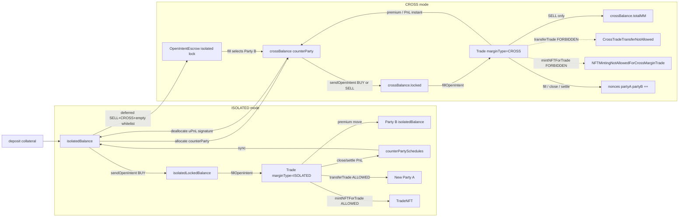

# Margin Modes

Options Core supports two margin models, selected per intent and locked into the resulting trade through `tradeAgreements.marginType`. The choice changes where collateral lives, which counterparty it is bound to, how PnL settles, which lifecycle operations are legal, and whether bilateral nonces advance. This doc is the side-by-side reference for `MarginType.ISOLATED` vs `MarginType.CROSS`.

The enum is defined in `contracts/types/BaseTypes.sol:12` (`enum MarginType { ISOLATED, CROSS }`).

## Contents

-   [Mental Model](#mental-model)
-   [Storage Layout Differences](#storage-layout-differences)
-   [Where The marginType Flag Flows](#where-the-margintype-flag-flows)
-   [Restrictions](#restrictions)
-   [Liquidation Differences](#liquidation-differences)
-   [Nonces](#nonces)
-   [Concrete Walk-through](#concrete-walk-through)
-   [Visual: Balance Routing](#visual-balance-routing)

## Mental Model

| Aspect            | Isolated                                                                                                                                     | Cross                                                                                                                                                                         |
| ----------------- | -------------------------------------------------------------------------------------------------------------------------------------------- | ----------------------------------------------------------------------------------------------------------------------------------------------------------------------------- |
| Margin scope      | Per trade. Each open intent's premium / fee is locked from `isolatedLockedBalance` without cross-pooling.                                    | Per `(partyA, partyB, collateral)` tuple. All intents and trades share the same `crossBalance[partyB]` slot once the Party B is known.                                        |
| Counterparty pool | None — credits from Party B may sit in a scheduled-release queue keyed by Party B but the spendable side is Party A's free isolated balance. | Bilateral. Premium and PnL move directly between the two parties' `crossBalance` entries with no scheduling delay.                                                            |
| What it protects  | Loss isolation: a default on one trade cannot drain margin posted for another trade or another counterparty.                                 | Capital efficiency: a Party A can run many positions against one Party B with margin offset across them.                                                                      |
| Trade transfer    | Allowed (`TradeFacet.transferTrade`, `TradeNFT`).                                                                                            | Forbidden — the trade is bound to the `(partyA, partyB)` cross slot.                                                                                                          |
| When to use       | Retail Party As, multi-Party-B competition, cases where a position must be portable as an NFT.                                               | Professional Party A↔Party B relationships where margin pooling is desired. A deferred Party B sell can start as an unassigned cross sell, then chooses the Party B at fill. |
| Side restrictions | `BUY` only — Party A cannot SELL in isolated.                                                                                                | Both `BUY` and `SELL` allowed.                                                                                                                                                |

A useful one-liner: **isolated trades belong to Party A; cross trades belong to a Party A↔Party B relationship**.

See [[account-balances]] for the underlying balance state machine and [[open-intents]] for the open lifecycle.

## Storage Layout Differences

Both modes share a single `ScheduledReleaseBalance` slot per `(user, collateral)` defined in `contracts/types/BalanceTypes.sol:46`, but they touch different fields. See [[types-and-storage#BalanceTypes]] for the full struct.

### Isolated entries

Isolated state lives on the top-level scalars:

| Field                                    | Role                                                                                                                                                                                                                            |
| ---------------------------------------- | ------------------------------------------------------------------------------------------------------------------------------------------------------------------------------------------------------------------------------- |
| `isolatedBalance` (`uint256`, 18d)       | Free, spendable funds. Increased by deposits, premium credits, MM releases, settlement payouts (in isolated trades), internal-transfer receipts.                                                                                |
| `isolatedLockedBalance` (`uint256`, 18d) | Funds reserved by an active intent (premium for BUY opens and fees). Party A `SELL + ISOLATED` is forbidden, but a deferred `SELL + CROSS + []` temporarily locks seller MM and open-fee escrow here until Party B is selected. |

A user's available isolated funds at any moment are `isolatedBalance − isolatedLockedBalance`. Isolated credits coming from a specific Party B (premium return, solver fee on a SELL is N/A here, exercise/expire payouts) flow through `instantIsolatedAdd` directly — there is no scheduling delay for isolated credits in this codebase. Deferred Party B sell escrow is different: it is not an isolated trade, it is a temporary isolated lock for a future cross trade.

### Cross entries

Cross state lives in the per-counterparty `crossBalance` mapping. The per-entry struct is `CrossEntry` (`contracts/types/BalanceTypes.sol:31`):

| Field                      | Role                                                                                                                                                                    |
| -------------------------- | ----------------------------------------------------------------------------------------------------------------------------------------------------------------------- |
| `balance` (`int256`, 18d)  | Signed cross balance vs this Party B. Allocations push it positive; SELL premium credits and realized PnL move it both ways. Can go negative for shorts.                |
| `locked` (`uint256`, 18d)  | Cross-locked premium / fee while an intent is `PENDING` or `LOCKED`. Released through `crossUnlock` on cancel/expire/fill.                                              |
| `totalMM` (`uint256`, 18d) | Sum of maintenance margin Party A has posted against this Party B for SELL trades. Increased on fill (`increaseMM`), decreased on close/expire/exercise (`decreaseMM`). |

Cross also uses `counterPartySchedules[partyB]` for credits that the protocol routes through `scheduledAdd(partyB, value, ISOLATED, …)` from this counterparty — the scheduling pipeline is keyed by counterparty even though the destination is the user's isolated balance. Cross-mode `scheduledAdd` calls (`scheduledAdd(partyB, value, CROSS, …)`) are an instant write to `crossBalance[partyB].balance`; there is no scheduling delay for cross credits (`contracts/libraries/models/LibScheduledReleaseBalance.sol:101-104`).

### Visual

```
ScheduledReleaseBalance[user][collateral]
├── isolatedBalance         ◄── isolated free funds
├── isolatedLockedBalance   ◄── isolated locks (BUY premium, fees)
├── reserveBalance          ◄── reserve pool (clearing-house tap)
├── crossBalance[partyB]
│     ├── balance  (int)    ◄── cross signed balance
│     ├── locked   (uint)   ◄── cross locks (BUY premium, SELL premium-Owed, fees)
│     └── totalMM (uint)    ◄── cross-side SELL MM
└── counterPartySchedules[partyB] (used by ISOLATED scheduledAdd; CROSS bypasses this)
```

## Where The marginType Flag Flows

The flag is set once by Party A at open-intent submission and propagates through every downstream lifecycle call.

1. **`PartyAOpenFacet.sendOpenIntent(...)`** — Party A passes `MarginType marginType` as a parameter (`contracts/facets/PartyAOpen/PartyAOpenFacet.sol:48-105`). The facet wraps it into a `TradeAgreements` struct and forwards.
2. **`LibPartyAOpen.sendOpenIntent`** — validates that `(SELL, ISOLATED)` is rejected and that normal cross intents have exactly one whitelisted Party B. The exception is an unbound `SELL + CROSS` with an empty whitelist, which stores a deferred Party B sell escrow instead of locking a named cross bucket. Then it persists the intent with `tradeAgreements.marginType` set.
3. **`LibPartyBOpen.fillOpenIntent`** — re-reads `intent.tradeAgreements.marginType` (`contracts/libraries/core/LibPartyBOpen.sol:174`), copies it onto the new `Trade.tradeAgreements.marginType` (`contracts/libraries/core/LibPartyBOpen.sol:231`), and uses it to dispatch:
    - Solver fee routing — `instantIsolatedAdd` for ISOLATED, `scheduledAdd(partyA, ..., MarginType.CROSS, SOLVER_FEE)` for CROSS (`contracts/libraries/core/LibPartyBOpen.sol:329-333`).
    - Premium and MM moves — `subForCounterParty(..., marginType, PREMIUM)` and `scheduledAdd(..., marginType, PREMIUM)` (`contracts/libraries/core/LibPartyBOpen.sol:354-359`).
    - Nonce bump — only when `marginType == CROSS` (`contracts/libraries/core/LibPartyBOpen.sol:364-367`).
4. **`Trade.tradeAgreements.marginType`** — the persisted source of truth for every later operation: close fills (`contracts/libraries/core/LibPartyBClose.sol`), settlement (`contracts/libraries/core/LibTradeOperations.sol:104-109,142-188,232-235`), trade transfer / NFT mint guards (`contracts/libraries/core/LibTradeOperations.sol:56,241`), liquidation pathing (`contracts/libraries/core/LibClearingHouse.sol:227-233,322-323,352-353`).

The flag is never mutated after intent creation; partial-fill children inherit it via the field-by-field copy in `LibPartyBOpen.fillOpenIntent`.

## Restrictions

The following invariants are enforced in code. Each one is asymmetric — applied only on cross or only on isolated.

### Party A SELL is forbidden in isolated

`LibPartyAOpen.sendOpenIntent` rejects the combination outright:

```
if (tradeAgreements.tradeSide == TradeSide.SELL && tradeAgreements.marginType == MarginType.ISOLATED)
    revert IntentErrors.IsolatedModeSellNotAllowed();
```

Source: `contracts/libraries/core/LibPartyAOpen.sol:63`. The rationale is that a SELL position's downside is unbounded relative to the strike, and isolated mode has no per-trade `totalMM` channel — MM is only tracked on the cross side via `CrossEntry.totalMM`.

### Cross normally requires exactly one Party B in the whitelist

`LibPartyAOpen.sendOpenIntent`:

```
if (tradeAgreements.marginType == MarginType.CROSS) {
    if (!deferredSell) {
        if (partyBsWhiteList.length != 1) revert IntentErrors.MultiplePartyBNotAllowed();
        sender.requireSolvent(partyBsWhiteList[0], symbol.collateral, tradeAgreements.marginType);
        partyBsWhiteList[0].requireSolvent(sender, symbol.collateral, tradeAgreements.marginType);
    }
}
```

Source: `contracts/libraries/core/LibPartyAOpen.sol:70-83`. Cross balances live in a slot keyed by exactly one Party B; allowing a many-Party-B whitelist would make the lock target ambiguous and break the bilateral solvency invariants in `LibAllocationOperations`.

The exception is a deferred Party B sell: `SELL + CROSS + partyBsWhiteList.length == 0`, only when Party A is not bound to a Party B. In that mode the protocol does not touch `crossBalance[partyB]` at creation because there is no `partyB` key yet. It locks seller MM and estimated open fees in `OpenIntentEscrow`; when a Party B locks and fills, the escrow is converted into that selected Party B's cross bucket before normal fee and premium settlement.

Bound Party As compose differently: a bound Party A already has a fixed Party B, so deferred sell is rejected with `DeferredSellNotAllowedForBoundPartyA`; all other open-intent whitelists must equal `[boundPartyB]`.

Isolated intents may have an empty whitelist (any active Party B) or a multi-Party-B list (any of those addresses).

### Cross-margin trade transfer is forbidden

`LibTradeOperations.validateAndTransferTrade`:

```
if (trade.tradeAgreements.marginType == MarginType.CROSS) revert TradeErrors.CrossTradeTransferNotAllowed(tradeId);
```

Source: `contracts/libraries/core/LibTradeOperations.sol:56`. This blocks both `TradeFacet.transferTrade` (Party-A initiated) and `TradeFacet.transferTradeFromNFT` (NFT-driven), since both route through the same validator (`contracts/libraries/core/LibTradeOperations.sol:68-78`). Cross trades cannot change ownership because the trade is married to the `(partyA, partyB, collateral)` cross slot — moving Party A would require atomically migrating that slot's balance, locks, totalMM, and active-intent indexes.

### Trade NFT minting is forbidden for cross

`LibTradeOperations.mintNFTForTrade`:

```
if (trade.tradeAgreements.marginType == MarginType.CROSS) revert TradeErrors.NFTMintingNotAllowedForCrossMarginTrade(tradeId);
```

Source: `contracts/libraries/core/LibTradeOperations.sol:241`. This is the consequence of the transfer rule above: an NFT exists to make trade ownership transferable, so the protocol refuses to mint a token whose only meaningful operation (transfer) would always revert.

## Liquidation Differences

Liquidation is keyed by the triple `(partyA, partyB, collateral)` and lives in `LiquidationStorage.inProgressLiquidationIds`. The shape of that key changes by margin mode (see [[liquidation-and-force-actions]] for the full pipeline).

| Aspect                     | Isolated Party B liquidation                                                         | Cross Party B liquidation                                                           | Cross Party A liquidation                                     |
| -------------------------- | ------------------------------------------------------------------------------------ | ----------------------------------------------------------------------------------- | ------------------------------------------------------------- |
| Storage key                | `inProgressLiquidationIds[address(0)][partyB][collateral]`                           | `inProgressLiquidationIds[partyA][partyB][collateral]`                              | `inProgressLiquidationIds[partyA][partyB][collateral]`        |
| Flag entry                 | `flagIsolatedPartyBLiquidation`                                                      | `flagCrossPartyBLiquidation`                                                        | `flagPartyALiquidation`                                       |
| Execute entry              | `liquidateIsolatedPartyB`                                                            | `liquidateCrossPartyB`                                                              | `liquidateCrossPartyA`                                        |
| Affected trades            | Every isolated trade Party B has on `collateral`.                                    | Only the cross slot for the specific `(partyA, partyB)` pair.                       | Only the cross slot for the specific `(partyA, partyB)` pair. |
| Ripple to other Party As   | None — each isolated trade is independent.                                           | None — only the bilateral pair freezes.                                             | None — only the bilateral pair freezes.                       |
| `requireSolvent` semantics | `isPartyB(self) && marginType == ISOLATED` ⇒ check `[address(0)][self][collateral]`. | `isPartyB(self) && marginType == CROSS` ⇒ check `[counterParty][self][collateral]`. | Party A path ⇒ check `[self][counterParty][collateral]`.      |

The asymmetry is encoded in `LibParty.isSolvent` (`contracts/libraries/models/LibParty.sol:21-30`), which picks `address(0)` for isolated and the actual `counterParty` for cross when the caller is a Party B. For Party As, the isolated branch always returns `true` (Party A has no isolated liquidation surface) and the cross branch consults `[self][counterParty][collateral]`.

Inside the execution paths (`contracts/libraries/core/LibClearingHouse.sol`):

-   Cross Party B liquidation (`liquidateCrossPartyB`, `:130`) zeroes the bilateral cross balance via `subForCounterParty(partyA, balance, MarginType.CROSS, LIQUIDATION)` and re-credits Party A through `scheduledAdd(partyB, balance, MarginType.CROSS, LIQUIDATION)` — both instant writes since the margin type is CROSS.
-   Liquidation distribution from the pool uses `scheduledAdd(partyB, amount, marginType, LIQUIDATION)` (`:299`), so isolated payouts queue through the scheduled-release pipeline while cross payouts land instantly.
-   Trade closure during liquidation reads `tradeAgreement.marginType` to decide whether locks/MM are released through the isolated or cross channel (`:227-233`).

## Nonces

`AccountStorage.nonces[party][counterParty]` is a bilateral counter mixed into Muon `UpnlSig` hashes (`contracts/libraries/services/LibMuon.sol:85`). It exists to invalidate every off-chain uPnL or settlement signature once the underlying state moves.

Only **cross-margin** code paths bump the nonce, because only cross-margin actions change the `(partyA, partyB)` shared balance:

| Action            | Source                           | Nonce bump                                                    |
| ----------------- | -------------------------------- | ------------------------------------------------------------- |
| `fillOpenIntent`  | `LibPartyBOpen.sol:364-367`      | `if (marginType == CROSS)` ⇒ `nonces[A][B]++; nonces[B][A]++` |
| `fillCloseIntent` | `LibPartyBClose.sol:170-171`     | Same guard.                                                   |
| `executeTrades`   | `LibTradeOperations.sol:232-235` | Same guard, per trade.                                        |

Isolated fills, isolated close fills, and isolated settlements do NOT bump the nonce because the balance changes they cause are not part of the bilateral cross slot — there is no cross uPnL signature that those moves could invalidate. See [[account-balances#Cross-Margin Nonces]] for the full implications.

## Concrete Walk-through

Same trade specification: Party A `0xA` BUY CALL on `5e18` units, strike `3000e18`, premium `200e18` per unit, expiration `T+30d`, `feeStructure.feeToken = USDC = collateral`, single Party B `0xB`. Initial state: Party A holds `2_000e18` of USDC isolated and has not allocated to cross.

### Step 1: open

| Mode     | What changes                                                                                                                                                                                      |
| -------- | ------------------------------------------------------------------------------------------------------------------------------------------------------------------------------------------------- |
| ISOLATED | `isolatedLockedBalance += premium + open fees` from Party A's isolated pool. No `crossBalance[0xB]` mutation. Whitelist may be empty or `[0xB]`.                                                  |
| CROSS    | Party A must `allocate(USDC, 0xB, X)` first so `crossBalance[0xB].balance = X`. Then `crossBalance[0xB].locked += premium + open fees` is locked from that cross slot. Whitelist must be `[0xB]`. |

Deferred cross sell variant: if Party A is unbound and submits `SELL + CROSS + []`, there is no `0xB` yet. Party A does not pre-allocate to a named Party B. Instead, `OpenIntentEscrow` locks seller MM from isolated collateral and estimated open fees from isolated `feeToken`. At fill, the selected Party B receives the filled slice as cross allocations and the resulting trade is still `marginType = CROSS`; if the fill is partial, the residual child keeps the remaining escrow until it is filled, canceled, or expired.

### Step 2: Party B fills at `price = 200e18`

| Mode     | Premium move                                                                                                                                                                                                                                                   | Solver fee                                                                                   | Nonce                                     |
| -------- | -------------------------------------------------------------------------------------------------------------------------------------------------------------------------------------------------------------------------------------------------------------- | -------------------------------------------------------------------------------------------- | ----------------------------------------- |
| ISOLATED | `partyA.subForCounterParty(0xB, premium, ISOLATED, PREMIUM)` ⇒ debits Party A's isolated channel (via the scheduled-release pipeline keyed by 0xB). `partyB.instantIsolatedAdd(premium)` is implicit through the existing close/open accounting.               | `instantIsolatedAdd(SOLVER_FEE)` to `0xB`'s isolated balance directly.                       | No bump.                                  |
| CROSS    | `partyA.subForCounterParty(0xB, premium, CROSS, PREMIUM)` ⇒ `crossBalance[0xB].balance -= premium`. The corresponding credit on `0xB`'s side lands as `scheduledAdd(0xA, premium, CROSS, PREMIUM)` ⇒ instant `crossBalance[0xA].balance += premium` for `0xB`. | `scheduledAdd(0xA, fee, CROSS, SOLVER_FEE)` ⇒ instant credit to `0xB`'s `crossBalance[0xA]`. | `nonces[0xA][0xB]++; nonces[0xB][0xA]++`. |

After Step 2 the trade is `OPENED` with `tradeAgreements.marginType` matching the original choice.

### Step 3: Party A close intent fills at `price = 250e18` for `2e18` units

| Mode     | Premium return + close payment                                                                                                                                                                         |
| -------- | ------------------------------------------------------------------------------------------------------------------------------------------------------------------------------------------------------ |
| ISOLATED | Open premium for the closed portion is `instantIsolatedAdd`'d back to `0xB`. Close premium debits `0xB`'s isolated and credits `0xA`'s isolated through the scheduled-release pipeline keyed by `0xB`. |
| CROSS    | Open premium return is `scheduledAdd(0xA, openPremiumPro, CROSS, PREMIUM)` ⇒ instant. Close premium uses `subForCounterParty / scheduledAdd` against the cross slot. Bilateral nonces increment again. |

### Step 4: settlement at `settlementPrice = 3200e18` (ITM)

| Mode     | PnL transfer                                                                                                                                                                                                    | Lock release                                                                              | Nonce                                     |
| -------- | --------------------------------------------------------------------------------------------------------------------------------------------------------------------------------------------------------------- | ----------------------------------------------------------------------------------------- | ----------------------------------------- |
| ISOLATED | `partyB.subForCounterParty(0xA, amountToTransfer, ISOLATED, REALIZED_PNL)` and `partyA.scheduledAdd(0xB, amountToTransfer, ISOLATED, REALIZED_PNL)` — Party A's PnL queues through the schedule keyed by `0xB`. | Proportional premium for the remaining open quantity returns to `0xB`'s isolated balance. | No bump.                                  |
| CROSS    | Same calls but `marginType = CROSS`: both sides hit `crossBalance` instantly.                                                                                                                                   | Proportional premium return is an instant credit on `0xB`'s `crossBalance[0xA]`.          | `nonces[0xA][0xB]++; nonces[0xB][0xA]++`. |

### Step 5: liquidation hypothesis

| Mode     | Liquidation surface                                                                                                                                                                                                        |
| -------- | -------------------------------------------------------------------------------------------------------------------------------------------------------------------------------------------------------------------------- |
| ISOLATED | `flagIsolatedPartyBLiquidation(0xB, USDC)` freezes EVERY isolated trade `0xB` has on USDC. Party A `0xA`'s ability to deposit / withdraw / send-intent is unaffected because their `(0xA, 0xB)` cross slot was never used. |
| CROSS    | `flagCrossPartyBLiquidation(0xB, 0xA, USDC)` (or `flagPartyALiquidation`) freezes only the `(0xA, 0xB, USDC)` slot. Party A's other Party B relationships and isolated balance keep functioning.                           |

## Visual: Balance Routing



Cross-margin paths (lower subgraph) keep collateral inside the bilateral `crossBalance[partyB]` slot for the lifetime of the position and bump bilateral nonces on every balance-affecting fill or settlement. Isolated paths (upper subgraph) keep collateral on the user's own scalars, route credits from Party B through the scheduled-release pipeline, and permit ownership transfer plus NFT representation. The `marginType` field set at `sendOpenIntent` time is the single switch that selects which subgraph the rest of the lifecycle uses.
