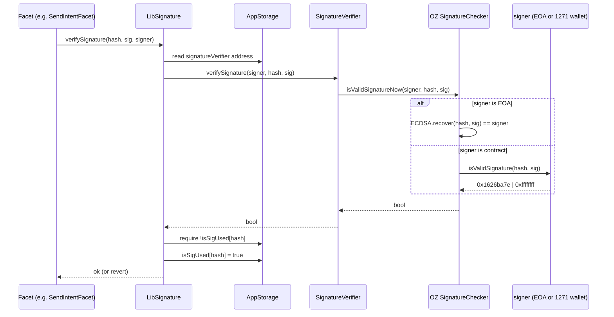
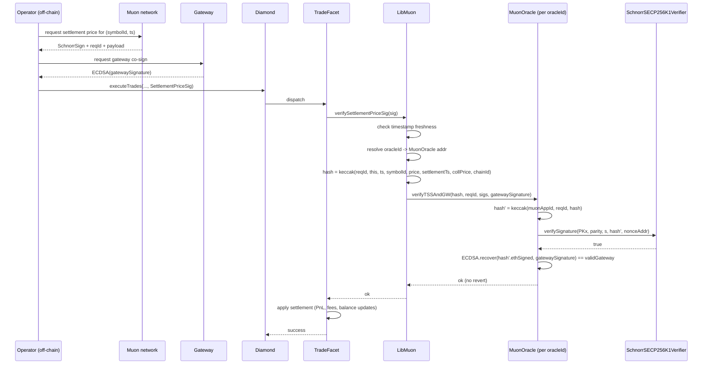

# Oracle and Signatures

SYMM Options Core relies on three distinct signing schemes, each with different trust assumptions, replay-protection models, and verification paths. This document covers the off-chain oracle (Muon TSS + Schnorr) and the on-chain account-signature path (ECDSA / ERC-1271) in depth, and points to `docs/flows/instant-actions.md` for EIP-712 batch authorization.

## 1. Overview

| Scheme                                        | Used for                                                                                                             | Where verified                                                                                           |
| --------------------------------------------- | -------------------------------------------------------------------------------------------------------------------- | -------------------------------------------------------------------------------------------------------- |
| Muon TSS + Schnorr (+ gateway ECDSA)          | Settlement prices, uPnL on deallocate / liquidate, any data the operator must not be trusted to provide unilaterally | `LibMuon.verifySettlementPriceSig`, `LibMuon.verifyUpnlSig`, ultimately `MuonOracle.verifyTSSAndGW`      |
| ECDSA / ERC-1271 (single signer)              | Off-chain authorization of intents on behalf of a Party A or Party B account (EOA or smart contract account)         | `LibSignature.verifySignature` -> `SignatureVerifier.verifySignature` -> OpenZeppelin `SignatureChecker` |
| EIP-712 batches (InstantLayer)                | Operator-pushed batches of pre-authorized actions submitted in a single transaction                                  | InstantLayer facets — see `docs/flows/instant-actions.md`                                                |
| `IPriceOracle` (collateral / fee-token quote) | Spot quote for collateral and fee tokens at intent creation time                                                     | Direct view-call from facets to a configured oracle adapter                                              |

Settlement (`executeTrades`, exercise, expiration) and any path that converts uPnL into a balance change (`deallocate`, `liquidate`) require Muon. Intent creation and amendment authenticated by the account owner use ECDSA / ERC-1271. Batched off-chain authorizations submitted by the operator use EIP-712 (InstantLayer). The collateral / fee quote during intent creation uses `IPriceOracle` and is independent of Muon.

## 2. Muon TSS / Schnorr deep-dive

### 2.1 What Muon is

Muon is an off-chain decentralized oracle network where a quorum of nodes runs a deterministic computation (e.g. "fetch the settlement price for symbol X at timestamp T") and produces a single threshold signature over the result. SYMM Options Core treats the resulting Schnorr signature as a single signature from a known group public key — the on-chain contract neither knows nor cares how the quorum was reached. The network is identified on-chain by `muonAppId` and its public key is stored as `(x, parity)` in `MuonConfig`.

### 2.2 Schnorr verification (high level)

`SchnorrSECP256K1Verifier.verifySignature` (`contracts/helpers/SchnorrSECP256K1Verifier.sol:98`) implements Schnorr verification over secp256k1 by abusing `ecrecover` as a scalar-multiplication primitive — the well-known "ecrecover trick". Inputs:

- `signingPubKeyX` — x ordinate of the group public key (must be `< HALF_Q`).
- `pubKeyYParity` — 0 or 1, encoding the parity of the y ordinate.
- `signature` — the scalar `s` (must be `< Q`).
- `msgHash` — the keccak256 of the message.
- `nonceTimesGeneratorAddress` — the Ethereum address derived from `k*G` (the per-signature public nonce).

The verifier computes the challenge `e = keccak256(PKx ‖ PKyp ‖ msgHash ‖ nonceAddr)` and checks the Schnorr equation `e*PK + s*G == k*G` by recovering `k*G`'s address via `ecrecover`. Trivial inputs (`0`) are explicitly rejected to avoid `ecrecover` returning `address(0)` and producing forgeable signatures. The `signingPubKeyX < HALF_Q` constraint is inherited from `ecrecover`'s `s`-malleability defense, even though Schnorr itself is not malleable.

### 2.3 Per-symbol oracleId model

There is no single "the Muon oracle" for the diamond. Each `Symbol` references an `oracleId`, and `SymbolStorage.oracles[oracleId]` resolves to an `Oracle` struct whose `contractAddress` points at a deployed `MuonOracle`. `LibMuon` always reads `Oracle storage oracle = symbolLayout.oracles[symbol.oracleId]` before calling `IMuonOracle(oracle.contractAddress).verifyTSSAndGW(...)` (`contracts/libraries/services/LibMuon.sol:40-56`).

Implications:

- Different symbols can be priced by different Muon apps (different `muonAppId` and group key).
- A single Muon app compromise contains the blast radius to its own `oracleId`.
- The `verifyUpnlSig` path takes `oracleId` as a parameter from the caller, so the facet decides which oracle is canonical for the uPnL (typically the collateral's oracle or a designated risk oracle).

### 2.4 Gateway signature — what it adds beyond Schnorr

`MuonOracle.verifyTSSAndGW` (`contracts/helpers/MuonOracle.sol:34`) checks the Schnorr TSS signature _and_ an additional ECDSA signature from `config.validGateway` over the same hash (in `toEthSignedMessageHash` form):

```solidity
bytes32 hash = keccak256(abi.encodePacked(config.muonAppId, _reqId, _data));
if (!verifySignature(...)) revert InvalidSignature();
hash = hash.toEthSignedMessageHash();
address gatewaySignatureSigner = hash.recover(_gatewaySignature);
if (gatewaySignatureSigner != config.validGateway) revert InvalidGatewaySignature(...);
```

The gateway signature is _not_ a second oracle. It is a single ECDSA key controlled by Symmetry (or a delegated party) that acts as a **rate-limiting / sanity gate**:

- It prevents a malicious or buggy Muon node from publishing a price unilaterally even if the quorum protocol were degraded.
- It allows fast off-chain blocking of obviously bad payloads (e.g. wildly stale, wrong chain) before they hit the contract.
- It does not weaken the TSS guarantee — both signatures are required, so an attacker must compromise both the Muon quorum _and_ the gateway key.

The gateway is centralized by design and is a known trust assumption; see Section 6.

### 2.5 SettlementPriceSig field-by-field + LibMuon validation flow

```solidity
struct SettlementPriceSig {
	bytes reqId;
	uint256 timestamp;
	uint256 symbolId;
	uint256 settlementPrice;
	uint256 settlementTimestamp;
	uint256 collateralPrice;
	bytes gatewaySignature;
	SchnorrSign sigs;
}
```

(`contracts/types/TradeTypes.sol:42-51`)

| Field                 | Purpose                                                                                                                                                                                                                          |
| --------------------- | -------------------------------------------------------------------------------------------------------------------------------------------------------------------------------------------------------------------------------- |
| `reqId`               | Muon request identifier. Bound into the hash so the same `(price, timestamp)` cannot be reused under a different request.                                                                                                        |
| `timestamp`           | Time at which Muon signed. Used by `LibMuon` to enforce `appLayout.settlementPriceSigValidTime` freshness.                                                                                                                       |
| `symbolId`            | The symbol the signature is bound to. Lookup of `symbol.oracleId` happens _after_ the struct is received, but the `symbolId` is hashed in, so a signature for symbol A cannot be used for symbol B even if both share an oracle. |
| `settlementPrice`     | The settlement / mark price for the symbol.                                                                                                                                                                                      |
| `settlementTimestamp` | The time the price was observed off-chain. May lag `timestamp`.                                                                                                                                                                  |
| `collateralPrice`     | Price of the collateral token, signed in the same payload so settlement and collateral conversion share a consistent snapshot.                                                                                                   |
| `gatewaySignature`    | ECDSA signature from `validGateway` over the same hash.                                                                                                                                                                          |
| `sigs`                | The Schnorr signature (`SchnorrSign { signature, owner, nonce }`); `nonce` is the `nonceTimesGeneratorAddress` (the address of `k*G`).                                                                                           |

`LibMuon.verifySettlementPriceSig` (`contracts/libraries/services/LibMuon.sol:26`) flow:

1. Check `block.timestamp <= sig.timestamp + settlementPriceSigValidTime`, else `ExpiredSignature`.
2. Resolve `oracle = symbolLayout.oracles[symbolLayout.symbols[sig.symbolId].oracleId]`.
3. Compute `hash = keccak256(abi.encodePacked(sig.reqId, address(this), sig.timestamp, sig.symbolId, sig.settlementPrice, sig.settlementTimestamp, sig.collateralPrice, getChainId()))`.
4. Call `IMuonOracle(oracle.contractAddress).verifyTSSAndGW(hash, sig.reqId, sig.sigs, sig.gatewaySignature)`.
5. The `MuonOracle` re-hashes with `muonAppId` and `reqId` (`hash' = keccak256(muonAppId ‖ reqId ‖ hash)`), Schnorr-verifies, then ECDSA-verifies the gateway over `hash'.toEthSignedMessageHash()`.

The hash binds: requesting app, request id, the diamond's own address (`address(this)` — pins the signature to one deployment), the chain id (`getChainId()` — pins it to one chain), the symbol, the price, both timestamps, and the collateral price. There is no per-symbol nonce, because the timestamp + freshness window is the replay defense. Two settlements at the same `(symbolId, timestamp)` with the same price are functionally identical, so accepting both is safe.

### 2.6 uPnL signature

`LibMuon.verifyUpnlSig` (`contracts/libraries/services/LibMuon.sol:59`) is the analogous path used on `deallocate` and `liquidate`. The signed `UpnlSig` (defined in `contracts/types/WithdrawTypes.sol`) carries `partyUpnl`, `counterPartyUpnl`, `collateralPrice`, plus `reqId`, `timestamp`, and Schnorr + gateway signatures. The hash includes:

- `address(this)` and `getChainId()` (deployment + chain pin).
- The literal string `"verifyUpnlSig"` (domain separator preventing cross-protocol reuse).
- `party` and `counterParty` (so a uPnL signed for pair A/B cannot be reused for A/C).
- `accountLayout.nonces[party][counterParty]` — a **per-pair nonce** which is incremented on use, providing strict replay protection.
- `sig.timestamp`, gated against `appLayout.upnlSigValidTime`.

This is stricter than the settlement-price path because uPnL directly authorizes withdrawal of value, whereas a settlement price is "merely" reused arithmetic.

### 2.7 MuonOracle storage + rotation (ORACLE_MANAGER_ROLE)

`MuonOracle` is `AccessControlEnumerable` with:

- `DEFAULT_ADMIN_ROLE` — granted to `admin` at construction. Manages role assignments.
- `SETTER_ROLE` — granted to `admin` at construction. Holds the right to call `setConfig(MuonConfig)` (`contracts/helpers/MuonOracle.sol:46`).

`setConfig` validates the new `muonPublicKey.x` against `HALF_Q` and overwrites `muonAppId`, `muonPublicKey`, and `validGateway` atomically, emitting `ConfigUpdated`.

> **Naming note.** The PRD calls this role `ORACLE_MANAGER_ROLE` from the operator's perspective. In the helper contract the role is named `SETTER_ROLE`. Operationally these are the same actor — the multisig that can rotate Muon keys.

Rotation properties:

- Rotation is atomic (no half-state where one signature scheme is verified against the new key and the other against the old).
- Rotation does **not** invalidate in-flight signatures retroactively — any already-signed `SettlementPriceSig` becomes unverifiable the moment the key changes, which is the desired behavior under compromise.
- The `Oracle` registration in `SymbolStorage` is a separate record; rotating the deployed `MuonOracle` for a symbol requires updating `oracles[oracleId].contractAddress` via the symbol-management facet, not `setConfig`.

`checkGatewaySignature` is declared but the live `verifyTSSAndGW` always enforces the gateway check. The flag and the corresponding `CheckGatewaySignatureUpdated` event exist for future migration to optional gateway checks; today, the gateway is mandatory.

## 3. ECDSA + ERC-1271 (SignatureVerifier)

### 3.1 When used

The diamond authenticates _off-chain authorizations from accounts_ (Party A or Party B) through a single `SignatureVerifier` deployed alongside the diamond. This is used wherever an account other than `msg.sender` must consent to an action — e.g. an operator submitting an intent on behalf of a Party A. The diamond addresses the verifier through its facade `appLayout.signatureVerifier`.

### 3.2 `_isValidSignature` flow

`LibSignature.verifySignature` (`contracts/libraries/services/LibSignature.sol:13`) is the sole entry point:

```solidity
function verifySignature(bytes32 hashValue, bytes calldata signature, address signer) internal {
	AppStorage.Layout storage appLayout = AppStorage.layout();
	if (!ISignatureVerifier(appLayout.signatureVerifier).verifySignature(signer, hashValue, signature))
		revert ValidationErrors.InvalidSignature(signer, hashValue);
	if (appLayout.isSigUsed[hashValue]) revert ValidationErrors.SignatureAlreadyUsed(hashValue);
	appLayout.isSigUsed[hashValue] = true;
}
```

Two guarantees:

1. The signature is valid for `signer` over `hashValue`, where validity follows OpenZeppelin's `SignatureChecker.isValidSignatureNow` — i.e. it succeeds for any of: ECDSA (EOA), ERC-1271 (smart-contract account returning the magic value), or ERC-6492 wrapped signatures via the underlying checker.
2. The hash has not been used before. `isSigUsed[hashValue]` is the global replay-protection map; the hash is therefore the canonical "intent fingerprint" — it must include all binding fields (signer, deadline, nonce, parameters) so distinct authorizations produce distinct hashes.



### 3.3 Magic value 0x1626ba7e

`SignatureVerifier.isValidSignatureEIP1271` (`contracts/helpers/SignatureVerifier.sol:23`) is the public ERC-1271 facade — it wraps `verifySignature` and returns `0x1626ba7e` on success, `0xffffffff` otherwise. `0x1626ba7e` is `bytes4(keccak256("isValidSignature(bytes32,bytes)"))` per EIP-1271; smart-contract wallets that implement that interface return this value to assert the signature is valid for them. The diamond itself does not implement ERC-1271; the facade exists so that _external_ protocols integrating SYMM accounts can verify signatures the same way the diamond does.

## 4. EIP-712 (InstantLayer)

InstantLayer uses EIP-712 typed-data signatures to authorize a _batch_ of actions in a single operator-submitted transaction. Domain separator, type hashes, per-action nonces, and the operator-vs-account replay model are detailed in `docs/flows/instant-actions.md`. From an oracle perspective, instant batches still consume Muon signatures and ECDSA / ERC-1271 signatures using the verification paths above — EIP-712 only governs how the _batch container_ itself is authorized.

## 5. IPriceOracle (collateral / fee-token quote)

Distinct from Muon, the diamond holds a configured `IPriceOracle` adapter for spot-quoting the collateral and the fee token at intent-creation time. This is used to size collateral requirements and fee charges against a dollar-denominated risk model, _not_ to settle PnL. The interface is intentionally minimal and is satisfied by Chainlink-style adapters or a custom feed.

Key differences vs. Muon:

|              | Muon (`SettlementPriceSig`)                                    | `IPriceOracle`                                                             |
| ------------ | -------------------------------------------------------------- | -------------------------------------------------------------------------- |
| When         | Settlement, exercise, expiration, deallocate, liquidate        | Intent creation / amendment                                                |
| Trust model  | Threshold quorum + gateway, signature-bound to chain + diamond | Whatever the configured adapter trusts (typically one or more aggregators) |
| Replay       | `timestamp + validTime`, plus per-pair nonce on uPnL           | None — view call returns current quote                                     |
| Failure mode | Stale signature reverts; intent retried                        | Stale feed returns last value; mitigated by adapter-level staleness checks |

Because `IPriceOracle` only gates _intent creation_, a stale or wrong quote does not directly mis-settle a trade — it can mis-size collateral. Final value transfer at settlement always goes through Muon.

## 6. Trust assumptions

| Component                              | Assumption                                                                                                   | Failure surface                                                                                                                                                                                     |
| -------------------------------------- | ------------------------------------------------------------------------------------------------------------ | --------------------------------------------------------------------------------------------------------------------------------------------------------------------------------------------------- |
| Muon TSS quorum                        | Honest threshold of Muon nodes for each `muonAppId`; quorum cannot be coerced into signing a malicious price | If broken: attacker can sign arbitrary settlement prices for symbols using that `oracleId`. Bound is per-app, per-oracle.                                                                           |
| Gateway ECDSA key                      | `validGateway` private key is held securely by Symmetry / delegated operator                                 | If broken: must also break Muon TSS to mint a usable signature; alone, a stolen gateway key cannot forge settlement.                                                                                |
| Both broken simultaneously             | Catastrophic for symbols on the affected `oracleId`                                                          | Mitigated by per-symbol `oracleId` partitioning and `ORACLE_MANAGER_ROLE` rotation.                                                                                                                 |
| `IPriceOracle` adapter                 | Returns a reasonable quote at intent-creation time                                                           | If broken: collateral mis-sizing, but settlement remains Muon-bound.                                                                                                                                |
| `SignatureVerifier` upgrade safety     | `appLayout.signatureVerifier` is set by governance and not user-controlled                                   | If replaced with a malicious verifier: any account signature can be forged for the diamond. Therefore `signatureVerifier` rotation is a high-privilege operation guarded by the diamond admin role. |
| Smart-account ERC-1271 implementations | Wallets that implement `isValidSignature` correctly per EIP-1271                                             | A buggy wallet that returns `0x1626ba7e` for arbitrary hashes can authorize arbitrary intents from that account. This is a wallet-side property, not a diamond bug.                                 |
| `isSigUsed` storage                    | Global single-use guarantee for ECDSA / 1271 signatures                                                      | The hash must include all binding fields (signer, deadline, nonce, parameters). A hash collision across distinct intents would allow one to consume the other's slot.                               |

## 7. Failure & rotation playbook

**Compromised Muon key (TSS suspected forged):**

1. Pause affected facets via the pauser role (settlement / deallocate / liquidate).
2. `MuonOracle.setConfig` with new `muonAppId` and `muonPublicKey` (called by `SETTER_ROLE` / ORACLE_MANAGER_ROLE multisig).
3. If the deployed `MuonOracle` itself is suspect (not just the key), update `SymbolStorage.oracles[oracleId].contractAddress` to a freshly deployed `MuonOracle`.
4. Unpause.

**Compromised gateway key:**

1. `setConfig` with the same Muon app + key but a new `validGateway` address.
2. No facet pause is strictly required because the TSS check still guards settlement, but pausing is recommended until rotation completes.

**Stale settlement price (Muon offline):**

- `LibMuon.verifySettlementPriceSig` reverts with `ExpiredSignature` once `block.timestamp > sig.timestamp + settlementPriceSigValidTime`. Operator must re-request a fresh signature; nothing on-chain is needed. Increasing `settlementPriceSigValidTime` is a parameter change via the muon parameters facet and trades safety for resilience.

**Suspected double-signing (Muon producing inconsistent prices for the same `(symbolId, timestamp)`):**

- This is a slashable off-chain offense at the Muon layer. On-chain, both signatures verify and the contract has no way to detect contradiction. Mitigation is rotation (treat as compromised key).

**ECDSA / 1271 signature replay attempt:**

- Cannot succeed: `LibSignature.verifySignature` reverts `SignatureAlreadyUsed` after the first consumption. If a hash collision were ever observed, that constitutes a hash-construction bug in the calling facet (missing nonce / deadline / parameter binding) and requires a facet upgrade.

**`SignatureVerifier` itself buggy:**

- Hot-swap `appLayout.signatureVerifier` to a fixed deployment. Because `LibSignature` re-reads `appLayout.signatureVerifier` on every call, the swap takes effect immediately for all subsequent intents. In-flight intents that have already passed `LibSignature.verifySignature` are not retroactively rechecked.

## 8. Settlement sequence



## 9. Code map

| Concern                                          | File                                             | Key symbols                                                                     |
| ------------------------------------------------ | ------------------------------------------------ | ------------------------------------------------------------------------------- |
| Schnorr primitive                                | `contracts/helpers/SchnorrSECP256K1Verifier.sol` | `verifySignature`, `validatePubKey`, `Q`, `HALF_Q`                              |
| Per-oracle Muon entry point                      | `contracts/helpers/MuonOracle.sol`               | `verifyTSSAndGW`, `setConfig`, `SETTER_ROLE`, `config`, `checkGatewaySignature` |
| Muon interface                                   | `contracts/interfaces/IMuonOracle.sol`           | `verifyTSSAndGW`, `setConfig`, `ConfigUpdated`                                  |
| Muon types                                       | `contracts/types/MuonTypes.sol`                  | `PublicKey`, `MuonConfig`, `SchnorrSign`                                        |
| Diamond-side Muon validation                     | `contracts/libraries/services/LibMuon.sol`       | `verifySettlementPriceSig`, `verifyUpnlSig`, `getChainId`                       |
| Settlement payload                               | `contracts/types/TradeTypes.sol`                 | `SettlementPriceSig`                                                            |
| uPnL payload                                     | `contracts/types/WithdrawTypes.sol`              | `UpnlSig`                                                                       |
| Account-signature verifier                       | `contracts/helpers/SignatureVerifier.sol`        | `verifySignature`, `isValidSignatureEIP1271`                                    |
| Diamond-side account-sig validation + replay map | `contracts/libraries/services/LibSignature.sol`  | `verifySignature`, `AppStorage.isSigUsed`                                       |
| Per-symbol oracle registration                   | `contracts/storages/SymbolStorage.sol`           | `Symbol.oracleId`, `oracles[oracleId].contractAddress`                          |
| Freshness windows                                | `contracts/storages/AppStorage.sol`              | `settlementPriceSigValidTime`, `upnlSigValidTime`, `signatureVerifier`          |
| InstantLayer (EIP-712)                           | see `docs/flows/instant-actions.md`              | —                                                                               |
