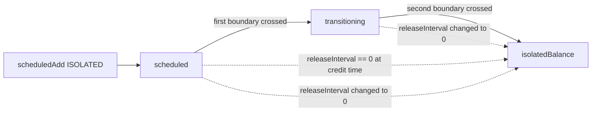

# Scheduled Release

The scheduled release model is a per-counterparty delay applied to isolated balance credits that originate from a counterparty (premium, realized PnL, fees, liquidation distributions, reserve→cross promotions on the isolated path). Funds wait two `releaseInterval` boundaries before they are spendable. Cross-margin credits are exempt: they land instantly.

This document covers the **why** and the **edge cases**. The end-to-end account flow is documented in `docs/flows/account-balances.md`; refer to that for storage shape, deposit/withdraw lifecycle, and event surface.

## 1. Overview

Every isolated credit from a counterparty B to user A reflects a settlement event whose correctness depends on B's solvency at the moment of recording. If A could withdraw such a credit immediately, then a late-arriving correction (a contested oracle, a missed liquidation trigger, a malicious counterparty unwind) would have nothing to claw back from. The scheduled release model gives the protocol a bounded window in which:

- B can be liquidated and the still-pending credit can be re-tagged or rolled back through `_sync`'s solvency short-circuit.
- A keeps custody of the funds (they are inside `counterPartySchedules[B]`) but cannot move them.
- An off-chain disputer / liquidator can react before the credit becomes free.

It is not a generic vesting schedule and not a withdrawal cooldown — withdrawals have a separate cooldown (`partyA/BDeallocateCooldown`). It is purely an unlock delay applied at the moment of credit, scoped to the counterparty that issued the credit.

Cross balances are deliberately not delayed: they remain bilateral and cannot be exfiltrated without a fresh Muon uPnL signature plus the deallocation flow, which already enforces solvency on both sides.

## 2. Two-Step Release Machine

A credit moves through three positions over time:

| Bucket | Stored in | Spendable? |
| --- | --- | --- |
| Scheduled | `counterPartySchedules[cp].scheduled` | No |
| Transitioning | `counterPartySchedules[cp].transitioning` | No |
| Free | `isolatedBalance` | Yes (minus `isolatedLockedBalance`) |

Each `_sync` call (`contracts/libraries/models/LibScheduledReleaseBalance.sol:302`) computes how many `releaseInterval` boundaries have crossed `entry.lastTransitionTimestamp` and advances the buckets accordingly:



Timestamps and intervals:

- `releaseInterval` is in **seconds**, copied at `addCounterParty` time from `counterParty.getReleaseInterval()` (per-user override or default).
- `lastTransitionTimestamp` is **always aligned** to the start of the current interval: `(block.timestamp / releaseInterval) * releaseInterval`. Adding new credits never moves it.
- Sync logic, `LibScheduledReleaseBalance.sol:339`:
  - `intervals = (block.timestamp - lastTransitionTimestamp) / releaseInterval`. Zero ⇒ no-op.
  - `intervals == 1` (one boundary crossed): drain `transitioning` to free, promote `scheduled` to `transitioning`. The credit added during this interval starts in `scheduled`.
  - `intervals >= 2` (two or more boundaries crossed): drain both buckets to free.
- After advancement, `lastTransitionTimestamp` is re-aligned to the current interval start so subsequent adds queue correctly.

Worst-case wait for a brand-new credit is `~2 * releaseInterval`; best case is just over `releaseInterval` (credit lands one block before the boundary). Average is `~1.5 * releaseInterval`.

The "two-bus" name in the source comments mirrors this geometry: the scheduled bucket is the "next bus that has not yet arrived"; the transitioning bucket is the "current bus, doors open at the next boundary".

## 3. Balance Fields Involved

Subset of `ScheduledReleaseBalance` (`contracts/types/BalanceTypes.sol:46`) relevant to the scheduled release model. See `docs/flows/account-balances.md` for the complete table.

| Field | Type | Units | Purpose |
| --- | --- | --- | --- |
| `isolatedBalance` | `uint256` | 18d | Free isolated funds. Sink for matured scheduled releases. |
| `counterPartySchedules[cp].releaseInterval` | `uint256` | seconds | Active interval used for bucket advancement. |
| `counterPartySchedules[cp].transitioning` | `uint256` | 18d | Funds maturing on the next boundary. |
| `counterPartySchedules[cp].scheduled` | `uint256` | 18d | Funds maturing on the boundary after next. |
| `counterPartySchedules[cp].lastTransitionTimestamp` | `uint256` | seconds (aligned) | Anchor for interval math. |
| `counterPartyAddresses` | `address[]` | n/a | Iteration list for `syncAll`. |
| `counterPartyIndexes[cp]` | `uint256` | 1-based | O(1) presence check (0 ⇒ not present). |

`crossBalance[cp]` is **not** affected by the scheduled release model; cross credits move directly via `crossBalance[cp].balance += int256(value)`.

## 4. When Credits Enter The Schedule vs. Free Isolated

`scheduledAdd` (`contracts/libraries/models/LibScheduledReleaseBalance.sol:91`) is the single entry point for counterparty-tagged credits. The branching, in order:

1. **Cross credits.** `marginType == MarginType.CROSS` ⇒ `crossBalance[cp].balance += value` and emit `IncreaseBalance(..., isInstant=true, CROSS)`. No queueing, no interval. This is the path used by cross premium, cross PnL, solver fees, and `LibClearingHouse.allocateFromReserveToCross`.
2. **Isolated credits with non-zero counterparty release interval.** Auto-track the counterparty (`addCounterParty` if `!manualSync[user]`), run `_sync(cp)`, then `entry.scheduled += value`. Emits `IncreaseBalance(..., isInstant=false, ISOLATED)`.
3. **Isolated credits with zero release interval.** If `counterParty.getReleaseInterval() == 0`, fall through to `instantIsolatedAdd`. The credit lands directly on `isolatedBalance` and emits `IncreaseBalance(..., isInstant=true, ISOLATED)`. `address(0)` is used as the counterparty in the event (the credit is no longer counterparty-tagged after the fall-through).

`instantIsolatedAdd` is also called directly (not via `scheduledAdd`) for credits that have no counterparty context — `DEPOSIT`, `INTERNAL_TRANSFER` recipient credit, cancelled withdraw refund, and `INVALID_WITHDRAWAL` pool deposits. None of these are subject to the schedule.

A consequence: the scheduling decision is taken **at credit time** based on the counterparty's then-current `getReleaseInterval()`. Subsequent governance changes to the interval are absorbed by `_sync`'s reinitialization branch (see Edge Cases).

## 5. Sync Mechanics

`sync(counterParty)` is a thin wrapper around `_sync` (`contracts/libraries/models/LibScheduledReleaseBalance.sol:280`). `syncAll()` iterates `counterPartyAddresses` in **reverse order** (`:291`) so that `tryRemoveCounterParty` swap-pop removals during the loop don't skip indices.

Implicit calls:

- `LibBalanceOperations.internalTransfer` calls `sourceBalance.syncAll()` unconditionally (`contracts/libraries/core/LibBalanceOperations.sol:73`).
- `LibBalanceOperations.initiateWithdraw` calls `balance.syncAll()` only when `!accountLayout.manualSync[sender]` (`:119`).
- `subForCounterParty` and `scheduledAdd` (isolated path) call `_sync(cp)` for the relevant counterparty before mutating buckets (`:113`, `:172`).

Explicit calls:

- `AccountFacet.syncBalances(collateral, partyA, partyBs)` is permissionless and does not require `partyA == msg.sender` (`contracts/facets/Account/AccountFacet.sol:252`). It loops over the supplied addresses and calls `sync(cp)` per entry. This is the public poke for `manualSync` users.

Iteration cost:

- `syncAll` is O(N) over `counterPartyAddresses.length`. N is bounded by `accountLayout.maxConnectedCounterParties` for non-`manualSync` users.
- Each `_sync` is O(1) storage reads + at most one bucket flush.
- `addCounterParty` triggers a `syncAll` when the user's tracking list is at `maxConnectedCounterParties` capacity, in an attempt to free a slot via `tryRemoveCounterParty` calls (`:380`). If still full afterward, it reverts `BalanceErrors.MaxCounterPartyConnectionsReached`.

`maxConnectedCounterParties` exists to bound the per-user `syncAll` gas envelope. Solver Party Bs face many takers and cannot operate under this bound, hence the `manualSync` escape hatch.

## 6. Per-Counterparty Interval vs. Default

`getReleaseInterval()` on an address consults two sources from `AccountStorage` (`contracts/storages/AccountStorage.sol:13`):

| Storage | Set by | Effect |
| --- | --- | --- |
| `releaseIntervals[user]` | per-user override | Used when `hasConfiguredInterval[user] == true` |
| `defaultReleaseInterval` | global | Fallback when no override |

The override takes precedence over the default. The interval read inside `scheduledAdd` and `_sync` is always the counterparty's interval (the user issuing the credit), not the recipient's. A Party A receiving a credit from Party B uses Party B's release interval.

Both setters live on `ControlFacet` and are gated by roles documented in `docs/concepts/roles-and-pauses.md`. `manualSync[user]` is also configured there and is automatically set to `true` when a Party B is registered (`contracts/facets/Control/ControlFacet.sol:397`).

A change in either storage affects only **future** sync operations for the affected counterparty. In-flight buckets are reconciled on the next `_sync` call via the reinitialization branch (`LibScheduledReleaseBalance.sol:314`).

## 7. `manualSync` Users

`accountLayout.manualSync[user]` (`contracts/storages/AccountStorage.sol:19`) is a per-user flag with two coupled behaviors:

- `scheduledAdd` does **not** auto-track the counterparty when `manualSync` is on (`LibScheduledReleaseBalance.sol:110`). The counterparty is still credited via `entry.scheduled`, but `counterPartyAddresses` is not extended. A consequence: `syncAll` will not visit this counterparty, even if balances have matured.
- `initiateWithdraw` does **not** call `syncAll` for `manualSync` users (`LibBalanceOperations.sol:119`). The user must have already called `syncBalances` for any counterparty whose matured funds they wish to withdraw.

Why it exists: a Party B solver typically faces hundreds of Party A takers. The `maxConnectedCounterParties` cap (which is a `syncAll` gas bound) would trip on every credit. `manualSync` lifts the cap by removing the auto-tracking, at the cost of pushing sync responsibility off-chain to the solver's keeper.

Operationally, a `manualSync` user must:

1. Track its set of counterparties off-chain.
2. Periodically call `syncBalances(collateral, self, [cp1, cp2, ...])` to mature funds.
3. Call `syncBalances` before any `initiateWithdraw` if it expects matured-but-unsynced funds to count toward availability.

`internalTransfer` is unaffected by `manualSync` (the unconditional `syncAll` runs anyway, `LibBalanceOperations.sol:73`) — but Party Bs are blocked from `internalTransfer` entirely by the `onlyNotPartyB` modifier on the facet, so this is moot for the typical `manualSync` user.

## 8. Liquidation Interaction

`_sync` opens with a solvency check on the **counterparty** (`LibScheduledReleaseBalance.sol:304`):

```solidity
if (!counterParty.isSolvent(self.user, self.collateral, MarginType.ISOLATED)) {
    return;
}
```

Effect: while the counterparty has an active isolated liquidation id, no scheduled or transitioning bucket from that counterparty advances. The user's free `isolatedBalance` is unaffected for credits from **other** counterparties (each is synced independently). Once the liquidation id is cleared, the next call to `_sync` (from any path) catches the buckets up.

Locked-by-liquidation funds therefore do not require a separate code path — they are simply funds whose `_sync` short-circuits. The clearing house can confiscate or redistribute them via the normal isolated-balance code paths because the buckets are still in `counterPartySchedules[cp]` and reachable via `subForCounterParty(cp, value, ...)`, which drains scheduled → transitioning → free in that order (`LibScheduledReleaseBalance.sol:151`).

## 9. Edge Cases

### Cancel Withdraw Of An Amount That Came From Scheduled Release

When `cancelWithdraw` runs (`contracts/libraries/core/LibBalanceOperations.sol:216`), the refund is credited via `instantIsolatedAdd(amount, DEPOSIT)`. The original counterparty context is intentionally lost — the funds were already promoted to `isolatedBalance` at the time of `initiateWithdraw` (the schedule was synced first, the debit took from free balance), so the cancellation re-credits them as a free deposit, not a re-queue. This means a user cannot use the withdraw → cancel sequence to escape the schedule (the first withdraw would have failed the availability check), and cannot accidentally re-queue free balance on cancel.

### Internal Transfer Recipient

`internalTransfer` (`contracts/libraries/core/LibBalanceOperations.sol:64`) debits the sender via `isolatedSub` (free balance only) and credits the recipient via `targetBalance.instantIsolatedAdd(amount, INTERNAL_TRANSFER)`. The recipient gets free isolated balance; there is no scheduled queueing for transferred funds. The sender is a fully-synced position, so any matured buckets count toward availability before the transfer.

### Allocate / Deallocate During Pending Releases

`allocateBalance` and `deallocateBalance` (`LibScheduledReleaseBalance.sol:249`, `:264`) operate on `isolatedBalance` and `crossBalance[cp].balance` directly. They do **not** touch `counterPartySchedules`. As a result:

- A user with `scheduled = 100`, `transitioning = 50`, `isolatedBalance = 30`, `isolatedLockedBalance = 0` can `allocate(cp, 30)` (but not `allocate(cp, 31)`) — pending releases are not borrowable.
- Deallocating from a cross balance lands the funds in free `isolatedBalance` immediately. This is consistent: cross balances never went through the schedule, so unwinding them does not need to.

### Suspended User

Sync paths called from facet entry points are gated by the facet's pause/suspension modifiers — a suspended user cannot trigger `syncAll` via `initiateWithdraw`/`internalTransfer`. However, `syncBalances` on the facet is **not** gated by `whenNotSuspended` (`contracts/facets/Account/AccountFacet.sol:252`), and is permissionless — anyone can sync a suspended user's counterparties. The credits become free `isolatedBalance` but the suspension still prevents the user from spending them. This is the intended design: pending releases continue to mature on-chain even while the user account is otherwise frozen.

### Counterparty Removal With Open Trades

`tryRemoveCounterParty` (`LibScheduledReleaseBalance.sol:400`) only frees the slot if **both** the buckets are empty and `TradeStorage.activeTradesOfPartyAWithPartyBCount[user][collateral][cp] == 0`. A user with open trades against a counterparty stays tracked even with empty buckets, ensuring future credits queue without re-paying the `addCounterParty` cost.

### Release Interval Changes

If the counterparty's interval changes between syncs (governance setter), `_sync` (`:314`) detects the mismatch and reinitializes:

- New interval `0`: drains both buckets to `isolatedBalance`. All in-flight funds become free immediately.
- New interval non-zero: merges `transitioning` into `scheduled` and aligns `lastTransitionTimestamp` to the new interval. The two-bucket geometry is reset; pending funds wait the full new cycle.

This is a behavioural side-effect operators must understand: shortening an interval can release funds early; lengthening one extends the wait for in-flight credits.

## 10. Numeric Timeline Example

Setup: `releaseInterval = I = 1 hour`, `block.timestamp` at credit `t0` is exactly aligned to an interval boundary (`t0 = k * I` for some `k`). `cp` is a previously-untracked counterparty for user A.

Events:

- `t0`: `scheduledAdd(cp, 100, ISOLATED, PREMIUM)`.
- `t0 + I`: `sync(cp)` called (e.g. by a keeper).
- `t0 + 2I`: `sync(cp)` called again.

State trace:

| Event | `lastTransitionTimestamp` | `scheduled` | `transitioning` | `isolatedBalance` |
| --- | --- | --- | --- | --- |
| Initial | 0 | 0 | 0 | 0 |
| `addCounterParty` at `t0` | `t0` | 0 | 0 | 0 |
| `_sync` at `t0` (intervals=0) | `t0` | 0 | 0 | 0 |
| `entry.scheduled += 100` | `t0` | 100 | 0 | 0 |
| `sync(cp)` at `t0 + I` (intervals=1) | `t0 + I` | 0 | 100 | 0 |
| `sync(cp)` at `t0 + 2I` (intervals=1 since last) | `t0 + 2I` | 0 | 0 | 100 |

If the keeper had skipped the `t0 + I` call and synced once at `t0 + 2I`:

| Event | `lastTransitionTimestamp` | `scheduled` | `transitioning` | `isolatedBalance` |
| --- | --- | --- | --- | --- |
| `entry.scheduled += 100` at `t0` | `t0` | 100 | 0 | 0 |
| `sync(cp)` at `t0 + 2I` (intervals=2) | `t0 + 2I` | 0 | 0 | 100 |

Same end state — the schedule is idempotent under sync frequency once the boundaries have passed. The keeper schedule only affects the timestamp of free-balance availability **within** the interval after the second boundary.

If a second credit lands at `t0 + 0.5I` and a single sync happens at `t0 + 2.5I`:

| Event | `lastTransitionTimestamp` | `scheduled` | `transitioning` | `isolatedBalance` |
| --- | --- | --- | --- | --- |
| Credit 100 at `t0` | `t0` | 100 | 0 | 0 |
| `scheduledAdd` 50 at `t0 + 0.5I` (auto-`_sync`, intervals=0) | `t0` | 150 | 0 | 0 |
| `sync(cp)` at `t0 + 2.5I` (intervals=2) | `t0 + 2I` | 0 | 0 | 150 |

Both credits matured together because both sat in `scheduled` when the two-boundary advancement collapsed the pipeline. A credit added at `t0 + 1.5I` instead would only have crossed one boundary by `t0 + 2.5I` and would land in `transitioning`, not free.

## 11. Code Map

| Concern | File | Line |
| --- | --- | --- |
| Two-bucket entry struct | `contracts/types/BalanceTypes.sol` | 24 |
| Balance container | `contracts/types/BalanceTypes.sol` | 46 |
| `scheduledAdd` (entry/branching) | `contracts/libraries/models/LibScheduledReleaseBalance.sol` | 91 |
| `instantIsolatedAdd` | `contracts/libraries/models/LibScheduledReleaseBalance.sol` | 128 |
| `subForCounterParty` (drain order) | `contracts/libraries/models/LibScheduledReleaseBalance.sol` | 151 |
| `_sync` (core logic) | `contracts/libraries/models/LibScheduledReleaseBalance.sol` | 302 |
| `syncAll` (reverse iteration) | `contracts/libraries/models/LibScheduledReleaseBalance.sol` | 287 |
| `addCounterParty` (cap + reinit) | `contracts/libraries/models/LibScheduledReleaseBalance.sol` | 375 |
| `tryRemoveCounterParty` (open-trade gate) | `contracts/libraries/models/LibScheduledReleaseBalance.sol` | 400 |
| `manualSync` storage | `contracts/storages/AccountStorage.sol` | 19 |
| `releaseIntervals` / `defaultReleaseInterval` | `contracts/storages/AccountStorage.sol` | 16-17 |
| `maxConnectedCounterParties` | `contracts/storages/AccountStorage.sol` | 18 |
| `syncAll` from `internalTransfer` | `contracts/libraries/core/LibBalanceOperations.sol` | 73 |
| `syncAll` from `initiateWithdraw` (gated by `manualSync`) | `contracts/libraries/core/LibBalanceOperations.sol` | 119 |
| `cancelWithdraw` re-credits as `DEPOSIT` | `contracts/libraries/core/LibBalanceOperations.sol` | 239 |
| `syncBalances` public surface | `contracts/facets/Account/AccountFacet.sol` | 252 |
| `allocateBalance` (free balance only) | `contracts/libraries/models/LibScheduledReleaseBalance.sol` | 249 |
| `deallocateBalance` (cross → free) | `contracts/libraries/models/LibScheduledReleaseBalance.sol` | 264 |
| Party B `manualSync` auto-set | `contracts/facets/Control/ControlFacet.sol` | 397 |
| Counterparty solvency helper | `contracts/libraries/models/LibParty.sol` | n/a |
