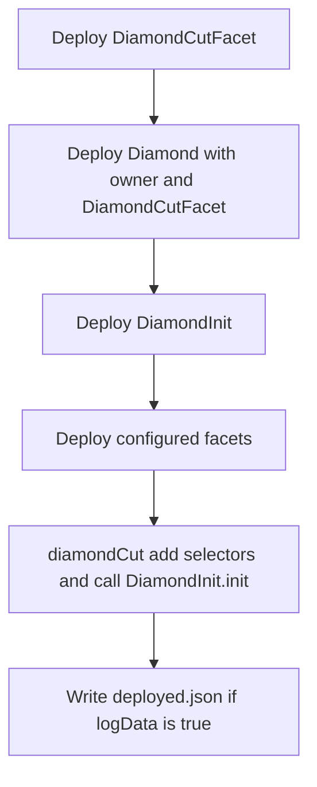
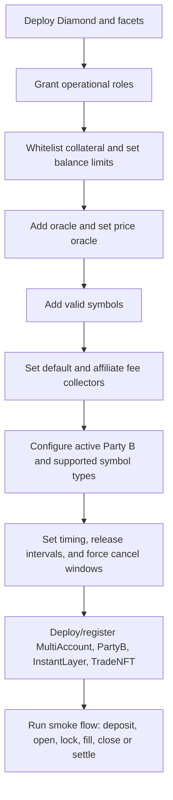

# Deployment And Operations

This repo is a Hardhat project using Solidity `0.8.19`, TypeChain for ethers v6, and the OpenZeppelin upgrades plugin for helper contracts.

## Common Commands

```bash
npm install
npx hardhat compile
npx hardhat test
npx hardhat coverage
```

The package scripts also include `yarn compile`, `yarn test`, and `yarn typechain`, but those wrap commands with `symsec --project options-core`. Use the direct `npx hardhat ...` commands if SymSec is not available in your environment.

## Diamond Deployment

The main deployment task is registered in `tasks/deployment/diamond-deploy.task.ts`.

```bash
npx hardhat deploy:diamond --network hardhat --log-data true
```

Deployment order:



The task deploys facets listed in `common/constants.ts` and adds their selectors through `IDiamondCut.diamondCut`.

`deploy:deploy` runs:

```bash
npx hardhat deploy:deploy --network <network>
```

It calls `deploy:diamond` and then `verify:deployment`.

## Helper Deployments

Registered helper tasks:

| Task                       | Purpose                                                                             |
| -------------------------- | ----------------------------------------------------------------------------------- |
| `deploy:stablecoin`        | Deploy fake stablecoin for local/dev use.                                           |
| `deploy:oracle`            | Deploy fake oracle for local/dev use.                                               |
| `deploy:hookHandler`       | Deploy mock hook handler.                                                           |
| `deploy:mocks`             | Deploy library mocks.                                                               |
| `deploy:SignatureVerifier` | Deploy signature verifier helper.                                                   |
| `deploy:multiAccount`      | Deploy upgradeable `MultiAccount`; requires Symmio, admin, and trade NFT addresses. |
| `deploy:InstantLayer`      | Deploy `InstantLayer`; requires Symmio and admin addresses.                         |
| `deploy:symmioPartyB`      | Deploy upgradeable `SymmioPartyB`; requires Symmio and admin addresses.             |

Examples:

```bash
npx hardhat deploy:multiAccount --network hardhat --symmioaddress <diamond> --admin <admin> --tradenftaddress <tradeNFT>
npx hardhat deploy:InstantLayer --network hardhat --symmioaddress <diamond> --admin <admin>
npx hardhat deploy:symmioPartyB --network hardhat --symmioaddress <diamond> --admin <admin>
```

## Setup Configuration

There are two setup config shapes in the repo:

-   `tasks/config/_sample.config.json` and `tasks/config/config.interface.ts` describe a task-oriented config structure.
-   `scripts/config/setup.example.json` is consumed by `scripts/symmSetup.ts`, which expects `scripts/config/setup.json` and reads the Diamond address from `output/addresses.json`.

The setup script configures items such as:

-   Admin and role grants/revokes.
-   Whitelisted collateral.
-   Max close orders, max trades per Party A, and balance limits.
-   Timing parameters.
-   Party B release interval and default release interval.
-   Default fee collector.
-   Oracles, price oracle address, and symbols.
-   Party B config and supported symbol types.
-   Affiliates and affiliate fees.
-   Signature verifier.
-   Express withdraw provider config.
-   Invalid withdrawal amount pool.
-   External transfer target validation.

## Minimal Post-Deploy Checklist



## Helper Tasks For Manual Flow Testing

The `tasks/helper` folder registers manual tasks:

-   `send-open-intent`
-   `lock-open-intent`
-   `fill-open-intent`
-   `send-close-intent`
-   `fill-close-intent`

These are useful for testing a deployed Diamond from the command line. Check each file in `tasks/helper` for exact parameters before running.

## Tests

The behavior tests are split by protocol area:

-   `tests/account-facet.behavior.ts`
-   `tests/partyA-open-facet.behavior.ts`
-   `tests/partyB-open-facet.behavior.ts`
-   `tests/partyA-close-facet.behavior.ts`
-   `tests/partyB-close-facet.behavior.ts`
-   `tests/trade-settlement.ts`
-   `tests/force-action.behavior.ts`
-   `tests/clearing-house.ts`
-   `tests/instant-action-open.behavior.ts`
-   `tests/instant-action-close.behavior.ts`
-   `tests/helpers/instant-layer.behavior.ts`
-   `tests/helpers/multi-account.behavior.ts`
-   `tests/helpers/symmio-partyb.behavior.ts`

Run the whole suite with:

```bash
npx hardhat test
```

For focused work, pass one test file:

```bash
npx hardhat test tests/partyB-open-facet.behavior.ts
```

## Networks

`hardhat.config.ts` defines:

-   `hardhat`: default local network.
-   `polygon`: `https://polygon-rpc.com`.
-   `base`: `https://mainnet.base.org`.

`PRIVATE_KEY` is read from `.env`; the fallback key in `hardhat.config.ts` is a dummy development key. Base verification uses `BASE_API_KEY`.
