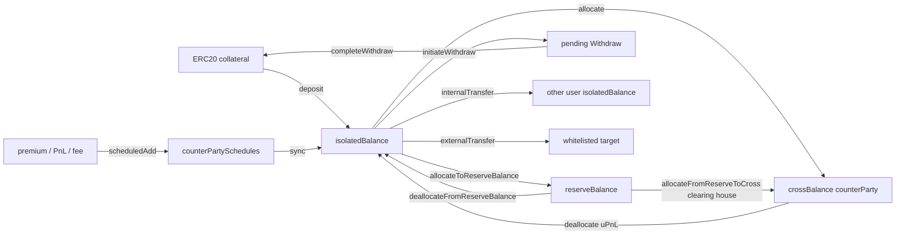
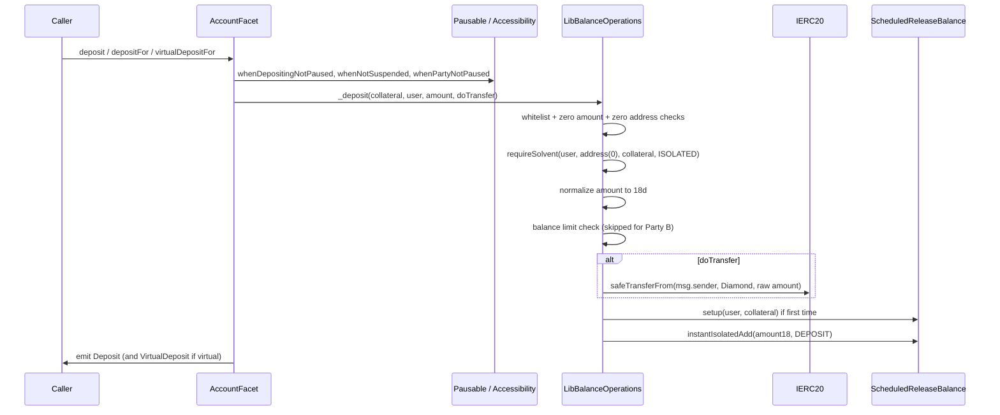
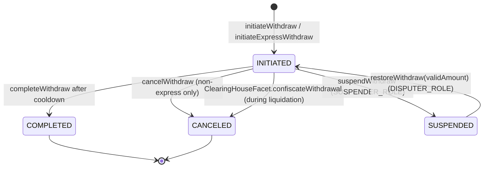
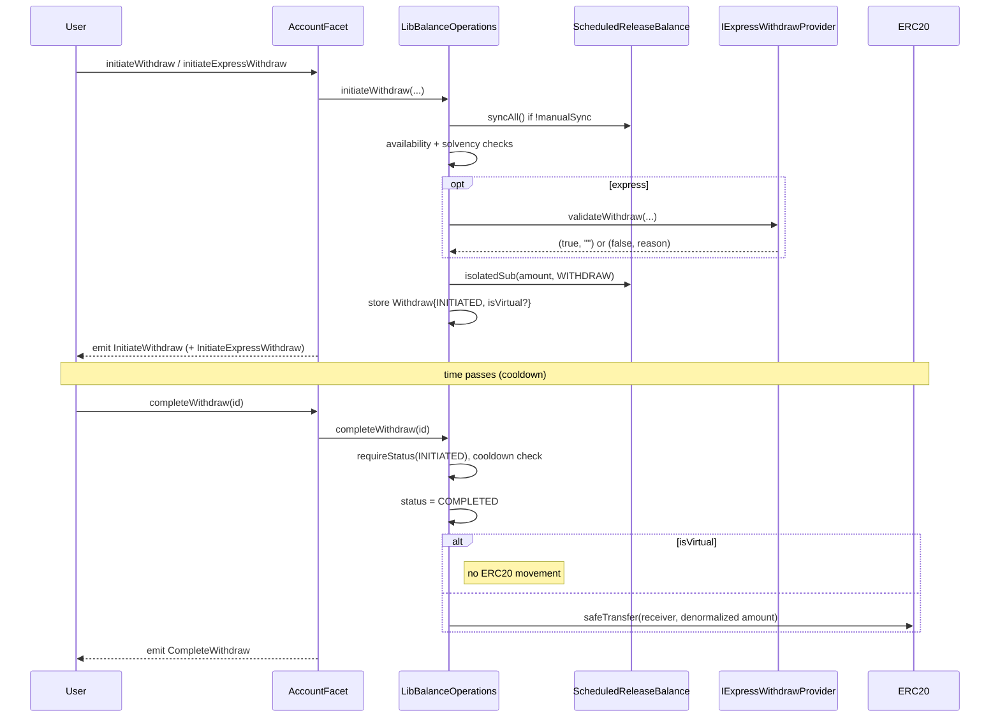
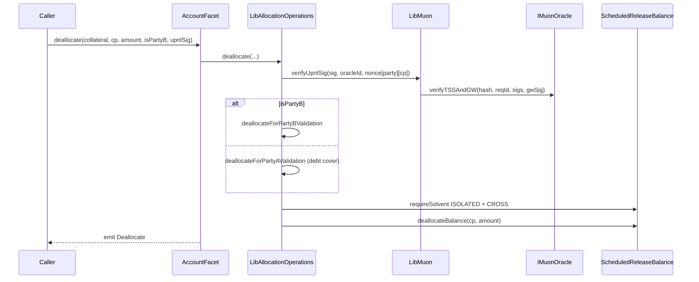
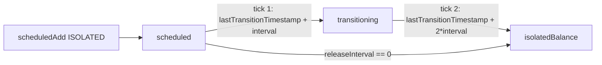

# Account And Balance Flows

`AccountFacet` is the only public surface for moving collateral into, around, and out of the Diamond. Every `(user, collateral)` pair is backed by a single `ScheduledReleaseBalance` slot in `AccountStorage.balances`. All numbers in storage are normalized to 18 decimals; only deposits and withdrawals translate between collateral-token decimals and the internal representation through `LibDecimals`.

This document describes the public surface, the underlying state machine, and the invariants the protocol depends on. Source citations refer to file paths under `contracts/`.

## Overview And Mental Model

The account layer answers four questions:

1. How much can a user spend right now (`isolatedBalance - isolatedLockedBalance`)?
2. How much is committed to a specific Party A↔Party B relationship (`crossBalance[counterParty]`)?
3. How much is parked outside isolated/cross for the clearing house's benefit (`reserveBalance`)?
4. How much will become available later, and against which counterparty (`counterPartySchedules[counterParty]`)?

Two design choices shape every flow:

- **Isolated vs. Cross.** Isolated funds belong to the user and are not bound to any counterparty. Cross funds live inside a bilateral `CrossEntry` keyed by counterparty, and they can be negative (a Party A short can produce a negative cross balance after PnL realization). Allocation and deallocation are the only direct conversions; the rest of the protocol mutates one side or the other.
- **Scheduled release.** Premium and realized-PnL credits to isolated balance from a specific counterparty do **not** become spendable immediately. They enter a two-bucket pipeline (`scheduled` → `transitioning` → `isolatedBalance`) keyed by the counterparty and gated by `releaseInterval`. This protects the protocol from late-arriving PnL or fee corrections during the same window in which Party B might enter liquidation.

The combination means every isolated credit is tagged with a counterparty (even when conceptually "free"), and every cross balance survives until explicitly deallocated with a fresh Muon uPnL signature.

## Balance Shape

`ScheduledReleaseBalance` is defined in `contracts/types/BalanceTypes.sol:46` and is mutated exclusively through `ScheduledReleaseBalanceOps` (`contracts/libraries/models/LibScheduledReleaseBalance.sol`).

| Field                                               | Type        | Units   | Default      | Writers                                                                                                                 | Readers                                                 |
| --------------------------------------------------- | ----------- | ------- | ------------ | ----------------------------------------------------------------------------------------------------------------------- | ------------------------------------------------------- |
| `collateral`                                        | `address`   | n/a     | `address(0)` | `setup` on first credit                                                                                                 | All ops via `checkSetup`                                |
| `user`                                              | `address`   | n/a     | `address(0)` | `setup` on first credit                                                                                                 | All ops via `checkSetup`                                |
| `isolatedBalance`                                   | `uint256`   | 18d     | `0`          | `instantIsolatedAdd`, `isolatedSub`, `subForCounterParty`, `allocateBalance`, `deallocateBalance`, `_sync`, reserve ops | Every facet that needs a free-balance check             |
| `isolatedLockedBalance`                             | `uint256`   | 18d     | `0`          | `isolatedLock`, `isolatedUnlock`                                                                                        | Open/close intent fee/premium locks                     |
| `reserveBalance`                                    | `uint256`   | 18d     | `0`          | `allocateToReserveBalance`, `deallocateFromReserveBalance`, `LibClearingHouse.allocateFromReserveToCross`               | Solvency views, clearing-house consumption              |
| `crossBalance[cp].balance`                          | `int256`    | 18d     | `0`          | `allocateBalance`, `deallocateBalance`, `subForCounterParty`, `scheduledAdd` (CROSS)                                    | All cross-margin solvency math                          |
| `crossBalance[cp].locked`                           | `uint256`   | 18d     | `0`          | `crossLock`, `crossUnlock`                                                                                              | Open intent margin locking                              |
| `crossBalance[cp].totalMM`                          | `uint256`   | 18d     | `0`          | `increaseMM`, `decreaseMM`                                                                                              | Maintenance-margin tracking for Party A short positions |
| `counterPartySchedules[cp].releaseInterval`         | `uint256`   | seconds | `0`          | `addCounterParty`, `_sync` reinit                                                                                       | `_sync`                                                 |
| `counterPartySchedules[cp].transitioning`           | `uint256`   | 18d     | `0`          | `_sync`, `subForCounterParty`                                                                                           | `inTransitionBalance`, `counterPartyBalance`            |
| `counterPartySchedules[cp].scheduled`               | `uint256`   | 18d     | `0`          | `scheduledAdd`, `_sync`, `subForCounterParty`                                                                           | `inTransitionBalance`, `counterPartyBalance`            |
| `counterPartySchedules[cp].lastTransitionTimestamp` | `uint256`   | seconds | `0`          | `addCounterParty`, `_sync`                                                                                              | `_sync`                                                 |
| `counterPartyAddresses`                             | `address[]` | n/a     | empty        | `addCounterParty`, `tryRemoveCounterParty`                                                                              | `syncAll`                                               |
| `counterPartyIndexes[cp]`                           | `uint256`   | 1-based | `0`          | `addCounterParty`, `tryRemoveCounterParty`                                                                              | `addCounterParty` membership check                      |

Free isolated balance available to the user is always `isolatedBalance - isolatedLockedBalance` (not the raw value). The locked portion exists so that intent creation can reserve funds without removing them from the global accounting.

`IncreaseBalanceReason` and `DecreaseBalanceReason` enums (`contracts/types/BalanceTypes.sol:66` and `:80`) tag every event so off-chain indexers can replay margin state without storage reads.

## Deposit Flows

There are three entry points, all routed through `LibBalanceOperations._deposit` (`contracts/libraries/core/LibBalanceOperations.sol:40`):

| Function                                      | Caller     | Role                     | Actually transfers ERC20? |
| --------------------------------------------- | ---------- | ------------------------ | ------------------------- |
| `deposit(collateral, amount)`                 | anyone     | none                     | yes, from `msg.sender`    |
| `depositFor(collateral, user, amount)`        | anyone     | none                     | yes, from `msg.sender`    |
| `virtualDepositFor(collateral, user, amount)` | privileged | `VIRTUAL_DEPOSITOR_ROLE` | no                        |

`amount` is in **collateral-token decimals** at the public boundary; it is normalized to 18 decimals via `LibDecimals.normalizeAmount` before crediting `isolatedBalance`.

### Preconditions

- `whenDepositingNotPaused`: rejects with `SystemErrors.GlobalPaused` or `SystemErrors.DepositingPaused`.
- `whenNotSuspended(msg.sender)` and, for `depositFor`, `whenNotSuspended(user)`: rejects with `SystemErrors.UserSuspended`. `virtualDepositFor` only checks the recipient.
- `whenPartyNotPaused`: rejects with `SystemErrors.PartyAActionsPaused` / `SystemErrors.PartyBActionsPaused` based on `LibParty.isPartyB`.
- `nonReentrant` on `deposit` and `depositFor` (the ERC20 transfer crosses a trust boundary). `virtualDepositFor` skips reentrancy because no external call is made.
- Inside `_deposit`:
    - `ValidationErrors.CollateralNotWhitelisted` if `AppStorage.whiteListedCollateral[collateral]` is false.
    - `ValidationErrors.ZeroAmount` if `amount == 0`.
    - `ValidationErrors.ZeroAddress("user")` if `user == address(0)`.
    - `requireSolvent(user, address(0), collateral, ISOLATED)`: rejects with `BalanceErrors.NotSolvent` if a Party A is in isolated liquidation, or if a Party B has any active isolated liquidation (`LibParty.isSolvent`, `contracts/libraries/models/LibParty.sol:21`).
    - `BalanceErrors.BalanceLimitExceeded` for non-Party B users when the post-credit isolated balance would breach `appLayout.balanceLimitPerUser[collateral]`.

### Events

`Deposit(sender, user, collateral, amount, newBalance)` from `IAccountEvents` (`contracts/facets/Account/IAccountEvents.sol:8`). For `virtualDepositFor`, both `Deposit` and `VirtualDeposit` are emitted so existing indexers continue to work without losing the "no token movement" signal.

### Notes On Decimals

- `amount` parameter is in collateral decimals (e.g. 6 for USDC).
- `safeTransferFrom` uses the raw amount.
- Internal `isolatedBalance` is bumped by `amount * 1e18 / 10**decimals`. Tokens with fewer than 18 decimals lose precision on the way out; tokens with more than 18 decimals would underflow the credited amount (the protocol assumes ≤ 18-decimal collaterals).

## Internal And External Transfers

### `internalTransfer(collateral, user, amount)`

`AccountFacet.internalTransfer` (`contracts/facets/Account/AccountFacet.sol:92`) moves available isolated balance to another in-protocol user. The flow lives in `LibBalanceOperations.internalTransfer` (`contracts/libraries/core/LibBalanceOperations.sol:64`).

- `amount` is **already 18d** (no normalization).
- The sender's full counterparty list is synced via `syncAll()` so any matured scheduled releases are realized before the availability check.
- Availability is `isolatedBalance - isolatedLockedBalance`; any shortfall reverts `BalanceErrors.InsufficientBalance`.
- Recipient balance limit applies only when the recipient is not a Party B.
- Modifiers: `whenInternalTransferNotPaused`, `whenNotSuspended` (sender and recipient), `whenInstantModeIsNotActive(msg.sender)`, `whenPartyNotPaused` for both, and `onlyNotPartyB(msg.sender)`. Party B accounts cannot use internal transfer at all.
- No reentrancy guard: there is no external call.
- Emits `InternalTransfer(sender, receiver, collateral, amount, newReceiverBalance, newSenderBalance)`.

### `externalTransfer(collateral, user, amount, target)`

`AccountFacet.externalTransfer` (`contracts/facets/Account/AccountFacet.sol:125`) is a privileged ERC20 escape valve to a whitelisted target contract.

- `amount` is internal 18d; the library calls `LibDecimals.denormalizeAmount` before invoking the ERC20.
- The target must be present in `accountLayout.externalTransferTargets[target][collateral]` (whitelisted via `ControlFacet.setExternalTransferTargetValidationStatus`, `contracts/facets/Control/ControlFacet.sol:917`). Otherwise `ValidationErrors.ExternalTransferTargetNotWhitelisted`.
- The library debits via `isolatedSub(amount, EXTERNAL_TRANSFER)`, so it does **not** consult `isolatedLockedBalance` separately — it only protects against over-spending the gross isolated total. (Callers must be aware that an external transfer can drain past locked intent margin if `isolatedBalance` was inflated by a recent credit.)
- After `safeTransfer`, the library calls `IExternalTransferTarget(target).onTransfer(collateral, sender, receiver, amount)` (`contracts/interfaces/IExternalTransferTarget.sol:15`). The target is expected to update its own books to credit `receiver`.
- Modifiers: `nonReentrant`, `whenNotExternalTransferPaused`, `whenNotSuspended(msg.sender)`, `whenInstantModeIsNotActive(msg.sender)`, `whenPartyNotPaused(msg.sender)`. Note: the **recipient** is not validated for suspension because it is the off-chain identity inside the target contract, not a Diamond user.

#### Why `onTransfer` Exists

External transfers are how the Diamond hands off collateral to other settlement venues (other Symmio cores, partner protocols, vaults). The callback gives the target the same `(collateral, sender, receiver, amount)` tuple in 18-decimal form so it can mirror the credit without re-reading ERC20 balances. Because the call happens **after** the ERC20 transfer, a target with insufficient gas or a reverting `onTransfer` undoes everything via the natural revert cascade — but a trusted target can still front-run its own logic. Targets must therefore be vetted before whitelisting.

#### Security Implications

- `nonReentrant` guards against the target re-entering `AccountFacet`, but the target receives funds **before** any cross-cutting reentrancy from other facets is reasonable; treat the whitelist as a privileged surface.
- The whitelist is per `(target, collateral)` so an attacker cannot extend an approval for one collateral to another.
- The 18-decimal `amount` handed to `onTransfer` matches what the Diamond debited; mismatches between the ERC20 amount actually transferred and the 18d `amount` are possible only when the collateral has more than 18 decimals.

## Withdrawal Flows

The withdrawal lifecycle is a small state machine over `Withdraw.status` (`contracts/types/WithdrawTypes.sol:32`):

### `initiateWithdraw` And `initiateExpressWithdraw`

Both go through `LibBalanceOperations.initiateWithdraw` (`contracts/libraries/core/LibBalanceOperations.sol:104`).

- `to == address(0)` reverts `ValidationErrors.ZeroAddress("to")`.
- `amount == 0` reverts `ValidationErrors.ZeroAmount`.
- `amount` is in **18 decimals** at the public boundary (it is later denormalized in `completeWithdraw`).
- If `accountLayout.manualSync[sender]` is false, the sender's full counterparty list is synced first.
- Availability check uses `isolatedBalance - isolatedLockedBalance`; shortfall reverts `BalanceErrors.InsufficientBalance`.
- Solvency: `requireSolvent(sender, address(0), collateral, ISOLATED)` — both Party A and Party B must be free of isolated liquidations.
- For express withdraws (`provider != address(0)`):
    - `accountLayout.expressWithdrawProviderConfigs[provider][collateral].isActive` must be true, else `BalanceErrors.ExpressWithdrawProviderNotActive`.
    - `providerConfig.receiver != address(0)`, else `ValidationErrors.ZeroAddress("receiver")`.
    - The provider's `IExpressWithdrawProvider.validateWithdraw(sender, collateral, amount, to, userData)` must return `(true, _)`. A failure reverts `BalanceErrors.ExpressWithdrawRejectedByProvider(provider, reason)`.
    - `isVirtual` on the request is taken from `providerConfig.isVirtual`. A virtual express withdraw never moves ERC20 on completion — it only flips state.
- The library debits `isolatedSub(amount, WITHDRAW)`, increments `lastWithdrawId`, and stores a `Withdraw` struct keyed by id.

### `completeWithdraw`

`LibBalanceOperations.completeWithdraw` (`contracts/libraries/core/LibBalanceOperations.sol:184`).

- `id > lastWithdrawId` reverts `BalanceErrors.InvalidWithdrawalId`.
- Status must be `INITIATED` (`ValidationErrors.requireStatus`).
- Cooldown is `appLayout.partyADeallocateCooldown` for Party A and `appLayout.partyBDeallocateCooldown` for Party B (`contracts/facets/Control/ControlFacet.sol:163`). Calls before `withdrawal.timestamp + cooldown` revert `ValidationErrors.CooldownNotOver("withdraw", ...)`.
- The receiver is `withdrawal.to` for normal withdraws, or `accountLayout.expressWithdrawProviderConfigs[provider][collateral].receiver` for express withdraws.
- Virtual withdraws (`isVirtual == true`) skip the ERC20 transfer entirely — they exist purely to signal off-chain settlement.
- Modifiers on the facet: `nonReentrant`, `whenWithdrawingNotPaused`, `whenWithdrawalNotSuspended(id)`, `whenPartyNotPaused(msg.sender)`.

### `cancelWithdraw`

`LibBalanceOperations.cancelWithdraw` (`contracts/libraries/core/LibBalanceOperations.sol:216`).

- Express withdrawals cannot be cancelled by the user: `BalanceErrors.ExpressWithdrawCancellationNotAllowed`. They are economically already settled to the provider.
- Status must be `INITIATED`.
- Balance limit is re-checked for non-Party B users before re-credit.
- Solvency check `requireSolvent(user, address(0), collateral, ISOLATED)` ensures the cancellation does not paper over a now-active liquidation.
- The amount returns to `isolatedBalance` via `instantIsolatedAdd(amount, DEPOSIT)` — the original counterparty context is intentionally not preserved because withdrawals are pure isolated movements.
- Modifiers: `whenWithdrawingNotPaused`, `whenWithdrawalNotSuspended(id)`, `whenPartyNotPaused(msg.sender)`.

### `suspendWithdraw` And `restoreWithdraw`

- `suspendWithdraw(id)` is gated on `SUSPENDER_ROLE` (`contracts/utils/Accessibility.sol:36`). It flips status to `SUSPENDED` and prevents `complete`/`cancel` until restored. It does **not** refund any balance.
- `restoreWithdraw(id, validAmount)` is gated on `DISPUTER_ROLE`. Preconditions:
    - Status must be `SUSPENDED`.
    - `accountLayout.invalidWithdrawalsAmountsPool` must be set, else `ValidationErrors.ZeroAddress("invalidWithdrawalsAmountsPool")`.
    - `validAmount <= withdrawal.amount`, else `BalanceErrors.ValidAmountExceedsOriginal`.
- The difference `(withdrawal.amount - validAmount)` is normalized again (via `LibDecimals.normalizeAmount`) and credited to the configured pool's isolated balance with reason `INVALID_WITHDRAWAL`. **Note:** this re-normalizes an already-normalized value, which double-applies the decimal scaling. Operators must understand this when configuring the pool address.
- Status returns to `INITIATED` and `withdrawal.amount` is overwritten with `validAmount` so a subsequent `completeWithdraw` only releases the validated portion.

### Express Withdrawals

Express withdrawals provide a cooldown-respecting fast-payout path managed by an external provider:

- `setExpressWithdrawProviderConfig(provider, collateral, ExpressWithdrawProviderConfig{isActive, isVirtual, receiver})` is configured by `SETTER_ROLE` via `ControlFacet` (`contracts/facets/Control/ControlFacet.sol:887`).
- `initiateExpressWithdraw` calls `provider.validateWithdraw(...)`. The provider is expected to front the user out of band; the Diamond compensates the provider when `completeWithdraw` runs after the cooldown.
- `cancelWithdraw` is locked out for express withdraws because cancelling would unwind a settlement the provider has already made.
- Suspension/restoration still works on express withdraws.
- Virtual express withdrawals (`isVirtual = true`) are useful when both sides operate off-chain ledgers and only need on-chain accounting reconciliation; the ERC20 leg is skipped on completion.

### `syncBalances`

`AccountFacet.syncBalances(collateral, partyA, partyBs)` (`contracts/facets/Account/AccountFacet.sol:252`) is permissionless and does not require `partyA == msg.sender`. It iterates the supplied Party B addresses and calls `sync(partyB)` on each. This is the explicit poke that `manualSync` users (typically Party Bs) need to advance their schedules.

## Allocation And Deallocation

`allocate` and `deallocate` are the only direct conduits between isolated and cross balance. Both target a specific Party A↔Party B pair.

### `allocate(collateral, counterParty, amount)`

`LibAllocationOperations.allocate` (`contracts/libraries/core/LibAllocationOperations.sol:23`).

- The pair `(msg.sender, counterParty)` must contain exactly one Party B. The check is `(!cp.isPartyB() && !sender.isPartyB()) || (cp.isPartyB() && sender.isPartyB())` ⇒ `BalanceErrors.InvalidCounterParty`.
- For Party A senders, the limit check uses the post-allocation cross balance: `crossBalance[cp].balance + amount > balanceLimitPerUser[collateral]` ⇒ `BalanceErrors.BalanceLimitExceeded`.
- Solvency is enforced both in `ISOLATED` and `CROSS` modes for the pair.
- `ScheduledReleaseBalanceOps.allocateBalance` (`contracts/libraries/models/LibScheduledReleaseBalance.sol:249`) checks `isolatedBalance - isolatedLockedBalance >= amount` and moves the funds without emitting `IncreaseBalance`/`DecreaseBalance` (the `Allocate` event from the facet covers it).
- Facet modifiers: `whenNotSuspended(msg.sender)`, `whenInstantModeIsNotActive(msg.sender)`, `whenPartyNotPaused(msg.sender)`. There is no global allocation pause.

### `deallocate(collateral, counterParty, amount, isPartyB, upnlSig)`

`LibAllocationOperations.deallocate` (`contracts/libraries/core/LibAllocationOperations.sol:45`).

- `isPartyB` is a self-declaration that must match `msg.sender`'s actual side; the validator paths use it to choose which oracle id (`partyBConfigs[msg.sender|counterParty].oracleId`) to feed `LibMuon.verifyUpnlSig`.
- `LibMuon.verifyUpnlSig` (`contracts/libraries/services/LibMuon.sol:59`) hashes `(reqId, diamond, "verifyUpnlSig", party, counterParty, partyUpnl, counterPartyUpnl, collateral, collateralPrice, nonces[party][counterParty], timestamp, chainId)` and calls `IMuonOracle.verifyTSSAndGW`. Expired or replayed signatures revert via `ValidationErrors.ExpiredSignature` or the underlying oracle.
- Path split:
    - `isPartyB = false` (Party A caller) → `deallocateForPartyAValidation`. Computes `partyAReadyToDeallocate = min(crossBalance, balance + uPnL_in_collateral - totalMM - locked)`. If Party B's available balance after uPnL is negative, Party A must "cover the debt" — the deallocation is rejected if `partyAReadyToDeallocate - amount < -debt`. Loss coverage uses `partyBConfigs[counterParty].lossCoverage` when Party B's uPnL is negative. After validation, an isolated balance limit check applies for non-Party A→Party B pairs (it always applies because Party A is never Party B here).
    - `isPartyB = true` (Party B caller) → `deallocateForPartyBValidation`. Requires Party A to be solvent (`partyA cross balance + uPnL ≥ totalMM`). Then either bounds Party B by `min(balance, balance + uPnL)` when uPnL is non-negative, or by the loss-coverage requirement when uPnL is negative.
- Both paths re-check `requireSolvent` for both `ISOLATED` and `CROSS` after validation.
- `ScheduledReleaseBalanceOps.deallocateBalance` decrements `crossBalance[cp].balance` (note: this can drive `balance` below zero for Party A shorts paying realized PnL, but never as a direct effect of deallocation since deallocation requires positive headroom).
- Facet modifiers: same as `allocate`.

### Why "Exactly One Party B" Per Pair

Cross-margin balances are defined as the bilateral state between one Party A (taker) and one Party B (maker). Allowing two Party As or two Party Bs in a `crossBalance` slot would break the solvency invariants encoded in `LibAllocationOperations` — those formulas hard-code which side carries `totalMM`, which side benefits from `lossCoverage`, and which uPnL belongs to whom.

## Reserve Balance

Reserve balance is a third pool that sits next to isolated and cross. It exists so a Party B (typically) can pre-fund headroom that the clearing house can pull into a cross slot during a liquidation cascade without requiring new signatures.

| Function                                                                                 | Direction                   | Caller                |
| ---------------------------------------------------------------------------------------- | --------------------------- | --------------------- |
| `allocateToReserveBalance(collateral, amount)`                                           | isolated → reserve          | the user              |
| `deallocateFromReserveBalance(collateral, amount)`                                       | reserve → isolated          | the user              |
| `ClearingHouseFacet.allocateFromReserveToCross(party, counterParty, collateral, amount)` | reserve → cross (scheduled) | `CLEARING_HOUSE_ROLE` |

`LibAllocationOperations.allocateToReserveBalance` (`contracts/libraries/core/LibAllocationOperations.sol:67`):

- For Party Bs, requires `isSolvent(self, address(0), collateral, ISOLATED)`.
- Available isolated must be `≥ amount` (`isolatedBalance - isolatedLockedBalance`).
- Non-Party B reserve balance is capped by `balanceLimitPerUser[collateral]`.
- Mutates `isolatedBalance -= amount; reserveBalance += amount` directly (no events from the model layer; the facet emits `AllocateToReserveBalance`).

`deallocateFromReserveBalance` (`contracts/libraries/core/LibAllocationOperations.sol:81`):

- Same Party B solvency check.
- `reserveBalance >= amount`, else `BalanceErrors.InsufficientBalance`.
- Non-Party B isolated balance limit re-checked.

`LibClearingHouse.allocateFromReserveToCross` (`contracts/libraries/core/LibClearingHouse.sol:249`) is callable only from `ClearingHouseFacet` (which holds `CLEARING_HOUSE_ROLE`). It debits `reserveBalance` and calls `scheduledAdd(counterParty, amount, CROSS, ALLOCATE_FROM_RESERVE)`. Because the margin type is CROSS, the credit lands instantly on `crossBalance[counterParty].balance` — there is no scheduled bucket for cross movements; the CROSS branch of `scheduledAdd` is an instant add.

Reserve balance is not consulted by deposit limits, internal transfers, withdrawals, or normal allocation. It is dead weight from the user's perspective until either the user reclaims it or the clearing house pulls it.

## Scheduled Release Model

`ScheduledReleaseEntry` (`contracts/types/BalanceTypes.sol:24`) implements a two-bucket "two-bus" pipeline per counterparty. A credit enters `scheduled`, advances to `transitioning` after one `releaseInterval`, then to `isolatedBalance` after another. The `transitioning` bucket is the second-bus position; the `scheduled` bucket is the first.

### `scheduledAdd`

`ScheduledReleaseBalanceOps.scheduledAdd` (`contracts/libraries/models/LibScheduledReleaseBalance.sol:91`):

- `value == 0` is a no-op.
- `MarginType.CROSS` ⇒ instantly mutates `crossBalance[counterParty].balance += value` and emits `IncreaseBalance(..., isInstant=true, CROSS)`. This is how every cross-margin credit (PnL settlement, fees to a cross collector, reserve→cross promotion) lands without delay.
- `MarginType.ISOLATED`:
    1. If `accountLayout.manualSync[self.user]` is false, ensure `counterParty` is tracked via `addCounterParty`. Adding fails if `counterPartyAddresses.length == maxConnectedCounterParties` and a `syncAll()` did not free a slot — `BalanceErrors.MaxCounterPartyConnectionsReached`.
    2. Run `_sync(counterParty)` first to realize anything mature.
    3. If `counterParty.getReleaseInterval() == 0`, fall back to `instantIsolatedAdd` (no scheduling at all).
    4. Otherwise increment `entry.scheduled += value`.

### `_sync`

`_sync` (`contracts/libraries/models/LibScheduledReleaseBalance.sol:302`) is the heart of the pipeline:

1. If `counterParty` is not solvent (via `isSolvent(counterParty, self.user, collateral, ISOLATED)`), the function returns early — **scheduled funds stay frozen** until the counterparty's liquidation clears. This is critical: it prevents Party A from harvesting premium before Party B's exposure to that Party A is settled.
2. If the user-specific or default release interval has changed since `entry.releaseInterval` was last set, the function re-initializes:
    - Aligns `lastTransitionTimestamp` to the new interval boundary.
    - If the new interval is zero, drains both buckets into `isolatedBalance` immediately.
    - Otherwise merges `transitioning` into `scheduled` (because the two-bus geometry only makes sense relative to the active interval).
3. With `releaseInterval == 0` and no change, returns.
4. Computes `intervals = (block.timestamp - lastTransitionTimestamp) / releaseInterval`. If zero, returns.
5. Bus advancement:
    - If two buses have passed (`block.timestamp >= thisTransitionTimestamp + interval`), both buckets flush to `isolatedBalance`.
    - Else if one bus has passed, `transitioning` flushes and `scheduled` is promoted into `transitioning`.
6. Re-aligns `lastTransitionTimestamp` to the current interval start.
7. Calls `tryRemoveCounterParty` to free the slot if both buckets are empty and there are no active trades for the pair (`TradeStorage.activeTradesOfPartyAWithPartyBCount`).

### `sync` vs `syncAll`

- `sync(counterParty)` is the targeted poke; `syncBalances` calls it for a list, the deposit/withdraw/internal-transfer paths invoke `syncAll` indirectly via `manualSync`.
- `syncAll()` iterates `counterPartyAddresses` in reverse (so removals during the loop don't skip indices) and calls `_sync` per entry.

### `manualSync`

When `accountLayout.manualSync[user]` is true (set automatically for Party B in `ControlFacet.setPartyBConfig`, `contracts/facets/Control/ControlFacet.sol:397`), the user is **not** auto-tracked as a counterparty when receiving scheduled credits, and the sync paths inside `internalTransfer` and `initiateWithdraw` skip the implicit `syncAll`. This dodges the `maxConnectedCounterParties` ceiling for solvers that face many takers, but obliges the user to call `syncBalances` (or `sync` indirectly) to realize matured funds before a withdraw or transfer.

### Behavior During Counterparty Liquidation

`_sync` short-circuits while the counterparty has an active liquidation id. As a consequence:

- Free isolated balance is unchanged for credits originating from that counterparty.
- A user can still spend their pre-existing `isolatedBalance` on withdraws/transfers (those have already passed `_sync` for unrelated counterparties).
- Once the liquidation is cleared, the next call into `_sync` (from any path) catches the user up.

### Edge Cases

- **Premium on isolated trades** lands via `scheduledAdd(otherParty, amount, ISOLATED, PREMIUM)` — both Party A premium credits (`LibPartyBClose.sol:117`) and Party B premium credits (`LibPartyBOpen.sol:359`, `LibPartyBClose.sol:113`) flow through this pipeline.
- **Realized PnL** uses `scheduledAdd(otherParty, amount, marginType, REALIZED_PNL)` for both isolated and cross margin (`LibTradeOperations.sol:180`, `:188`). For cross margin the credit is instant, for isolated it queues.
- **Solver fees** for cross margin land via `scheduledAdd(partyA, ..., CROSS, SOLVER_FEE)` (`LibPartyBOpen.sol:332`, `LibPartyBClose.sol:151`) — instant on cross, but tagged with the Party A counterparty so the solver fee collector sees the relationship.
- **Liquidation distributions** go through `scheduledAdd(partyB, amount, marginType, LIQUIDATION)` in `LibClearingHouse.sol:299` — for cross liquidations the credit is instant, for isolated it joins the queue.
- **Counterparty removal** is gated on `activeTradesOfPartyAWithPartyBCount[user][collateral][counterParty] == 0` so a user with open trades against a counterparty is never removed from tracking even with empty buckets.

## Cross-Margin Nonces

`AccountStorage.nonces[partyA][partyB]` and `nonces[partyB][partyA]` are bilateral counters that protect off-chain Muon signatures from replay.

- The nonce for `(party, counterParty)` is mixed into `LibMuon.verifyUpnlSig` (`contracts/libraries/services/LibMuon.sol:85`) so a single `UpnlSig` is bound to the exact pair-state at signing time.
- Both directions are incremented after balance-affecting trade actions, ensuring signatures issued before the action become invalid for either side:
    - Open intent fill by Party B: `LibPartyBOpen.sol:365-366`.
    - Close intent fill by Party B: `LibPartyBClose.sol:170-171`.
    - Settlement execution: `LibTradeOperations.sol:233-234`.
- `ViewFacet` exposes `getNonce(party, counterParty)` (`contracts/facets/View/ViewFacet.sol:200`) so off-chain signers can fetch the value before requesting a Muon signature.

Off-chain implications: any service producing a `UpnlSig` for a Party A↔Party B pair must read the on-chain nonce for `(party, counterParty)` and include it in the Muon request payload. Stale signatures cannot be reused for any subsequent action against the same pair.

## Errors Reference

Every error this facet surface can throw, with cause:

| Error                                                                                                                                                                                    | Source                                                                                                      | Cause                                                                                       |
| ---------------------------------------------------------------------------------------------------------------------------------------------------------------------------------------- | ----------------------------------------------------------------------------------------------------------- | ------------------------------------------------------------------------------------------- |
| `ValidationErrors.CollateralNotWhitelisted(collateral)`                                                                                                                                  | `LibBalanceOperations._deposit`                                                                             | Collateral not in `AppStorage.whiteListedCollateral`                                        |
| `ValidationErrors.ZeroAmount()`                                                                                                                                                          | deposit, transfer, withdraw, initiate                                                                       | `amount == 0`                                                                               |
| `ValidationErrors.ZeroAddress(prop)`                                                                                                                                                     | many                                                                                                        | `user`, `to`, `target`, `counterParty`, `receiver`, `invalidWithdrawalsAmountsPool` is zero |
| `ValidationErrors.ExternalTransferTargetNotWhitelisted(target, collateral)`                                                                                                              | `externalTransfer`                                                                                          | Target not in `accountLayout.externalTransferTargets`                                       |
| `ValidationErrors.CooldownNotOver("withdraw", now, due)`                                                                                                                                 | `completeWithdraw`                                                                                          | Called before `partyA/BDeallocateCooldown` elapsed                                          |
| `ValidationErrors.InvalidState("WithdrawStatus", current, [expected])`                                                                                                                   | `completeWithdraw`, `cancelWithdraw`, `suspendWithdraw`, `restoreWithdraw`                                  | Status not as required by `requireStatus`                                                   |
| `ValidationErrors.ExpiredSignature(now, t, valid, expiry)`                                                                                                                               | `LibMuon.verifyUpnlSig`                                                                                     | uPnL signature older than `appLayout.upnlSigValidTime`                                      |
| `ValidationErrors.MissingRole(sender, role)`                                                                                                                                             | `virtualDepositFor`, `suspendWithdraw`, `restoreWithdraw`                                                   | Caller lacks `VIRTUAL_DEPOSITOR_ROLE`, `SUSPENDER_ROLE`, or `DISPUTER_ROLE`                 |
| `ValidationErrors.PartyBUser(user)`                                                                                                                                                      | `internalTransfer`                                                                                          | Sender is a Party B (blocked by `onlyNotPartyB`)                                            |
| `BalanceErrors.InsufficientBalance(user, token, requested, available)`                                                                                                                   | `internalTransfer`, `initiateWithdraw`, `allocateBalance`, `subForCounterParty`, reserve ops, `isolatedSub` | Free isolated < requested, or reserve < requested                                           |
| `BalanceErrors.InsufficientIntBalance(user, token, requested, available)`                                                                                                                | `deallocateForPartyAValidation`, `deallocateForPartyBValidation`, `confiscate`                              | Cross headroom (signed) less than requested                                                 |
| `BalanceErrors.InsufficientLockedBalance(token, requested, balance)`                                                                                                                     | `isolatedUnlock`, `crossUnlock`                                                                             | Unlock more than was locked                                                                 |
| `BalanceErrors.InsufficientMMBalance(token, requested, balance)`                                                                                                                         | `decreaseMM`                                                                                                | Decrement more MM than tracked                                                              |
| `BalanceErrors.BalanceLimitExceeded(balance, amount, limit)`                                                                                                                             | deposit, internal transfer, allocate, deallocate, reserve, cancel                                           | Non-Party B post-credit would exceed `balanceLimitPerUser`                                  |
| `BalanceErrors.MaxCounterPartyConnectionsReached(current, max)`                                                                                                                          | `addCounterParty`                                                                                           | Tracked-counterparty count at cap and `syncAll` could not free a slot                       |
| `BalanceErrors.InvalidSyncTimestamp(now, last)`                                                                                                                                          | `_sync`                                                                                                     | Clock skew (should be unreachable in production)                                            |
| `BalanceErrors.BalanceSetupRequired()`                                                                                                                                                   | any op gated by `checkSetup`                                                                                | Slot mutated before `setup` initialized `user`/`collateral`                                 |
| `BalanceErrors.InvalidCounterParty(party, counterParty)`                                                                                                                                 | `allocate`                                                                                                  | Pair not exactly one Party B                                                                |
| `BalanceErrors.InsufficientDebtCoverage(party, cp, ready, amount, debt)`                                                                                                                 | `deallocateForPartyAValidation`                                                                             | Party A leaving would leave Party B insolvent post-loss-coverage                            |
| `BalanceErrors.NotSolvent(user, cp, collateral, marginType)`                                                                                                                             | `requireSolvent`, `deallocateForPartyBValidation`                                                           | Active liquidation id present, or post-deallocation solvency fails                          |
| `BalanceErrors.InvalidWithdrawalId(id)`                                                                                                                                                  | `completeWithdraw`, `cancelWithdraw`                                                                        | `id > lastWithdrawId`                                                                       |
| `BalanceErrors.ExpressWithdrawCancellationNotAllowed(provider)`                                                                                                                          | `cancelWithdraw`                                                                                            | Express withdraws are non-cancellable                                                       |
| `BalanceErrors.ExpressWithdrawProviderNotActive(provider)`                                                                                                                               | `initiateExpressWithdraw`                                                                                   | Provider config inactive                                                                    |
| `BalanceErrors.ExpressWithdrawProviderReceiverNotSet(provider)`                                                                                                                          | (declared, used by configuration paths)                                                                     | Receiver missing                                                                            |
| `BalanceErrors.ExpressWithdrawRejectedByProvider(provider, reason)`                                                                                                                      | `initiateExpressWithdraw`                                                                                   | `validateWithdraw` returned false                                                           |
| `BalanceErrors.ValidAmountExceedsOriginal(given, original)`                                                                                                                              | `restoreWithdraw`                                                                                           | Disputer attempted to restore more than the original amount                                 |
| `SystemErrors.GlobalPaused / DepositingPaused / WithdrawingPaused / InternalTransferPaused / ExternalTransferPaused / ExpressWithdrawPaused / PartyAActionsPaused / PartyBActionsPaused` | `Pausable` modifiers                                                                                        | Global or scoped pause active                                                               |
| `SystemErrors.UserSuspended(user)`                                                                                                                                                       | `whenNotSuspended`, `whenWithdrawalNotSuspended`                                                            | Sender, recipient, or withdrawal participant suspended                                      |
| `SystemErrors.WithdrawalSuspended(id)`                                                                                                                                                   | `whenWithdrawalNotSuspended`                                                                                | Withdrawal flagged by `suspendWithdraw`                                                     |
| `PartyRelationsErrors.InstantModeActive(sender)`                                                                                                                                         | `whenInstantModeIsNotActive`                                                                                | Sender is in instant-action mode and call is not from `InstantLayer`                        |

## Related Code Map

| Concern                                         | File                                                                               | Line range   |
| ----------------------------------------------- | ---------------------------------------------------------------------------------- | ------------ |
| Public surface                                  | `contracts/facets/Account/AccountFacet.sol`                                        | 36–328       |
| Interface and events                            | `contracts/facets/Account/IAccountFacet.sol`, `IAccountEvents.sol`                 | full         |
| Deposit/withdraw/transfer logic                 | `contracts/libraries/core/LibBalanceOperations.sol`                                | 32–244       |
| Allocation/deallocation logic                   | `contracts/libraries/core/LibAllocationOperations.sol`                             | 23–149       |
| Balance struct + ops                            | `contracts/libraries/models/LibScheduledReleaseBalance.sol`                        | 25–462       |
| Account storage layout                          | `contracts/storages/AccountStorage.sol`                                            | 13–35        |
| Balance/withdraw types                          | `contracts/types/BalanceTypes.sol`, `contracts/types/WithdrawTypes.sol`            | full         |
| Party helpers + solvency                        | `contracts/libraries/models/LibParty.sol`                                          | 17–43        |
| Decimal normalization                           | `contracts/libraries/utils/LibDecimals.sol`                                        | 13–21        |
| Pause and access modifiers                      | `contracts/utils/Pausable.sol`, `contracts/utils/Accessibility.sol`                | full         |
| Express withdraw / external transfer interfaces | `contracts/interfaces/IExpressWithdrawProvider.sol`, `IExternalTransferTarget.sol` | full         |
| Muon uPnL verification                          | `contracts/libraries/services/LibMuon.sol`                                         | 59–92        |
| Reserve→cross promotion                         | `contracts/libraries/core/LibClearingHouse.sol`                                    | 249–254      |
| Cross-margin nonce increments                   | `LibPartyBOpen.sol:365`, `LibPartyBClose.sol:170`, `LibTradeOperations.sol:233`    | n/a          |
| Withdraw cooldown configuration                 | `contracts/facets/Control/ControlFacet.sol`                                        | 152–188      |
| Release-interval / manual-sync setup            | `contracts/facets/Control/ControlFacet.sol`                                        | 297–321, 397 |
| Express withdraw / external transfer config     | `contracts/facets/Control/ControlFacet.sol`                                        | 887–917      |

## Worked Example

Suppose `partyA = 0xA`, `partyB = 0xB` (active Party B), `USDC` collateral with 6 decimals, `defaultReleaseInterval = 1 hour`, `partyADeallocateCooldown = 30 minutes`, `lossCoverage = 1.1e18`, no per-user overrides.

### Step 1: Deposit

`partyA` calls `deposit(USDC, 1_000_000_000)` (1,000 USDC raw). The library:

- Whitelist + zero checks pass.
- `requireSolvent(partyA, address(0), USDC, ISOLATED)` passes (no liquidations).
- Normalizes `1_000_000_000 * 1e18 / 1e6 = 1_000e18`.
- Balance limit: `0 + 1_000e18 ≤ balanceLimitPerUser[USDC]`.
- `safeTransferFrom(partyA, Diamond, 1_000_000_000)`.
- `setup(partyA, USDC)` initializes the slot.
- `instantIsolatedAdd(1_000e18, DEPOSIT)` ⇒ `isolatedBalance = 1_000e18`.

State of `balances[partyA][USDC]` after: `isolatedBalance = 1_000e18`, all other fields zero.

### Step 2: Allocate

`partyA` calls `allocate(USDC, partyB, 800e18)`.

- Pair check: `partyB.isPartyB() == true && partyA.isPartyB() == false` ⇒ valid.
- Balance limit on cross side: `0 + 800e18 ≤ balanceLimitPerUser`.
- Solvency on isolated and cross modes passes.
- `allocateBalance(partyB, 800e18)`: requires `1_000e18 - 0 ≥ 800e18` ⇒ ok.
- Mutates `isolatedBalance = 200e18`, `crossBalance[partyB].balance = +800e18`.

### Step 3: Trade Fill

Off-protocol, `partyA` opens a CROSS open intent priced so that `partyB` locks margin and fills. During fill, `LibPartyBOpen` increments `crossBalance[partyA].locked` for Party B's side, deducts premium from Party A and credits Party B (cross premium ⇒ `scheduledAdd(partyA, premium, CROSS, PREMIUM)` ⇒ instant), and increments both nonces. After the fill:

- `crossBalance[partyB].balance` for Party A: `+800e18 - premium - solverFee`.
- `crossBalance[partyA].balance` for Party B: includes premium credit and locked margin.
- `nonces[partyA][partyB] = nonces[partyB][partyA] = 1`.

### Step 4: Settlement

A settlement at expiry runs through `LibTradeOperations.settle`. Realized PnL of, say, `+50e18` for Party A is credited as `scheduledAdd(partyB, 50e18, CROSS, REALIZED_PNL)` ⇒ instant credit to `crossBalance[partyB].balance` for Party A. Both nonces increment again.

### Step 5: Deallocate

`partyA` requests a fresh Muon `UpnlSig` for `(partyA, partyB)` with `nonces[partyA][partyB] = 2`. Suppose `partyUpnl = 0`, `counterPartyUpnl = -10e18`, `collateralPrice = 1e18`. `partyA` calls `deallocate(USDC, partyB, 700e18, false, sig)`.

- `verifyUpnlSig` passes (signature time within `upnlSigValidTime`, nonce matches).
- `deallocateForPartyAValidation`:
    - `partyACrossEntry.balance = ~800e18 - premium - solverFee + 50e18`. Assume net `+830e18`.
    - `partyAAvailableBalance = 830e18 + 0 - 0 - 0 = 830e18`.
    - `partyAReadyToDeallocate = min(830e18, 830e18) = 830e18`.
    - `partyBCrossEntry.balance = -50e18` (after PnL transfer to Party A).
    - `partyBAvailableBalance = -50e18 + (-10e18) = -60e18 < 0`, `counterPartyUpnl < 0` ⇒ `collateralMustHave = 10e18 * 1.1e18 / 1e18 = 11e18`. `debt = 11e18 - (-50e18) = 61e18`.
    - Headroom check: `830e18 - 700e18 = 130e18`, must be `≥ -debt = -61e18` ⇒ passes.
- Limit check on isolated: `200e18 + 700e18 ≤ balanceLimitPerUser` ⇒ passes.
- `deallocateBalance(partyB, 700e18)`: `crossBalance[partyB].balance -= 700e18`, `isolatedBalance += 700e18`.

After: `isolatedBalance = 900e18`, `crossBalance[partyB].balance = +130e18`.

### Step 6: Withdraw

`partyA` calls `initiateWithdraw(USDC, 900e18, partyA)`.

- `manualSync[partyA] = false` ⇒ `syncAll()` runs, no scheduled buckets to advance for `partyB` (cross PnL is instant).
- Availability `900e18 - 0 ≥ 900e18` passes.
- Solvency passes (no liquidation id).
- `isolatedSub(900e18, WITHDRAW)` ⇒ `isolatedBalance = 0`.
- `Withdraw{id, amount=900e18, status=INITIATED, isVirtual=false}` stored.

After 30 minutes, `partyA` calls `completeWithdraw(id)`:

- Cooldown elapsed.
- `isVirtual = false` ⇒ `safeTransfer(partyA, denormalize(900e18) = 900_000_000)`.
- Status flipped to `COMPLETED`.

Final state: `isolatedBalance = 0`, `crossBalance[partyB].balance = +130e18` (still bound to the pair), `reserveBalance = 0`. The remaining cross balance can be deallocated later with a fresh signature, or absorbed by a future trade.
