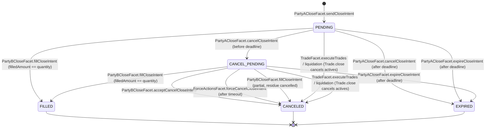
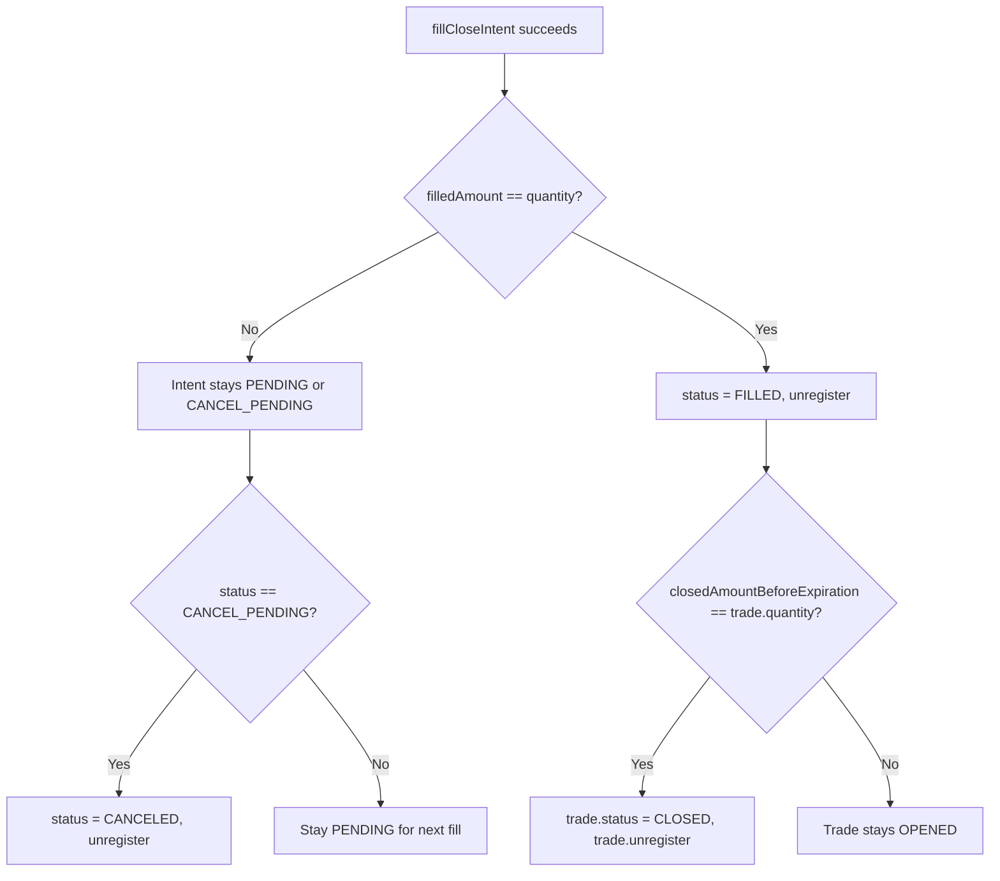
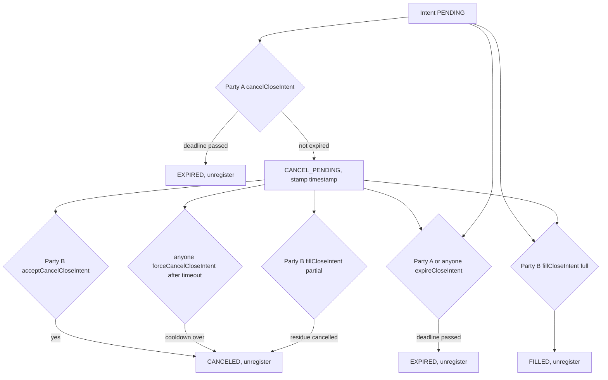
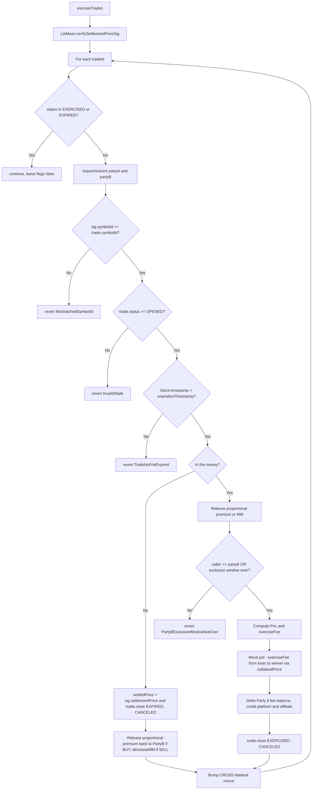

# Close And Settlement Flows

This document covers everything that happens to a `Trade` after it is opened: pre-expiration close intents (Party A initiated, Party B filled), the full settlement of expired trades through `TradeFacet.executeTrades`, and the auxiliary trade-ownership operations (`transferTrade`, `mintNFTForTrade`, `transferTradeFromNFT`).

## Overview

A trade can leave its `OPENED` state via three distinct mechanisms:

| Mechanism            | Initiator                                   | Pre/Post expiration | Resulting `TradeStatus`  | Source                                                             |
| -------------------- | ------------------------------------------- | ------------------- | ------------------------ | ------------------------------------------------------------------ |
| Close intent fill    | Party A creates intent, Party B fills       | Pre-expiration      | `OPENED` then `CLOSED`   | `LibPartyAClose.sendCloseIntent`, `LibPartyBClose.fillCloseIntent` |
| Settlement execution | Anyone after `partyBExclusiveWindow` lapses | Post-expiration     | `EXERCISED` or `EXPIRED` | `LibTradeOperations.executeTrades`                                 |
| Liquidation closure  | Clearing house                              | Either              | `LIQUIDATED`             | `LibClearingHouse` (covered in [[liquidation-and-force-actions]])  |

"Close" and "settlement" are independent paths:

- A close intent is an off-market RFQ where Party A sets a price they will accept; Party B fills at a price favorable to Party A. It moves units of the trade out of the open quantity before option expiration.
- Settlement is a single Muon-signed event after `expirationTimestamp` that prices the remaining open amount and either pays Party A's intrinsic option value (`EXERCISED`) or releases the locked premium/MM back to Party B (`EXPIRED`).

A trade with a partial early close still gets settled at expiration for the remaining `getOpenAmount()`, and any active close intents at settlement time are cancelled as a side effect of `Trade.close()` (see `LibTradeOps.close` at `contracts/libraries/models/LibTrade.sol:112`).

## Close Intent State Machine



The enum values are defined in `contracts/types/IntentTypes.sol:18-24`:

```
PENDING = 0, CANCEL_PENDING = 1, CANCELED = 2, FILLED = 3, EXPIRED = 4
```

Status transitions are guarded by `ValidationErrors.requireStatus` and the explicit two-state `InvalidState` check in `LibPartyBClose.fillCloseIntent` (`contracts/libraries/core/LibPartyBClose.sol:79-84`). All transitions also stamp `intent.statusModifyTimestamp = block.timestamp`, which the timeout-based force cancel relies on.

## Anatomy Of A CloseIntent

`CloseIntent` (`contracts/types/IntentTypes.sol:44-55`) is a flat struct keyed by an auto-incrementing id from `CloseIntentStorage.lastCloseIntentId`.

| Field                   | Type                | Source                                                     | Purpose                                                                                                |
| ----------------------- | ------------------- | ---------------------------------------------------------- | ------------------------------------------------------------------------------------------------------ |
| `id`                    | `uint256`           | `++CloseIntentStorage.lastCloseIntentId`                   | Primary key in `closeIntents` mapping.                                                                 |
| `tradeId`               | `uint256`           | Caller argument                                            | Back-reference to the parent `Trade`.                                                                  |
| `price`                 | `uint256` (1e18)    | Caller argument                                            | Party A's threshold close price. For BUY trades, fills must be `>=`; for SELL, fills must be `<=`.     |
| `quantity`              | `uint256` (1e18)    | Caller argument                                            | Total amount Party A is offering to close on this intent.                                              |
| `filledAmount`          | `uint256` (1e18)    | Updated by `fillCloseIntent`                               | Cumulative filled amount across multiple fills.                                                        |
| `createTimestamp`       | `uint256`           | `block.timestamp` at creation                              | Audit/UI metadata.                                                                                     |
| `statusModifyTimestamp` | `uint256`           | Updated on every transition                                | Drives `forceCancelCloseIntentTimeout`.                                                                |
| `deadline`              | `uint256`           | Caller argument                                            | Hard expiry of the intent itself. Independent of `trade.expirationTimestamp`.                          |
| `feeStructure`          | `FeeStructure`      | Snapshot of `trade.feeStructure` (`LibPartyAClose.sol:55`) | Locks fee token, fee token price, and platform/affiliate/solver close fee rates as of intent creation. |
| `status`                | `CloseIntentStatus` | State machine                                              | One of `PENDING`, `CANCEL_PENDING`, `CANCELED`, `FILLED`, `EXPIRED`.                                   |

### Relationship To The Parent Trade

`Trade` (`contracts/types/TradeTypes.sol:18-35`) stores three quantity counters that close intents mutate:

- `tradeAgreements.quantity`: total opened size of the trade. Immutable post-open.
- `closedAmountBeforeExpiration`: cumulative filled close-intent quantity. Increased on every `fillCloseIntent`.
- `closePendingAmount`: sum of the `quantity` field of every active (non-finalized) close intent. Increased on `register`, decreased on `unregister` (`LibCloseIntentOps.register` / `unregister`, `contracts/libraries/models/LibCloseIntent.sol:53-66`).

The available amount Party A may put on a new close intent is enforced by `LibTradeOps.getAvailableAmountToClose` (`contracts/libraries/models/LibTrade.sol:32-34`):

```
available = trade.tradeAgreements.quantity − trade.closedAmountBeforeExpiration − trade.closePendingAmount
```

The currently exercisable size at settlement is `LibTradeOps.getOpenAmount`:

```
open = trade.tradeAgreements.quantity − trade.closedAmountBeforeExpiration
```

Note that `getOpenAmount` ignores `closePendingAmount`: pending close intents do not shrink the settlement quantity, only filled closes do. They are released by `Trade.close` if settlement runs first.

### Indexes

`CloseIntentStorage` (`contracts/storages/CloseIntentStorage.sol`):

- `closeIntents[id] → CloseIntent`.
- `closeIntentIdsOf[tradeId] → uint256[]`: append-only history of every intent ever created against a trade. Never removed. Used by view/UI flows.
- `lastCloseIntentId`: monotonic id counter.

`TradeStorage.trades[tradeId].activeCloseIntentIds`: only intents that are `PENDING` or `CANCEL_PENDING`. Mutated by `register`/`unregister` and by `Trade.close`.

## sendCloseIntent

Selector: `PartyACloseFacet.sendCloseIntent(uint256 tradeId, uint256 quantity, uint256 price, uint256 deadline)` at `contracts/facets/PartyAClose/PartyACloseFacet.sol:38`. Returns `intentId`.

The facet applies these modifiers before calling `LibPartyAClose.sendCloseIntent`:

- `whenPartyNotPaused(msg.sender)`
- `onlyPartyAOfTrade(tradeId)`: equivalent to checking `trade.partyA == msg.sender` and that the address is not configured as Party B.
- `whenInstantModeIsNotActive(msg.sender)`: instant mode must be off (close intents flow through `InstantLayer` instead — see [[instant-actions]]).

`LibPartyAClose.sendCloseIntent` (`contracts/libraries/core/LibPartyAClose.sol:29-59`) validates:

| Check                                                                 | Error                                          |
| --------------------------------------------------------------------- | ---------------------------------------------- |
| `sender == trade.partyA`                                              | `ValidationErrors.UnauthorizedSender`          |
| `trade.status == OPENED`                                              | `ValidationErrors.InvalidState("TradeStatus")` |
| `deadline >= block.timestamp`                                         | `ValidationErrors.LowDeadline`                 |
| `quantity <= trade.getAvailableAmountToClose()`                       | `IntentErrors.InvalidQuantity`                 |
| `trade.activeCloseIntentIds.length < AppStorage.maxCloseOrdersLength` | `IntentErrors.TooManyCloseOrders`              |

There is no validation on `price` itself (it can be zero or above the strike). Favorability is only enforced on the fill side.

State effects on success:

1. `intentId = ++CloseIntentStorage.lastCloseIntentId`.
2. `CloseIntent` is constructed with `status = PENDING`, `filledAmount = 0`, `feeStructure = trade.feeStructure`, and timestamps set to `block.timestamp`.
3. `LibCloseIntentOps.register` writes `closeIntents[id]`, appends to `closeIntentIdsOf[tradeId]`, appends to `trade.activeCloseIntentIds`, and increases `trade.closePendingAmount += quantity`.
4. Emits `SendCloseIntent(tradeId, intentId, price, quantity, deadline)`.

No balance movement happens at this point. Premium and MM are still locked from the open intent flow; close fees are debited only when a fill happens.

## fillCloseIntent

Selector: `PartyBCloseFacet.fillCloseIntent(uint256 intentId, uint256 quantity, uint256 price)` at `contracts/facets/PartyBClose/PartyBCloseFacet.sol:38`. The facet wraps `LibPartyBClose.fillCloseIntent` and emits `FillCloseIntent(intentId, quantity, price)`.

### Caller And State Restrictions

| Check                                                                  | Error                                                      |
| ---------------------------------------------------------------------- | ---------------------------------------------------------- |
| `msg.sender == trade.partyB`                                           | `ValidationErrors.UnauthorizedSender`                      |
| Solvent counterparty (CROSS only requires Party A solvency vs Party B) | `LibParty.requireSolvent` reverts with `ActiveLiquidation` |
| `0 < quantity <= intent.quantity − intent.filledAmount`                | `IntentErrors.InvalidFillAmount`                           |
| `intent.status ∈ {PENDING, CANCEL_PENDING}`                            | `ValidationErrors.InvalidState("CloseIntentStatus")`       |
| `trade.status == OPENED`                                               | `ValidationErrors.InvalidState("TradeStatus")`             |
| `block.timestamp <= intent.deadline`                                   | `IntentErrors.IntentExpired`                               |
| `block.timestamp < trade.tradeAgreements.expirationTimestamp`          | `TradeErrors.TradeExpired`                                 |
| BUY: `price >= intent.price`. SELL: `price <= intent.price`            | `IntentErrors.InvalidClosePrice`                           |

### Price Favorability — Worked Examples

Party A holds a BUY CALL on 5 ETH strike $3000, originally opened at premium price $200/unit, with an active close intent at `price = 250e18`:

- Party B fills at $260: passes (`260 >= 250`). `closePremium = (1 ETH * 260) / 1e18 = 260` per unit closed.
- Party B fills at $245: reverts with `InvalidClosePrice(245, 250)`.

Party A holds a SELL PUT with intent `price = 100e18`:

- Party B fills at $90: passes (`90 <= 100`).
- Party B fills at $110: reverts with `InvalidClosePrice(110, 100)`.

The protocol does not validate that the close price has any relationship to the live oracle price; favorability is purely vs Party A's stated threshold.

### Accounting

All numbers are 18-decimal. Let `q = quantity`, `p = price`, and:

```
closePremium       = q * p / 1e18
openPremiumPro     = (trade.openedPrice * q) / 1e18    // LibTradeOps.calculateProportionalPremium
mmPro              = (trade.tradeAgreements.mm * q) / trade.tradeAgreements.quantity
```

#### Party A BUY (`TradeSide.BUY`)

The original premium for this `q` is unlocked back to Party B (it was locked from Party B at open). Party B then pays `closePremium` to Party A, both via the relevant balance ops:

| Operation                                                                     | Source line              |
| ----------------------------------------------------------------------------- | ------------------------ |
| ISOLATED: `partyBBalance.instantIsolatedAdd(openPremiumPro, PREMIUM)`         | `LibPartyBClose.sol:111` |
| CROSS: `partyBBalance.scheduledAdd(partyA, openPremiumPro, CROSS, PREMIUM)`   | `LibPartyBClose.sol:113` |
| `partyBBalance.subForCounterParty(partyA, closePremium, marginType, PREMIUM)` | `LibPartyBClose.sol:116` |
| `partyABalance.scheduledAdd(partyB, closePremium, marginType, PREMIUM)`       | `LibPartyBClose.sol:117` |

Net for Party A: `+closePremium`. Net for Party B: `+openPremiumPro − closePremium`. Party B's gain matches the on-market move: if `p < trade.openedPrice` Party B profits.

#### Party A SELL (`TradeSide.SELL`)

Party A originally locked maintenance margin (MM) and received premium. The proportional MM is released back to Party A's free balance, and Party A pays `closePremium` to Party B:

| Operation                                                                     | Source line              |
| ----------------------------------------------------------------------------- | ------------------------ |
| `partyABalance.decreaseMM(partyB, mmPro)`                                     | `LibPartyBClose.sol:119` |
| `partyABalance.subForCounterParty(partyB, closePremium, marginType, PREMIUM)` | `LibPartyBClose.sol:120` |
| `partyBBalance.scheduledAdd(partyA, closePremium, marginType, PREMIUM)`       | `LibPartyBClose.sol:121` |

Net for Party A: `+mmPro − closePremium − closeFees`. Net for Party B: `+closePremium`.

### Fee Distribution

All close fees are paid by Party A in `intent.feeStructure.feeToken` (snapshot from the trade) — see `LibCloseIntentOps.getFeesFromUser` at `contracts/libraries/models/LibCloseIntent.sol:83-102`.

For each fee category `r ∈ {platformFee.closeFee, affiliateFee.closeFee, solverFee.closeFee}` the amount is:

```
fee = (q * p * r) / (feeStructure.tokenPriceInCollateral * 1e18)
```

| Recipient               | Account                                                                         | Balance op                                                                                                      |
| ----------------------- | ------------------------------------------------------------------------------- | --------------------------------------------------------------------------------------------------------------- |
| Default fee collector   | `FeeManagementStorage.defaultFeeCollector`                                      | `instantIsolatedAdd(fees[0], PLATFORM_FEE)`                                                                     |
| Affiliate fee collector | `affiliateFeeCollector[trade.affiliate]` if non-zero else `defaultFeeCollector` | `instantIsolatedAdd(fees[1], AFFILIATE_FEE)`                                                                    |
| Solver (Party B)        | `trade.partyB`                                                                  | ISOLATED: `instantIsolatedAdd(fees[2], SOLVER_FEE)`. CROSS: `scheduledAdd(partyA, fees[2], CROSS, SOLVER_FEE)`. |

Each recipient balance is initialized via `setup(recipient, feeToken)` first to ensure the `ScheduledReleaseBalance` slot is bound to the correct user/token (see `LibPartyBClose.sol:137`, `:142`, `:147`).

### Trade Counter Updates

After balance moves (`LibPartyBClose.sol:158-164`):

```
trade.avgClosedPriceBeforeExpiration =
    (trade.avgClosedPriceBeforeExpiration * trade.closedAmountBeforeExpiration + q * p)
    / (trade.closedAmountBeforeExpiration + q);
trade.closedAmountBeforeExpiration += q;
intent.filledAmount += q;
```

### Nonce Increments (CROSS only)

```
accountLayout.nonces[partyA][partyB] += 1;
accountLayout.nonces[partyB][partyA] += 1;
```

This invalidates any in-flight off-chain uPnL signatures bound to the previous nonce (`LibMuon.verifyUpnlSig` mixes the nonce into the hash, `LibMuon.sol:85`).

## Partial Fills And Trade Transitions

`LibPartyBClose.fillCloseIntent` post-processing (`contracts/libraries/core/LibPartyBClose.sol:174-194`):



Notes on the `CANCEL_PENDING` partial-fill branch (`LibPartyBClose.sol:188-193`): Party B may choose to fill less than the remaining `intent.quantity − intent.filledAmount`. If the intent was already in `CANCEL_PENDING`, the residue does not stay open — it is forced to `CANCELED` and the intent is unregistered, releasing `closePendingAmount` for the unfilled remainder. This mirrors the "Party B partially fills, then accepts cancel" semantics in a single call.

A full trade close (`TradeStatus.CLOSED`) happens only via the close-intent path. Settlement uses `EXERCISED`/`EXPIRED`. Liquidation uses `LIQUIDATED`.

## Cancellation And Expiry Paths

### Party A Initiated Cancel

`PartyACloseFacet.cancelCloseIntent(uint256[] intentIds)` accepts a batch and applies `LibPartyAClose.cancelCloseIntent` per id (`contracts/libraries/core/LibPartyAClose.sol:61-77`):

- Requires `sender == trade.partyA` and `intent.status == PENDING`.
- If `block.timestamp > intent.deadline`: calls `intent.expire()` → `EXPIRED` (emits `ExpireCloseIntent`).
- Otherwise: sets `status = CANCEL_PENDING`, stamps `statusModifyTimestamp` (emits `CancelCloseIntent`).

### Party B Accept Cancel

`PartyBCloseFacet.acceptCancelCloseIntent(uint256 intentId)` calls `LibPartyBClose.acceptCancelCloseIntent` (`contracts/libraries/core/LibPartyBClose.sol:33-51`):

- Requires `sender == trade.partyB`, `intent.status == CANCEL_PENDING`.
- Sets `status = CANCELED`, calls `unregister` (releases `closePendingAmount`).
- Emits `AcceptCancelCloseIntent(intentId)`.

### Force Cancel After Timeout

`ForceActionsFacet.forceCancelCloseIntent(uint256 intentId)` is callable by anyone and uses `LibForceActions.forceCancelCloseIntent` (`contracts/libraries/core/LibForceActions.sol:43-58`):

- Requires `intent.status == CANCEL_PENDING`.
- Requires `block.timestamp > intent.statusModifyTimestamp + AppStorage.forceCancelCloseIntentTimeout` (else `CooldownNotOver`).
- Sets `status = CANCELED`, calls `unregister`.
- Emits `ForceCancelCloseIntent(intentId)`.

### Expire

`PartyACloseFacet.expireCloseIntent(uint256[] expiredIntentIds)` is permissionless and calls `LibCloseIntentOps.expire` (`contracts/libraries/models/LibCloseIntent.sol:68-81`):

- Requires `block.timestamp > intent.deadline` (`IntentNotExpired` if not).
- Requires `intent.status ∈ {PENDING, CANCEL_PENDING}`.
- Sets `status = EXPIRED`, calls `unregister`.
- Emits `ExpireCloseIntent(intentId)`.

### Combined Flow



Note: a `PENDING` intent past its deadline can only be transitioned by `expireCloseIntent` (anyone) or `cancelCloseIntent` from Party A (which routes to `EXPIRED` because of the deadline check). It cannot be filled — `fillCloseIntent` reverts on the `IntentExpired` check before any state changes.

## Settlement Execution

`TradeFacet.executeTrades(uint256[] tradeIds, SettlementPriceSig sig)` at `contracts/facets/Trade/TradeFacet.sol:61` is the single entry-point for post-expiration trade resolution. It is gated only by `whenNotThirdPartyActionsPaused` (third-party caller is allowed; `partyBExclusiveWindow` is enforced inside the loop on a per-exercise basis).

### SettlementPriceSig

Defined at `contracts/types/TradeTypes.sol:42-50`:

| Field                 | Meaning                                                                                                   |
| --------------------- | --------------------------------------------------------------------------------------------------------- |
| `reqId`               | Muon request id used in the gateway signature.                                                            |
| `timestamp`           | Signing timestamp; signature expires after `AppStorage.settlementPriceSigValidTime`.                      |
| `symbolId`            | Symbol covered by the signature; must match every trade in the batch.                                     |
| `settlementPrice`     | Oracle settlement price for the underlying at expiration (1e18).                                          |
| `settlementTimestamp` | Oracle-reported settlement reference time.                                                                |
| `collateralPrice`     | Price of `symbol.collateral` in the units used for `pnl` (used to convert PnL to collateral units, 1e18). |
| `gatewaySignature`    | Muon gateway ECDSA signature.                                                                             |
| `sigs`                | Schnorr TSS signature.                                                                                    |

`LibMuon.verifySettlementPriceSig` (`contracts/libraries/services/LibMuon.sol:26-57`):

1. Reverts with `ExpiredSignature` if `block.timestamp > sig.timestamp + appLayout.settlementPriceSigValidTime`.
2. Computes `keccak256(abi.encodePacked(reqId, address(this), timestamp, symbolId, settlementPrice, settlementTimestamp, collateralPrice, chainId))`.
3. Calls `IMuonOracle(oracle.contractAddress).verifyTSSAndGW(hash, reqId, sigs, gatewaySignature)` where the oracle is resolved via `symbol.oracleId`.

The signature is symbol-bound but not trade-bound: a single signature covers all trades on the same symbol. Reusing it is permitted within `settlementPriceSigValidTime`.

### Per-Trade Loop



### Already-Settled Skip

If `trade.status` is `EXERCISED` or `EXPIRED` when the loop reaches it, both `exercised[i]` and `expired[i]` are left false and the loop continues without revert (`LibTradeOperations.sol:97-102`). This is what makes batched calls safe across racing executors.

### In-The-Money Rules

From `LibTradeOperations.sol:118-134`:

- **PUT**: exercised if `sig.settlementPrice < trade.tradeAgreements.strikePrice`. Otherwise expired.
- **CALL**: exercised if `sig.settlementPrice > trade.tradeAgreements.strikePrice`. Otherwise expired.
- Equality (`settlement == strike`) is treated as expired (no intrinsic value).

`LibTradeOps.calculatePnl` (`contracts/libraries/models/LibTrade.sol:36-44`) computes the absolute intrinsic value for the remaining open amount; it returns 0 if not in the money:

```
CALL: pnl = (settlementPrice − strikePrice) * openAmount / 1e18    (if settlement > strike)
PUT:  pnl = (strikePrice − settlementPrice) * openAmount / 1e18    (if settlement < strike)
```

`openAmount` here is `trade.getOpenAmount() = trade.quantity − trade.closedAmountBeforeExpiration` and is computed before `trade.close` runs.

### Pre-PnL Lock Releases

Both the EXPIRED and EXERCISED branches release the locks attached to the remaining open amount (`LibTradeOperations.sol:141-154`):

- BUY trades: the proportional premium that Party B paid at open is added back to Party B's balance (`scheduledAdd` in CROSS, `instantIsolatedAdd` in ISOLATED).
- SELL trades: the proportional MM Party A had locked vs Party B is released via `decreaseMM`.

For an EXPIRED option these releases plus the fact that `pnl == 0` mean the trade winds down with only the original premium having moved (the BUY pays premium and gets nothing in return; SELL collects premium and frees its margin).

### Exclusive Party B Window

If `exercised[i]` is true and `msg.sender != trade.partyB`:

```
require(block.timestamp > trade.tradeAgreements.expirationTimestamp + appLayout.partyBExclusiveWindow);
```

else `TradeErrors.PartyBExclusiveWindowNotOver`. Within the window, only Party B can finalize the exercise. After the window, anyone (including a keeper or Party A) can settle. The window does not apply to expired (out-of-money) trades — anyone may execute them as soon as the trade has expired.

### PnL Transfer And Collateral Conversion

PnL is denominated in the symbol's quote unit (matching `settlementPrice` and `strikePrice` units). It is converted to collateral units before being moved between balances (`LibTradeOperations.sol:168-169`):

```
amountToTransfer = (pnl − exerciseFee) * 1e18 / sig.collateralPrice
```

For a BUY (Party A long the option), the loser is Party B:

```
partyBBalance.subForCounterParty(partyA, amountToTransfer, marginType, REALIZED_PNL)
partyABalance.scheduledAdd(partyB, amountToTransfer, marginType, REALIZED_PNL)
```

For a SELL (Party A short), the loser is Party A:

```
partyABalance.subForCounterParty(partyB, amountToTransfer, marginType, REALIZED_PNL)
partyBBalance.scheduledAdd(partyA, amountToTransfer, marginType, REALIZED_PNL)
```

`trade.settledPrice = sig.settlementPrice` is persisted in both branches.

### Exercise Fee Math

From `LibTradeOps.calculateExerciseFee` (`contracts/libraries/models/LibTrade.sol:58-62`) using `trade.tradeAgreements.exerciseFee.{cap, rate}`:

```
cap   = exerciseFee.cap * pnl / 1e18                        // share of PnL, 1e18 = 100%
fee   = exerciseFee.rate * settlementPrice * openAmount / 1e36  // notional rate
exerciseFee = min(cap, fee)
```

Interpretation: the exercise fee is the lesser of (a) a percentage of the realized PnL (`cap`) and (b) a per-notional rate applied to `settlementPrice * openAmount` (`fee`). The two `1e18` factors in the second formula come from the 1e18 scaling of both `rate` and `settlementPrice * openAmount / 1e18`.

### Exercise Fee Distribution

The platform and affiliate exercise fees are charged to Party A's fee-token balance (`LibTradeOperations.sol:191-225`):

```
pnlInCollateral = pnl * 1e18 / sig.collateralPrice
fees[0] = pnlInCollateral * platformFee.closeFee / tokenPriceInCollateral
fees[1] = pnlInCollateral * affiliateFee.closeFee / tokenPriceInCollateral
```

Both come from `trade.partyA.balanceOf(feeStructure.feeToken)` via `subForCounterParty(partyB, ...)` and are credited to the default and affiliate fee collectors respectively. There is no solver-fee component on settlement (only on close intent fills).

Note: in this branch the `closeFee` rate from `feeStructure` is reused for the settlement-time fee, even though it is paid in the symbol's `feeToken` and the size formula differs (PnL-based, not premium-based). The exerciseFee from `tradeAgreements` is a separate notional/cap-share fee debited via the PnL transfer (it stays inside the balance flow because `amountToTransfer` is computed as `pnl − exerciseFee`, so the loser keeps `exerciseFee` worth of PnL — this is the pool from which exercise fees are economically funded).

### Active Close Intent Cancellation

Both branches end with `trade.close(targetStatus, CloseIntentStatus.CANCELED)` (`LibTradeOps.close` at `contracts/libraries/models/LibTrade.sol:112-123`). For every id remaining in `activeCloseIntentIds`:

- Stamps `statusModifyTimestamp = block.timestamp`.
- Sets `status = CANCELED`.
- Calls `unregister` (mutates `activeCloseIntentIds` and `closePendingAmount`).

Then the trade itself is unregistered from `activeTradesOfPartyA` and `activeTradesOfPartyB[collateral]` and its status is set.

### Result

| Outcome      | `trade.status` | `trade.settledPrice`  | Active close intents  | `exercised[i]` | `expired[i]` |
| ------------ | -------------- | --------------------- | --------------------- | -------------- | ------------ |
| In the money | `EXERCISED`    | `sig.settlementPrice` | All set to `CANCELED` | `true`         | `false`      |
| Out of money | `EXPIRED`      | `sig.settlementPrice` | All set to `CANCELED` | `false`        | `true`       |
| Already done | unchanged      | unchanged             | unchanged             | `false`        | `false`      |

Emits `ExecuteTrades(operator, tradeIds, exercised, expired, settlementPrice, collateralPrice)`.

## NFTs And Trade Transfer

Trade ownership is the `trade.partyA` field. It can be moved while a trade is `OPENED` and only for ISOLATED trades.

### transferTrade

`TradeFacet.transferTrade(address receiver, uint256 tradeId)` at `contracts/facets/Trade/TradeFacet.sol:29` is non-reentrant, gated by `whenPartyNotPaused(msg.sender)`, `onlyPartyAOfTrade(tradeId)`, and `whenNotSuspended` for both sender and receiver.

`LibTradeOperations.transferTrade` calls the shared `validateAndTransferTrade` (`contracts/libraries/core/LibTradeOperations.sol:37-66`) which checks:

- `trade.partyA == sender`.
- `receiver != address(0)` (`ZeroAddress`).
- `receiver` is not configured as a Party B (`ReceiverIsPartyB`).
- `trade.status == OPENED`.
- `trade.tradeAgreements.marginType == ISOLATED` (else `CrossTradeTransferNotAllowed`).
- Party B is solvent for ISOLATED.

On success it `unregister`s from the seller's index, sets `trade.partyA = receiver`, and `register`s under the new owner. If `AppStorage.tradeNftAddress != 0`, it also calls `ITradeNFT(tradeNftAddress).transferTradeNFT(sender, receiver, tradeId)` so the NFT follows the trade.

### mintNFTForTrade

`TradeFacet.mintNFTForTrade(uint256 tradeId)` (`contracts/facets/Trade/TradeFacet.sol:71`) is `nonReentrant onlyPartyAOfTrade(tradeId)`. `LibTradeOperations.mintNFTForTrade` rejects CROSS trades (`NFTMintingNotAllowedForCrossMarginTrade`) and otherwise calls `ITradeNFT(tradeNftAddress).mintNFTForTrade(trade.partyA, tradeId)`.

### transferTradeFromNFT

`TradeFacet.transferTradeFromNFT(address sender, address receiver, uint256 tradeId)` is the reverse direction — called by `TradeNFT._beforeTokenTransfer` when an NFT changes hands outside the protocol.

`LibTradeOperations.transferTradeFromNFT` (`contracts/libraries/core/LibTradeOperations.sol:74-78`):

- Requires `msg.sender == AppStorage.tradeNftAddress` (else `UnauthorizedSender`).
- Calls the same `validateAndTransferTrade(sender, receiver, tradeId)` body, so all the ownership/state/cross-margin invariants are enforced before sync.

Re-entrancy between the two sides is prevented in `TradeNFT.transferTradeNFT` by the `transferInitiatedInSymmio` flag (`contracts/helpers/TradeNFT.sol:116-121`) — when the diamond initiates the move, the `_beforeTokenTransfer` hook is short-circuited.

## Errors Reference

| Error                                                                 | Source                           | Raised by                                                                                                                     |
| --------------------------------------------------------------------- | -------------------------------- | ----------------------------------------------------------------------------------------------------------------------------- |
| `UnauthorizedSender(sender, requiredSender)`                          | `errors/ValidationErrors.sol:16` | `sendCloseIntent`, `cancelCloseIntent`, `acceptCancelCloseIntent`, `fillCloseIntent`, `transferTrade`, `transferTradeFromNFT` |
| `InvalidState(property, current, requiredStatus[])`                   | `errors/ValidationErrors.sol:15` | All status guards on `TradeStatus`/`CloseIntentStatus`                                                                        |
| `LowDeadline(deadline, current)`                                      | `errors/ValidationErrors.sol:13` | `sendCloseIntent`                                                                                                             |
| `ZeroAddress(property)`                                               | `errors/ValidationErrors.sol:9`  | `validateAndTransferTrade`                                                                                                    |
| `ExpiredSignature(currentTime, sigTimestamp, validTime, expiryTime)`  | `errors/ValidationErrors.sol:30` | `verifySettlementPriceSig`                                                                                                    |
| `CooldownNotOver("forceCancelCloseIntentTimeout", current, required)` | `errors/ValidationErrors.sol:14` | `forceCancelCloseIntent`                                                                                                      |
| `InvalidQuantity(requested, available)`                               | `errors/IntentErrors.sol:30`     | `sendCloseIntent`                                                                                                             |
| `TooManyCloseOrders(current, maximum)`                                | `errors/IntentErrors.sol:31`     | `sendCloseIntent`                                                                                                             |
| `InvalidClosePrice(providedPrice, thresholdPrice)`                    | `errors/IntentErrors.sol:32`     | `fillCloseIntent` price favorability                                                                                          |
| `InvalidFillAmount(quantity, availableAmount)`                        | `errors/IntentErrors.sol:35`     | `fillCloseIntent`                                                                                                             |
| `IntentExpired(intentId, currentTime, deadline)`                      | `errors/IntentErrors.sol:9`      | `fillCloseIntent` deadline check                                                                                              |
| `IntentNotExpired(intentId, currentTime, deadline)`                   | `errors/IntentErrors.sol:10`     | `expireCloseIntent`                                                                                                           |
| `TradeExpired(tradeId, currentTime, expirationTimestamp)`             | `errors/TradeErrors.sol:12`      | `fillCloseIntent` expiration check                                                                                            |
| `TradeNotYetExpired(tradeId, currentTime, expirationTimestamp)`       | `errors/TradeErrors.sol:21`      | `executeTrades`                                                                                                               |
| `MismatchedSymbolId(providedSymbolId, tradeSymbolId)`                 | `errors/TradeErrors.sol:20`      | `executeTrades` per-trade symbol check                                                                                        |
| `PartyBExclusiveWindowNotOver(currentTime, requiredTime)`             | `errors/TradeErrors.sol:22`      | `executeTrades` exercise window                                                                                               |
| `ReceiverIsPartyB(receiver, partyB)`                                  | `errors/TradeErrors.sol:15`      | `validateAndTransferTrade`                                                                                                    |
| `CrossTradeTransferNotAllowed(tradeId)`                               | `errors/TradeErrors.sol:16`      | `validateAndTransferTrade`                                                                                                    |
| `NFTMintingNotAllowedForCrossMarginTrade(tradeId)`                    | `errors/TradeErrors.sol:17`      | `mintNFTForTrade`                                                                                                             |

## Worked Numeric Example

Trade: Party A BUY CALL on `quantity = 5e18` ETH, `strikePrice = 3000e18`, `openedPrice = 200e18` (premium per unit), `marginType = ISOLATED`. `feeStructure.feeToken = USDC`, `tokenPriceInCollateral = 1e18`, `platformFee.closeFee = 0.001e18` (0.1%), `affiliateFee.closeFee = 0`, `solverFee.closeFee = 0`, `exerciseFee = {rate: 0.001e18, cap: 0.05e18}`.

State at open (collateral = USDC):

- Party A locked: open premium `5 * 200 = 1000` USDC paid to Party B at fill (already moved).
- Party B locked: nothing for ISOLATED BUY beyond having received the 1000 USDC premium.

### Step 1 — Partial Close At $250

Party A `sendCloseIntent(tradeId, quantity=2e18, price=250e18, deadline=...)`:

- `available = 5 − 0 − 0 = 5`, `2 ≤ 5` ok. Intent registered, `closePendingAmount = 2`.

Party B `fillCloseIntent(intentId, quantity=2e18, price=260e18)` at $260 (favorable: `260 ≥ 250`):

- `closePremium = 2 * 260 / 1 = 520` USDC.
- `openPremiumPro = 200 * 2 / 1 = 400` USDC.
- ISOLATED BUY accounting:
    - Party B balance `+= 400` USDC (premium return).
    - Party B balance `-= 520` USDC (close premium paid).
    - Party A balance `+= 520` USDC.
- Close fees from Party A (USDC): `(2 * 260 * 0.001) / (1 * 1) = 0.52` USDC paid to default fee collector. Affiliate and solver fees are zero by configuration.
- `trade.closedAmountBeforeExpiration = 2`, `avgClosedPriceBeforeExpiration = 260`, `intent.filledAmount = 2`, intent → `FILLED`, unregistered.
- Trade still `OPENED` (`closedAmountBeforeExpiration != quantity`).

Net flows after step 1:

- Party A: `+520 − 0.52 = +519.48` USDC.
- Party B: `+400 − 520 = −120` USDC.
- Default fee collector: `+0.52` USDC.

### Step 2 — Settlement At $3200 (CALL ITM)

After `expirationTimestamp`, anyone (within Party B exclusive window only Party B) calls `executeTrades([tradeId], sig)` with `sig.settlementPrice = 3200e18`, `sig.collateralPrice = 1e18`.

- Symbol verified, trade `OPENED`, expired. CALL with `3200 > 3000` → `exercised`.
- `openAmount = 5 − 2 = 3`.
- Pre-PnL release: ISOLATED BUY → Party B `+= calculateProportionalPremium(3) = 200 * 3 = 600` USDC.
- `pnl = (3200 − 3000) * 3 / 1 = 600` USDC-equivalent (in symbol quote units, here equal to USDC).
- Exercise fee: `cap = 0.05 * 600 / 1 = 30`; `fee = 0.001 * 3200 * 3 / 1e18 = 9.6` (after the `1e36` scaling in code). `exerciseFee = min(30, 9.6) = 9.6`.
- `amountToTransfer = (600 − 9.6) * 1 / 1 = 590.4` USDC.
- Party B `−= 590.4` USDC, Party A `+= 590.4` USDC.
- Platform exercise fee from Party A's USDC fee balance: `pnlInCollateral = 600`; `fees[0] = 600 * 0.001 / 1 = 0.6` USDC to default fee collector. Affiliate fee zero.
- `trade.settledPrice = 3200`. `trade.close(EXERCISED, CANCELED)` runs (no active close intents to cancel).

Cumulative net (deltas relative to a hypothetical pre-trade state where Party B had received the 1000 premium at open):

- Party A: `−1000 (open premium) + 519.48 (close step) + 590.4 (exercise) − 0.6 (platform exercise fee) = +109.28` USDC.
- Party B: `+1000 (open premium) − 120 (close step) + 600 (lock release) − 590.4 (exercise) = +889.6` USDC.

    Note that the lock release of 600 is offsetting the 600 paid out as `pnl + exerciseFee_kept`, so Party B effectively lost only `120 + 590.4 − 600 = +110.4` net relative to having held the premium.

- Default fee collector: `0.52 + 0.6 = 1.12` USDC.

(Numbers shown without 1e18 scaling for readability; on-chain values are 1e18-scaled.)

## Related Code Map

| Path                                                  | Role                                                                                                                                                        |
| ----------------------------------------------------- | ----------------------------------------------------------------------------------------------------------------------------------------------------------- |
| `contracts/facets/PartyAClose/PartyACloseFacet.sol`   | Party A entry points: `sendCloseIntent`, `cancelCloseIntent`, `expireCloseIntent`.                                                                          |
| `contracts/facets/PartyAClose/IPartyACloseFacet.sol`  | Selectors and `IPartyACloseEvents`.                                                                                                                         |
| `contracts/facets/PartyAClose/IPartyACloseEvents.sol` | `SendCloseIntent`, `CancelCloseIntent` events.                                                                                                              |
| `contracts/facets/PartyBClose/PartyBCloseFacet.sol`   | Party B entry points: `fillCloseIntent`, `acceptCancelCloseIntent`.                                                                                         |
| `contracts/facets/PartyBClose/IPartyBCloseEvents.sol` | `FillCloseIntent`, `AcceptCancelCloseIntent` events.                                                                                                        |
| `contracts/facets/Trade/TradeFacet.sol`               | `transferTrade`, `transferTradeFromNFT`, `executeTrades`, `mintNFTForTrade`.                                                                                |
| `contracts/facets/Trade/ITradeEvents.sol`             | `TransferTradeByPartyA`, `ExecuteTrades`.                                                                                                                   |
| `contracts/facets/ForceActions/ForceActionsFacet.sol` | `forceCancelCloseIntent` and `forceCancelOpenIntent`.                                                                                                       |
| `contracts/libraries/core/LibPartyAClose.sol`         | Send/cancel logic.                                                                                                                                          |
| `contracts/libraries/core/LibPartyBClose.sol`         | Fill/accept-cancel logic, fee distribution, nonce bumping.                                                                                                  |
| `contracts/libraries/core/LibTradeOperations.sol`     | `executeTrades`, transfer validation, NFT mint glue.                                                                                                        |
| `contracts/libraries/core/LibForceActions.sol`        | Cooldown-gated CANCELED transitions.                                                                                                                        |
| `contracts/libraries/models/LibCloseIntent.sol`       | `register`/`unregister`/`expire`/`getFeesFromUser`/`calculateFee`.                                                                                          |
| `contracts/libraries/models/LibTrade.sol`             | `getOpenAmount`, `getAvailableAmountToClose`, `calculatePnl`, `calculateProportionalPremium`/`MM`, `calculateExerciseFee`, `register`/`unregister`/`close`. |
| `contracts/libraries/services/LibMuon.sol`            | `verifySettlementPriceSig`, `verifyUpnlSig`.                                                                                                                |
| `contracts/storages/CloseIntentStorage.sol`           | `closeIntents`, `closeIntentIdsOf`, `lastCloseIntentId`.                                                                                                    |
| `contracts/storages/TradeStorage.sol`                 | `trades`, active trade indexes per Party A/B, `lastTradeId`.                                                                                                |
| `contracts/storages/AppStorage.sol`                   | `maxCloseOrdersLength`, `forceCancelCloseIntentTimeout`, `partyBExclusiveWindow`, `settlementPriceSigValidTime`, `tradeNftAddress`.                         |
| `contracts/types/IntentTypes.sol`                     | `CloseIntent`, `CloseIntentStatus`.                                                                                                                         |
| `contracts/types/TradeTypes.sol`                      | `Trade`, `TradeStatus`, `SettlementState`, `SettlementPriceSig`.                                                                                            |
| `contracts/types/SymbolTypes.sol`                     | `Symbol`, `OptionType` (`PUT`, `CALL`).                                                                                                                     |
| `contracts/types/BaseTypes.sol`                       | `TradeAgreements`, `FeeStructure`, `ExerciseFee`, `TradeSide`, `MarginType`.                                                                                |
| `contracts/errors/IntentErrors.sol`                   | Close intent errors.                                                                                                                                        |
| `contracts/errors/TradeErrors.sol`                    | Trade lifecycle and settlement errors.                                                                                                                      |
| `contracts/helpers/TradeNFT.sol`                      | ERC-721 trade NFT, `transferTradeNFT`, `mintNFTForTrade`, `_beforeTokenTransfer` sync hook.                                                                 |
| `tests/partyA-close-facet.behavior.ts`                | Party A side coverage (send, cancel, expire, deadlines, instant-mode interactions).                                                                         |
| `tests/partyB-close-facet.behavior.ts`                | Party B side coverage (fill, partial fill, accept-cancel, fee distribution, nonce bumps).                                                                   |
| `tests/trade-settlement.ts`                           | Settlement coverage: ITM/OTM CALL and PUT, ISOLATED and CROSS, BUY and SELL, transfer trade.                                                                |
