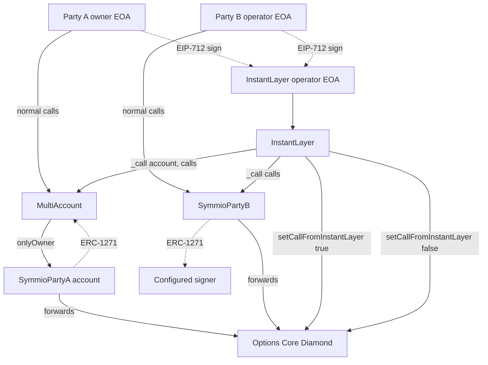
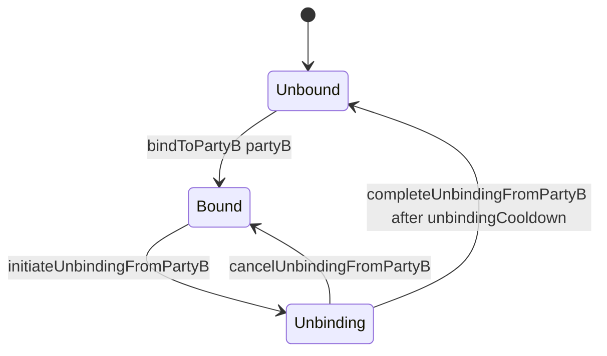
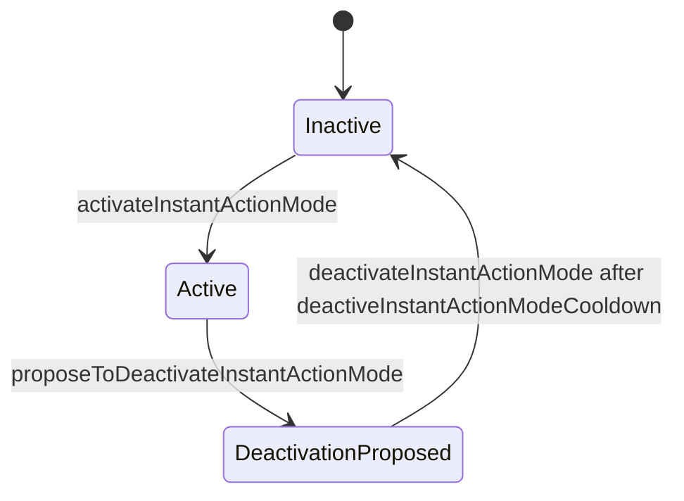
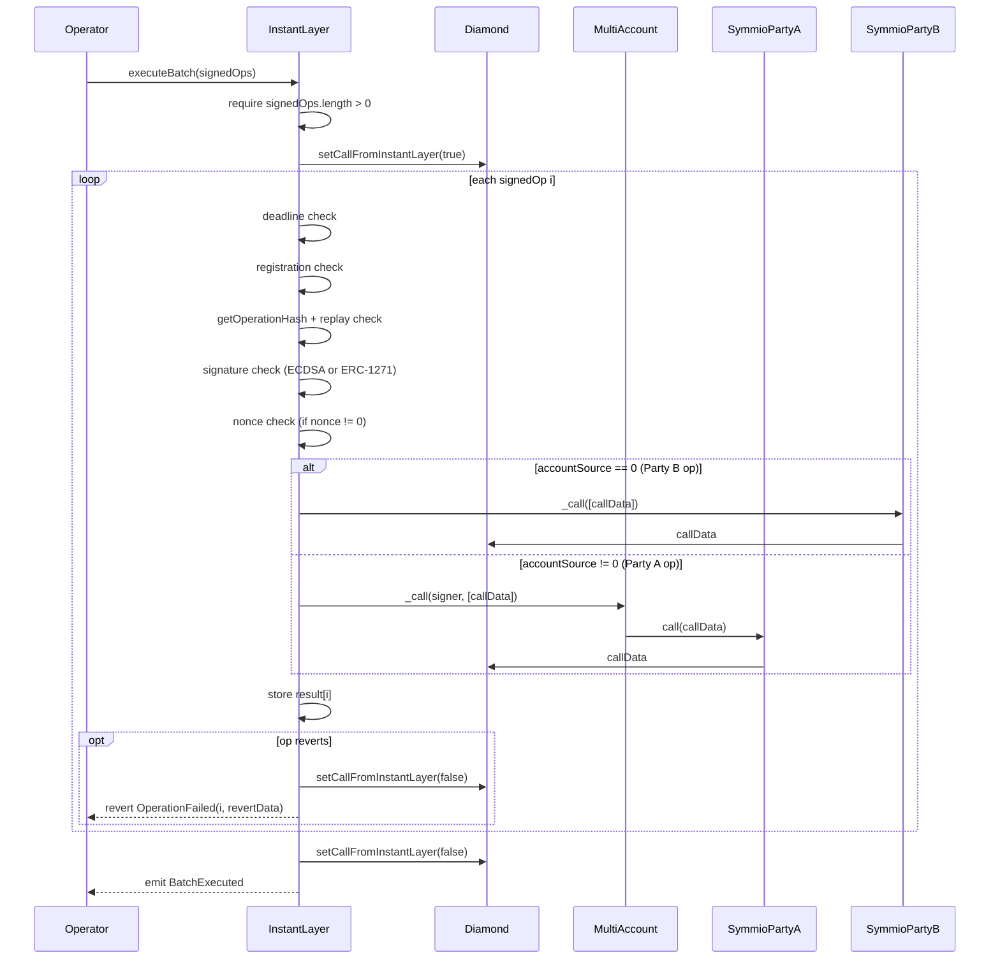
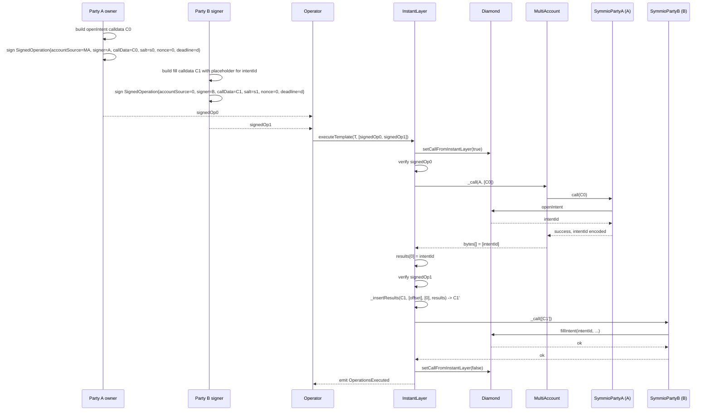

# Instant Actions Flow

Instant actions let Party A and Party B coordinate state changes through off-chain EIP-712 signed operations executed by a trusted operator (the InstantLayer). Instead of each party submitting its own transaction, both sides sign the calldata they want executed, hand the signatures to the operator, and the operator atomically batches them into a single transaction against the Diamond.

This document describes:

1. The overall topology and call paths.
2. The on-chain Party A binding state machine that gates instant action mode.
3. The instant action mode lifecycle and what it disables.
4. The four helper contracts that participate (`MultiAccount`, `SymmioPartyA`, `SymmioPartyB`, `InstantLayer`).
5. The `SignedOperation` type, signature scheme, replay protection, and execution paths.
6. The Diamond `callFromInstantLayer` flag that authorises the operator at the protocol boundary.
7. A worked example combining a Party A intent and a Party B fill in one batch.
8. Errors, code map.

## 1. Overview



Two execution channels exist for every party:

| Party   | Direct channel                                                       | Instant channel                                                                                   |
| ------- | -------------------------------------------------------------------- | ------------------------------------------------------------------------------------------------- |
| Party A | Owner EOA -> `MultiAccount._call` -> `SymmioPartyA.call` -> Diamond  | Operator -> `InstantLayer.executeBatch` -> `MultiAccount._call` -> `SymmioPartyA.call` -> Diamond |
| Party B | Authorised role on `SymmioPartyB` -> `SymmioPartyB._call` -> Diamond | Operator -> `InstantLayer.executeBatch` -> `SymmioPartyB._call` -> Diamond                        |

The Diamond does not see the operator directly. It sees calls coming from `SymmioPartyA` (Party A's account) or `SymmioPartyB` (Party B's contract), exactly like the direct channel. The only protocol-level distinguishing fact is that the boolean `callFromInstantLayer` is set to `true` on the Diamond for the duration of the batch.

## 2. Party A Binding Lifecycle

Before a Party A can use instant actions, it must bind itself to a single Party B. The binding is a one-to-one relationship stored per Party A account address.

### State machine



All transitions are driven by `CounterPartyRelationsFacet` and the supporting library at `contracts/libraries/core/LibCounterPartyRelations.sol`. State is held in `CounterPartyRelationsStorage.Layout`:

| Field                                      | Purpose                                                                                                         |
| ------------------------------------------ | --------------------------------------------------------------------------------------------------------------- |
| `boundPartyB[partyA]`                      | The bound Party B, or `address(0)` when unbound.                                                                |
| `unbindingRequestTime[partyA]`             | Timestamp when `initiateUnbindingFromPartyB` was called, or `0` when no unbinding is in progress.               |
| `unbindingCooldown`                        | Required wait between initiation and completion.                                                                |
| `instantActionsMode[partyA]`               | Whether instant action mode is currently active.                                                                |
| `instantActionsModeDeactivateTime[partyA]` | Earliest timestamp at which `deactivateInstantActionMode` will succeed, or `0` when no deactivation is pending. |
| `deactiveInstantActionModeCooldown`        | Required wait between proposing and finalising deactivation.                                                    |

### Transitions

| Function                        | Pre-condition                                                                            | Effect                                               | Reverts with                                                               |
| ------------------------------- | ---------------------------------------------------------------------------------------- | ---------------------------------------------------- | -------------------------------------------------------------------------- |
| `bindToPartyB(partyB)`          | `boundPartyB[msg.sender] == address(0)` and `partyB.isPartyB()`                          | `boundPartyB[msg.sender] = partyB`                   | `PartyBNotActive`, `BoundedToAnotherPartyB`                                |
| `initiateUnbindingFromPartyB()` | A bound Party B exists, instant mode is **not** active, no unbinding already in progress | `unbindingRequestTime[msg.sender] = block.timestamp` | `BoundedPartyBNotFound`, `InstantModeActive`, `UnbindingAlreadyInProgress` |
| `cancelUnbindingFromPartyB()`   | Unbinding in progress                                                                    | Clears `unbindingRequestTime`                        | `UnbindingNotInitiated`                                                    |
| `completeUnbindingFromPartyB()` | Unbinding in progress and `block.timestamp >= unbindingRequestTime + unbindingCooldown`  | Deletes `boundPartyB` and `unbindingRequestTime`     | `BoundedPartyBNotFound`, `UnbindingNotInitiated`, `CooldownNotOver`        |

### Effects of binding

- Open-intent flows on Party A whitelist their bound Party B as a permitted counterparty.
- Instant action mode requires a non-zero `boundPartyB[msg.sender]` to activate (`activateInstantActionMode` reverts with `BoundedPartyBNotFound` otherwise).
- `initiateUnbindingFromPartyB` is blocked while `instantActionsMode[msg.sender]` is true. A bound Party A wishing to unbind must first deactivate instant mode (which itself takes a cooldown).

## 3. Instant Action Mode

Instant action mode is a per-Party-A flag stored in `instantActionsMode[partyA]`. It must be explicitly enabled by Party A and explicitly disabled with a delay.

### State machine



### Transitions

| Function                                 | Pre-condition                                       | Effect                                                                                               | Reverts with                                                   |
| ---------------------------------------- | --------------------------------------------------- | ---------------------------------------------------------------------------------------------------- | -------------------------------------------------------------- |
| `activateInstantActionMode()`            | A Party B is bound, instant mode currently inactive | `instantActionsMode[msg.sender] = true`                                                              | `BoundedPartyBNotFound`, `whenInstantModeIsNotActive` modifier |
| `proposeToDeactivateInstantActionMode()` | Instant mode active                                 | `instantActionsModeDeactivateTime[msg.sender] = block.timestamp + deactiveInstantActionModeCooldown` | `whenInstantModeIsActive` modifier                             |
| `deactivateInstantActionMode()`          | Deactivation proposed and cooldown elapsed          | Clears `instantActionsMode` and `instantActionsModeDeactivateTime`                                   | `DeactivationNotProposed`, `CooldownNotOver`                   |

All three are only callable by Party A (`onlyNotPartyB(msg.sender)`) and respect `whenPartyNotPaused`.

### What instant mode blocks for Party A direct calls

Functions guarded by the `whenInstantModeIsNotActive` modifier reject direct Party A calls while instant mode is active. The blocked surface is the entire user-action surface that the InstantLayer is expected to mediate:

- Open intent creation, modification, and cancellation.
- Close intent creation, modification, and cancellation.
- Allocation, deallocation, and reserve movement.
- Internal and external transfers.
- Withdrawals.

Deposits remain available because they only add value to the account and have no counter-party coordination requirement.

The intent of this gate is simple: while Party A has authorised the InstantLayer to act through signed operations, Party A must not also be sending conflicting direct transactions. A two-step deactivation (propose + wait) gives the operator time to drain in-flight signed work before user-driven flows resume.

### Symmetric blocking on Party B

The Diamond enforces that Party B can only act through `SymmioPartyB`. Whether Party B is acting "directly" (its operator EOA calling `SymmioPartyB._call`) or "through InstantLayer" is invisible to the Diamond: both paths arrive as `msg.sender == SymmioPartyB`. The InstantLayer simply uses the `callFromInstantLayer` flag to authorise itself at the `SymmioPartyB` boundary, see section 6.

## 4. MultiAccount Deep-Dive

`contracts/helpers/MultiAccount.sol` is an upgradeable contract that:

- Deploys `SymmioPartyA` accounts via CREATE2 and indexes them per owner.
- Forwards calls to those accounts on behalf of either the owner or the InstantLayer.
- Acts as the ERC-1271 verifier for accounts it owns.
- Custodies trade NFTs and exposes a thin admin path for the owner.

### Account creation

```solidity
function addAccount(string memory name) external whenNotPaused;
```

Each call:

1. Computes `salt = keccak256("MultiAccount_" || saltCounter)`, then increments `saltCounter`.
2. Deploys a new `SymmioPartyA` via CREATE2, with constructor args `(address(this), symmioAddress)`. The deployed account therefore knows its `MultiAccount` (`multiAccountAddress`) and the Diamond (`symmioAddress`) at construction.
3. Stores `accounts[msg.sender].push(Account({account, name}))`, `indexOfAccount[account] = idx`, and `owners[account] = msg.sender`.
4. Emits `AddAccount(user, account, name)` and `DeployContract(deployer, contractAddress)`.

Accounts are immutable contracts; only the bytecode used for new deployments can be swapped via `setAccountImplementation` (SETTER_ROLE).

### Authorisation in `_call`

```solidity
function _call(address account, bytes[] calldata _callDatas) external whenNotPaused returns (bytes[] memory);
```

The check is:

```
if (msg.sender != owners[account] && !ISymmio(symmioAddress).isCallFromInstantLayer())
    revert UnauthorizedAccess(account, msg.sender, bytes4(0));
```

Two callers are admitted:

1. `msg.sender == owners[account]`: the registered owner of the target Party A account.
2. Any caller, provided the Diamond currently reports `isCallFromInstantLayer() == true`. This is what lets the InstantLayer route into accounts it does not own.

Each entry in `_callDatas` is forwarded to `SymmioPartyA(account).call(callData)`. A failure inside the account is rethrown by `innerCall` using assembly to preserve the original revert data. Successful results are emitted in the `Call` event and returned as a `bytes[]`.

### Owner-only utilities

| Function                                       | Caller            | Effect                                                                                           |
| ---------------------------------------------- | ----------------- | ------------------------------------------------------------------------------------------------ |
| `editAccountName(account, name)`               | `owners[account]` | Updates display name.                                                                            |
| `transferTradeNFT(account, to, tokenId)`       | `owners[account]` | Calls `SymmioPartyA.transferTradeNFT(tradeNFTAddress, to, tokenId)`.                             |
| `verifySignatureOfAccount(account, hash, sig)` | anyone (view)     | Returns the EIP-1271 magic value if `sig` is a valid signature by `owners[account]` over `hash`. |

### Admin paths

| Function                          | Role                            | Effect                                                               |
| --------------------------------- | ------------------------------- | -------------------------------------------------------------------- |
| `setAccountImplementation(bytes)` | `SETTER_ROLE`                   | Updates bytecode used for new accounts.                              |
| `setSymmioAddress(addr)`          | `SETTER_ROLE`                   | Re-points future deployments and authorisation checks.               |
| `setTradeNFTAddress(addr)`        | `SETTER_ROLE`                   | Updates NFT contract address.                                        |
| `adminCallPartyA(partyA, data)`   | `SETTER_ROLE`                   | Arbitrary low-level call into a `SymmioPartyA`; rethrows on failure. |
| `pause()` / `unpause()`           | `PAUSER_ROLE` / `UNPAUSER_ROLE` | Pauses non-view functions.                                           |

### ERC-1271 chain

Because `SymmioPartyA` is a contract, it cannot produce ECDSA signatures. The chain used when an off-chain protocol asks "is this signature valid for the Party A account?" is:

```
caller -> SymmioPartyA.isValidSignature(hash, sig)
       -> MultiAccount.verifySignatureOfAccount(account, hash, sig)
       -> SignatureVerifier.isValidSignatureEIP1271(owners[account], hash, sig)
       -> LibSignatureChecker.isValidSignatureNow(owners[account], hash, sig)
```

This means signatures attributed to a Party A account are validated against the EOA recorded in `owners[account]` at validation time. Transferring ownership of an account (not currently exposed) would invalidate prior signatures.

## 5. SymmioPartyA

`contracts/helpers/SymmioPartyA.sol` is a deliberately small per-account contract.

```solidity
function call(bytes memory callData) external onlyMultiAccount returns (bool, bytes memory) {
	return symmioAddress.call{ value: 0 }(callData);
}
```

Properties:

- Only the originating `MultiAccount` may call it (`onlyMultiAccount` modifier checks `msg.sender == multiAccountAddress`).
- It forwards arbitrary `callData` to the Diamond as a value-less call. The result and success flag are returned to the `MultiAccount`, which surfaces them.
- It implements `IERC721Receiver` so it can hold trade NFTs minted to the account.
- `transferTradeNFT(nftContract, to, tokenId)` is restricted to the `MultiAccount`, wraps `safeTransferFrom`, and converts any failure into `NFTTransferFailed`.
- It implements ERC-1271 by delegating to the `MultiAccount` (which in turn delegates to the owner EOA, see section 4).
- `setSymmioAddress(addr)` is gated by `DEFAULT_ADMIN_ROLE`, granted at construction to the `MultiAccount`. Combined with `MultiAccount.adminCallPartyA`, this gives the `MultiAccount`'s `SETTER_ROLE` holders an upgrade path for the Diamond address inside an account.

The Diamond therefore sees `msg.sender == SymmioPartyA` for every Party A call regardless of whether it originated from the owner or the InstantLayer.

## 6. SymmioPartyB

`contracts/helpers/SymmioPartyB.sol` is an upgradeable, per-Party-B contract that fronts all of Party B's interactions with the Diamond. Unlike Party A's per-account contracts, a Party B typically operates a single `SymmioPartyB` contract.

### Roles

| Role                            | Purpose                                                                                                                      |
| ------------------------------- | ---------------------------------------------------------------------------------------------------------------------------- |
| `DEFAULT_ADMIN_ROLE`            | Updates Symmio address, manages restricted selectors.                                                                        |
| `SETTER_ROLE`                   | Updates the EIP-1271 signer address.                                                                                         |
| `MANAGER_ROLE`                  | May call restricted selectors on the Diamond, manage the multicast whitelist, withdraw ERC-20s.                              |
| `TRUSTED_ROLE`                  | May call non-restricted selectors on the Diamond, approve tokens, perform multicast calls to whitelisted external contracts. |
| `PAUSER_ROLE` / `UNPAUSER_ROLE` | Pause / unpause non-view operations.                                                                                         |

### Call execution

Two entry points exist:

```solidity
function _call(bytes[] calldata _callDatas) external whenNotPaused nonReentrant;
function _multicastCall(address[] calldata destAddresses, bytes[] calldata _callDatas) external whenNotPaused nonReentrant;
```

`_call` always targets `symmioAddress`. `_multicastCall` allows Party B to fan out to other contracts but only to whitelisted destinations and only when the caller has `TRUSTED_ROLE`.

For each call the contract dispatches to `_executeCall`, which encapsulates the access logic:

| Target              | Selector                                | Required caller                                                                |
| ------------------- | --------------------------------------- | ------------------------------------------------------------------------------ |
| `symmioAddress`     | `restrictedSelectors[selector] == true` | `MANAGER_ROLE`                                                                 |
| `symmioAddress`     | non-restricted                          | `MANAGER_ROLE` or `TRUSTED_ROLE` or `ISymmio.isCallFromInstantLayer() == true` |
| not `symmioAddress` | any                                     | `multicastWhitelist[dest] == true` and `TRUSTED_ROLE`                          |

The Diamond's `callFromInstantLayer` flag is the third admit path for Symmio-bound calls. This is what lets the InstantLayer push Party B calldata through `SymmioPartyB._call` without holding a Party B role on the contract: while the flag is set, anyone can invoke `_call` with non-restricted selectors. Restricted selectors (configured by Party B's admin) remain reachable only through `MANAGER_ROLE`, even from the InstantLayer, which prevents the operator from invoking sensitive admin-style selectors via signed operations.

Failures are rethrown verbatim (`revert(add(_resultData, 32), mload(_resultData))`), so Diamond errors propagate cleanly through `SymmioPartyB._call` -> `InstantLayer._executeOperationSafe` -> `OperationFailed`.

### Token plumbing

| Function                       | Role           | Purpose                                    |
| ------------------------------ | -------------- | ------------------------------------------ |
| `_approve(token, amount)`      | `TRUSTED_ROLE` | Approves Symmio to spend Party B's tokens. |
| `withdrawERC20(token, amount)` | `MANAGER_ROLE` | Sweeps tokens to the caller.               |

### ERC-1271

```solidity
function isValidSignature(bytes32 hash, bytes calldata signature) external view returns (bytes4);
```

Returns the magic value when `signature` is a valid signature by the configured `signer` over `hash`. The `signer` is set via `setSigner` (SETTER_ROLE). This is the EOA whose signatures the Diamond accepts when Party B participates in EIP-712 schemes that allow contract signers (open intent acceptance, oracle attestation, etc.).

## 7. InstantLayer Deep-Dive

`contracts/helpers/InstantLayer.sol` is the executor that consumes signed operations, verifies them, toggles the Diamond's instant flag, and dispatches each operation through the right helper.

### Roles

| Role                 | Purpose                                                                                               |
| -------------------- | ----------------------------------------------------------------------------------------------------- |
| `SETTER_ROLE`        | Register / unregister Party Bs and MultiAccounts; add / activate templates.                           |
| `OPERATOR_ROLE`      | Call `executeBatch` and `executeTemplate`. Granted automatically to every registered Party B address. |
| `MANAGER_ROLE`       | Manager-level admin.                                                                                  |
| `TRUSTED_ROLE`       | Trusted-level admin.                                                                                  |
| `DEFAULT_ADMIN_ROLE` | Role administration.                                                                                  |

All five are granted to the constructor `_admin` argument.

### EIP-712 domain

```solidity
EIP712("SymmioInstantLayer", "1");
```

So the domain separator is computed over `name = "SymmioInstantLayer"`, `version = "1"`, the chain id, and `address(this)`.

### `SignedOperation`

```solidity
bytes32 public constant OPERATION_TYPEHASH = keccak256(
    "SignedOperation(address accountSource,address signer,bytes callData,uint256 nonce,bytes32 salt,uint256 deadline)"
);

struct SignedOperation {
    address accountSource;
    address signer;
    bytes callData;
    uint256 nonce;
    bytes32 salt;
    uint256 deadline;
    bytes signature;
}
```

The struct hash is

```
keccak256(abi.encode(
    OPERATION_TYPEHASH,
    accountSource,
    signer,
    keccak256(callData),
    nonce,
    salt,
    deadline
));
```

The signed digest is `_hashTypedDataV4(structHash)`, exposed as `getOperationHash`.

| Field           | Meaning                                                                                                                                                                                                                                                                                                                                                                                                             |
| --------------- | ------------------------------------------------------------------------------------------------------------------------------------------------------------------------------------------------------------------------------------------------------------------------------------------------------------------------------------------------------------------------------------------------------------------- |
| `accountSource` | `address(0)` for a Party B operation, or the registered `MultiAccount` for a Party A operation. Selects the dispatch path.                                                                                                                                                                                                                                                                                          |
| `signer`        | Party A operations: the `SymmioPartyA` account address (the on-chain identity that the Diamond sees as `msg.sender`). Party B operations: the `SymmioPartyB` address. In both cases the actual ECDSA signature is checked against this address using `LibSignatureChecker.isValidSignatureNow`, which falls through to ERC-1271 because both addresses are contracts. The chains are described in sections 4 and 6. |
| `callData`      | The raw calldata to send to the Diamond. It is included in the typed-data hash via `keccak256(callData)`, so any modification invalidates the signature. (The single exception: `executeTemplate` mutates a working copy of `callData` for return-data injection; the signature is still verified against the original `callData` because verification happens before the copy is mutated.)                         |
| `nonce`         | If `0`, only salt-based replay protection applies. If non-zero, must equal `nonces[signer] + 1`; on success the value is written and `nonces[signer]++` is emitted.                                                                                                                                                                                                                                                 |
| `salt`          | An arbitrary 32-byte value the signer chooses. It guarantees that two operations with otherwise identical fields hash differently. Required even when `nonce != 0`.                                                                                                                                                                                                                                                 |
| `deadline`      | Unix timestamp after which the operation is rejected with `DeadlineExpired`.                                                                                                                                                                                                                                                                                                                                        |
| `signature`     | ECDSA or ERC-1271 signature over `getOperationHash(...)`. ECDSA is verified with `MessageHashUtils.toEthSignedMessageHash(hash)` (i.e. the `\x19Ethereum Signed Message:\n32` prefix), since `LibSignatureChecker.isValidSignatureNow` is invoked on that prefixed hash.                                                                                                                                            |

### Replay protection

Every successful verification writes `usedOperationHashes[hash] = true`. A re-submitted signed operation reverts with `OperationAlreadyExecuted(hash)`. This applies whether or not `nonce` is in use.

The `nonce` mechanism is layered on top:

- `nonce == 0` ("salt-only mode"): pure idempotency, no ordering. Signers can pre-sign many operations and the operator can execute them in any order.
- `nonce > 0` ("ordered mode"): each successful verification asserts `nonce == nonces[signer] + 1` and increments `nonces[signer]`. This pins operations to a strict per-signer sequence and fills a gap if signers want hard ordering across batches.

Both modes rely on `usedOperationHashes` to prevent re-execution. `salt` is the only mechanism that allows two semantically identical calls to coexist as distinct operations.

### Registration model

| Function                                                           | Role          | Effect                                                                                                                                 |
| ------------------------------------------------------------------ | ------------- | -------------------------------------------------------------------------------------------------------------------------------------- |
| `registerPartyB(addr)` / `registerPartyBBatch([addr])`             | `SETTER_ROLE` | Sets `registeredPartyBs[addr] = true`. **Also grants `OPERATOR_ROLE` to `addr`**, so registered Party Bs can submit their own batches. |
| `unregisterPartyB(addr)`                                           | `SETTER_ROLE` | Clears the flag and revokes `OPERATOR_ROLE`.                                                                                           |
| `registerMultiAccount(addr)` / `registerMultiAccountBatch([addr])` | `SETTER_ROLE` | Sets `registeredMultiAccounts[addr] = true`. **Does not** grant `OPERATOR_ROLE` to the `MultiAccount`.                                 |
| `unregisterMultiAccount(addr)`                                     | `SETTER_ROLE` | Clears the flag.                                                                                                                       |

`_verifyOperation` enforces:

- `accountSource == address(0)` -> `registeredPartyBs[signer]` must be true; else `UnregisteredPartyB`.
- `accountSource != address(0)` -> `registeredMultiAccounts[accountSource]` must be true; else `UnregisteredMultiAccount`. (No registration check on `signer` itself; the `MultiAccount` is trusted to know which addresses are its accounts because it is the one that deployed them.)

### `executeBatch`

```solidity
function executeBatch(SignedOperation[] calldata signedOps) external nonReentrant onlyRole(OPERATOR_ROLE);
```



Notes:

- The flag is set before verification of operation 0 and cleared on the way out, including in the failure branch. If the trailing `setCallFromInstantLayer(false)` itself reverts (it should not, modulo Diamond storage corruption), the entire batch reverts and the flag stays at its prior value.
- The loop is `success && i < length`. The first failure sets `success = false`, clears the flag, and reverts with `OperationFailed(i, revertData)`. There is no partial commit.
- `_executeOperationSafe` wraps each operation:

```
callDatas[0] = signedOp.callData;
if (accountSource == 0)
    signer.call(abi.encodeWithSelector(ISymmioPartyB._call.selector, callDatas));
else
    accountSource.call(abi.encodeWithSelector(IMultiAccount._call.selector, signer, callDatas));
```

If the call returns non-empty data, `_executeOperationSafe` decodes it as `bytes[]` (the return type of both `_call` shapes) and surfaces the first element as `result`. This is what makes `result[i]` directly usable as the underlying Diamond return value.

### `executeTemplate` and return-data injection

```solidity
function executeTemplate(uint256 templateId, SignedOperation[] calldata signedOps) external nonReentrant onlyRole(OPERATOR_ROLE);
```

A `Template` is a fixed sequence of `Operation` records added by `SETTER_ROLE`:

```solidity
struct Operation {
	uint256[] insertionPoints;
	uint256[] sourceIndices;
}

struct Template {
	string name;
	Operation[] operations;
	bool active;
}
```

Each batch position is paired with the template's `Operation` at the same index. `_insertResults` patches the working copy of `callData` before dispatch:

```
for i in 0..insertionPoints.length:
    if sourceIndices[i] < results.length:
        value = abi.decode(results[sourceIndices[i]], (bytes32))
        // store `value` at byte offset `insertionPoints[i]` inside callData
        // the `+ 36` accounts for the bytes-length prefix and 32-byte offset
        mstore(callData + 36 + insertionPoints[i], value)
```

Practical implications:

- Only 32-byte values flow between operations (`abi.decode(..., (bytes32))`). Suitable for IDs, addresses, and uint256/uint*-returning functions; not for dynamic types.
- The template author must know the static layout of the placeholder bytes inside the signed `callData` so that signers can pre-sign with arbitrary placeholder bytes (often zeros) and trust the runtime to overwrite the specified offsets.
- The signature is verified against the **original** `signedOp.callData` (through `keccak256(signedOp.callData)` in the typed-data hash), not the patched copy. Signers therefore explicitly authorise the placeholder layout, not the post-injection bytes.
- If `sourceIndices[i] >= results.length`, that insertion is silently skipped; this allows trailing placeholders that would only be consumed by later, longer templates.

A typical template flow: operation 0 creates an open intent and returns its `intentId`; operation 1 is a Party B fill that takes the same `intentId` as a parameter. The signers do not know the `intentId` at signing time; the template injects it.

### Failure modes

| Stage                   | Error                                                                    | Notes                                                      |
| ----------------------- | ------------------------------------------------------------------------ | ---------------------------------------------------------- |
| `executeBatch` entry    | `EmptyBatch`                                                             | Empty array.                                               |
| `executeTemplate` entry | `InvalidTemplate(id)`                                                    | `id >= nextTemplateId`.                                    |
| `executeTemplate` entry | `TemplateNotActive(id)`                                                  | Active flag false.                                         |
| `executeTemplate` entry | `ArrayLengthMismatch`                                                    | `signedOps.length != template.operations.length`.          |
| `_verifyOperation`      | `DeadlineExpired(deadline)`                                              | `deadline < block.timestamp`.                              |
| `_verifyOperation`      | `UnregisteredPartyB(signer)` / `UnregisteredMultiAccount(accountSource)` | Registration check.                                        |
| `_verifyOperation`      | `OperationAlreadyExecuted(hash)`                                         | Replay.                                                    |
| `_verifyOperation`      | `InvalidSignature(signer)`                                               | Signature did not validate.                                |
| `_verifyOperation`      | `InvalidNonce(signer, expected, provided)`                               | Ordered-nonce mismatch.                                    |
| `_executeOperationSafe` | `OperationFailed(i, revertData)`                                         | The downstream call reverted; raw revert data is included. |
| Constructor / admin     | OZ access control errors                                                 | Role gate failures.                                        |

Because every helper rethrows downstream revert data, the `revertData` field in `OperationFailed` typically encodes a Diamond error (e.g. `MarginInsufficient`, `IntentNotFound`).

## 8. Diamond `callFromInstantLayer` Flag

The Diamond exposes:

```solidity
function setCallFromInstantLayer(bool) external; // restricted to INSTANT_LAYER_ROLE
function isCallFromInstantLayer() external view returns (bool);
```

Properties:

- The setter is gated such that only addresses holding the Diamond's `INSTANT_LAYER_ROLE` can flip it. The deployment ceremony grants this role exclusively to the `InstantLayer` contract.
- The flag is transient relative to a transaction: `executeBatch` and `executeTemplate` set it to `true` immediately before dispatching the first operation and clear it before returning. If those calls revert, the entire transaction reverts and the storage write is rolled back; there is no path where the flag is left set across transactions in the happy or unhappy path.
- `MultiAccount._call` reads the flag to admit non-owner callers (section 4).
- `SymmioPartyB._executeCall` reads the flag to admit non-roled callers for non-restricted selectors (section 6).
- The Diamond may also use the flag to relax its own modifiers in places where a Party A direct call would normally be blocked (e.g. while instant mode is active for Party A, the flag's truthiness is what allows the InstantLayer-relayed Party A call to proceed past `whenInstantModeIsNotActive`-style gates that admit instant traffic).

The flag is a single boolean, not a stack: nested or reentrant `executeBatch` calls would clobber it. The InstantLayer protects against that with `nonReentrant` on both execution entry points.

## 9. Signature Schemes Summary

| Surface                                 | Signer                                                                               | Hash computation                                             | Verifier                                                                                              | Caller-visible error       |
| --------------------------------------- | ------------------------------------------------------------------------------------ | ------------------------------------------------------------ | ----------------------------------------------------------------------------------------------------- | -------------------------- |
| `InstantLayer` operation                | EOA owning a Party A account (via ERC-1271 through `SymmioPartyA` -> `MultiAccount`) | `EIP712("SymmioInstantLayer","1")` over `OPERATION_TYPEHASH` | `LibSignatureChecker.isValidSignatureNow(signer, MessageHashUtils.toEthSignedMessageHash(hash), sig)` | `InvalidSignature(signer)` |
| `InstantLayer` operation                | EOA configured as `signer` on `SymmioPartyB` (via ERC-1271 through `SymmioPartyB`)   | same                                                         | same                                                                                                  | `InvalidSignature(signer)` |
| Direct ERC-1271 query on `SymmioPartyA` | `owners[account]`                                                                    | hash supplied by caller                                      | `LibSignatureChecker.isValidSignatureNow(owners[account], hash, sig)`                                 | returns `0xffffffff`       |
| Direct ERC-1271 query on `SymmioPartyB` | `signer`                                                                             | hash supplied by caller                                      | same with `signer`                                                                                    | returns `0xffffffff`       |

`LibSignatureChecker.isValidSignatureNow` (`contracts/libraries/utils/LibSignatureChecker.sol`) first attempts `ECDSA.tryRecover`; if recovery fails or the recovered address is not `signer`, it falls through to OpenZeppelin's `SignatureChecker.isValidERC1271SignatureNow`, which calls `IERC1271.isValidSignature` on `signer`. These are OpenZeppelin 4 semantics, kept deliberately: OpenZeppelin 5's `LibSignatureChecker.isValidSignatureNow` routes on `signer.code.length` and would reject a raw-key signature from an EIP-7702-delegated EOA. This is what enables both EOA owners and contract-based signers (e.g. multisigs) to act as the `signer` field of a `SignedOperation`.

Note that `InstantLayer.isValidSignature` wraps the typed-data hash with `MessageHashUtils.toEthSignedMessageHash` before delegating to `LibSignatureChecker`. ERC-1271 signers on Party A and Party B contracts must therefore accept signatures over the prefixed hash, not the raw typed-data hash. The wrapper is applied uniformly so that EOA signers can use a normal `personal_sign`-style flow and contract signers can compose with it.

## 10. Worked Example: Party A Open Intent + Party B Fill

Setup:

- Party A's owner EOA controls account `A` deployed by `MultiAccount` `MA`. `MA` is registered in `InstantLayer` (`registeredMultiAccounts[MA] == true`).
- Party B operates `SymmioPartyB` `B`. `B` is registered (`registeredPartyBs[B] == true`) and B's signer EOA backs `B`'s ERC-1271.
- Party A has bound to `B` and activated instant action mode.
- A template `T` exists: `operations.length == 2`, with `operations[1].insertionPoints = [<offset of intentId in fill calldata>]`, `operations[1].sourceIndices = [0]`.

Flow:



Observations:

- Two separate signers authored the two operations independently; the operator only orders and submits.
- Party A's signer never knew the resulting `intentId` and did not need to. They authorised the create-intent calldata; the template guarantees the resulting id is wired into the fill at a known offset.
- If the fill reverts on chain (e.g. price moved beyond Party B's tolerance), the create also reverts because `executeTemplate` is atomic. Party A is not exposed to a half-completed state.
- A vanilla `executeBatch` would also work for this pattern provided Party B can pre-compute the `intentId` (e.g. by asking the Diamond's view layer first), or provided Party B accepts a generic "fill latest open intent created by A" selector if the protocol exposes one. Templates are the right tool when the id is only known after operation 0 returns.

## 11. Errors Reference

### `InstantLayer`

| Error                                    | Condition                                                             |
| ---------------------------------------- | --------------------------------------------------------------------- |
| `InvalidSignature(signer)`               | `LibSignatureChecker` returned false.                                 |
| `DeadlineExpired(deadline)`              | `deadline < block.timestamp`.                                         |
| `InvalidNonce(user, expected, provided)` | `nonce != 0` and `nonce != nonces[signer] + 1`.                       |
| `TemplateNotActive(templateId)`          | Template flagged inactive.                                            |
| `InvalidTemplate(templateId)`            | Template id never minted.                                             |
| `OperationFailed(opIndex, revertData)`   | The dispatched call reverted; `revertData` is the downstream payload. |
| `ArrayLengthMismatch`                    | `signedOps.length != template.operations.length`.                     |
| `UnregisteredMultiAccount(addr)`         | `accountSource` not registered.                                       |
| `UnregisteredPartyB(addr)`               | `signer` not registered as Party B.                                   |
| `OperationAlreadyExecuted(hash)`         | Replay of a previously consumed operation.                            |
| `EmptyBatch`                             | `executeBatch` called with zero ops.                                  |

### `MultiAccount`

| Error                                           | Condition                                                       |
| ----------------------------------------------- | --------------------------------------------------------------- |
| `NotOwnerOfAccount(sender, account, owner)`     | Owner-only call from non-owner.                                 |
| `ContractDeploymentFailed`                      | CREATE2 returned `address(0)`.                                  |
| `PartyACallFailed(returnData)`                  | `adminCallPartyA` call reverted.                                |
| `InvalidCallData(callData)`                     | Reserved for downstream guards.                                 |
| `UnauthorizedAccess(account, sender, selector)` | `_call` rejected: not the owner and instant-layer flag not set. |

### `SymmioPartyA`

| Error                                | Condition                                                                                |
| ------------------------------------ | ---------------------------------------------------------------------------------------- |
| `OnlyMultiAccount(sender, expected)` | `call` / `transferTradeNFT` invoked by anyone other than the originating `MultiAccount`. |
| `NFTTransferFailed`                  | `safeTransferFrom` reverted.                                                             |

### `SymmioPartyB`

| Error                                           | Condition                                                                     |
| ----------------------------------------------- | ----------------------------------------------------------------------------- |
| `InvalidTargetAddress(self)`                    | Multicast whitelist tried to add `address(this)`.                             |
| `TokenNotApproved(token, spender, amount)`      | ERC-20 `approve` returned false.                                              |
| `TokenNotTransferred(token, recipient, amount)` | ERC-20 `transfer` returned false.                                             |
| `ArrayLengthMismatch(destLen, callLen)`         | Multicast arrays mismatched.                                                  |
| `InvalidAddress(addr)`                          | `_executeCall` saw `address(0)` destination.                                  |
| `InvalidCallData(len)`                          | Calldata shorter than 4 bytes.                                                |
| `InsufficientPermissions(sender, selector)`     | Caller lacks `MANAGER_ROLE` / `TRUSTED_ROLE` and instant-layer flag is false. |
| `DestinationNotWhitelisted(dest)`               | Multicast destination not whitelisted.                                        |

### `LibCounterPartyRelations` (via `PartyRelationsErrors` / `ValidationErrors`)

| Error                                             | Condition                                                                           |
| ------------------------------------------------- | ----------------------------------------------------------------------------------- |
| `BoundedPartyBNotFound(partyA)`                   | Operation requires a binding that does not exist.                                   |
| `BoundedToAnotherPartyB(partyA, current)`         | `bindToPartyB` while already bound.                                                 |
| `PartyBNotActive(partyB)`                         | `bindToPartyB` target not registered as Party B.                                    |
| `InstantModeActive(partyA)`                       | `initiateUnbindingFromPartyB` while instant mode is on.                             |
| `UnbindingAlreadyInProgress(partyA, requestedAt)` | Re-entry into `initiateUnbindingFromPartyB`.                                        |
| `UnbindingNotInitiated(partyA)`                   | `cancelUnbindingFromPartyB` / `completeUnbindingFromPartyB` with no pending unbind. |
| `DeactivationNotProposed(partyA)`                 | `deactivateInstantActionMode` without `proposeToDeactivateInstantActionMode`.       |
| `CooldownNotOver(label, now, until)`              | Generic timed-release gate.                                                         |

## 12. Code Map

| Path                                                                    | Role                                                                                                                 |
| ----------------------------------------------------------------------- | -------------------------------------------------------------------------------------------------------------------- |
| `contracts/helpers/InstantLayer.sol`                                    | EIP-712 verifier + executor; templates; replay/nonce; flag toggling.                                                 |
| `contracts/helpers/MultiAccount.sol`                                    | Per-owner registry of Party A accounts; CREATE2 deployer; owner / instant-layer dispatch; ERC-1271 root for Party A. |
| `contracts/helpers/SymmioPartyA.sol`                                    | Per-account forwarder to the Diamond; NFT custody; ERC-1271 delegate.                                                |
| `contracts/helpers/SymmioPartyB.sol`                                    | Per-Party-B forwarder; role-gated dispatch; multicast whitelist; ERC-1271 against configured signer.                 |
| `contracts/helpers/SignatureVerifier.sol`                               | Shared `LibSignatureChecker` wrapper used by `MultiAccount` and `SymmioPartyB`.                                      |
| `contracts/facets/CounterPartyRelations/CounterPartyRelationsFacet.sol` | External entry points for binding and instant-mode lifecycle.                                                        |
| `contracts/libraries/core/LibCounterPartyRelations.sol`                 | Internal logic and storage mutation for binding and instant-mode lifecycle.                                          |
| `contracts/storages/CounterPartyRelationsStorage.sol`                   | Diamond storage for the relations and instant-mode state.                                                            |
| `contracts/interfaces/ISymmio.sol`                                      | Includes `setCallFromInstantLayer` and `isCallFromInstantLayer`.                                                     |
| `contracts/interfaces/IMultiAccount.sol`                                | External shape consumed by `InstantLayer._executeOperationSafe`.                                                     |
| `contracts/interfaces/ISymmioPartyA.sol`                                | External shape consumed by `MultiAccount.innerCall`.                                                                 |
