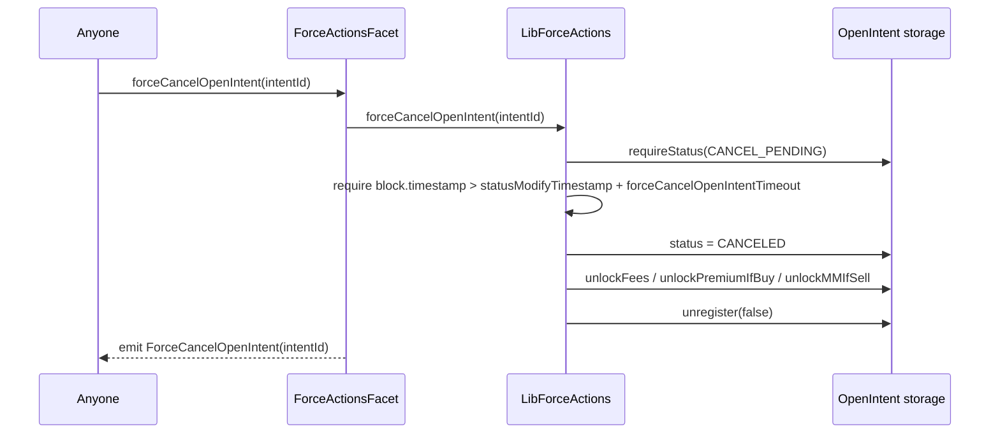
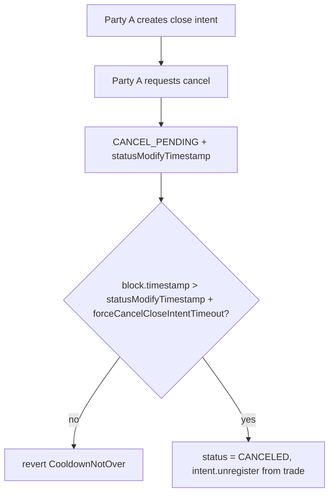
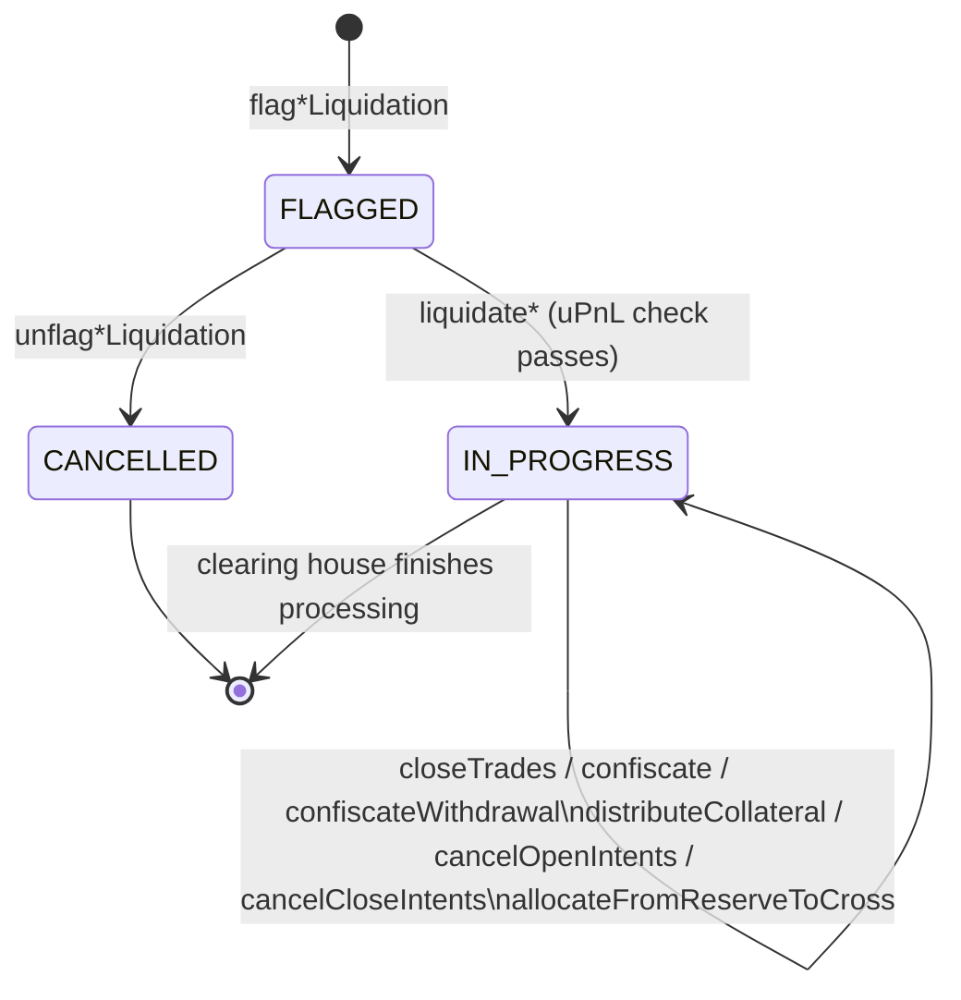
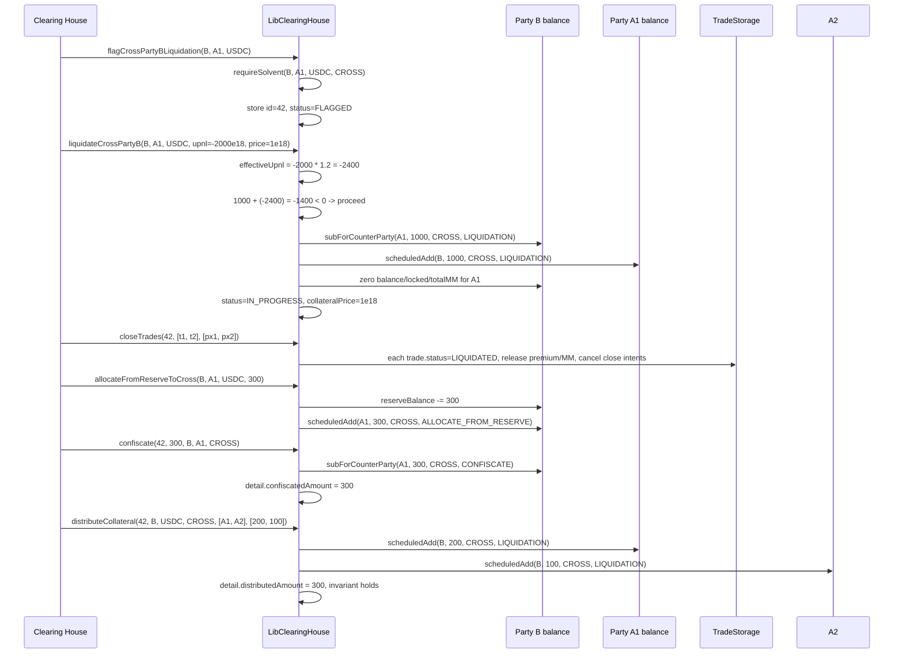

# Liquidation And Force Actions

This document covers the two emergency surfaces of Options Core: timeout-based **force actions** that anyone can call, and **liquidation** flows reserved for the clearing house. Both protect the protocol when one side of a trade stops responding or becomes economically insolvent.

## Overview

There are two distinct surfaces with very different trust assumptions:

| Surface                             | Caller                                   | Pause flag                                                 | Purpose                                                                                                   |
| ----------------------------------- | ---------------------------------------- | ---------------------------------------------------------- | --------------------------------------------------------------------------------------------------------- |
| Force actions (`ForceActionsFacet`) | Anyone (subject to `whenPartyNotPaused`) | `partyAActionsPaused` / `partyBActionsPaused` (per caller) | Cancel a `CANCEL_PENDING` open or close intent that has been ignored beyond the configured timeout.       |
| Liquidation (`ClearingHouseFacet`)  | `CLEARING_HOUSE_ROLE` only               | `liquidatingPaused`                                        | Flag a party-pair as insolvent, freeze cross balance, close trades, and confiscate/distribute collateral. |

Liquidation entries are keyed by the triple **`(partyA, partyB, collateral)`**. The key is stored in `LiquidationStorage.inProgressLiquidationIds` (`storages/LiquidationStorage.sol:13`). Whenever a key resolves to a non-zero `liquidationId`, the corresponding party-pair-collateral slice is considered "in liquidation" and most balance-affecting calls revert.

For **isolated Party B liquidation** the `partyA` slot is `address(0)` because the isolated balance is not associated with any specific Party A (`libraries/core/LibClearingHouse.sol:103`). Cross liquidation always uses real `partyA` and `partyB` addresses.

`LibParty.requireSolvent` (`libraries/models/LibParty.sol:17-30`) only checks that **no active liquidation id exists** for the relevant tuple — it does **not** evaluate uPnL or balance arithmetic. Economic insolvency is evaluated inside the `liquidate...` calls themselves. See [Solvency vs liquidation distinction](#solvency-vs-liquidation-distinction).

## Force Action Flows

`ForceActionsFacet` (`facets/ForceActions/ForceActionsFacet.sol`) exposes two functions that release locked funds when a counterparty has gone silent on a `CANCEL_PENDING` intent. Both are gated only by the caller-side party pause modifier `whenPartyNotPaused(msg.sender)`; there is no role check.

### Timeouts

Both timeouts live in `AppStorage` and are set by `SETTER_ROLE` through `ControlFacet`:

| Field                           | Storage path                                                                       | Setter                                                                                                                                                          |
| ------------------------------- | ---------------------------------------------------------------------------------- | --------------------------------------------------------------------------------------------------------------------------------------------------------------- |
| `forceCancelOpenIntentTimeout`  | `AppStorage.layout().forceCancelOpenIntentTimeout` (`storages/AppStorage.sol:34`)  | `setForceCancelOpenIntentTimeout(uint256)` (`facets/Control/ControlFacet.sol:222`) or batched via `setTimingParameters` (`facets/Control/ControlFacet.sol:162`) |
| `forceCancelCloseIntentTimeout` | `AppStorage.layout().forceCancelCloseIntentTimeout` (`storages/AppStorage.sol:35`) | `setForceCancelCloseIntentTimeout(uint256)` (`facets/Control/ControlFacet.sol:231`) or `setTimingParameters`                                                    |

The countdown starts at the intent's `statusModifyTimestamp` — the moment Party A flipped the intent into `CANCEL_PENDING`.

### forceCancelOpenIntent



Source: `LibForceActions.forceCancelOpenIntent` (`libraries/core/LibForceActions.sol:23-41`).

Preconditions:

- Open intent status must be `CANCEL_PENDING` (else `ValidationErrors.InvalidState`).
- `block.timestamp > statusModifyTimestamp + forceCancelOpenIntentTimeout` (else `ValidationErrors.CooldownNotOver`).

State effects:

- `status` becomes `CANCELED`.
- `statusModifyTimestamp = block.timestamp`.
- Fees previously locked at intent creation are released through `unlockFees` (`libraries/models/LibOpenIntent.sol:189`).
- BUY-side premium is released to Party A through `unlockPremiumIfBuy` (`libraries/models/LibOpenIntent.sol:121`).
- SELL-side maintenance margin is released through `unlockMMIfSell` (`libraries/models/LibOpenIntent.sol:130`).
- The intent is removed from active indexes via `unregister(false)` (`libraries/models/LibOpenIntent.sol:55`).

Event: `ForceCancelOpenIntent(intentId)` (`facets/ForceActions/ForceActionsFacetEvents.sol:8`).

### forceCancelCloseIntent



Source: `LibForceActions.forceCancelCloseIntent` (`libraries/core/LibForceActions.sol:43-58`).

Preconditions:

- Close intent status must be `CANCEL_PENDING`.
- `block.timestamp > statusModifyTimestamp + forceCancelCloseIntentTimeout`.

State effects:

- `status` becomes `CANCELED`, `statusModifyTimestamp = block.timestamp`.
- The intent is removed from the parent trade's `activeCloseIntentIds` via `unregister` (`libraries/models/LibCloseIntent.sol:62`). No balances move; close intents do not lock funds.

Event: `ForceCancelCloseIntent(intentId)`.

## Liquidation Status Machine



The enum is defined in `types/LiquidationTypes.sol:7-11`:

```
enum LiquidationStatus { FLAGGED, IN_PROGRESS, CANCELLED }
```

Transitions are controlled inside `LibClearingHouse`:

| Transition                                                                                                                   | Function                                                                                 |
| ---------------------------------------------------------------------------------------------------------------------------- | ---------------------------------------------------------------------------------------- |
| `_flag(...)` creates `FLAGGED` and sets `inProgressLiquidationIds` (`LibClearingHouse.sol:46-59`).                           | `flagIsolatedPartyBLiquidation` / `flagCrossPartyBLiquidation` / `flagPartyALiquidation` |
| `_unflag(...)` requires `FLAGGED`, clears the lookup, sets `CANCELLED` (`LibClearingHouse.sol:64-70`).                       | `unflag*` family                                                                         |
| `_beginLiquidation(...)` requires `FLAGGED`, sets `IN_PROGRESS` and stores `collateralPrice` (`LibClearingHouse.sol:90-93`). | `liquidate*` family                                                                      |

Note that the `inProgressLiquidationIds[partyA][partyB][collateral]` lookup is **set during both `FLAGGED` and `IN_PROGRESS`**. It is only cleared on `unflag` (transition to `CANCELLED`). After `IN_PROGRESS`, the lookup is intentionally left in place so the clearing house can keep operating on the same `liquidationId`. Cleanup of the mapping after settlement is the clearing-house operator's responsibility.

There is no automatic `IN_PROGRESS → CANCELLED` transition; once `liquidate*` succeeds, the only remaining work is trade closure, confiscation, distribution, and intent cancellation.

## LiquidationDetail Anatomy

Defined in `types/LiquidationTypes.sol:18-31`:

| Field                  | Type                | Set by                                                                                      | Meaning                                                                                                                               |
| ---------------------- | ------------------- | ------------------------------------------------------------------------------------------- | ------------------------------------------------------------------------------------------------------------------------------------- |
| `upnl`                 | `int256`            | (declared but never written by current `LibClearingHouse`; reserved for future bookkeeping) | Snapshot of uPnL at liquidation moment, in 18-decimal collateral units.                                                               |
| `flagTimestamp`        | `uint256`           | `_flag` (`LibClearingHouse.sol:52`)                                                         | `block.timestamp` when the flag was raised.                                                                                           |
| `liquidationTimestamp` | `uint256`           | (declared, not currently written)                                                           | Reserved for the moment liquidation begins.                                                                                           |
| `collateralPrice`      | `uint256`           | `_beginLiquidation` (`LibClearingHouse.sol:92`)                                             | Price of the collateral asset against the protocol's reference, scaled to 1e18.                                                       |
| `confiscatedAmount`    | `uint256`           | `confiscate` (`LibClearingHouse.sol:271`)                                                   | Cumulative collateral pulled from the liquidating party into the clearing house's accounting domain.                                  |
| `distributedAmount`    | `uint256`           | `distributeCollateral` (`LibClearingHouse.sol:302`)                                         | Cumulative collateral pushed back out to Party As. Constraint: `distributedAmount <= confiscatedAmount` (`LibClearingHouse.sol:305`). |
| `flagger`              | `address`           | `_flag`                                                                                     | The clearing-house operator that called `flag*`.                                                                                      |
| `collateral`           | `address`           | `_flag`                                                                                     | The collateral asset of the liquidation.                                                                                              |
| `partyA`               | `address`           | `_flag`                                                                                     | Party A address; `address(0)` for isolated Party B liquidation.                                                                       |
| `partyB`               | `address`           | `_flag`                                                                                     | Party B address.                                                                                                                      |
| `side`                 | `LiquidationSide`   | `_flag`                                                                                     | `PARTY_A` or `PARTY_B` — which side is being liquidated.                                                                              |
| `status`               | `LiquidationStatus` | `_flag` / `_unflag` / `_beginLiquidation`                                                   | Current lifecycle state.                                                                                                              |

`LiquidationSide` enum (`types/LiquidationTypes.sol:13-16`): `PARTY_A` or `PARTY_B`.

All amounts are 18-decimal protocol units. `collateralPrice` is the reference price used so that uPnL (denominated in collateral) can be reconciled with balances (denominated in collateral); the formulas below divide uPnL by `collateralPrice / 1e18`.

## Liquidation Flavors

There are three distinct flavors. Each has its own `flag` / `unflag` / `liquidate` triplet.

### Party B Isolated

Used when Party B's **isolated** balance for a collateral is insolvent. Party A is not involved because isolated margin is not bilaterally allocated; therefore the storage key uses `address(0)` as the Party A slot.

Functions on `IClearingHouseFacet`:

- `flagIsolatedPartyBLiquidation(partyB, collateral)` — `ClearingHouseFacet.sol:26`
- `unflagIsolatedPartyBLiquidation(partyB, collateral)` — `ClearingHouseFacet.sol:39`
- `liquidateIsolatedPartyB(partyB, collateral, upnl, collateralPrice)` — `ClearingHouseFacet.sol:54`

Flag preconditions (`LibClearingHouse.sol:99-104`):

- `partyBConfigs[partyB].lossCoverage` must be non-zero, else `ZeroLossCoverage(partyB)`.
- `partyB.requireSolvent(address(0), collateral, ISOLATED)` must hold (no existing active id), else `BalanceErrors.NotSolvent`.

Liquidate insolvency check (`LibClearingHouse.sol:110-122`):

```
isolatedBalance = partyB.balanceOf(collateral).isolatedBalance
effectiveUpnl   = upnl > 0 ? upnl : (upnl * lossCoverage) / 1e18
require int256(isolatedBalance) + (effectiveUpnl * 1e18) / int256(collateralPrice) < 0
        else revert PartyBSolvent(...)
```

Loss coverage only scales **negative** uPnL — it makes the loss look bigger, biasing toward declaring insolvency. Positive uPnL is passed through unmodified.

State effects on liquidate: status flips to `IN_PROGRESS` and `collateralPrice` is recorded. The isolated balance itself is **not** zeroed at this stage — it is later drained via `confiscate(... ISOLATED)`.

### Party B Cross

Used when Party B's **cross** balance against a specific Party A is insolvent.

Functions:

- `flagCrossPartyBLiquidation(partyB, partyA, collateral)` — `ClearingHouseFacet.sol:92`
- `unflagCrossPartyBLiquidation(partyB, partyA, collateral)` — `ClearingHouseFacet.sol:101`
- `liquidateCrossPartyB(partyB, partyA, collateral, upnl, collateralPrice)` — `ClearingHouseFacet.sol:110`

Flag preconditions (`LibClearingHouse.sol:128-133`):

- Non-zero `partyBConfigs[partyB].lossCoverage`.
- `partyB.requireSolvent(partyA, collateral, CROSS)` — no existing active id for the tuple.

Liquidate insolvency check (`LibClearingHouse.sol:139-149`) operates on the `CrossEntry` for `partyA`:

```
crossBalance = partyB.crossBalance[partyA]
effectiveUpnl = upnl > 0 ? upnl : (upnl * lossCoverage) / 1e18
require crossBalance.balance + (effectiveUpnl * 1e18) / int256(collateralPrice) < 0
        else revert PartyBSolvent
```

State effects on liquidate (`LibClearingHouse.sol:151-160`):

- If `crossBalance.balance > 0`, the **positive** balance is transferred to Party A using `subForCounterParty(partyA, balance, CROSS, LIQUIDATION)` on Party B and `scheduledAdd(partyB, balance, CROSS, LIQUIDATION)` on Party A. Party A receives this through the standard scheduled-release model so it cannot front-run the rest of the liquidation.
- `crossBalance.balance`, `.locked`, and `.totalMM` are all set to zero, regardless of sign.
- `_beginLiquidation` flips status to `IN_PROGRESS` and stores `collateralPrice`.

The transfer-positive-balance-to-counterparty mechanic ensures Party A is not penalized by Party B's liquidation: any free cross collateral Party B held against Party A goes back to Party A before the position is wound down.

### Party A Cross

Used when Party A's cross balance against a specific Party B is insolvent.

Functions:

- `flagPartyALiquidation(partyA, partyB, collateral)` — `ClearingHouseFacet.sol:121`
- `unflagPartyALiquidation(partyA, partyB, collateral)` — `ClearingHouseFacet.sol:130`
- `liquidateCrossPartyA(liquidationId, partyA, partyB, collateral, upnl, collateralPrice)` — `ClearingHouseFacet.sol:139`

Flag preconditions (`LibClearingHouse.sol:167-170`):

- `partyA.requireSolvent(partyB, collateral, CROSS)` — no existing active id. Notably, **no `lossCoverage` check** applies because `lossCoverage` is a Party B parameter.

Liquidate insolvency check (`LibClearingHouse.sol:176-185`). The Party A path is asymmetric: it subtracts maintenance margin and uses the **raw** uPnL (no loss-coverage scaling):

```
crossBalance = partyA.crossBalance[partyB]
require (crossBalance.balance - int256(crossBalance.totalMM))
        + (upnl * 1e18) / int256(collateralPrice) < 0
        else revert PartyASolvent
```

State effects on liquidate (`LibClearingHouse.sol:187-198`) mirror the Party B cross path but in reverse direction:

- If `crossBalance.balance > 0`, transfer it to Party B via `subForCounterParty` / `scheduledAdd` with `LIQUIDATION` reasons.
- Zero out `balance`, `locked`, and `totalMM`.
- Status → `IN_PROGRESS`, `collateralPrice` stored.

Notice that the facet entry takes `(liquidationId, partyA, partyB, collateral, ...)` but the library only consumes `liquidationId` (`LibClearingHouse.sol:147`); the additional parameters are emitted in the event but not validated against the stored detail. The liquidation id authoritatively identifies the entry.

## uPnL Signature

The `upnl` and `collateralPrice` arguments to every `liquidate*` are off-chain values produced by the Muon TSS. Although `LibClearingHouse` does not call `LibMuon.verifyUpnlSig` directly inside the liquidate functions in this version, the `UpnlSig` struct (`types/WithdrawTypes.sol:22-30`) is the canonical container and `LibMuon.verifyUpnlSig` (`libraries/services/LibMuon.sol:59-92`) is the verification path used elsewhere in the protocol for the same `(party, counterParty, partyUpnl, counterPartyUpnl, collateral, collateralPrice, nonce, timestamp)` payload. The clearing house operator is expected to source these values from the same Muon flow.

`upnlSigValidTime` (`AppStorage.sol:38`) caps the freshness of any signed uPnL.

## closeTrades During Liquidation

`closeTrades(liquidationId, tradeIds, prices)` (`ClearingHouseFacet.sol:151`, `LibClearingHouse.sol:204-247`) closes open trades that belong to the party-pair under liquidation.

Preconditions:

- `tradeIds.length == prices.length`, else `MismatchedArrayLengths`.
- The liquidation entry must be `IN_PROGRESS`.
- For each trade:
    - `trade.status == OPENED` (else `ValidationErrors.InvalidState`).
    - The trade must belong to the tuple. Specifically: if `detail.partyA != address(0)`, then `trade.partyA == detail.partyA` is required; if `detail.partyB != address(0)`, then `trade.partyB == detail.partyB` is required. Otherwise reverts with `TradeNotInLiquidation(liquidationId, tradeId)`. The `address(0)` slack accommodates the isolated Party B case where `detail.partyA` is zero.

Per-trade effects (`LibClearingHouse.sol:223-246`):

- For Party A `BUY` trades: the proportional remaining premium for the open amount is credited to Party B. Isolated trades use `instantIsolatedAdd(..., PREMIUM)`; cross trades use `scheduledAdd(partyA, ..., PREMIUM)`.
- For Party A `SELL` trades: the proportional remaining maintenance margin is released from Party A's cross slot using `decreaseMM(partyB, ...)` (`libraries/models/LibScheduledReleaseBalance.sol:458`).
- `trade.settledPrice = price`.
- `trade.close(TradeStatus.LIQUIDATED, CloseIntentStatus.CANCELED)` (`libraries/models/LibTrade.sol:112-123`) cancels every active close intent on the trade and unregisters the trade from active indexes.

Event: `CloseTradesForLiquidation(operator, liquidationId, tradeIds, prices)`.

## Confiscation And Distribution

Three functions cooperate to drain the liquidating party and pay out the counterparties.

### confiscate

`confiscate(liquidationId, amount, party, counterParty, marginType)` (`LibClearingHouse.sol:256-272`) debits collateral from `party` and increments `LiquidationDetail.confiscatedAmount` by `amount`.

Preconditions:

- `party` must be `detail.partyA` or `detail.partyB`, else `PartyNotInLiquidation(party, partyA, partyB, collateral)`.
- The party's `counterPartyBalance(counterParty, marginType)` must be ≥ `amount`, else `BalanceErrors.InsufficientIntBalance`.
- The liquidation must be `IN_PROGRESS`.

State effect: `subForCounterParty(counterParty, amount, marginType, CONFISCATE)` removes the funds from accounting, and `detail.confiscatedAmount += amount` records the running total. Funds leave the user's balance into the protocol's confiscated pool — they are not yet attributable to any beneficiary.

Event: `Confiscate(operator, party, counterParty, liquidationId, amount, marginType)`.

### confiscateWithdrawal

`confiscateWithdrawal(withdrawId)` (`LibClearingHouse.sol:274-279`) handles the case where a user has an `INITIATED` withdrawal in flight that should be reclaimed into the in-protocol balance.

Preconditions:

- `withdrawal.status == INITIATED` (else `ValidationErrors.InvalidState`).

State effect: status flips to `CANCELED` and the amount is added back to the user's isolated balance via `instantIsolatedAdd(amount, DEPOSIT)`. The clearing house can then `confiscate` it like any other balance. Note the function does not consult `LiquidationDetail` — it is callable by the clearing house at any time on any `INITIATED` withdrawal.

Event: `ConfiscateWithdrawal(operator, withdrawId)`.

### distributeCollateral

`distributeCollateral(liquidationId, partyB, collateral, marginType, partyAs, amounts)` (`LibClearingHouse.sol:281-306`) credits scheduled collateral to a list of Party As as the counter-side of the liquidation.

Preconditions:

- `partyAs.length == amounts.length`, else `MismatchedArrayLengths`.
- Liquidation must be `IN_PROGRESS`.

State effects per row: `partyA.balanceOf(collateral).scheduledAdd(partyB, amount, marginType, LIQUIDATION)` plus `detail.distributedAmount += amount`. After the loop, **`distributedAmount > confiscatedAmount` reverts with `DistributedAmountExceedsConfiscatedAmount(liquidationId)`** — this is the conservation invariant that prevents the clearing house from minting collateral.

The invariant is `confiscatedAmount >= distributedAmount` at all times. Any surplus stays accounted for under the liquidation detail and can be distributed in subsequent calls.

Event: `DistributeCollateral(operator, partyB, collateral, liquidationId, partyAs, amounts)`.

## allocateFromReserveToCross

`allocateFromReserveToCross(party, counterParty, collateral, amount)` (`LibClearingHouse.sol:249-254`) lets the clearing house move a party's reserve balance into a cross slot during liquidation. This is used when Party B's cross balance against a specific Party A is too thin to cover an obligation but Party B still has reserve collateral that should back the position.

Preconditions:

- `party.balanceOf(collateral).reserveBalance >= amount`, else `BalanceErrors.InsufficientBalance`.

State effects:

- `reserveBalance -= amount`.
- `scheduledAdd(counterParty, amount, CROSS, ALLOCATE_FROM_RESERVE)` on the same party.

The headroom is paid by the party itself out of their own reserve — the clearing house simply has the authority to forcibly route reserve to cross. Event: `AllocateFromReserveToCross(operator, party, counterParty, collateral, amount)`.

## cancelOpenIntents / cancelCloseIntents

These two functions sweep out pending intents for parties whose tuple is in liquidation. Either side being insolvent (i.e. having an active liquidation id) is enough.

### cancelOpenIntents

`cancelOpenIntents(intentIds)` (`LibClearingHouse.sol:308-340`):

- For each `intentId`:
    - Status must be `PENDING` or `LOCKED`, else `ValidationErrors.InvalidState`.
    - At least one of `partyA.isSolvent(...)` or `partyB.isSolvent(...)` must be **false**, else `PartiesNotInLiquidation(partyA, partyB, collateral)`.
    - If `block.timestamp > intent.deadline`: the intent is `expire()`d (`libraries/models/LibOpenIntent.sol:78`).
    - Otherwise: status → `CANCELED`, then release normal locks (`unlockFees` + `unlockPremiumIfBuy` + `unlockMMIfSell`) or deferred Party B sell escrow via `unlockForCancelOrExpire`, then `unregister(false)`.
    - `statusModifyTimestamp = block.timestamp`.

For deferred Party B sells, this means liquidation cancel first returns the isolated escrow to Party A's account. The clearing house can then use the normal liquidation/confiscation functions against Party A's available balance if that amount should be seized. The cancel path itself does not silently transfer escrow into a liquidation pool.

### cancelCloseIntents

`cancelCloseIntents(intentIds)` (`LibClearingHouse.sol:342-367`):

- Status must be `PENDING`, else `ValidationErrors.InvalidState`.
- At least one of `partyA.isSolvent(...)` or `partyB.isSolvent(...)` must be false for the trade's tuple.
- If past deadline: `intent.expire()` (`libraries/models/LibCloseIntent.sol:68`).
- Otherwise: status → `CANCELED`, `statusModifyTimestamp = block.timestamp`, `unregister()` from the trade.

Both functions emit `CancelOpenIntentsForLiquidation` / `CancelCloseIntentsForLiquidation`.

## Solvency vs Liquidation Distinction

This protocol uses the word "solvent" in a deliberately narrow sense in `LibParty`:

```solidity
function isSolvent(self, counterParty, collateral, marginType) -> bool {
    if (isPartyB(self)) {
        return inProgressLiquidationIds[isolated ? 0 : counterParty][self][collateral] == 0;
    } else {
        return marginType == ISOLATED || inProgressLiquidationIds[self][counterParty][collateral] == 0;
    }
}
```

(`libraries/models/LibParty.sol:21-30`)

In other words, **`isSolvent` only looks at whether the party is currently flagged or being liquidated**. It does not look at any balance, uPnL, MM, or oracle data. This is the check you see in:

- `flag*Liquidation` — to refuse re-flagging an already-flagged or in-progress tuple.
- `cancelOpenIntents` / `cancelCloseIntents` — to require that one side is in liquidation for the tuple before sweeping.
- All non-liquidation flows that gate on `requireSolvent(...)` to refuse touching balances mid-liquidation.

The **economic** insolvency check (`balance + uPnL_adjusted < 0`) lives only inside `liquidateIsolatedPartyB`, `liquidateCrossPartyB`, and `liquidateCrossPartyA`. A party can be economically underwater for hours before anyone calls `flag*`; conversely, a flagged party that has since recovered will revert from `liquidate*` with `PartyASolvent` / `PartyBSolvent`, allowing the operator to `unflag*`.

For Party A in **isolated** mode, `isSolvent` always returns `true`. Isolated Party A balance is not eligible for liquidation in this codebase — only isolated Party B and cross positions are.

## Loss Coverage Parameter

`PartyBConfig.lossCoverage` (`storages/AppStorage.sol:7-11`) is a per-Party-B 18-decimal multiplier applied to **negative** uPnL during the Party B insolvency check:

```
effectiveUpnl = upnl > 0 ? upnl : (upnl * lossCoverage) / 1e18
```

Because `upnl < 0`, multiplying by a `lossCoverage > 1e18` makes the loss appear larger and triggers liquidation sooner; a value below `1e18` makes the threshold more lenient. A value of `0` disables Party B liquidation: `flagCrossPartyBLiquidation` and `flagIsolatedPartyBLiquidation` revert with `ZeroLossCoverage(partyB)` (`LibClearingHouse.sol:100, 129`). Party A liquidation does not consult `lossCoverage`.

Configured by `PARTY_B_MANAGER_ROLE` via `ControlFacet.setPartyBConfig(partyB, config)` (`facets/Control/ControlFacet.sol:392`), which writes the entire `PartyBConfig` struct (`isActive`, `lossCoverage`, `oracleId`).

## Errors Reference

| Error                                                      | Where                                                         | Cause                                                                                                    |
| ---------------------------------------------------------- | ------------------------------------------------------------- | -------------------------------------------------------------------------------------------------------- |
| `ZeroLossCoverage(partyB)`                                 | `flagIsolatedPartyBLiquidation`, `flagCrossPartyBLiquidation` | Party B has `lossCoverage == 0`.                                                                         |
| `MismatchedArrayLengths(a, b)`                             | `closeTrades`, `distributeCollateral`                         | Input arrays have different lengths.                                                                     |
| `PartyASolvent(partyA, partyB, token)`                     | `liquidateCrossPartyA`                                        | Economic check still passes (`balance - totalMM + adjustedUpnl >= 0`).                                   |
| `PartyBSolvent(partyA, partyB, token)`                     | `liquidateIsolatedPartyB`, `liquidateCrossPartyB`             | Economic check still passes.                                                                             |
| `TradeNotInLiquidation(liquidationId, tradeId)`            | `closeTrades`                                                 | Trade does not belong to the party tuple stored in `LiquidationDetail`.                                  |
| `PartiesNotInLiquidation(partyA, partyB, collateral)`      | `cancelOpenIntents`, `cancelCloseIntents`                     | Both sides report as solvent for the relevant tuple.                                                     |
| `PartyNotInLiquidation(party, partyA, partyB, collateral)` | `confiscate`                                                  | The `party` argument is neither `detail.partyA` nor `detail.partyB`.                                     |
| `DistributedAmountExceedsConfiscatedAmount(liquidationId)` | `distributeCollateral`                                        | Sum of distributed amounts would exceed cumulative confiscated amount.                                   |
| `BalanceErrors.NotSolvent(...)`                            | `requireSolvent`                                              | The tuple already has an active liquidation id (during flag).                                            |
| `BalanceErrors.InsufficientIntBalance(...)`                | `confiscate`                                                  | Counter-party balance under requested confiscation amount.                                               |
| `BalanceErrors.InsufficientBalance(...)`                   | `allocateFromReserveToCross`                                  | Reserve balance under requested allocation amount.                                                       |
| `ValidationErrors.InvalidState("LiquidationStatus", ...)`  | All `_requireStatus` calls                                    | Status mismatch (e.g. flag on already-flagged, liquidate on non-flagged, confiscate on non-in-progress). |
| `ValidationErrors.InvalidState("OpenIntentStatus", ...)`   | `cancelOpenIntents`                                           | Open intent not `PENDING` or `LOCKED`.                                                                   |
| `ValidationErrors.InvalidState("CloseIntentStatus", ...)`  | `cancelCloseIntents`                                          | Close intent not `PENDING`.                                                                              |
| `ValidationErrors.InvalidState("WithdrawStatus", ...)`     | `confiscateWithdrawal`                                        | Withdrawal not `INITIATED`.                                                                              |
| `ValidationErrors.CooldownNotOver(...)`                    | `forceCancelOpenIntent`, `forceCancelCloseIntent`             | Force-cancel timeout has not elapsed.                                                                    |
| `ValidationErrors.InvalidState("OpenIntentStatus", ...)`   | `forceCancelOpenIntent`                                       | Open intent not in `CANCEL_PENDING`.                                                                     |
| `ValidationErrors.InvalidState("CloseIntentStatus", ...)`  | `forceCancelCloseIntent`                                      | Close intent not in `CANCEL_PENDING`.                                                                    |

Source files: `errors/LiquidationErrors.sol`, `errors/BalanceErrors.sol`, `errors/ValidationErrors.sol`.

## End-To-End Scenario: Insolvent Cross Party B With Two Party As

Setup:

- Party B `B` is configured with `lossCoverage = 1.2e18` and `isActive = true`.
- `B` holds cross positions against Party A `A1` and Party A `A2` in collateral `USDC`.
- `B`'s position against `A1` has balance `+1000`, locked `200`, totalMM `0`. The position is deeply underwater on its open trades.
- `B`'s position against `A2` is healthy.
- `B` also has `300` of `reserveBalance` for `USDC`.

Step-by-step:



Throughout the scenario, `inProgressLiquidationIds[A1][B][USDC] = 42` is active. Calls from `B` against `A1` for `USDC` (open intents, close intents, allocations, deallocations, withdrawals if isolated) all revert with `NotSolvent`. The `B`/`A2` slice is unaffected and continues to operate normally.

After the operator finishes accounting, they leave `status = IN_PROGRESS`. There is no on-chain "DONE" transition; off-chain bookkeeping resumes independently.

## Related Code Map

| Concern                                    | File                                                                                                                                                          |
| ------------------------------------------ | ------------------------------------------------------------------------------------------------------------------------------------------------------------- |
| Force action entry points                  | `contracts/facets/ForceActions/ForceActionsFacet.sol`                                                                                                         |
| Force action interface and events          | `contracts/facets/ForceActions/IForceActionsFacet.sol`, `ForceActionsFacetEvents.sol`                                                                         |
| Force action logic                         | `contracts/libraries/core/LibForceActions.sol`                                                                                                                |
| Liquidation entry points                   | `contracts/facets/ClearingHouse/ClearingHouseFacet.sol`                                                                                                       |
| Liquidation interface and events           | `contracts/facets/ClearingHouse/IClearingHouseFacet.sol`, `IClearingHouseEvents.sol`                                                                          |
| Liquidation logic                          | `contracts/libraries/core/LibClearingHouse.sol`                                                                                                               |
| Solvency check                             | `contracts/libraries/models/LibParty.sol`                                                                                                                     |
| Liquidation storage                        | `contracts/storages/LiquidationStorage.sol`                                                                                                                   |
| Liquidation types                          | `contracts/types/LiquidationTypes.sol`                                                                                                                        |
| Liquidation errors                         | `contracts/errors/LiquidationErrors.sol`                                                                                                                      |
| `lossCoverage` and timeouts                | `contracts/storages/AppStorage.sol`, `contracts/facets/Control/ControlFacet.sol`                                                                              |
| uPnL signature                             | `contracts/libraries/services/LibMuon.sol`, `contracts/types/WithdrawTypes.sol` (`UpnlSig`)                                                                   |
| Trade closure semantics during liquidation | `contracts/libraries/models/LibTrade.sol` (`close`, `unregister`)                                                                                             |
| Balance mutations used by liquidation      | `contracts/libraries/models/LibScheduledReleaseBalance.sol` (`subForCounterParty`, `scheduledAdd`, `decreaseMM`, `counterPartyBalance`, `instantIsolatedAdd`) |
| Tests                                      | `tests/clearing-house.ts`, `tests/force-action.behavior.ts`                                                                                                   |
