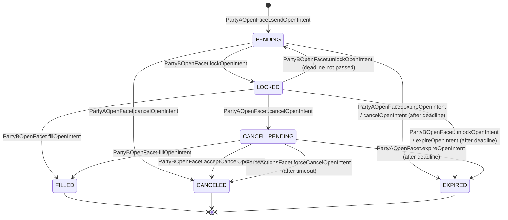
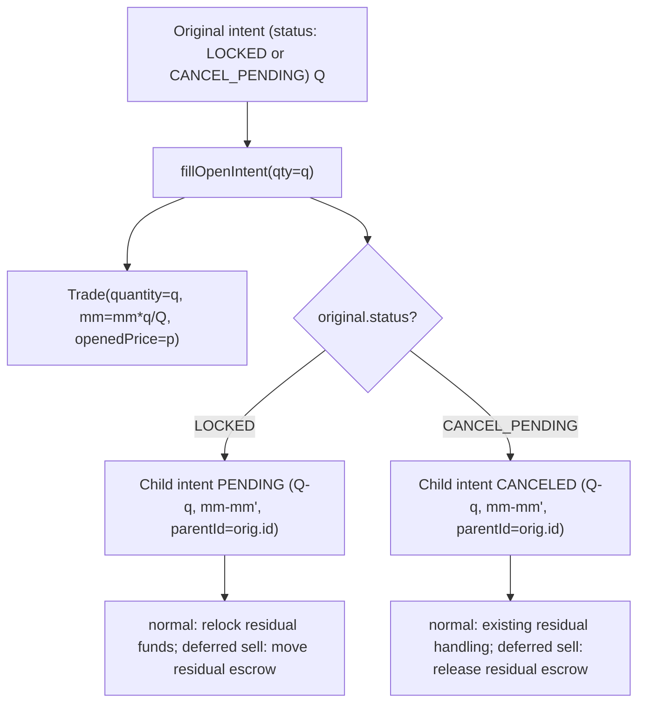
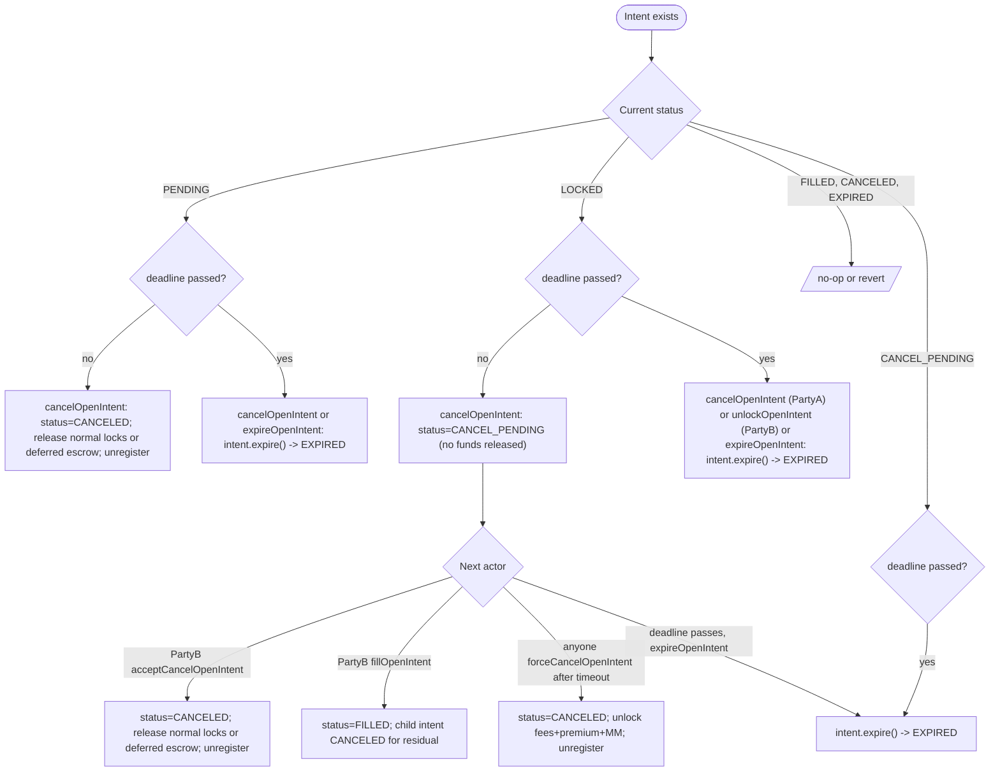

# Open Intent Flow

An open intent is Party A's binding request to open an option position. It carries the full trade specification (symbol, side, quantity, strike, expiration, margin type, fees, deadline) and a Party B whitelist. Most intents lock their premium, maintenance margin, and open fees directly in the balance bucket that will later be charged. There is one deliberate exception: an unbound `SELL + CROSS` intent with an empty Party B whitelist is a **deferred Party B sell**. Because the selected Party B is not known yet, its maintenance margin and estimated open fees are temporarily locked from Party A's isolated balance in `OpenIntentEscrow`, then moved into the selected Party B cross bucket at fill.

Party B reserves the intent with `lockOpenIntent`, optionally returns it with `unlockOpenIntent`, and finalizes it with `fillOpenIntent`, which atomically creates a `Trade`, resolves the locks or escrow, transfers premium, distributes the three open-fee streams, and (if partial) spawns a child intent for the remainder. Deferred Party B sells can also be partially filled: the filled slice consumes a pro-rata piece of escrow, and the residual child carries the remaining escrow forward. Cancellation is two-phased: a `PENDING` intent cancels immediately; a `LOCKED` intent enters `CANCEL_PENDING` and either Party B accepts, the deadline elapses, or anyone calls `forceCancelOpenIntent` after `forceCancelOpenIntentTimeout`.

## State Machine

`OpenIntentStatus` (`contracts/types/IntentTypes.sol:9-16`) has six values. Every transition below is gated by the function listed on the edge.



Every terminal state (`CANCELED`, `EXPIRED`, `FILLED`) calls `LibOpenIntentOps.unregister` to remove the intent from `activeOpenIntentsOf` for both parties. `LOCKED` and `PENDING` are the only non-terminal active states; `CANCEL_PENDING` is also active but only Party B can move it forward (other than expiration).

## End-To-End Sequence

```mermaid
sequenceDiagram
    participant A as Party A
    participant FA as PartyAOpenFacet
    participant FB as PartyBOpenFacet
    participant Lib as LibPartyAOpen / LibPartyBOpen
    participant Bal as ScheduledReleaseBalance
    participant IS as OpenIntentStorage
    participant TS as TradeStorage
    participant B as Party B

    A->>FA: sendOpenIntent(whitelist, agreements, price, deadline, fees, ...)
    FA->>Lib: LibPartyAOpen.sendOpenIntent
    Lib->>Lib: validate sender, symbol, deadline, exerciseFee cap, affiliate, marginType, whitelist
    Lib->>Lib: requireSolvent (cross only)
    Lib->>IS: ++lastOpenIntentId; store OpenIntent (PENDING)
    alt deferred PartyB SELL+CROSS+empty whitelist
        Lib->>Bal: isolatedLock(mm collateral + estimated open fees)
        Lib->>IS: store OpenIntentEscrow(intentId)
    else normal intent
        Lib->>Bal: lockFees(price)
        Lib->>Bal: lockPremiumIfBuy(price)
        Lib->>Bal: lockMMIfSell(mm)
    end
    FA-->>A: emit SendOpenIntent(intentId, ...)

    B->>FB: lockOpenIntent(intentId)
    FB->>Lib: LibPartyBOpen.lockOpenIntent
    Lib->>Lib: validate suspensions, emergency, status, deadline, symbol oracle id, symbol type, whitelist, solvency
    Lib->>IS: status = LOCKED; partyB = sender; registerForPartyB
    FB-->>B: emit LockOpenIntent(intentId, partyB)

    B->>FB: fillOpenIntent(intentId, quantity, price)
    FB->>Lib: LibPartyBOpen.fillOpenIntent
    Lib->>Lib: validate sender = partyB, status in {LOCKED, CANCEL_PENDING}, price favorable, quantity <= intent.quantity
    Lib->>TS: ++lastTradeId; store Trade(OPENED)
    alt deferred PartyB sell
        Lib->>Bal: isolatedUnlock escrow; allocate mm + actual fill-price fees to PartyA cross bucket for selected PartyB
    else normal intent
        Lib->>Bal: unlockFees + unlockPremiumIfBuy + unlockMMIfSell
    end
    alt partial fill
        Lib->>IS: ++lastOpenIntentId; create child intent (PENDING or CANCELED)
        alt deferred PartyB sell
            Lib->>IS: move residual escrow to child or release it if child is CANCELED
        else normal intent
            Lib->>Bal: re-lock fees / premium / MM for child
        end
        Lib->>IS: original.quantity = filled
    end
    Lib->>Bal: getFeesFromUser(price) -> 3 fee streams charged from Party A
    Lib->>Bal: defaultFeeCollector += platformFee; affiliateCollector += affiliateFee; partyB += solverFee
    alt BUY
        Lib->>Bal: partyA.subForCounterParty(partyB, premium)
    else SELL
        Lib->>Bal: partyA.increaseMM(partyB, trade.mm)
        Lib->>Bal: partyB.subForCounterParty(partyA, premium)
        Lib->>Bal: partyA.scheduledAdd(partyB, premium)
    end
    Lib->>Bal: cross only - bump nonces[A][B] and nonces[B][A]
    FB-->>B: emit FillOpenIntent(intentId, tradeId, qty, price)
```

## Anatomy Of An OpenIntent

`OpenIntent` is defined in `contracts/types/IntentTypes.sol:26-42`. It embeds `TradeAgreements` (`contracts/types/BaseTypes.sol:42-51`) and `FeeStructure` (`contracts/types/BaseTypes.sol:34-40`).

| Field                                 | Type               | Meaning                                                                                                                                                                                           |
| ------------------------------------- | ------------------ | ------------------------------------------------------------------------------------------------------------------------------------------------------------------------------------------------- |
| `id`                                  | `uint256`          | Auto-assigned from `OpenIntentStorage.lastOpenIntentId` (`contracts/storages/OpenIntentStorage.sol:18`).                                                                                          |
| `tradeId`                             | `uint256`          | `0` until `FILLED`; then set to the spawned `Trade.id` (`LibPartyBOpen.sol:353-356`).                                                                                                             |
| `tradeAgreements.symbolId`            | `uint256`          | Index into `SymbolStorage.symbols`.                                                                                                                                                               |
| `tradeAgreements.quantity`            | `uint256`          | Contract size in 18-decimal units. On partial fill the original is overwritten to the filled amount and a child holds the remainder (`LibPartyBOpen.sol:317-318`).                                |
| `tradeAgreements.strikePrice`         | `uint256`          | Strike in collateral, 18-decimal.                                                                                                                                                                 |
| `tradeAgreements.expirationTimestamp` | `uint256`          | Option expiration (UNIX seconds). Must be `> block.timestamp` at creation and at fill (`LibPartyAOpen.sol:60`, `LibPartyBOpen.sol:67-68,207-209`).                                                |
| `tradeAgreements.mm`                  | `uint256`          | Maintenance margin in collateral. Only meaningful for `SELL` (cross). On partial fill the trade gets `mm * filled / quantity` and the child gets the remainder (`LibPartyBOpen.sol:234,282-285`). |
| `tradeAgreements.exerciseFee.rate`    | `uint256`          | Per-contract exercise-fee rate, 18-decimal.                                                                                                                                                       |
| `tradeAgreements.exerciseFee.cap`     | `uint256`          | PnL-fraction cap, must be `<= 1e18` (`LibPartyAOpen.sol:62`).                                                                                                                                     |
| `tradeAgreements.tradeSide`           | `TradeSide`        | `BUY` (Party A pays premium) or `SELL` (Party A receives premium and posts MM).                                                                                                                   |
| `tradeAgreements.marginType`          | `MarginType`       | `ISOLATED` or `CROSS`. `SELL + ISOLATED` is rejected (`LibPartyAOpen.sol:63`).                                                                                                                    |
| `price`                               | `uint256`          | Party A's limit price in collateral per contract, 18-decimal. Acts as a cap for `BUY` and a floor for `SELL`.                                                                                     |
| `partyBsWhiteList`                    | `address[]`        | See whitelist semantics below. Empty means "any active Party B" for isolated intents and deferred Party B sells; normal cross intents require exactly one Party B.                                |
| `parentId`                            | `uint256`          | `0` for top-level intents; otherwise the id of the intent that spawned this one via partial fill (`LibPartyBOpen.sol:295`).                                                                       |
| `createTimestamp`                     | `uint256`          | `block.timestamp` at submission.                                                                                                                                                                  |
| `statusModifyTimestamp`               | `uint256`          | Timestamp of last state change. Used by `forceCancelOpenIntent` to enforce cooldown (`LibForceActions.sol:28`).                                                                                   |
| `deadline`                            | `uint256`          | Latest timestamp at which Party B may lock or fill. After this point the intent can only expire.                                                                                                  |
| `feeStructure.feeToken`               | `address`          | Token used for the three open-fee streams. May differ from the symbol's collateral.                                                                                                               |
| `feeStructure.tokenPriceInCollateral` | `uint256`          | Snapshot of `IPriceOracle.getPrice(feeToken, collateral)` at creation (`LibPartyAOpen.sol:101`). Frozen for the intent's lifetime.                                                                |
| `feeStructure.platformFee`            | `Fee`              | Snapshot of `Symbol.platformFee` at submission.                                                                                                                                                   |
| `feeStructure.affiliateFee`           | `Fee`              | Snapshot of `affiliateFees[affiliate][symbolId]` (zero if no affiliate).                                                                                                                          |
| `feeStructure.solverFee`              | `Fee`              | Caller-supplied per-trade Party B fee.                                                                                                                                                            |
| `partyA`                              | `address`          | Originator (`msg.sender` in non-instant flows).                                                                                                                                                   |
| `partyB`                              | `address`          | `address(0)` while `PENDING`; assigned on `LOCKED`; cleared on `unlockOpenIntent` (`LibPartyBOpen.sol:135-138`).                                                                                  |
| `affiliate`                           | `address`          | Affiliate identity; must be active or `address(0)` (`LibPartyAOpen.sol:68`).                                                                                                                      |
| `userData`                            | `bytes`            | Arbitrary user payload, suffixed with a 32-byte counter via `LibUserData.addCounter` (`LibUserData.sol:10`); the counter is incremented on each child intent (`LibUserData.sol:37`).              |
| `status`                              | `OpenIntentStatus` | Current state.                                                                                                                                                                                    |

## sendOpenIntent

Entry point: `PartyAOpenFacet.sendOpenIntent` (`contracts/facets/PartyAOpen/PartyAOpenFacet.sol:48-105`). Body delegates to `LibPartyAOpen.sendOpenIntent` (`contracts/libraries/core/LibPartyAOpen.sol:35-117`).

### Parameters

| Parameter             | Description                                                                           |
| --------------------- | ------------------------------------------------------------------------------------- |
| `partyBsWhiteList`    | Allowed Party B addresses. See semantics table.                                       |
| `symbolId`            | Lookup key into `SymbolStorage.symbols`; must be `isValid`.                           |
| `price`               | Party A's limit price (collateral, 18-decimal).                                       |
| `quantity`            | Trade size (must be non-zero).                                                        |
| `strikePrice`         | Strike (collateral, 18-decimal).                                                      |
| `expirationTimestamp` | Option expiration.                                                                    |
| `mm`                  | Maintenance margin in collateral; meaningful only for `SELL`.                         |
| `tradeSide`           | `BUY` or `SELL`.                                                                      |
| `marginType`          | `ISOLATED` or `CROSS`.                                                                |
| `exerciseFee`         | `(rate, cap)` with `cap <= 1e18`.                                                     |
| `solverFee`           | `(openFee, closeFee)` paid to Party B; rate denominated like platform/affiliate fees. |
| `deadline`            | Latest fill/lock time.                                                                |
| `feeToken`            | ERC-20 used for open-fee streams.                                                     |
| `affiliate`           | Affiliate id (must be active or zero).                                                |
| `userData`            | Application-specific bytes; counter is appended internally.                           |

### Validation order

1. `whenPartyNotPaused(msg.sender)` and `whenInstantModeIsNotActive(msg.sender)` modifiers (facet level).
2. `sender.isPartyB()` is false (`LibPartyAOpen.sol:52`) - reverts `IntentErrors.PartyBSender`.
3. `StateControlStorage.suspendedAddresses[sender]` is false (`LibPartyAOpen.sol:53`).
4. No whitelist entry equals `msg.sender` (`LibPartyAOpen.sol:55-57`).
5. `Symbol.isValid` is true (`LibPartyAOpen.sol:59`).
6. `tradeAgreements.expirationTimestamp >= block.timestamp` (`LibPartyAOpen.sol:60`).
7. `exerciseFee.cap <= 1e18` (`LibPartyAOpen.sol:62`).
8. Not `SELL + ISOLATED` (`LibPartyAOpen.sol:63`).
9. `deadline >= block.timestamp` (`LibPartyAOpen.sol:66`).
10. `affiliate` is active or zero (`LibPartyAOpen.sol:68`).
11. Compute `deferredSell = SELL + CROSS + empty whitelist` (`LibOpenIntent.sol:70-72`).
12. If Party A is bound to a Party B (`CounterPartyRelationsStorage.boundPartyB[sender]`), deferred sell is rejected with `DeferredSellNotAllowedForBoundPartyA`; otherwise the whitelist must be exactly `[boundPartyB]` (`LibPartyAOpen.sol:70-75`).
13. For normal `CROSS`: whitelist length must be exactly 1; both `(sender, partyB[0])` and `(partyB[0], sender)` must satisfy `requireSolvent` for the symbol's collateral (`LibPartyAOpen.sol:78-83`).
14. For deferred `SELL + CROSS`: the Party B side is not known yet, so no bilateral solvency check is possible at submission. Solvency is checked when a Party B locks and fills.
15. For `ISOLATED` with a single whitelisted Party B: `partyB[0].requireSolvent(address(0), collateral, ISOLATED)` (`LibPartyAOpen.sol:84-86`). Multi-Party-B isolated intents skip the solvency check.
16. `quantity != 0` (`LibPartyAOpen.sol:88`).

### Whitelist semantics

| Pattern                          | `marginType` | Bound?            | Result                                                                                                                       |
| -------------------------------- | ------------ | ----------------- | ---------------------------------------------------------------------------------------------------------------------------- |
| `[]` (empty)                     | `ISOLATED`   | not bound         | Any active Party B may lock.                                                                                                 |
| `[]` + `BUY`                     | `CROSS`      | n/a               | Reverts `MultiplePartyBNotAllowed`.                                                                                          |
| `[]` + `SELL`                    | `CROSS`      | not bound         | Deferred Party B sell: any active Party B may lock; escrow is locked from Party A isolated balance until fill/cancel/expire. |
| `[]` + `SELL`                    | `CROSS`      | bound             | Reverts `DeferredSellNotAllowedForBoundPartyA`.                                                                              |
| `[]` + `BUY`                     | any          | bound             | Reverts `BoundedToAnotherPartyB`.                                                                                            |
| `[X]`                            | `ISOLATED`   | not bound         | Only `X` may lock; X solvency checked at submission.                                                                         |
| `[X]`                            | `CROSS`      | not bound         | Only `X` may lock; bilateral solvency required.                                                                              |
| `[X]`                            | any          | bound to `X`      | Allowed.                                                                                                                     |
| `[X]`                            | any          | bound to `Y != X` | Reverts `BoundedToAnotherPartyB`.                                                                                            |
| `[X, Y, ...]`                    | `ISOLATED`   | not bound         | Any of the listed addresses may lock; no solvency precheck.                                                                  |
| `[X, Y, ...]`                    | `CROSS`      | n/a               | Reverts `MultiplePartyBNotAllowed`.                                                                                          |
| any list containing `msg.sender` | any          | n/a               | Reverts `InvalidWhitelistEntry`.                                                                                             |

### Accounting effects on creation

`LibPartyAOpen.sol:118-125` registers the intent and then takes one of two accounting paths.

Normal intents call the usual lock helpers:

| Helper             | Effect                                                                                                                                                                                                                                     |
| ------------------ | ------------------------------------------------------------------------------------------------------------------------------------------------------------------------------------------------------------------------------------------ |
| `register`         | Pushes the intent into `activeOpenIntentsOf[partyA]` and increments `activeOpenIntentsCount[partyA]` (`LibOpenIntent.sol:81-90`).                                                                                                          |
| `lockFees`         | Locks the platform, affiliate, and solver fees (computed at `intent.price`) from Party A's `feeToken` balance via `_handleFees(FeeOp.Lock)` (`LibOpenIntent.sol:281-340`). Lock target is isolated or cross as a function of `marginType`. |
| `lockPremiumIfBuy` | If `BUY`, locks `quantity * price / 1e18` of the symbol's collateral. Isolated lock for `ISOLATED`; cross lock against `partyBsWhiteList[0]` for `CROSS` (`LibOpenIntent.sol:263-268`).                                                    |
| `lockMMIfSell`     | If `SELL`, cross-locks `mm` from Party A against `partyBsWhiteList[0]` (`LibOpenIntent.sol:271-278`).                                                                                                                                      |

Deferred Party B sells call `lockDeferredSellEscrow` instead. It locks `mm` from Party A's isolated symbol-collateral balance and locks the estimated open fee amount from Party A's isolated `feeToken` balance. The escrow record is stored at `OpenIntentStorage.openIntentEscrows[intentId]` and emits `LockOpenIntentEscrow`. No cross bucket is touched until a Party B actually locks and fills the intent.

### Events and errors

Emits `IPartiesEvents.SendOpenIntent(partyA, intentId, partyBsWhiteList, requestedParams)` where `requestedParams` is an `abi.encodePacked` blob of all numeric/enumerated parameters (`PartyAOpenFacet.sol:85-104`).

Reverts: `IntentErrors.PartyBSender`, `SystemErrors.UserSuspended`, `IntentErrors.InvalidWhitelistEntry`, `ValidationErrors.InvalidSymbol`, `IntentErrors.ExpirationTimestampPassed`, `IntentErrors.InvalidExerciseFee`, `IntentErrors.IsolatedModeSellNotAllowed`, `ValidationErrors.LowDeadline`, `IntentErrors.InvalidAffiliate`, `IntentErrors.DeferredSellNotAllowedForBoundPartyA`, `PartyRelationsErrors.BoundedToAnotherPartyB`, `IntentErrors.MultiplePartyBNotAllowed`, `BalanceErrors.NotSolvent`, `IntentErrors.InvalidOpenQuantity`, plus any `BalanceErrors.InsufficientBalance` thrown by the locking or escrow helpers.

## Deferred Party B Sell Escrow

Deferred Party B sell is the exception that allows a cross-margin sell to be broadcast without naming the Party B at creation time:

```
tradeSide == SELL
marginType == CROSS
partyBsWhiteList.length == 0
partyA is not bound to a Party B
```

The intent still creates a **cross** trade at fill. The temporary escrow is only a creation-time holding area because the cross bucket key `(partyA, partyB, collateral)` is not known yet.

### What gets locked

`lockDeferredSellEscrow` locks two isolated balances from Party A:

| Asset             | Amount                                         | Why                                                                   |
| ----------------- | ---------------------------------------------- | --------------------------------------------------------------------- |
| Symbol collateral | `tradeAgreements.mm`                           | Seller MM must exist before the broadcast can be filled.              |
| `feeToken`        | `calculateOpenFeeAmount(intent, intent.price)` | Estimated platform + affiliate + solver open fees at the limit price. |

The stored `OpenIntentEscrow` keeps `partyA`, `collateral`, `feeToken`, `mm`, `feeLockAmount`, `exists`, and `consumed`. `getOpenIntentEscrow(intentId)` exposes the record for indexers and monitors.

### What happens at fill

When Party B fills the deferred sell, the selected Party B is now known. The escrow is consumed before the normal fee and premium accounting:

1. Unlock the filled slice of `mm` from Party A isolated collateral.
2. Allocate that same `mm` slice to Party A's cross collateral bucket against the selected Party B.
3. Unlock the filled slice of the original `feeLockAmount` from Party A isolated `feeToken`.
4. Allocate `calculateOpenFeeAmountForQuantity(intent, filledQuantity, fillPrice)` to Party A's cross fee-token bucket against the selected Party B.
5. Continue through `getFeesFromUser(fillPrice)`, fee distribution, `increaseMM`, and premium transfer using the normal cross sell path.

On full fill the escrow record is deleted. On partial fill the filled parent intent's escrow record is deleted, and the remaining `mm` / `feeLockAmount` record is moved to the residual child intent. No new lock event is emitted for that move because the same isolated balances remain locked.

For a sell, a better fill means `fillPrice >= intent.price`, so the actual fee can be greater than the estimated lock. In that case the extra amount must be available in Party A's isolated `feeToken` balance at fill; otherwise the allocation reverts. This is intentional: the protocol does not over-lock based on an unknown future better price.

### What happens when it does not fill

Every terminal non-fill path releases the escrow back to Party A isolated balances:

| Path                                | Release point                                                                                                    |
| ----------------------------------- | ---------------------------------------------------------------------------------------------------------------- |
| `cancelOpenIntent` while `PENDING`  | immediate `CANCELED`.                                                                                            |
| `cancelOpenIntent` while `LOCKED`   | no release yet; status becomes `CANCEL_PENDING`.                                                                 |
| `acceptCancelOpenIntent`            | `CANCELED`, escrow released.                                                                                     |
| `forceCancelOpenIntent`             | `CANCELED`, escrow released after timeout.                                                                       |
| `expireOpenIntent` / deadline paths | `EXPIRED`, escrow released.                                                                                      |
| Clearing-house `cancelOpenIntents`  | `CANCELED` or `EXPIRED`, escrow released before the clearing house can separately confiscate available balances. |

The events are `LockOpenIntentEscrow`, `ReleaseOpenIntentEscrow`, and `ConsumeOpenIntentEscrow`. They are intentionally separate from `LockBalance` / `UnlockBalance` so off-chain systems can distinguish "isolated funds reserved for future Party B selection" from ordinary isolated or cross intent locks.

## lockOpenIntent

Entry point: `PartyBOpenFacet.lockOpenIntent` (`contracts/facets/PartyBOpen/PartyBOpenFacet.sol:29-32`). Body: `LibPartyBOpen.lockOpenIntent` (`contracts/libraries/core/LibPartyBOpen.sol:36-104`).

Modifiers: `whenPartyNotPaused(msg.sender)`, `onlyPartyB(msg.sender)`.

Preconditions, in order:

1. Neither `intent.partyA` nor `sender` is suspended (`LibPartyBOpen.sol:47-48`).
2. Neither `partyBEmergencyMode[sender]` nor the global `partyBsEmergencyMode` is set (`LibPartyBOpen.sol:51-52`).
3. `intentId <= lastOpenIntentId` (`LibPartyBOpen.sol:55`).
4. `intent.status == PENDING` (`LibPartyBOpen.sol:58`).
5. `block.timestamp <= intent.deadline` (`LibPartyBOpen.sol:61`).
6. `Symbol.isValid` (`LibPartyBOpen.sol:64`).
7. `block.timestamp < intent.tradeAgreements.expirationTimestamp` (`LibPartyBOpen.sol:67-68`).
8. `partyBConfigs[sender].oracleId == symbol.oracleId` (`LibPartyBOpen.sol:71`).
9. Whitelist match: empty whitelist allows any Party B; otherwise sender must be in the list (`LibPartyBOpen.sol:75-89`).
10. `partyBSupportedSymbolTypes[sender][symbol.symbolType]` (`LibPartyBOpen.sol:92`).
11. If this is a deferred Party B sell, `openIntentEscrows[intentId]` must exist and not already be consumed (`LibPartyBOpen.sol:94-97`).
12. `sender.requireSolvent(intent.partyA, symbol.collateral, intent.tradeAgreements.marginType)` (`LibPartyBOpen.sol:100`).

State transition: `status = LOCKED`, `partyB = sender`, push intent id into `activeOpenIntentsOf[sender]` via `registerForPartyB` (`LibOpenIntent.sol:93-98`), bump `statusModifyTimestamp`. Emits `LockOpenIntent(intentId, partyB)`.

## unlockOpenIntent

Entry point: `PartyBOpenFacet.unlockOpenIntent` (`contracts/facets/PartyBOpen/PartyBOpenFacet.sol:40-47`). Body: `LibPartyBOpen.unlockOpenIntent` (`contracts/libraries/core/LibPartyBOpen.sol:111-140`).

Only `intent.partyB` may call. Status must be `LOCKED`. Sender must be solvent versus `intent.partyA` for the symbol's collateral with `MarginType.ISOLATED` (`LibPartyBOpen.sol:123-124`; the marginType parameter is hard-coded to `ISOLATED` regardless of intent's actual margin type).

Branching:

-   `block.timestamp > intent.deadline`: calls `intent.expire()` (status becomes `EXPIRED`, all locks released, intent removed from both parties' active lists). Facet emits `ExpireOpenIntent`.
-   Otherwise: status reverts to `PENDING`, `intent.unregister(true)` removes the intent from Party B's active list only (Party A's entry is preserved), then `partyB` is cleared. Facet emits `UnlockOpenIntent`.

## fillOpenIntent

Entry point: `PartyBOpenFacet.fillOpenIntent` (`contracts/facets/PartyBOpen/PartyBOpenFacet.sol:69-96`). Body: `LibPartyBOpen.fillOpenIntent` (`contracts/libraries/core/LibPartyBOpen.sol:164-385`).

### Preconditions

1. `sender == intent.partyB` (`LibPartyBOpen.sol:181-182`).
2. Neither party suspended; `partyB` not in emergency mode; `partyBsEmergencyMode` false (`LibPartyBOpen.sol:184-188`).
3. `Symbol.isValid` (`LibPartyBOpen.sol:190-191`).
4. `intent.status in {LOCKED, CANCEL_PENDING}` (`LibPartyBOpen.sol:193-199`).
5. For `CROSS`: `partyA.requireSolvent(partyB, ...)` and always `partyB.requireSolvent(partyA, ...)` (`LibPartyBOpen.sol:201-204`).
6. `block.timestamp <= intent.deadline` and `block.timestamp < intent.tradeAgreements.expirationTimestamp` (`LibPartyBOpen.sol:206-209`).
7. `quantity > 0` and `quantity <= intent.tradeAgreements.quantity` (`LibPartyBOpen.sol:211-213`).
8. Price favorability:
    - `BUY`: `price <= intent.price`. Reverts `InvalidOpenPrice` otherwise.
    - `SELL`: `price >= intent.price`. Reverts `InvalidOpenPrice` otherwise (`LibPartyBOpen.sol:216-219`).

### Numeric examples for price favorability

-   Party A `BUY` with `intent.price = 100e18`: a fill at `98e18` is accepted (better for buyer); a fill at `101e18` reverts `InvalidOpenPrice(101e18, 100e18)`.
-   Party A `SELL` with `intent.price = 100e18`: a fill at `101e18` is accepted (better for seller); a fill at `99e18` reverts `InvalidOpenPrice(99e18, 100e18)`.

### State transition and trade creation

`LibPartyBOpen.sol:225-252` allocates a new `Trade` with:

-   `id = ++TradeStorage.lastTradeId`.
-   `openIntentId = intentId`.
-   `quantity = quantity` (the fill amount).
-   `mm = intent.mm * quantity / intent.quantity` (proportional).
-   `openedPrice = price`, `status = OPENED`, `feeStructure` and `affiliate` inherited.

Normal intent locks are released first (`unlockFees`, `unlockPremiumIfBuy`, `unlockMMIfSell`). Deferred Party B sells instead consume escrow: the filled slice of Party A's isolated `mm` lock is unlocked and allocated into Party A's cross bucket against the selected Party B; the filled slice of the isolated fee lock is unlocked and the actual fill-price fee amount is allocated into the same Party B cross fee-token bucket. This makes the subsequent cross fee debit and `increaseMM` path run through the same accounting as a normal single-Party-B cross sell. The intent is then marked `FILLED`, `tradeId` is set, and `intent.unregister(false)` removes it from both parties' active lists. The new trade is pushed into `activeTradesOfPartyA[partyA]` and `activeTradesOfPartyB[partyB][collateral]` via `LibTradeOps.register` (`LibTrade.sol:64-85`), which enforces `maxTradePerPartyA` and adds Party B as a counterparty on Party A's balance.

### Fee collection breakdown

`LibPartyBOpen.sol:323-350` charges all three open-fee streams from Party A in the `feeToken` at the actual fill `price` via `getFeesFromUser` (`LibOpenIntent.sol:329-330`). Each fee is computed as `quantity * price * rate / (tokenPriceInCollateral * 1e18)` (`LibOpenIntent.sol:42-43`); the snapshotted `tokenPriceInCollateral` lets fees be denominated in a token different from the collateral.

| Stream              | Recipient                                                                     | How credited                                                                                                                                                 |
| ------------------- | ----------------------------------------------------------------------------- | ------------------------------------------------------------------------------------------------------------------------------------------------------------ |
| `fees[0]` platform  | `FeeManagementStorage.defaultFeeCollector`                                    | `instantIsolatedAdd(PLATFORM_FEE)`.                                                                                                                          |
| `fees[1]` affiliate | `affiliateFeeCollector[intent.affiliate]` (or `defaultFeeCollector` if unset) | `instantIsolatedAdd(AFFILIATE_FEE)`.                                                                                                                         |
| `fees[2]` solver    | `intent.partyB`                                                               | For `ISOLATED`: `instantIsolatedAdd(SOLVER_FEE)`. For `CROSS`: `scheduledAdd(intent.partyA, ..., SOLVER_FEE)` (counted against the bilateral cross channel). |

### Premium and MM flow

After fees are settled and the trade is registered (`LibPartyBOpen.sol:353-360`):

-   `BUY`: `partyA.balanceOf(collateral).subForCounterParty(partyB, premium, marginType, PREMIUM)` where `premium = quantity * openedPrice / 1e18` (`LibTrade.sol:46-48`). Premium moves from Party A's locked-or-cross balance to Party B's scheduled-add channel internally.
-   `SELL`: `partyA.balanceOf(collateral).increaseMM(partyB, trade.mm)`, then `partyB.balanceOf(collateral).subForCounterParty(partyA, premium, marginType, PREMIUM)`, then `partyA.balanceOf(collateral).scheduledAdd(partyB, premium, marginType, PREMIUM)`. `totalMM` (`CrossEntry.totalMM`, `LibScheduledReleaseBalance.sol:453-456`) tracks Party A's accumulated maintenance margin against this Party B for liquidation accounting.

### Cross-margin nonce increment

When `marginType == CROSS`, both `nonces[partyA][partyB]` and `nonces[partyB][partyA]` are incremented (`LibPartyBOpen.sol:381-383`). This invalidates any off-chain signatures (settlement, uPnL, deallocation) issued before the fill. ISOLATED fills do not bump nonces.

## Partial Fills

Open intents may be partially filled. Deferred Party B sells use the same child-intent model, with an escrow-specific rollover:

-   The filled slice consumes `trade.mm = intent.mm * filled / originalQuantity`.
-   The filled slice unlocks the matching estimated fee lock at the intent limit price and allocates the actual fill-price fee amount into the selected Party B cross bucket.
-   The child intent receives the remaining `quantity`, remaining `mm`, empty whitelist, `parentId = original.id`, and the remaining escrow record.
-   If the original intent was already `CANCEL_PENDING`, the residual child is created as `CANCELED`; for deferred sells, the remaining escrow is released immediately instead of being moved to that canceled child.

When `quantity < intent.tradeAgreements.quantity`:



Implementation: `LibPartyBOpen.sol:264-318`. The child gets `id = ++lastOpenIntentId`, copies all intent fields except `quantity` (residual), `mm` (residual), and `partyB` (cleared), and bumps the user-data counter via `LibUserData.incrementCounter`. Normal intents lock residual fees / premium / MM on the child. Deferred sells call `moveDeferredSellEscrow` for a `PENDING` child or `releaseDeferredSellEscrow` for a `CANCELED` child. The original intent's `tradeAgreements.quantity` is then overwritten to `quantity` (the filled amount).

After this, the facet re-emits `SendOpenIntent` for the child and, if the child is `CANCELED`, also emits `CancelOpenIntent(child.id, CANCELED)` (`PartyBOpenFacet.sol:73-95`).

## Cancellation Paths



Function summary:

| Caller  | Function                     | Source                     | Notes                                                                                                                                                                                                                               |
| ------- | ---------------------------- | -------------------------- | ----------------------------------------------------------------------------------------------------------------------------------------------------------------------------------------------------------------------------------- |
| Party A | `cancelOpenIntent([ids])`    | `PartyAOpenFacet.sol:129`  | Blocked when Party A's instant mode is active. Per id: PENDING -> CANCELED; LOCKED -> CANCEL_PENDING; either -> EXPIRED if past deadline (`LibPartyAOpen.sol:119-145`). Emits `CancelOpenIntent` or `ExpireOpenIntent` accordingly. |
| Party B | `acceptCancelOpenIntent(id)` | `PartyBOpenFacet.sol:55`   | Only for `CANCEL_PENDING` and only by the locking Party B. Releases normal locks or deferred escrow and unregisters (`LibPartyBOpen.sol:142-162`).                                                                                  |
| Anyone  | `forceCancelOpenIntent(id)`  | `ForceActionsFacet.sol:25` | Requires `CANCEL_PENDING` and `block.timestamp > statusModifyTimestamp + AppStorage.forceCancelOpenIntentTimeout` (`LibForceActions.sol:23-41`).                                                                                    |
| Anyone  | `expireOpenIntent([ids])`    | `PartyAOpenFacet.sol:112`  | Per id: requires `block.timestamp > deadline` and current status in `{PENDING, LOCKED, CANCEL_PENDING}` (`LibOpenIntent.sol:123-139`).                                                                                              |

## Expiration

`expireOpenIntent` (`PartyAOpenFacet.sol:112-119`) is gated only by `whenPartyNotPaused(msg.sender)`; it can be called by any address (the modifier checks the caller's pause state, not Party A's). Each id is processed independently via `intent.expire()`:

-   Reverts `IntentErrors.IntentNotExpired(intentId, now, deadline)` if `block.timestamp <= deadline` (`LibOpenIntent.sol:123-124`).
-   Reverts `ValidationErrors.InvalidState` if status is not `PENDING`, `LOCKED`, or `CANCEL_PENDING` (`LibOpenIntent.sol:126-133`).
-   Otherwise sets status to `EXPIRED`, releases normal locks or deferred escrow via `unlockForCancelOrExpire`, and unregisters from both parties' active lists.

Party A's `cancelOpenIntent` and Party B's `unlockOpenIntent` also invoke `intent.expire()` when called past the deadline, producing the same effect plus the corresponding `ExpireOpenIntent` event.

## Fee Accounting

The three open-fee streams are platform, affiliate, and solver. All are denominated in `feeToken` units but their rates are applied to a notional in collateral terms.

`LibOpenIntent.calculateFee` (`contracts/libraries/models/LibOpenIntent.sol:42-47`):

```
fee = (quantity * price * rate) / (tokenPriceInCollateral * 1e18)
```

Where `quantity`, `price`, `rate`, and `tokenPriceInCollateral` are 18-decimal. The product `quantity * price / 1e18` is the notional in collateral; multiplying by `rate / 1e18` yields the rate-scaled notional in collateral; dividing by `tokenPriceInCollateral / 1e18` converts to fee-token units.

At submission, normal intents compute fees using `intent.price` (the limit price) and lock them from Party A's `feeToken` balance via `lockFees`. At fill, the previously locked amounts are released via `unlockFees` and a fresh charge is computed at the actual fill `price` and debited via `getFeesFromUser`. Because the actual fill price is bounded by the limit (`<= price` for BUY, `>= price` for SELL), the locked amount is sufficient for BUYs but may differ in either direction for SELLs; the unlock-then-resubtract pattern handles both.

Deferred Party B sells use the same fee formula but a different holding path. At submission, `lockDeferredSellEscrow` locks the estimated total open fee from Party A isolated `feeToken` because the cross counterparty is not known. At fill, `consumeDeferredSellEscrow` unlocks the filled slice of that isolated lock and allocates the actual fill-price fee amount for the filled quantity into Party A's cross `feeToken` bucket against the selected Party B. `getFeesFromUser(fillPrice)` then subtracts those fees from that cross bucket and distributes platform, affiliate, and solver fees normally. If the fill price is better for the seller and the actual fee exceeds the estimate for that filled slice, the extra amount is pulled from available isolated `feeToken` during allocation.

`tokenPriceInCollateral` is captured once via `IPriceOracle.getPrice(feeToken, symbol.collateral)` at submission (`LibPartyAOpen.sol:101-104`) and frozen on the intent. Subsequent oracle moves do not affect this intent's fees.

When `marginType == ISOLATED` and the whitelist has more than one Party B (`isolated && !singlePartyB`), fees are taken from / refunded to Party A's isolated balance directly (`LibOpenIntent.sol:308-324`). Otherwise they pass through `subForCounterParty` / `scheduledAdd` against the single whitelisted or assigned Party B. Deferred Party B sells rely on the assigned `intent.partyB` after lock because `partyBsWhiteList[0]` does not exist.

## Errors Reference

Every revert reachable from `sendOpenIntent`, `lockOpenIntent`, `unlockOpenIntent`, `acceptCancelOpenIntent`, `fillOpenIntent`, `cancelOpenIntent`, `expireOpenIntent`, `forceCancelOpenIntent`:

| Error                                                                                  | Source                        | Triggered by                                                                                                 |
| -------------------------------------------------------------------------------------- | ----------------------------- | ------------------------------------------------------------------------------------------------------------ |
| `IntentErrors.PartyBSender`                                                            | `IntentErrors.sol:14`         | Party B address calls `sendOpenIntent`.                                                                      |
| `IntentErrors.IsolatedModeSellNotAllowed`                                              | `IntentErrors.sol:15`         | `tradeSide=SELL` with `marginType=ISOLATED`.                                                                 |
| `IntentErrors.InvalidWhitelistEntry`                                                   | `IntentErrors.sol:16`         | Sender appears in own whitelist.                                                                             |
| `IntentErrors.InvalidExerciseFee`                                                      | `IntentErrors.sol:17`         | `exerciseFee.cap > 1e18`.                                                                                    |
| `IntentErrors.InvalidAffiliate`                                                        | `IntentErrors.sol:18`         | Affiliate not active and non-zero.                                                                           |
| `IntentErrors.MultiplePartyBNotAllowed`                                                | `IntentErrors.sol:19`         | Normal `CROSS` intent without exactly one whitelisted Party B; unbound `SELL + CROSS + []` is the exception. |
| `IntentErrors.InvalidOpenQuantity`                                                     | `IntentErrors.sol:20`         | `quantity == 0` at submission.                                                                               |
| `IntentErrors.DeferredSellNotAllowedForBoundPartyA`                                    | `IntentErrors.sol:21`         | Bound Party A attempts deferred Party B sell (`SELL + CROSS + []`).                                          |
| `IntentErrors.MissingOpenIntentEscrow`                                                 | `IntentErrors.sol:22`         | Deferred Party B sell is locked/filled/released without a live escrow record.                                |
| `IntentErrors.OpenIntentEscrowAlreadyConsumed`                                         | `IntentErrors.sol:23`         | Deferred Party B sell escrow was already consumed before a second operation attempted to use it.             |
| `IntentErrors.IntentExpired`                                                           | `IntentErrors.sol:9`          | `lockOpenIntent` or `fillOpenIntent` after `deadline`.                                                       |
| `IntentErrors.IntentNotExpired`                                                        | `IntentErrors.sol:10`         | `expireOpenIntent` before `deadline`.                                                                        |
| `IntentErrors.ExpirationTimestampPassed`                                               | `IntentErrors.sol:11`         | Option `expirationTimestamp` already past.                                                                   |
| `IntentErrors.IntentNotFound`                                                          | `IntentErrors.sol:26`         | `lockOpenIntent` for `intentId > lastOpenIntentId`.                                                          |
| `IntentErrors.OracleMismatch`                                                          | `IntentErrors.sol:27`         | `partyBConfig.oracleId != symbol.oracleId` on lock.                                                          |
| `IntentErrors.SymbolTypeNotSupported`                                                  | `IntentErrors.sol:28`         | Party B not enabled for the symbol type on lock.                                                             |
| `IntentErrors.NotWhitelistedPartyB`                                                    | `IntentErrors.sol:29`         | Lock attempt by address not in non-empty whitelist.                                                          |
| `IntentErrors.InvalidOpenPrice`                                                        | `IntentErrors.sol:30`         | Fill price violates favorability rule.                                                                       |
| `IntentErrors.InvalidFillAmount`                                                       | `IntentErrors.sol:38`         | `quantity > intent.quantity` at fill.                                                                        |
| `ValidationErrors.LowDeadline`                                                         | `ValidationErrors.sol:13`     | `deadline < block.timestamp` at submission.                                                                  |
| `ValidationErrors.InvalidSymbol`                                                       | `ValidationErrors.sol:25`     | `Symbol.isValid` is false.                                                                                   |
| `ValidationErrors.InvalidState`                                                        | `ValidationErrors.sol:15`     | Status guard fails (cancel, lock, unlock, accept, fill, expire, force).                                      |
| `ValidationErrors.UnauthorizedSender`                                                  | `ValidationErrors.sol:16`     | Caller is not the required actor (Party A on cancel; locking Party B on unlock/accept/fill).                 |
| `ValidationErrors.ZeroAmount`                                                          | `ValidationErrors.sol:10`     | `quantity == 0` at fill.                                                                                     |
| `ValidationErrors.NotPartyB`                                                           | `ValidationErrors.sol:20`     | `onlyPartyB` modifier on `lockOpenIntent`.                                                                   |
| `ValidationErrors.CooldownNotOver`                                                     | `ValidationErrors.sol:14`     | `forceCancelOpenIntent` before `forceCancelOpenIntentTimeout` elapses.                                       |
| `PartyRelationsErrors.BoundedToAnotherPartyB`                                          | `PartyRelationsErrors.sol:15` | Whitelist incompatible with bound Party B.                                                                   |
| `PartyRelationsErrors.InstantModeActive`                                               | `PartyRelationsErrors.sol:9`  | `whenInstantModeIsNotActive` modifier.                                                                       |
| `BalanceErrors.NotSolvent`                                                             | `BalanceErrors.sol:30`        | `requireSolvent` failure on submission, lock, unlock, or fill.                                               |
| `BalanceErrors.InsufficientBalance`                                                    | `BalanceErrors.sol:11`        | Free balance too low to satisfy a `lockFees`/`lockPremiumIfBuy`/`lockMMIfSell`/`subForCounterParty` call.    |
| `BalanceErrors.InsufficientLockedBalance`                                              | `BalanceErrors.sol:13`        | Unlock attempts to release more than is locked.                                                              |
| `BalanceErrors.InsufficientMMBalance`                                                  | `BalanceErrors.sol:14`        | `decreaseMM` underflow (post-fill paths only).                                                               |
| `SystemErrors.UserSuspended`                                                           | `SystemErrors.sol:47`         | Suspended Party A or Party B at submission, lock, or fill.                                                   |
| `SystemErrors.PartyBInEmergencyMode`                                                   | `SystemErrors.sol:43`         | Party B-specific emergency flag set on lock or fill.                                                         |
| `SystemErrors.PartyBsInEmergencyMode`                                                  | `SystemErrors.sol:44`         | Global Party B emergency flag set on lock or fill.                                                           |
| `SystemErrors.PartyAActionsPaused` / `PartyBActionsPaused` / `ThirdPartyActionsPaused` | `SystemErrors.sol:36-38`      | Caller-side pause flags via `whenPartyNotPaused`.                                                            |

## Worked Numeric Example

Setup (all amounts in 18-decimal collateral; assume `feeToken == collateral` so `tokenPriceInCollateral = 1e18`):

-   Party A balance: `2_000e18` collateral, free, isolated.
-   Party A is unbound, not suspended; Party B `B1` is active, supports the symbol type, has matching oracle id, is solvent, and is the sole whitelist entry.
-   Symbol: `symbolId = 7`, valid, expiration `T+30d`.
-   Intent params: `tradeSide = BUY`, `marginType = ISOLATED`, `quantity = 5e18` (5 contracts), `price = 100e18`, `mm = 0`, `exerciseFee = (rate=0, cap=0)`, `solverFee = (openFee=1e16, closeFee=0)`, platform `openFee = 5e15`, affiliate inactive (`affiliate = address(0)` -> `affiliateFee = 0`).

### Submission: `sendOpenIntent`

Locks computed at `intent.price = 100e18`:

-   Premium lock: `5e18 * 100e18 / 1e18 = 500e18` collateral (BUY), isolated lock.
-   Platform fee lock: `5e18 * 100e18 * 5e15 / (1e18 * 1e18) = 2.5e15` -> `2_500_000_000_000_000` (`0.0025` units), isolated lock on feeToken (== collateral here).
-   Affiliate fee lock: `0`.
-   Solver fee lock: `5e18 * 100e18 * 1e16 / (1e18 * 1e18) = 5e15` (`0.005`), isolated lock.

Party A isolated balance state after submission:

-   Free: `2_000e18 - 500e18 - 0.0025 - 0.005 = 1_499.9925e18`.
-   Locked: `500.0075e18`.

Intent stored with `id = N`, `status = PENDING`, `partyB = 0x0`, `userData` suffixed with counter `0`.

### Lock: `B1.lockOpenIntent(N)`

Status `PENDING -> LOCKED`, `partyB = B1`. No balance change.

### Partial fill: `B1.fillOpenIntent(N, qty=3e18, price=98e18)`

Favorability: `98e18 <= 100e18` so accepted for BUY.

Trade created:

-   `id = M`, `quantity = 3e18`, `mm = 0 * 3 / 5 = 0`, `openedPrice = 98e18`, `feeStructure` and `affiliate` inherited.

All original intent locks released (`unlockFees`, `unlockPremiumIfBuy`, `unlockMMIfSell`):

-   Free += `500e18 + 0.0025 + 0.005 = 500.0075e18`. Balance: free `2_000e18`, locked `0`.

Child intent `N+1` is created (because `5e18 > 3e18`):

-   `quantity = 5e18 - 3e18 = 2e18`, `mm = 0`, `parentId = N`, `partyB = 0x0`, `status = PENDING`, `userData` counter `1`.
-   New locks at `intent.price = 100e18`:
    -   Premium lock: `2e18 * 100e18 / 1e18 = 200e18`.
    -   Platform fee lock: `2e18 * 100e18 * 5e15 / 1e36 = 1e15` (`0.001`).
    -   Solver fee lock: `2e18 * 100e18 * 1e16 / 1e36 = 2e15` (`0.002`).

Original intent's `tradeAgreements.quantity` overwritten to `3e18`; status set to `FILLED`; `tradeId = M`; unregistered from active lists.

Open fees from Party A computed at fill price `98e18` for the filled `quantity = 3e18`:

-   Platform fee: `3e18 * 98e18 * 5e15 / 1e36 = 1.47e15` (`0.00147`) -> credited to `defaultFeeCollector` (`PLATFORM_FEE`).
-   Affiliate fee: `0` -> credited to `defaultFeeCollector` (`affiliateFeeCollector[address(0)]` is `address(0)`, so falls back to default).
-   Solver fee: `3e18 * 98e18 * 1e16 / 1e36 = 2.94e15` (`0.00294`) -> isolated-credited to `B1` (because intent is `ISOLATED`).

Premium transfer: `partyA.subForCounterParty(B1, 3e18 * 98e18 / 1e18 = 294e18, ISOLATED, PREMIUM)`.

Final Party A balance state:

-   Free: `2_000e18 - 0.00147 - 0 - 0.00294 - 294e18 = 1_705.99559e18`, of which `200e18 + 0.001 + 0.002 = 200.003e18` is locked under the child intent `N+1`.
-   Counterparties on Party A's `collateral` balance now include `B1` (via `LibTradeOps.register` -> `addCounterParty`).

Trade `M` is now `OPENED` and active for both parties; child intent `N+1` is the residual `PENDING` intent that any whitelisted Party B (still `[B1]`, inherited) can lock and fill independently.

## Related Code Map

| Concern                                                                                     | File                                                        | Lines     |
| ------------------------------------------------------------------------------------------- | ----------------------------------------------------------- | --------- |
| Party A facet entry                                                                         | `contracts/facets/PartyAOpen/PartyAOpenFacet.sol`           | 48-139    |
| Party A facet interface                                                                     | `contracts/facets/PartyAOpen/IPartyAOpenFacet.sol`          | 12-32     |
| Party A events                                                                              | `contracts/interfaces/IPartiesEvents.sol`                   | 10-30     |
| Party B facet entry                                                                         | `contracts/facets/PartyBOpen/PartyBOpenFacet.sol`           | 29-96     |
| Party B facet interface                                                                     | `contracts/facets/PartyBOpen/IPartyBOpenFacet.sol`          | 12-18     |
| Party B events                                                                              | `contracts/facets/PartyBOpen/IPartyBOpenEvents.sol`         | 9-14      |
| Force actions facet                                                                         | `contracts/facets/ForceActions/ForceActionsFacet.sol`       | 25-39     |
| Force actions events                                                                        | `contracts/facets/ForceActions/ForceActionsFacetEvents.sol` | 7-9       |
| Open intent submission/cancel core logic                                                    | `contracts/libraries/core/LibPartyAOpen.sol`                | 35-145    |
| Open intent lock/unlock/accept/fill core logic                                              | `contracts/libraries/core/LibPartyBOpen.sol`                | 36-368    |
| Force-cancel logic                                                                          | `contracts/libraries/core/LibForceActions.sol`              | 23-41     |
| Open intent model ops (register, expire, lock helpers, fee math, deferred escrow)           | `contracts/libraries/models/LibOpenIntent.sol`              | 42-340    |
| Trade model ops (register, premium, MM, exercise fee, close)                                | `contracts/libraries/models/LibTrade.sol`                   | 28-123    |
| Solvency helper (`requireSolvent`, `isPartyB`, `balanceOf`)                                 | `contracts/libraries/models/LibParty.sol`                   | 17-43     |
| User-data counter helpers                                                                   | `contracts/libraries/utils/LibUserData.sol`                 | 10-45     |
| Balance lock primitives (`isolatedLock`, `crossLock`, `increaseMM`)                         | `contracts/libraries/models/LibScheduledReleaseBalance.sol` | 427-462   |
| Storage layout                                                                              | `contracts/storages/OpenIntentStorage.sol`                  | 9-27      |
| AppStorage timeouts and Party B configs                                                     | `contracts/storages/AppStorage.sol`                         | 13-50     |
| `OpenIntent`, `OpenIntentEscrow`, and status types                                          | `contracts/types/IntentTypes.sol`                           | 9-65      |
| `TradeAgreements`, `FeeStructure`, `MarginType`, `TradeSide`, `Fee`, `ExerciseFee`, `FeeOp` | `contracts/types/BaseTypes.sol`                             | 7-51      |
| Intent error definitions                                                                    | `contracts/errors/IntentErrors.sol`                         | 7-40      |
| Validation error definitions and `requireStatus` helper                                     | `contracts/errors/ValidationErrors.sol`                     | 7-48      |
| Party-relations errors                                                                      | `contracts/errors/PartyRelationsErrors.sol`                 | 7-21      |
| System errors (suspension, emergency, pauses)                                               | `contracts/errors/SystemErrors.sol`                         | 7-49      |
| Balance errors                                                                              | `contracts/errors/BalanceErrors.sol`                        | 9-39      |
| Party A behavior tests                                                                      | `tests/partyA-open-facet.behavior.ts`                       | full file |
| Party B behavior tests                                                                      | `tests/partyB-open-facet.behavior.ts`                       | full file |
| Deferred Party B sell behavior tests                                                        | `tests/deferred-partyb-sell.behavior.ts`                    | full file |
