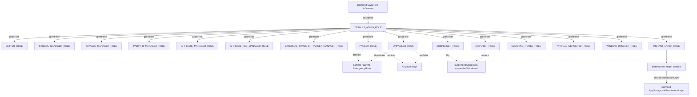

# Roles, Permissions, and Pause Flags

## Table of Contents

- [Part 1 — Roles](#part-1--roles)
- [Part 2 — Pause Flags](#part-2--pause-flags)
- [Part 3 — Modifiers Reference](#part-3--modifiers-reference)
- [Part 4 — Suspension and Emergency](#part-4--suspension-and-emergency)
- [Part 5 — Role Hierarchy](#part-5--role-hierarchy)

All role identifiers are `keccak256` hashes declared in `contracts/libraries/core/LibAccessibility.sol`. Storage of role memberships lives in `contracts/storages/AccessControlStorage.sol:12-16`. The on-chain check is `LibAccessibility.hasRole(user, role)` at `contracts/libraries/core/LibAccessibility.sol:33-35`, surfaced through the `onlyRole` modifier in `contracts/utils/Accessibility.sol:36-39`.

The Diamond owner (set via `LibDiamond`) is distinct from `DEFAULT_ADMIN_ROLE`. Only the Diamond owner can call `ControlFacet.setAdmin` (`contracts/facets/Control/ControlFacet.sol:53-57`); only `DEFAULT_ADMIN_ROLE` can call `grantRole` / `revokeRole` (`contracts/facets/Control/ControlFacet.sol:65-89`).

## Part 1 — Roles

### Diamond Roles

| Role | Hash source | Granted by | Held by (operationally) | Risk if compromised |
| --- | --- | --- | --- | --- |
| `DEFAULT_ADMIN_ROLE` | `LibAccessibility.sol:10` | Diamond owner via `setAdmin` | Protocol governance multisig | Full control: can grant/revoke every other role and reconfigure access. |
| `SETTER_ROLE` | `LibAccessibility.sol:13` | `DEFAULT_ADMIN_ROLE` | Ops admin / governance | Can re-tune cooldowns, signature lifetimes, balance limits, fee collectors, signature verifier — economic and safety parameters. |
| `SYMBOL_MANAGER_ROLE` | `LibAccessibility.sol:11` | `DEFAULT_ADMIN_ROLE` | Listings team | Can list malicious symbols, flip validity, mutate platform fees on existing symbols. |
| `ORACLE_MANAGER_ROLE` | `LibAccessibility.sol:12` | `DEFAULT_ADMIN_ROLE` | Listings / oracle ops | Can swap oracle contract addresses or repoint the global price oracle, breaking pricing. |
| `PARTY_B_MANAGER_ROLE` | `LibAccessibility.sol:16` | `DEFAULT_ADMIN_ROLE` | Counterparty onboarding | Can activate/deactivate Party Bs and toggle supported symbol types. |
| `AFFILIATE_MANAGER_ROLE` | `LibAccessibility.sol:17` | `DEFAULT_ADMIN_ROLE` | Affiliate ops | Can whitelist arbitrary affiliates and redirect their fee collectors. |
| `AFFILIATE_FEE_MANAGER_ROLE` | `LibAccessibility.sol:18` | `DEFAULT_ADMIN_ROLE` | Affiliate ops | Can set affiliate fees on behalf of any affiliate (bypassing the self-sender check in `setAffiliateFees`). |
| `EXTERNAL_TRANSFER_TARGET_MANAGER_ROLE` | `LibAccessibility.sol:19` | `DEFAULT_ADMIN_ROLE` | Integration ops | Can whitelist arbitrary external transfer targets and exfiltrate balances via `externalTransfer`. |
| `PAUSER_ROLE` | `LibAccessibility.sol:14` | `DEFAULT_ADMIN_ROLE` | Incident-response bot / multisig | Can halt every user-facing flow and put Party Bs into emergency mode. |
| `UNPAUSER_ROLE` | `LibAccessibility.sol:15` | `DEFAULT_ADMIN_ROLE` | Governance multisig | Can prematurely lift pauses or emergency mode, resuming a degraded protocol. |
| `SUSPENDER_ROLE` | `LibAccessibility.sol:20` | `DEFAULT_ADMIN_ROLE` | Compliance / risk ops | Can freeze any address and withhold any pending withdrawal. |
| `DISPUTER_ROLE` | `LibAccessibility.sol:22` | `DEFAULT_ADMIN_ROLE` | Disputes adjudicator | Can rewrite the valid amount on a suspended withdrawal via `restoreWithdraw`. |
| `CLEARING_HOUSE_ROLE` | `LibAccessibility.sol:21` | `DEFAULT_ADMIN_ROLE` | ClearingHouse bot | Can flag/unflag liquidation, execute liquidations, confiscate funds, and force-close trades. |
| `VIRTUAL_DEPOSITOR_ROLE` | `LibAccessibility.sol:23` | `DEFAULT_ADMIN_ROLE` | Approved bridges / accounting | Can credit isolated balance to any user without an actual ERC-20 transfer. |
| `WINDOW_UPDATER_ROLE` | `LibAccessibility.sol:24` | `DEFAULT_ADMIN_ROLE` | Reserved | No on-chain modifier currently consumes this role; reserved for future use. |
| `INSTANT_LAYER_ROLE` | `LibAccessibility.sol:25` | `DEFAULT_ADMIN_ROLE` | Deployed `InstantLayer` contract | Can flip the `callFromInstantLayer` flag, bypassing `whenInstantModeIsNotActive` guards. |

### Functions guarded per role (Diamond)

`DEFAULT_ADMIN_ROLE` — administers role membership only:

- `ControlFacet.grantRole` — `contracts/facets/Control/ControlFacet.sol:65`
- `ControlFacet.revokeRole` — `contracts/facets/Control/ControlFacet.sol:81`

`SETTER_ROLE` — system parameters and integrations:

- `whiteListCollateral` / `removeCollateralFromWhitelist` — `ControlFacet.sol:99`, `:109`
- `setMaxCloseOrdersLength`, `setMaxTradePerPartyA`, `setBalanceLimitPerUser` — `ControlFacet.sol:122`, `:132`, `:143`
- `setTimingParameters` — `ControlFacet.sol:172`
- `setPartyADeallocateCooldown`, `setPartyBDeallocateCooldown` — `ControlFacet.sol:204`, `:213`
- `setForceCancelOpenIntentTimeout`, `setForceCancelCloseIntentTimeout` — `ControlFacet.sol:222`, `:231`
- `setSettlementPriceSigValidTime`, `setUpnlSigValidTime` — `ControlFacet.sol:240`, `:249`
- `setPartyBExclusiveWindow`, `setUnbindingCooldown`, `setDeactiveInstantActionModeCooldown` — `ControlFacet.sol:258`, `:267`, `:276`
- `setTradeNftAddress` — `ControlFacet.sol:285`
- `setPartyBReleaseInterval`, `setDefaultReleaseInterval`, `setMaxConnectedCounterParties` — `ControlFacet.sol:299`, `:310`, `:319`
- `setDefaultFeeCollector`, `setAffiliateFees` — `ControlFacet.sol:333`, `:370`
- `setSignatureVerifier` — `ControlFacet.sol:871`
- `setExpressWithdrawProviderConfig`, `setInvalidWithdrawalsAmountsPool` — `ControlFacet.sol:891`, `:901`

`SYMBOL_MANAGER_ROLE`:

- `addSymbol`, `addSymbols` — `ControlFacet.sol:762`, `:787`
- `setSymbolsPlatformFees` — `ControlFacet.sol:799`
- `setSymbolsValidationState` — `ControlFacet.sol:819`
- `setSymbolsNames`, `setSymbolsTypes` — `ControlFacet.sol:835`, `:852`

`ORACLE_MANAGER_ROLE`:

- `addOracle` — `ControlFacet.sol:706`
- `updateOracle` — `ControlFacet.sol:721`
- `setPriceOracleAddress` — `ControlFacet.sol:736`

`PARTY_B_MANAGER_ROLE`:

- `setPartyBConfig` — `ControlFacet.sol:392`
- `setPartyBSupportedSymbolTypes` — `ControlFacet.sol:411`

`AFFILIATE_MANAGER_ROLE`:

- `setAffiliateStatus` — `ControlFacet.sol:344`
- `setAffiliateFeesCollector` — `ControlFacet.sol:354`

`AFFILIATE_FEE_MANAGER_ROLE`:

- `setAffiliateFees` (when caller is not the affiliate themself) — `ControlFacet.sol:370-372`

`EXTERNAL_TRANSFER_TARGET_MANAGER_ROLE`:

- `setExternalTransferTargetValidationStatus` — `ControlFacet.sol:921`

`PAUSER_ROLE`:

- `pauseGlobal`, `pauseDeposit`, `pauseWithdraw`, `pauseExpressWithdraw` — `ControlFacet.sol:430`, `:438`, `:446`, `:454`
- `pauseInternalTransfer`, `pauseExternalTransfer` — `ControlFacet.sol:462`, `:470`
- `pausePartyBActions`, `pausePartyAActions` — `ControlFacet.sol:478`, `:486`
- `pauseLiquidating`, `pauseThirdPartyActions` — `ControlFacet.sol:494`, `:502`
- `pauseInstantLayer` — `ControlFacet.sol:510`
- `activePartyBsEmergencyMode`, `activePartyBEmergencyMode` — `ControlFacet.sol:612`, `:629`

`UNPAUSER_ROLE`:

- `unpauseGlobal`, `unpauseDeposit`, `unpauseWithdraw` — `ControlFacet.sol:520`, `:528`, `:536`
- `unpauseInternalTransfer`, `unpauseExternalTransfer`, `unpauseExpressWithdraw` — `ControlFacet.sol:544`, `:552`, `:560`
- `unpausePartyBActions`, `unpausePartyAActions` — `ControlFacet.sol:568`, `:576`
- `unpauseLiquidating`, `unpauseThirdPartyActions` — `ControlFacet.sol:584`, `:592`
- `unpauseInstantLayer` — `ControlFacet.sol:600`
- `deactivePartyBsEmergencyMode`, `deactivePartyBEmergencyMode` — `ControlFacet.sol:620`, `:639`

`SUSPENDER_ROLE`:

- `suspendAddress`, `suspendAddresses` — `ControlFacet.sol:654`, `:676`
- `suspendWithdrawal` — `ControlFacet.sol:665`
- `AccountFacet.suspendWithdraw` — `contracts/facets/Account/AccountFacet.sol:200`

`DISPUTER_ROLE`:

- `AccountFacet.restoreWithdraw` — `contracts/facets/Account/AccountFacet.sol:211`

`CLEARING_HOUSE_ROLE` (all guarded by both `whenNotLiquidationPaused` and `onlyRole`):

- `flagIsolatedPartyBLiquidation` — `contracts/facets/ClearingHouse/ClearingHouseFacet.sol:26`
- `unflagIsolatedPartyBLiquidation` — `ClearingHouseFacet.sol:39`
- `liquidateIsolatedPartyB` — `ClearingHouseFacet.sol:54`
- `confiscate`, `confiscateWithdrawal` — `ClearingHouseFacet.sol:64`, `:75`
- `distributeCollateral` — `ClearingHouseFacet.sol:80`
- `flagCrossPartyBLiquidation`, `unflagCrossPartyBLiquidation`, `liquidateCrossPartyB` — `ClearingHouseFacet.sol:92`, `:101`, `:110`
- `flagPartyALiquidation`, `unflagPartyALiquidation`, `liquidateCrossPartyA` — `ClearingHouseFacet.sol:121`, `:130`, `:139`
- `closeTrades` — `ClearingHouseFacet.sol:151`
- `allocateFromReserveToCross` — `ClearingHouseFacet.sol:160`
- `cancelOpenIntents`, `cancelCloseIntents` — `ClearingHouseFacet.sol:170`, `:175`

`VIRTUAL_DEPOSITOR_ROLE`:

- `AccountFacet.virtualDepositFor` — `contracts/facets/Account/AccountFacet.sol:51-55`

`INSTANT_LAYER_ROLE`:

- `ControlFacet.setCallFromInstantLayer` — `contracts/facets/Control/ControlFacet.sol:937`

`WINDOW_UPDATER_ROLE`:

- Defined at `LibAccessibility.sol:24` but no facet currently calls `onlyRole(WINDOW_UPDATER_ROLE)`. Reserved.

### InstantLayer Roles

The `InstantLayer` helper at `contracts/helpers/InstantLayer.sol` uses OpenZeppelin `AccessControlEnumerable` — these roles are isolated from the Diamond's `LibAccessibility` and live in the helper's own storage.

| Role | Hash source | Granted by | Held by | Functions guarded | Risk if compromised |
| --- | --- | --- | --- | --- | --- |
| `DEFAULT_ADMIN_ROLE` | `InstantLayer.sol:198` (granted in constructor) | Self / OZ default | Deployment admin | Standard OZ admin (grant/revoke). | Can re-grant any other role on the helper. |
| `SETTER_ROLE` | `InstantLayer.sol:61` | `DEFAULT_ADMIN_ROLE` | Ops admin | `registerPartyB`/`unregisterPartyB`/`registerPartyBBatch` (`InstantLayer.sol:211`, `:221`, `:231`); `registerMultiAccount`/`unregisterMultiAccount`/`registerMultiAccountBatch` (`:243`, `:252`, `:261`); `addTemplate` (`:275`); `setTemplateActive` (`:294`). | Can register arbitrary PartyB/MultiAccount addresses, install templates that chain results into Diamond calls, or auto-grant `OPERATOR_ROLE` (`registerPartyB` calls `_grantRole(OPERATOR_ROLE, partyB)` at `:213`). |
| `OPERATOR_ROLE` | `InstantLayer.sol:64` | `DEFAULT_ADMIN_ROLE`, or auto-granted to registered PartyBs (`InstantLayer.sol:213`) | Off-chain executor / registered PartyBs | `executeTemplate` (`:311`), `executeBatch` (`:354`). | Can submit signed-operation batches to the Diamond inside `callFromInstantLayer = true` windows, bypassing `whenInstantModeIsNotActive`. Replay still bounded by EIP-712 signatures and `usedOperationHashes`. |
| `MANAGER_ROLE` | `InstantLayer.sol:70` | `DEFAULT_ADMIN_ROLE` | Reserved | Granted in constructor (`:201`); not consumed by `InstantLayer` itself. | Reserved for future restricted ops. |
| `TRUSTED_ROLE` | `InstantLayer.sol:67` | `DEFAULT_ADMIN_ROLE` | Reserved | Granted in constructor (`:202`); not consumed by `InstantLayer` itself. | Reserved for trusted approvals/external calls. |

`SymmioPartyB` and `MultiAccount` helpers reuse the same `PAUSER_ROLE` / `UNPAUSER_ROLE` / `SETTER_ROLE` / `MANAGER_ROLE` / `TRUSTED_ROLE` / `DEFAULT_ADMIN_ROLE` names from OZ but those are scoped to those helper contracts (`contracts/helpers/SymmioPartyB.sol`, `contracts/helpers/MultiAccount.sol`) — not the Diamond.

## Part 2 — Pause Flags

All flags live in `StateControlStorage.Layout` at `contracts/storages/StateControlStorage.sol:10-28`. Setters and unsetters are concentrated in `ControlFacet`. Every guarded path additionally checks `globalPaused` first (see `Pausable.sol`).

| Flag | Storage | Gates | Set by | Unset by |
| --- | --- | --- | --- | --- |
| `globalPaused` | `StateControlStorage.sol:11` | Every `Pausable` modifier checks this first; effectively halts deposits, withdrawals, transfers, party A/B actions, liquidation, third-party actions, and express withdrawals. | `pauseGlobal` — `ControlFacet.sol:430` (PAUSER_ROLE) | `unpauseGlobal` — `ControlFacet.sol:520` (UNPAUSER_ROLE) |
| `depositingPaused` | `StateControlStorage.sol:12` | `whenDepositingNotPaused` → `AccountFacet.deposit`, `depositFor`, `virtualDepositFor` (`AccountFacet.sol:39`, `:55`, `:78`). | `pauseDeposit` — `ControlFacet.sol:438` | `unpauseDeposit` — `ControlFacet.sol:528` |
| `withdrawingPaused` | `StateControlStorage.sol:13` | `whenWithdrawingNotPaused` → `completeWithdraw`, `cancelWithdraw` (`AccountFacet.sol:223`, `:233`); also `initiateWithdraw`, `initiateExpressWithdraw` (`AccountFacet.sol:155`, `:183`). | `pauseWithdraw` — `ControlFacet.sol:446` | `unpauseWithdraw` — `ControlFacet.sol:536` |
| `partyBActionsPaused` | `StateControlStorage.sol:14` | `whenPartyNotPaused(user)` when `user.isPartyB()` (`Pausable.sol:61-68`, `:77-82`) → all PartyB facet entrypoints (`PartyBOpenFacet.sol:29,40,55,69`, `PartyBCloseFacet.sol:26,38`). | `pausePartyBActions` — `ControlFacet.sol:478` | `unpausePartyBActions` — `ControlFacet.sol:568` |
| `partyAActionsPaused` | `StateControlStorage.sol:15` | `whenPartyNotPaused(user)` when `!isPartyB()` → all PartyA / Account / Trade entrypoints that take a user-side modifier. | `pausePartyAActions` — `ControlFacet.sol:486` | `unpausePartyAActions` — `ControlFacet.sol:576` |
| `liquidatingPaused` | `StateControlStorage.sol:16` | `whenNotLiquidationPaused` → every function on `ClearingHouseFacet` (see Part 1). | `pauseLiquidating` — `ControlFacet.sol:494` | `unpauseLiquidating` — `ControlFacet.sol:584` |
| `thirdPartyActionsPaused` | `StateControlStorage.sol:17` | `whenNotThirdPartyActionsPaused` → `TradeFacet.executeTrades` (`TradeFacet.sol:61`). | `pauseThirdPartyActions` — `ControlFacet.sol:502` | `unpauseThirdPartyActions` — `ControlFacet.sol:592` |
| `internalTransferPaused` | `StateControlStorage.sol:18` | `whenInternalTransferNotPaused` → `AccountFacet.internalTransfer` (`AccountFacet.sol:98`). | `pauseInternalTransfer` — `ControlFacet.sol:462` | `unpauseInternalTransfer` — `ControlFacet.sol:544` |
| `externalTransferPaused` | `StateControlStorage.sol:19` | `whenNotExternalTransferPaused` → `AccountFacet.externalTransfer` (`AccountFacet.sol:133`). | `pauseExternalTransfer` — `ControlFacet.sol:470` | `unpauseExternalTransfer` — `ControlFacet.sol:552` |
| `expressWithdrawPaused` | `StateControlStorage.sol:20` | `whenNotExpressWithdrawPaused` → `AccountFacet.initiateExpressWithdraw` (`AccountFacet.sol:184`). | `pauseExpressWithdraw` — `ControlFacet.sol:454` | `unpauseExpressWithdraw` — `ControlFacet.sol:560` |
| `instantLayerPaused` | `StateControlStorage.sol:21` | Checked inside `setCallFromInstantLayer` (`ControlFacet.sol:938`); when set, blocks `InstantLayer` from entering instant mode. Reverts with `SystemErrors.InstantLayerPaused`. | `pauseInstantLayer` — `ControlFacet.sol:510` | `unpauseInstantLayer` — `ControlFacet.sol:600` |
| `partyBsEmergencyMode` | `StateControlStorage.sol:23` | Checked in `LibPartyBOpen` lock and fill paths (`contracts/libraries/core/LibPartyBOpen.sol:52`, `:185`). When true, no PartyB can lock or fill open intents. | `activePartyBsEmergencyMode` — `ControlFacet.sol:612` (PAUSER_ROLE) | `deactivePartyBsEmergencyMode` — `ControlFacet.sol:620` (UNPAUSER_ROLE) |
| `partyBEmergencyMode[partyB]` | `StateControlStorage.sol:24` | Checked in `LibPartyBOpen` against the acting PartyB (`LibPartyBOpen.sol:51`, `:184`). Targets one PartyB only. | `activePartyBEmergencyMode` — `ControlFacet.sol:629` (PAUSER_ROLE) | `deactivePartyBEmergencyMode` — `ControlFacet.sol:639` (UNPAUSER_ROLE) |
| `suspendedAddresses[user]` | `StateControlStorage.sol:26` | `whenNotSuspended(user)` (`Accessibility.sol:53-56`); also enforced via `checkNotSuspendedWithdrawal` against withdraw `user` and `to` (`Accessibility.sol:63-69`). | `suspendAddress` / `suspendAddresses` — `ControlFacet.sol:654`, `:676` (SUSPENDER_ROLE) | Same setters with `_status = false`. |
| `suspendedWithdrawal[id]` | `StateControlStorage.sol:27` | `whenWithdrawalNotSuspended(id)` (`Accessibility.sol:58-61`) → `completeWithdraw`, `cancelWithdraw`. | `suspendWithdrawal` — `ControlFacet.sol:665`; `AccountFacet.suspendWithdraw` — `AccountFacet.sol:200` (SUSPENDER_ROLE) | `suspendWithdrawal(_status=false)`; `AccountFacet.restoreWithdraw` — `AccountFacet.sol:211` (DISPUTER_ROLE) clears the flag and rewrites `validAmount`. |

## Part 3 — Modifiers Reference

### `contracts/utils/Accessibility.sol`

| Modifier | Check | Used by (representative) | Reverts with |
| --- | --- | --- | --- |
| `onlyPartyB(user)` (`Accessibility.sol:26`) | `LibParty.isPartyB(user) == true` | `PartyBOpenFacet.lockOpenIntent` (`PartyBOpenFacet.sol:29`) | `ValidationErrors.NotPartyB(user)` |
| `onlyNotPartyB(user)` (`Accessibility.sol:31`) | `LibParty.isPartyB(user) == false` | `CounterPartyRelationsFacet.activateInstantActionMode`, `bindToPartyB` (`CounterPartyRelationsFacet.sol:29,62`); `AccountFacet.internalTransfer` (`AccountFacet.sol:104`) | `ValidationErrors.PartyBUser(user)` |
| `onlyRole(role)` (`Accessibility.sol:36`) | `AccessControlStorage.hasRole[msg.sender][role]` | All `ControlFacet`/`ClearingHouseFacet`/`AccountFacet` admin entrypoints | `ValidationErrors.MissingRole(msg.sender, role)` |
| `onlyPartyAOfTrade(tradeId)` (`Accessibility.sol:41`) | `TradeStorage.trades[tradeId].partyA == msg.sender` | `TradeFacet.transferTrade` (`TradeFacet.sol:32`); `TradeFacet.mintNFTForTrade` (`TradeFacet.sol:71`); `PartyACloseFacet.requestCloseIntent` (`PartyACloseFacet.sol:43`) | `ValidationErrors.UnauthorizedSender(msg.sender, partyA)` |
| `onlyPartyBOfTrade(tradeId)` (`Accessibility.sol:47`) | `TradeStorage.trades[tradeId].partyB == msg.sender` | (Reserved for PartyB-side trade-scoped functions) | `ValidationErrors.UnauthorizedSender(msg.sender, partyB)` |
| `whenNotSuspended(user)` (`Accessibility.sol:53`) | `StateControlStorage.suspendedAddresses[user] == false` | `AccountFacet.deposit/depositFor/internalTransfer/externalTransfer/initiateWithdraw/initiateExpressWithdraw/allocate/deallocate` (`AccountFacet.sol:39, 76-77, 99-100, 134, 156-158, 185-187, 266, 292`); `TradeFacet.transferTrade` (`TradeFacet.sol:32`) | `SystemErrors.UserSuspended(user)` |
| `whenWithdrawalNotSuspended(id)` (`Accessibility.sol:58`) | Withdraw user, recipient, and `suspendedWithdrawal[id]` all clear (`Accessibility.sol:63-69`) | `AccountFacet.completeWithdraw`, `cancelWithdraw` (`AccountFacet.sol:223, 233`) | `SystemErrors.UserSuspended(...)` or `SystemErrors.WithdrawalSuspended(id)` |
| `whenInstantModeIsNotActive(sender)` (`Accessibility.sol:71`) | `instantActionsMode[sender] == false` OR `AppStorage.callFromInstantLayer == true` | `PartyAOpenFacet.requestOpenIntent` (`PartyAOpenFacet.sol:64`); `PartyACloseFacet.requestCloseIntent` (`PartyACloseFacet.sol:43`); `AccountFacet.internalTransfer/externalTransfer/initiateWithdraw/initiateExpressWithdraw/allocate/deallocate/allocateToReserveBalance/deallocateFromReserveBalance` | `PartyRelationsErrors.InstantModeActive(sender)` |
| `whenInstantModeIsActive(sender)` (`Accessibility.sol:76`) | `instantActionsMode[sender] == true` | `CounterPartyRelationsFacet.initiateDeactivateInstantActionMode` (`CounterPartyRelationsFacet.sol:41`) | `PartyRelationsErrors.InstantModeNotActive(sender)` |

### `contracts/utils/Pausable.sol`

Every modifier short-circuits on `globalPaused` first.

| Modifier | Check | Used by | Reverts with |
| --- | --- | --- | --- |
| `whenNotGlobalPaused()` (`Pausable.sol:16`) | `!globalPaused` | (Generic; rarely used directly — most paths use a more specific modifier that already checks global.) | `SystemErrors.GlobalPaused()` |
| `whenNotExpressWithdrawPaused()` (`Pausable.sol:21`) | `!globalPaused && !expressWithdrawPaused` | `AccountFacet.initiateExpressWithdraw` (`AccountFacet.sol:184`) | `GlobalPaused()` / `ExpressWithdrawPaused()` |
| `whenDepositingNotPaused()` (`Pausable.sol:29`) | `!globalPaused && !depositingPaused` | `AccountFacet.deposit/depositFor/virtualDepositFor` (`AccountFacet.sol:39,55,75`) | `GlobalPaused()` / `DepositingPaused()` |
| `whenInternalTransferNotPaused()` (`Pausable.sol:37`) | `!globalPaused && !internalTransferPaused` | `AccountFacet.internalTransfer` (`AccountFacet.sol:98`) | `GlobalPaused()` / `InternalTransferPaused()` |
| `whenNotExternalTransferPaused()` (`Pausable.sol:45`) | `!globalPaused && !externalTransferPaused` | `AccountFacet.externalTransfer` (`AccountFacet.sol:133`) | `GlobalPaused()` / `ExternalTransferPaused()` |
| `whenWithdrawingNotPaused()` (`Pausable.sol:53`) | `!globalPaused && !withdrawingPaused` | `AccountFacet.initiateWithdraw/completeWithdraw/cancelWithdraw` (`AccountFacet.sol:155,223,233`); `AccountFacet.initiateExpressWithdraw` (`AccountFacet.sol:183`) | `GlobalPaused()` / `WithdrawingPaused()` |
| `whenPartyNotPaused(user)` (`Pausable.sol:61`) | If `isPartyB(user)`: `!partyBActionsPaused`. Else: `!partyAActionsPaused`. (Plus `!globalPaused`.) | All PartyA/PartyB user-facing entrypoints (`PartyAOpenFacet`, `PartyACloseFacet`, `PartyBOpenFacet`, `PartyBCloseFacet`, `ForceActionsFacet`, `TradeFacet`, `CounterPartyRelationsFacet`, most of `AccountFacet`) | `GlobalPaused()` / `PartyAActionsPaused()` / `PartyBActionsPaused()` |
| `whenNotThirdPartyActionsPaused()` (`Pausable.sol:84`) | `!globalPaused && !thirdPartyActionsPaused` | `TradeFacet.executeTrades` (`TradeFacet.sol:61`) | `GlobalPaused()` / `ThirdPartyActionsPaused()` |
| `whenNotLiquidationPaused()` (`Pausable.sol:92`) | `!globalPaused && !liquidatingPaused` | All `ClearingHouseFacet` functions | `GlobalPaused()` / `LiquidatingPaused()` |

### `contracts/utils/Ownable.sol`

| Modifier | Check | Used by | Reverts with |
| --- | --- | --- | --- |
| `onlyOwner()` (`Ownable.sol:10`) | `LibDiamond.enforceIsContractOwner()` (Diamond owner) | `ControlFacet.setAdmin` (`ControlFacet.sol:53`); `DiamondCutFacet.diamondCut` | `LibDiamond.NotContractOwner` |

### `contracts/utils/ReentrancyGuard.sol`

| Modifier | Check | Used by | Reverts with |
| --- | --- | --- | --- |
| `nonReentrant()` (`ReentrancyGuard.sol:14`) | `AccessControlStorage.reentrancyGuardStatus != _ENTERED`; sets/clears around call. | `AccountFacet.deposit/depositFor/externalTransfer/initiateExpressWithdraw/completeWithdraw` (`AccountFacet.sol:39,73,132,182,223`); `TradeFacet.transferTrade/mintNFTForTrade` (`TradeFacet.sol:32,71`) | `ReentrancyGuardErrors.ReentrantCall()` |

## Part 4 — Suspension and Emergency

These are **distinct** from pause flags and from liquidation flagging:

- **Pause** halts a class of actions for everybody.
- **Liquidation flagging** (`flagIsolatedPartyBLiquidation`, etc.) marks a counterparty for clearing-house processing; it is not "suspended" in the access-control sense.
- **Suspension** is a per-address denial of access enforced in user code paths.
- **Emergency mode** is a PartyB-scoped lock specifically over `LibPartyBOpen` lock/fill paths.

### Address suspension

Storage: `StateControlStorage.suspendedAddresses` (`StateControlStorage.sol:26`).

What it blocks (via `whenNotSuspended` in `Accessibility.sol:53-56`):

- `AccountFacet.deposit` (sender) — `AccountFacet.sol:39`
- `AccountFacet.virtualDepositFor` (recipient `user`) — `AccountFacet.sol:55`
- `AccountFacet.depositFor` (sender and `user`) — `AccountFacet.sol:76-77`
- `AccountFacet.internalTransfer` (sender and `user`) — `AccountFacet.sol:99-100`
- `AccountFacet.externalTransfer` (sender) — `AccountFacet.sol:134`
- `AccountFacet.initiateWithdraw` (sender, `to`) — `AccountFacet.sol:156, 158`
- `AccountFacet.initiateExpressWithdraw` (sender, `to`) — `AccountFacet.sol:185, 187`
- `AccountFacet.allocate`/`deallocate` (sender) — `AccountFacet.sol:266, 292`
- `TradeFacet.transferTrade` (sender, `receiver`) — `TradeFacet.sol:32`
- `TradeFacet.mintTradeNFTViaSig` (sender, `receiver`) — `TradeFacet.sol:49`

It also indirectly blocks `completeWithdraw` and `cancelWithdraw` because those run `checkNotSuspendedWithdrawal` against the withdraw's `user` and `to` (`Accessibility.sol:63-69`).

What suspension does **not** block: read-only views, liquidation flow against the user, intent-side modifiers without a `whenNotSuspended` guard. A suspended user can still be liquidated.

Flipped by:

- `ControlFacet.suspendAddress(user, status)` — `ControlFacet.sol:654` (`SUSPENDER_ROLE`)
- `ControlFacet.suspendAddresses(users[], statuses[])` — `ControlFacet.sol:676` (`SUSPENDER_ROLE`, batch)

### Withdrawal suspension

Storage: `StateControlStorage.suspendedWithdrawal[withdrawId]` (`StateControlStorage.sol:27`).

What it blocks (via `whenWithdrawalNotSuspended` in `Accessibility.sol:58-69`):

- `AccountFacet.completeWithdraw(id)` — `AccountFacet.sol:223`
- `AccountFacet.cancelWithdraw(id)` — `AccountFacet.sol:233`

Flipped by:

- `ControlFacet.suspendWithdrawal(id, status)` — `ControlFacet.sol:665` (`SUSPENDER_ROLE`)
- `AccountFacet.suspendWithdraw(id)` — `AccountFacet.sol:200` (`SUSPENDER_ROLE`); sets the flag to `true`.
- `AccountFacet.restoreWithdraw(id, validAmount)` — `AccountFacet.sol:211` (`DISPUTER_ROLE`); clears the flag and overwrites `Withdraw.amount` with `validAmount`. The disputer is the only role that can resolve a suspended withdrawal at a different amount; the suspender can only toggle the flag.

### Party B emergency mode

Two storage levels in `StateControlStorage.sol:23-24`:

- `partyBsEmergencyMode` — global PartyB freeze.
- `partyBEmergencyMode[partyB]` — single-PartyB freeze.

What it blocks: locking and filling open intents. Enforced inside `LibPartyBOpen`:

- `LibPartyBOpen.sol:51` checks `partyBEmergencyMode[sender]` on lock.
- `LibPartyBOpen.sol:52` checks `partyBsEmergencyMode` on lock.
- `LibPartyBOpen.sol:184` checks `partyBEmergencyMode[intent.partyB]` on fill.
- `LibPartyBOpen.sol:185` checks `partyBsEmergencyMode` on fill.

Reverts with `SystemErrors.PartyBInEmergencyMode(partyB)` or `SystemErrors.PartyBsInEmergencyMode()` (`contracts/errors/SystemErrors.sol:43-44`).

Emergency mode does not block close-side flows or withdrawals; it specifically prevents new exposure being taken on by a problematic PartyB.

Flipped by:

| Action | Function | Role |
| --- | --- | --- |
| Activate global PartyB freeze | `activePartyBsEmergencyMode` — `ControlFacet.sol:612` | `PAUSER_ROLE` |
| Deactivate global PartyB freeze | `deactivePartyBsEmergencyMode` — `ControlFacet.sol:620` | `UNPAUSER_ROLE` |
| Activate per-PartyB freeze | `activePartyBEmergencyMode(partyB)` — `ControlFacet.sol:629` | `PAUSER_ROLE` |
| Deactivate per-PartyB freeze | `deactivePartyBEmergencyMode(partyB)` — `ControlFacet.sol:639` | `UNPAUSER_ROLE` |

### Read access

`ViewFacet` exposes the raw state for off-chain monitors:

- `getStateControlStatus` (returns the full pause/emergency tuple) — `contracts/facets/View/ViewFacet.sol:758-774`
- `getPartyBsEmergencyMode` — `ViewFacet.sol:783`
- `getPartyBEmergencyMode(partyB)` — `ViewFacet.sol:792`

## Part 5 — Role Hierarchy

