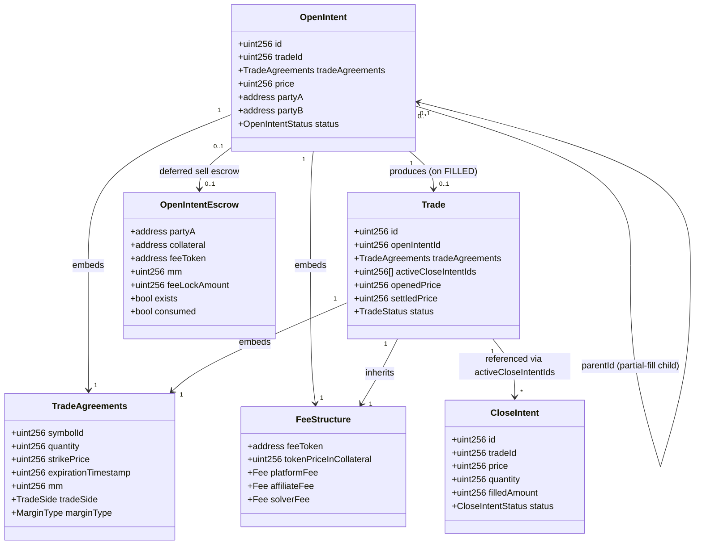

# Types And Storage

This document is the canonical reference for every Solidity struct and enum defined under `contracts/types/`, and every diamond-storage library defined under `contracts/storages/`. Internal accounting is normalized to 18 decimals through `LibDecimals`; timestamps are seconds; prices and premiums are denominated in the symbol's collateral token. All storage slot constants follow the EIP-2535 `keccak256("diamond.standard.storage.<name>")` derivation pattern.

## Contents

-   [Types](#types)
    -   [BaseTypes](#basetypes)
    -   [BalanceTypes](#balancetypes)
    -   [IntentTypes](#intenttypes)
    -   [TradeTypes](#tradetypes)
    -   [SymbolTypes](#symboltypes)
    -   [LiquidationTypes](#liquidationtypes)
    -   [WithdrawTypes](#withdrawtypes)
    -   [MuonTypes](#muontypes)
    -   [Trade ↔ Intent Relationships](#trade--intent-relationships)
-   [Storage](#storage)
    -   [AppStorage](#appstorage)
    -   [AccountStorage](#accountstorage)
    -   [OpenIntentStorage](#openintentstorage)
    -   [CloseIntentStorage](#closeintentstorage)
    -   [TradeStorage](#tradestorage)
    -   [SymbolStorage](#symbolstorage)
    -   [FeeManagementStorage](#feemanagementstorage)
    -   [LiquidationStorage](#liquidationstorage)
    -   [CounterPartyRelationsStorage](#counterpartyrelationsstorage)
    -   [StateControlStorage](#statecontrolstorage)
    -   [AccessControlStorage](#accesscontrolstorage)
-   [Conventions](#conventions)
    -   [Decimal Normalization](#decimal-normalization)
    -   [Time Units](#time-units)
    -   [Price, Quantity, Premium, Margin](#price-quantity-premium-margin)
    -   [Identifier Counters](#identifier-counters)

## Types

### BaseTypes

Source: `contracts/types/BaseTypes.sol`.

#### enum TradeSide — line 7

| Member | Meaning                  |
| ------ | ------------------------ |
| `BUY`  | Party A buys the option. |
| `SELL` | Party A writes/sells.    |

#### enum MarginType — line 12

| Member     | Meaning                                                                              |
| ---------- | ------------------------------------------------------------------------------------ |
| `ISOLATED` | Per-position margin; locked on Party A `isolatedLockedBalance`.                      |
| `CROSS`    | Pooled margin against a specific Party B; managed in `CrossEntry` per counter-party. |

Party A `SELL` is rejected for `ISOLATED` (see `PartyAOpenFacet.sendOpenIntent`).

#### struct ExerciseFee — line 17

| Field  | Type      | Units                          | Meaning                                                       |
| ------ | --------- | ------------------------------ | ------------------------------------------------------------- |
| `rate` | `uint256` | 1e18 fraction (e.g. 1e16 = 1%) | Exercise fee rate applied at settlement; cap is `1e18`.       |
| `cap`  | `uint256` | collateral, 18 decimals        | Maximum absolute fee charged regardless of `rate * notional`. |

#### struct Fee — line 22

| Field      | Type      | Units                     | Meaning                                                     |
| ---------- | --------- | ------------------------- | ----------------------------------------------------------- |
| `openFee`  | `uint256` | 1e18 fraction of notional | Fraction of notional charged when an open intent is filled. |
| `closeFee` | `uint256` | 1e18 fraction of notional | Fraction of notional charged when a close intent settles.   |

#### enum FeeOp — line 27

| Member     | Meaning                                            |
| ---------- | -------------------------------------------------- |
| `Subtract` | Debit the fee from a free balance.                 |
| `Add`      | Credit the fee to a free balance.                  |
| `Lock`     | Move fee from free to locked (intent reservation). |
| `Unlock`   | Release a locked fee back to free.                 |

#### struct FeeStructure — line 34

| Field                    | Type      | Units            | Meaning                                                                        |
| ------------------------ | --------- | ---------------- | ------------------------------------------------------------------------------ |
| `feeToken`               | `address` | ERC-20           | Token used to pay platform/affiliate/solver fees.                              |
| `tokenPriceInCollateral` | `uint256` | 18-decimal price | Price of `feeToken` denominated in collateral, snapshotted at intent creation. |
| `platformFee`            | `Fee`     | —                | Platform open/close fee fractions.                                             |
| `affiliateFee`           | `Fee`     | —                | Affiliate open/close fee fractions.                                            |
| `solverFee`              | `Fee`     | —                | Party B (solver) open/close fee fractions.                                     |

#### struct TradeAgreements — line 42

| Field                 | Type          | Units                   | Meaning                                                      |
| --------------------- | ------------- | ----------------------- | ------------------------------------------------------------ |
| `symbolId`            | `uint256`     | id                      | Reference into `SymbolStorage.symbols`.                      |
| `quantity`            | `uint256`     | base units, 18 decimals | Option contract size; must be nonzero.                       |
| `strikePrice`         | `uint256`     | collateral, 18 decimals | Strike price.                                                |
| `expirationTimestamp` | `uint256`     | unix seconds            | Option expiration; must be in the future at intent creation. |
| `mm`                  | `uint256`     | collateral, 18 decimals | Maintenance margin per quantity locked for sellers.          |
| `exerciseFee`         | `ExerciseFee` | —                       | Exercise fee schedule.                                       |
| `tradeSide`           | `TradeSide`   | —                       | Party A side.                                                |
| `marginType`          | `MarginType`  | —                       | Margin model.                                                |

Used by: `OpenIntent`, `Trade`. Consumed in `LibPartyAOpen`, `LibPartyBOpen`, `LibPartyAClose`, `LibPartyBClose`, `LibTradeOperations`, `LibTrade`.

### BalanceTypes

Source: `contracts/types/BalanceTypes.sol`.

#### struct ScheduledReleaseEntry — line 24

Two-bus delayed-unlock slot. Funds enter `scheduled`, advance to `transitioning` after one interval, then to free balance after another.

| Field                     | Type      | Units        | Meaning                                          |
| ------------------------- | --------- | ------------ | ------------------------------------------------ |
| `releaseInterval`         | `uint256` | seconds      | Interval between bus arrivals.                   |
| `transitioning`           | `uint256` | 18 decimals  | Funds unlocking after one interval.              |
| `scheduled`               | `uint256` | 18 decimals  | Funds unlocking after two intervals.             |
| `lastTransitionTimestamp` | `uint256` | unix seconds | Aligned to start of the last processed interval. |

#### struct CrossEntry — line 31

| Field     | Type      | Units       | Meaning                                                                   |
| --------- | --------- | ----------- | ------------------------------------------------------------------------- |
| `balance` | `int256`  | 18 decimals | Signed cross balance vs a specific counter-party (premium PnL etc.).      |
| `locked`  | `uint256` | 18 decimals | Locked premium / fee amount.                                              |
| `totalMM` | `uint256` | 18 decimals | Aggregated maintenance margin for SELL trades against this counter-party. |

#### struct ScheduledReleaseBalance — line 46

Per (`user`, `collateral`) margin state with packed counter-party enumeration.

| Field                   | Type                                       | Meaning                                                 |
| ----------------------- | ------------------------------------------ | ------------------------------------------------------- |
| `collateral`            | `address`                                  | Collateral token (ERC-20).                              |
| `user`                  | `address`                                  | Owner of this slot.                                     |
| `isolatedBalance`       | `uint256`                                  | Free isolated funds (18 dec).                           |
| `isolatedLockedBalance` | `uint256`                                  | Isolated funds locked behind intents/trades.            |
| `reserveBalance`        | `uint256`                                  | Funds set aside in reserve pool.                        |
| `crossBalance`          | `mapping(address ⇒ CrossEntry)`            | Per counter-party cross state.                          |
| `counterPartySchedules` | `mapping(address ⇒ ScheduledReleaseEntry)` | Two-bus delayed balances per counter-party.             |
| `counterPartyAddresses` | `address[]`                                | Packed enumeration of active counter-parties.           |
| `counterPartyIndexes`   | `mapping(address ⇒ uint256)`               | 1-based index into `counterPartyAddresses`; 0 ⇒ absent. |

Used by: `LibScheduledReleaseBalance`, `LibBalanceOperations`, `LibAllocationOperations`, `LibParty`, the entire `Account/`, `PartyA*`, `PartyB*`, `ClearingHouse`, `ForceActions`, `Trade`, and `View` facets.

#### enum IncreaseBalanceReason — line 66

Reasons recorded when balances grow. Members: `DEPOSIT`, `INTERNAL_TRANSFER`, `EXPRESS_WITHDRAW`, `AFFILIATE_FEE`, `SOLVER_FEE`, `PLATFORM_FEE`, `PREMIUM`, `REALIZED_PNL`, `LIQUIDATION`, `INVALID_WITHDRAWAL`, `ALLOCATE_FROM_RESERVE`.

#### enum DecreaseBalanceReason — line 80

Symmetric reasons for debits. Members: `WITHDRAW`, `INTERNAL_TRANSFER`, `EXPRESS_WITHDRAW`, `AFFILIATE_FEE`, `SOLVER_FEE`, `PLATFORM_FEE`, `PREMIUM`, `REALIZED_PNL`, `CONFISCATE`, `LIQUIDATION`, `EXTERNAL_TRANSFER`.

### IntentTypes

Source: `contracts/types/IntentTypes.sol`.

#### enum OpenIntentStatus — line 9

`PENDING`, `LOCKED`, `CANCEL_PENDING`, `CANCELED`, `FILLED`, `EXPIRED`. State machine documented in `flows/open-intents.md`.

#### enum CloseIntentStatus — line 18

`PENDING`, `CANCEL_PENDING`, `CANCELED`, `FILLED`, `EXPIRED`.

#### struct OpenIntent — line 26

| Field                   | Type               | Units        | Meaning                                                                                                                                             |
| ----------------------- | ------------------ | ------------ | --------------------------------------------------------------------------------------------------------------------------------------------------- |
| `id`                    | `uint256`          | id           | Monotonic id from `OpenIntentStorage.lastOpenIntentId`.                                                                                             |
| `tradeId`               | `uint256`          | id           | Set on FILL; references `TradeStorage.trades`.                                                                                                      |
| `tradeAgreements`       | `TradeAgreements`  | —            | Symbol/quantity/strike/expiry/mm/side/margin terms.                                                                                                 |
| `price`                 | `uint256`          | 18 decimals  | Party A limit premium per unit.                                                                                                                     |
| `partyBsWhiteList`      | `address[]`        | —            | Allowed Party Bs; empty means any active Party B for isolated intents and deferred Party B sells; normal cross intents require exactly one Party B. |
| `parentId`              | `uint256`          | id           | Original intent id when this is a partial-fill child; `0` otherwise.                                                                                |
| `createTimestamp`       | `uint256`          | unix seconds | Creation time.                                                                                                                                      |
| `statusModifyTimestamp` | `uint256`          | unix seconds | Last status transition; used by force/expire timeouts.                                                                                              |
| `deadline`              | `uint256`          | unix seconds | Latest time the intent may be locked/filled.                                                                                                        |
| `feeStructure`          | `FeeStructure`     | —            | Snapshot of fee tokens and fractions at creation.                                                                                                   |
| `partyA`                | `address`          | —            | Intent owner.                                                                                                                                       |
| `partyB`                | `address`          | —            | Locking Party B; cleared on unlock.                                                                                                                 |
| `affiliate`             | `address`          | —            | Affiliate fee recipient routing.                                                                                                                    |
| `userData`              | `bytes`            | —            | Opaque payload (see `LibUserData`).                                                                                                                 |
| `status`                | `OpenIntentStatus` | —            | Current state.                                                                                                                                      |

Consumed by: `PartyAOpenFacet`, `PartyBOpenFacet`, `LibPartyAOpen`, `LibPartyBOpen`, `LibOpenIntent`, `LibForceActions`, `LibTradeOperations`, `ViewFacet`.

#### struct OpenIntentEscrow — line 44

Temporary escrow record for deferred Party B sells (`SELL + CROSS + empty whitelist`). It exists while the matching quantity is still pending without a final Party B; after a partial fill, the remaining record is moved from the filled parent intent to the residual child intent.

| Field           | Type      | Units       | Meaning                                                                   |
| --------------- | --------- | ----------- | ------------------------------------------------------------------------- |
| `partyA`        | `address` | —           | Owner whose isolated balances were locked.                                |
| `collateral`    | `address` | ERC-20      | Symbol collateral used for seller MM.                                     |
| `feeToken`      | `address` | ERC-20      | Token reserved for open fees.                                             |
| `mm`            | `uint256` | 18 decimals | Seller maintenance margin locked from isolated collateral.                |
| `feeLockAmount` | `uint256` | 18 decimals | Estimated total open fee locked from isolated `feeToken` at intent price. |
| `exists`        | `bool`    | —           | Whether the escrow is live.                                               |
| `consumed`      | `bool`    | —           | Guard against double consumption before deletion.                         |

Consumed by: `LibOpenIntent.lockDeferredSellEscrow`, `releaseDeferredSellEscrow`, `consumeDeferredSellEscrow`, `moveDeferredSellEscrow`, `LibPartyBOpen.lockOpenIntent`, and `ViewFacet.getOpenIntentEscrow`.

#### struct CloseIntent — line 54

| Field                   | Type                | Units        | Meaning                                                   |
| ----------------------- | ------------------- | ------------ | --------------------------------------------------------- |
| `id`                    | `uint256`           | id           | Monotonic id from `CloseIntentStorage.lastCloseIntentId`. |
| `tradeId`               | `uint256`           | id           | Parent trade reference.                                   |
| `price`                 | `uint256`           | 18 decimals  | Party A close limit price.                                |
| `quantity`              | `uint256`           | 18 decimals  | Quantity to close.                                        |
| `filledAmount`          | `uint256`           | 18 decimals  | Cumulative filled portion.                                |
| `createTimestamp`       | `uint256`           | unix seconds | Creation time.                                            |
| `statusModifyTimestamp` | `uint256`           | unix seconds | Last status transition.                                   |
| `deadline`              | `uint256`           | unix seconds | Cancel/expire boundary.                                   |
| `feeStructure`          | `FeeStructure`      | —            | Fee snapshot inherited from open path.                    |
| `status`                | `CloseIntentStatus` | —            | Current state.                                            |

Consumed by: `PartyACloseFacet`, `PartyBCloseFacet`, `LibPartyAClose`, `LibPartyBClose`, `LibCloseIntent`, `LibForceActions`, `ViewFacet`.

### TradeTypes

Source: `contracts/types/TradeTypes.sol`.

#### enum TradeStatus — line 10

`OPENED`, `CLOSED`, `EXERCISED`, `EXPIRED`, `LIQUIDATED`.

#### struct Trade — line 18

| Field                            | Type              | Units        | Meaning                                            |
| -------------------------------- | ----------------- | ------------ | -------------------------------------------------- |
| `id`                             | `uint256`         | id           | Monotonic id from `TradeStorage.lastTradeId`.      |
| `openIntentId`                   | `uint256`         | id           | Origin intent.                                     |
| `tradeAgreements`                | `TradeAgreements` | —            | Locked-in terms.                                   |
| `activeCloseIntentIds`           | `uint256[]`       | id           | Open close intents pending against this trade.     |
| `settledPrice`                   | `uint256`         | 18 decimals  | Final settlement price after expiry.               |
| `openedPrice`                    | `uint256`         | 18 decimals  | Premium per unit paid at fill.                     |
| `closedAmountBeforeExpiration`   | `uint256`         | 18 decimals  | Quantity closed via close intents prior to expiry. |
| `closePendingAmount`             | `uint256`         | 18 decimals  | Quantity reserved by active close intents.         |
| `avgClosedPriceBeforeExpiration` | `uint256`         | 18 decimals  | Quantity-weighted average close price.             |
| `createTimestamp`                | `uint256`         | unix seconds | Trade creation time.                               |
| `statusModifyTimestamp`          | `uint256`         | unix seconds | Last status transition.                            |
| `partyA`                         | `address`         | —            | Party A.                                           |
| `partyB`                         | `address`         | —            | Party B.                                           |
| `affiliate`                      | `address`         | —            | Affiliate routing.                                 |
| `status`                         | `TradeStatus`     | —            | Current state.                                     |
| `feeStructure`                   | `FeeStructure`    | —            | Fee snapshot.                                      |

Consumed by: `TradeFacet`, `PartyACloseFacet`, `PartyBCloseFacet`, `ClearingHouseFacet`, `ForceActionsFacet`, `LibTrade`, `LibTradeOperations`, `LibClearingHouse`, `LibPartyAClose`, `LibPartyBClose`, `ViewFacet`.

Invariant: `closedAmountBeforeExpiration + closePendingAmount + remainingOpenQuantity == tradeAgreements.quantity`. For isolated margin, ownership transfers via `TradeNFT` and `TradeFacet.transferTradeFromNFT`.

#### struct SettlementState — line 37

| Field     | Type     | Meaning                                         |
| --------- | -------- | ----------------------------------------------- |
| `amount`  | `int256` | Pending settlement delta (signed, 18 decimals). |
| `pending` | `bool`   | Whether a settlement is awaiting resolution.    |

#### struct SettlementPriceSig — line 42

Muon-signed settlement payload.

| Field                 | Type          | Units        | Meaning                                 |
| --------------------- | ------------- | ------------ | --------------------------------------- |
| `reqId`               | `bytes`       | —            | Muon request id.                        |
| `timestamp`           | `uint256`     | unix seconds | Signature timestamp.                    |
| `symbolId`            | `uint256`     | id           | Settled symbol.                         |
| `settlementPrice`     | `uint256`     | 18 decimals  | Final settlement price.                 |
| `settlementTimestamp` | `uint256`     | unix seconds | Time at which the price applies.        |
| `collateralPrice`     | `uint256`     | 18 decimals  | Collateral USD price for normalization. |
| `gatewaySignature`    | `bytes`       | —            | Gateway EOA signature.                  |
| `sigs`                | `SchnorrSign` | —            | TSS Schnorr signature.                  |

Validated against `AppStorage.settlementPriceSigValidTime` in `LibMuon`.

### SymbolTypes

Source: `contracts/types/SymbolTypes.sol`.

#### enum OptionType — line 9

`PUT`, `CALL`.

#### struct Oracle — line 14

| Field             | Type      | Meaning                                      |
| ----------------- | --------- | -------------------------------------------- |
| `id`              | `uint256` | Oracle id (matches `PartyBConfig.oracleId`). |
| `contractAddress` | `address` | Off-chain oracle gateway address.            |
| `name`            | `string`  | Display label.                               |

#### struct Symbol — line 20

| Field         | Type         | Meaning                                                       |
| ------------- | ------------ | ------------------------------------------------------------- |
| `symbolId`    | `uint256`    | Identity in `SymbolStorage.symbols`.                          |
| `oracleId`    | `uint256`    | Bound oracle.                                                 |
| `symbolType`  | `uint256`    | Free-form category (must be in `partyBSupportedSymbolTypes`). |
| `platformFee` | `Fee`        | Per-symbol platform fee fractions.                            |
| `collateral`  | `address`    | Collateral token; must be in `whiteListedCollateral`.         |
| `name`        | `string`     | Display label.                                                |
| `isValid`     | `bool`       | Manager-controlled enable/disable flag.                       |
| `optionType`  | `OptionType` | `PUT` or `CALL`.                                              |

Consumed by: `ControlFacet`, `PartyA*`/`PartyB*` facets via `LibPartyAOpen`, `LibTradeOperations`, `ViewFacet`.

### LiquidationTypes

Source: `contracts/types/LiquidationTypes.sol`.

#### enum LiquidationStatus — line 7

`FLAGGED`, `IN_PROGRESS`, `CANCELLED`.

#### enum LiquidationSide — line 13

`PARTY_A`, `PARTY_B`.

#### struct LiquidationDetail — line 18

| Field                  | Type                | Units        | Meaning                                            |
| ---------------------- | ------------------- | ------------ | -------------------------------------------------- |
| `upnl`                 | `int256`            | 18 decimals  | Snapshotted unrealized PnL of the liquidated side. |
| `flagTimestamp`        | `uint256`           | unix seconds | When `flagLiquidation` ran.                        |
| `liquidationTimestamp` | `uint256`           | unix seconds | When execution began.                              |
| `collateralPrice`      | `uint256`           | 18 decimals  | Collateral USD price snapshot.                     |
| `confiscatedAmount`    | `uint256`           | 18 decimals  | Total collateral confiscated.                      |
| `distributedAmount`    | `uint256`           | 18 decimals  | Amount distributed to creditors so far.            |
| `flagger`              | `address`           | —            | Address that flagged the liquidation.              |
| `collateral`           | `address`           | —            | Collateral token.                                  |
| `partyA`               | `address`           | —            | Party A address.                                   |
| `partyB`               | `address`           | —            | Party B address.                                   |
| `side`                 | `LiquidationSide`   | —            | Which side is being liquidated.                    |
| `status`               | `LiquidationStatus` | —            | Current liquidation state.                         |

Consumed by: `ClearingHouseFacet`, `LibClearingHouse`, `ViewFacet`.

### WithdrawTypes

Source: `contracts/types/WithdrawTypes.sol`.

#### struct Withdraw — line 9

| Field        | Type             | Units        | Meaning                                                              |
| ------------ | ---------------- | ------------ | -------------------------------------------------------------------- |
| `id`         | `uint256`        | id           | Monotonic id from `AccountStorage.lastWithdrawId`.                   |
| `amount`     | `uint256`        | 18 decimals  | Internal withdraw amount (denormalized to token decimals on payout). |
| `timestamp`  | `uint256`        | unix seconds | Initiation time.                                                     |
| `collateral` | `address`        | —            | Collateral token.                                                    |
| `user`       | `address`        | —            | Initiator (debited).                                                 |
| `to`         | `address`        | —            | Destination address.                                                 |
| `provider`   | `address`        | —            | Express withdraw provider, if any.                                   |
| `userData`   | `bytes`          | —            | Opaque payload.                                                      |
| `status`     | `WithdrawStatus` | —            | Lifecycle state.                                                     |
| `isVirtual`  | `bool`           | —            | Whether the withdrawal is virtual (no ERC-20 transfer).              |

Consumed by: `AccountFacet`, `ControlFacet` (suspension/restoration), `ViewFacet`.

#### struct UpnlSig — line 22

Muon-signed unrealized PnL payload used by liquidation paths.

| Field              | Type          | Units        | Meaning                              |
| ------------------ | ------------- | ------------ | ------------------------------------ |
| `reqId`            | `bytes`       | —            | Muon request id.                     |
| `partyUpnl`        | `int256`      | 18 decimals  | Unrealized PnL of the queried party. |
| `counterPartyUpnl` | `int256`      | 18 decimals  | Counter-party uPnL.                  |
| `collateralPrice`  | `uint256`     | 18 decimals  | Collateral USD price.                |
| `timestamp`        | `uint256`     | unix seconds | Signature timestamp.                 |
| `gatewaySignature` | `bytes`       | —            | Gateway signature.                   |
| `sigs`             | `SchnorrSign` | —            | TSS Schnorr signature.               |

Validity: `block.timestamp - timestamp <= AppStorage.upnlSigValidTime`.

#### enum WithdrawStatus — line 32

`INITIATED`, `CANCELED`, `COMPLETED`, `SUSPENDED`.

#### struct ExpressWithdrawProviderConfig — line 39

| Field       | Type      | Meaning                                             |
| ----------- | --------- | --------------------------------------------------- |
| `isActive`  | `bool`    | Whether the provider is enabled for the collateral. |
| `isVirtual` | `bool`    | If true, payout occurs through a virtual flow.      |
| `receiver`  | `address` | Destination receiving advanced funds.               |

### MuonTypes

Source: `contracts/types/MuonTypes.sol`.

#### struct PublicKey — line 7

| Field    | Type      | Meaning                   |
| -------- | --------- | ------------------------- |
| `x`      | `uint256` | Schnorr/TSS public key x. |
| `parity` | `uint8`   | y-coordinate parity.      |

#### struct MuonConfig — line 12

| Field           | Type        | Meaning                                           |
| --------------- | ----------- | ------------------------------------------------- |
| `muonAppId`     | `uint256`   | Muon app id used for verification.                |
| `muonPublicKey` | `PublicKey` | TSS verification key.                             |
| `validGateway`  | `address`   | Gateway address whose ECDSA signature is trusted. |

Stored inside `MuonOracle`/`LibMuon`; not part of the diamond storage layout.

#### struct SchnorrSign — line 18

| Field       | Type      | Meaning                           |
| ----------- | --------- | --------------------------------- |
| `signature` | `uint256` | Schnorr `s` value.                |
| `owner`     | `address` | Public-key derived owner address. |
| `nonce`     | `address` | Per-signature nonce point.        |

### Trade ↔ Intent Relationships

## Storage

All storage libraries follow the EIP-2535 pattern: a single `Layout` struct returned via `layout()` reading from a fixed `bytes32` slot derived by `keccak256("diamond.standard.storage.<name>")`.

### AppStorage

Source: `contracts/storages/AppStorage.sol:13`. Slot: `APP_STORAGE_SLOT = keccak256("diamond.standard.storage.app")` (line 14).

#### struct PartyBConfig — line 7

| Field          | Type      | Units       | Meaning                                                           |
| -------------- | --------- | ----------- | ----------------------------------------------------------------- |
| `isActive`     | `bool`    | —           | Whether the Party B can lock/fill intents.                        |
| `lossCoverage` | `uint256` | 18 decimals | Additional loss-coverage capacity used in liquidation accounting. |
| `oracleId`     | `uint256` | id          | Oracle id this Party B serves; must match symbol oracle on lock.  |

#### Layout

| Field                           | Type                                         | Meaning                                                             |
| ------------------------------- | -------------------------------------------- | ------------------------------------------------------------------- |
| `version`                       | `uint16`                                     | System version.                                                     |
| `callFromInstantLayer`          | `bool`                                       | Toggled by `INSTANT_LAYER_ROLE` while executing instant operations. |
| `balanceLimitPerUser`           | `mapping(address ⇒ uint256)`                 | Per-collateral deposit cap per user (18 dec).                       |
| `maxCloseOrdersLength`          | `uint256`                                    | Cap on `Trade.activeCloseIntentIds` length.                         |
| `maxTradePerPartyA`             | `uint256`                                    | Cap on active trades per Party A.                                   |
| `priceOracleAddress`            | `address`                                    | `IPriceOracle` used at intent creation for fee-token pricing.       |
| `whiteListedCollateral`         | `mapping(address ⇒ bool)`                    | Allowed collateral tokens.                                          |
| `tradeNftAddress`               | `address`                                    | `TradeNFT` contract address.                                        |
| `isSigUsed`                     | `mapping(bytes32 ⇒ bool)`                    | Replay guard for Muon signatures.                                   |
| `signatureVerifier`             | `address`                                    | Shared `SignatureVerifier` helper.                                  |
| `partyADeallocateCooldown`      | `uint256`                                    | Seconds before Party A funds become free after deallocation.        |
| `partyBDeallocateCooldown`      | `uint256`                                    | Seconds before Party B funds become free after deallocation.        |
| `forceCancelOpenIntentTimeout`  | `uint256`                                    | Seconds after CANCEL_PENDING that anyone may force-cancel.          |
| `forceCancelCloseIntentTimeout` | `uint256`                                    | Same, for close intents.                                            |
| `partyBExclusiveWindow`         | `uint256`                                    | Window during which the locking Party B has exclusive rights.       |
| `settlementPriceSigValidTime`   | `uint256`                                    | Validity window for `SettlementPriceSig`.                           |
| `upnlSigValidTime`              | `uint256`                                    | Validity window for `UpnlSig`.                                      |
| `partyBConfigs`                 | `mapping(address ⇒ PartyBConfig)`            | Party B activation/oracle/loss-cover.                               |
| `partyBSupportedSymbolTypes`    | `mapping(address ⇒ mapping(uint256 ⇒ bool))` | Which `Symbol.symbolType` values each Party B accepts.              |

Writers: `ControlFacet`, `DiamondCutFacet` (version), `InstantLayer`-flag toggling.
Readers: most facets and libraries — `LibPartyAOpen`, `LibPartyBOpen`, `LibPartyAClose`, `LibPartyBClose`, `LibForceActions`, `LibClearingHouse`, `LibTradeOperations`, `LibMuon`, `LibAllocationOperations`, `ViewFacet`.

### AccountStorage

Source: `contracts/storages/AccountStorage.sol:10`. Slot: `ACCOUNT_STORAGE_SLOT = keccak256("diamond.standard.storage.account")` (line 11).

#### Layout

| Field                            | Type                                                                  | Meaning                                                                         |
| -------------------------------- | --------------------------------------------------------------------- | ------------------------------------------------------------------------------- |
| `balances`                       | `mapping(address ⇒ mapping(address ⇒ ScheduledReleaseBalance))`       | Indexed by `(user, collateral)`.                                                |
| `hasConfiguredInterval`          | `mapping(address ⇒ bool)`                                             | Whether the user has overridden the default release interval.                   |
| `releaseIntervals`               | `mapping(address ⇒ uint256)`                                          | Per-user release interval (seconds).                                            |
| `defaultReleaseInterval`         | `uint256`                                                             | Default unlock interval applied when none configured.                           |
| `maxConnectedCounterParties`     | `uint256`                                                             | Limit for `counterPartyAddresses` enumeration unless `manualSync` is set.       |
| `manualSync`                     | `mapping(address ⇒ bool)`                                             | Bypasses connected-CP limit but requires manual sync (set for Party Bs).        |
| `nonces`                         | `mapping(address ⇒ mapping(address ⇒ uint256))`                       | Cross-side nonces incremented on each fill, indexed by `(party, counterparty)`. |
| `withdrawals`                    | `mapping(uint256 ⇒ Withdraw)`                                         | All withdraw requests by id.                                                    |
| `lastWithdrawId`                 | `uint256`                                                             | Monotonic id counter.                                                           |
| `invalidWithdrawalsAmountsPool`  | `address`                                                             | Sink for amounts of invalidated withdrawals.                                    |
| `expressWithdrawProviderConfigs` | `mapping(address ⇒ mapping(address ⇒ ExpressWithdrawProviderConfig))` | Indexed by `(provider, collateral)`.                                            |
| `externalTransferTargets`        | `mapping(address ⇒ mapping(address ⇒ bool))`                          | Whitelisted external transfer targets per `(target, collateral)`.               |

Writers: `AccountFacet`, `ControlFacet` (intervals, providers, targets, suspended pool).
Readers: every facet that touches balances, plus `ViewFacet`.

### OpenIntentStorage

Source: `contracts/storages/OpenIntentStorage.sol:9`. Slot: `OPEN_INTENT_STORAGE_SLOT = keccak256("diamond.standard.storage.openIntent")` (line 10).

#### Layout

| Field                    | Type                                  | Meaning                                                                                                                                                    |
| ------------------------ | ------------------------------------- | ---------------------------------------------------------------------------------------------------------------------------------------------------------- |
| `openIntents`            | `mapping(uint256 ⇒ OpenIntent)`       | Intent lookup by id.                                                                                                                                       |
| `activeOpenIntentsOf`    | `mapping(address ⇒ uint256[])`        | Packed active intent ids per Party A or Party B.                                                                                                           |
| `activeOpenIntentsCount` | `mapping(address ⇒ uint256)`          | Cached length used for capacity checks.                                                                                                                    |
| `partyAOpenIntentsIndex` | `mapping(uint256 ⇒ uint256)`          | id → index into `activeOpenIntentsOf[partyA]` for O(1) removal.                                                                                            |
| `partyBOpenIntentsIndex` | `mapping(uint256 ⇒ uint256)`          | Same for `partyB`.                                                                                                                                         |
| `lastOpenIntentId`       | `uint256`                             | Monotonic id counter.                                                                                                                                      |
| `openIntentEscrows`      | `mapping(uint256 ⇒ OpenIntentEscrow)` | Deferred Party B sell escrow by intent id. Empty for normal open intents; deleted on release/full consume, or moved to the residual child on partial fill. |

Writers: `PartyAOpenFacet`, `PartyBOpenFacet`, `ForceActionsFacet`, `ClearingHouseFacet` (cancel during liquidation), via `LibOpenIntent` helpers.
Readers: `ViewFacet`, `LibPartyAOpen`, `LibPartyBOpen`, `LibForceActions`, `LibClearingHouse`.

### CloseIntentStorage

Source: `contracts/storages/CloseIntentStorage.sol:9`. Slot: `CLOSE_INTENT_STORAGE_SLOT = keccak256("diamond.standard.storage.closeIntent")` (line 10).

#### Layout

| Field               | Type                             | Meaning                                                            |
| ------------------- | -------------------------------- | ------------------------------------------------------------------ |
| `closeIntents`      | `mapping(uint256 ⇒ CloseIntent)` | Close intent lookup by id.                                         |
| `closeIntentIdsOf`  | `mapping(uint256 ⇒ uint256[])`   | All close intent ids per `tradeId` (active list lives on `Trade`). |
| `lastCloseIntentId` | `uint256`                        | Monotonic id counter.                                              |

Writers: `PartyACloseFacet`, `PartyBCloseFacet`, `ForceActionsFacet`, `ClearingHouseFacet`, via `LibCloseIntent` / `LibPartyAClose` / `LibPartyBClose`.
Readers: `ViewFacet`.

### TradeStorage

Source: `contracts/storages/TradeStorage.sol:9`. Slot: `TRADE_STORAGE_SLOT = keccak256("diamond.standard.storage.trade")` (line 10).

#### Layout

| Field                                 | Type                                                               | Meaning                                                                             |
| ------------------------------------- | ------------------------------------------------------------------ | ----------------------------------------------------------------------------------- |
| `trades`                              | `mapping(uint256 ⇒ Trade)`                                         | Trade lookup by id.                                                                 |
| `activeTradesOfPartyA`                | `mapping(address ⇒ uint256[])`                                     | Packed active trade ids per Party A.                                                |
| `activeTradesOfPartyAWithPartyBCount` | `mapping(address ⇒ mapping(address ⇒ mapping(address ⇒ uint256)))` | Counter indexed by `(partyA, collateral, partyB)`; gates liquidation/cross binding. |
| `activeTradesOfPartyB`                | `mapping(address ⇒ mapping(address ⇒ uint256[]))`                  | Indexed by `(partyB, collateral)`.                                                  |
| `partyATradesIndex`                   | `mapping(uint256 ⇒ uint256)`                                       | id → index in `activeTradesOfPartyA`, O(1) removal.                                 |
| `partyBTradesIndex`                   | `mapping(uint256 ⇒ uint256)`                                       | id → index in `activeTradesOfPartyB`.                                               |
| `lastTradeId`                         | `uint256`                                                          | Monotonic id counter.                                                               |

Writers: `TradeFacet`, `PartyBOpenFacet` (creation on fill), `PartyACloseFacet`, `PartyBCloseFacet`, `ClearingHouseFacet`, via `LibTrade` / `LibTradeOperations`.
Readers: `ViewFacet`, all close/liquidation libraries.

Access pattern: trade enumeration is per Party A and per `(Party B, collateral)`. The `(partyA, collateral, partyB)` counter is consulted before allowing a new cross binding or starting liquidation.

### SymbolStorage

Source: `contracts/storages/SymbolStorage.sol:9`. Slot: `SYMBOL_STORAGE_SLOT = keccak256("diamond.standard.storage.symbol")` (line 10).

#### Layout

| Field          | Type                        | Meaning                      |
| -------------- | --------------------------- | ---------------------------- |
| `oracles`      | `mapping(uint256 ⇒ Oracle)` | Oracles by id.               |
| `lastOracleId` | `uint256`                   | Monotonic oracle id counter. |
| `symbols`      | `mapping(uint256 ⇒ Symbol)` | Symbols by id.               |
| `lastSymbolId` | `uint256`                   | Monotonic symbol id counter. |

Writers: `ControlFacet` (managers).
Readers: `ViewFacet`, `LibPartyAOpen`, `LibTradeOperations`, `LibClearingHouse`.

### FeeManagementStorage

Source: `contracts/storages/FeeManagementStorage.sol:9`. Slot: `FEE_MANAGEMENT_STORAGE_SLOT = keccak256("diamond.standard.storage.feeManagement")` (line 10).

#### Layout

| Field                   | Type                                        | Meaning                                |
| ----------------------- | ------------------------------------------- | -------------------------------------- |
| `defaultFeeCollector`   | `address`                                   | Recipient of platform fees.            |
| `affiliateStatus`       | `mapping(address ⇒ bool)`                   | Whether an affiliate is enabled.       |
| `affiliateFeeCollector` | `mapping(address ⇒ address)`                | Per-affiliate fee recipient.           |
| `affiliateFees`         | `mapping(address ⇒ mapping(uint256 ⇒ Fee))` | Per-affiliate per-symbol fee schedule. |

Writers: `ControlFacet` (`AFFILIATE_MANAGER_ROLE`, `SETTER_ROLE`).
Readers: `ViewFacet`, `LibPartyAOpen`, `LibTradeOperations`.

### LiquidationStorage

Source: `contracts/storages/LiquidationStorage.sol:9`. Slot: `LIQUIDATION_STORAGE_SLOT = keccak256("diamond.standard.storage.liquidation")` (line 10).

#### Layout

| Field                      | Type                                                               | Meaning                                                                |
| -------------------------- | ------------------------------------------------------------------ | ---------------------------------------------------------------------- |
| `inProgressLiquidationIds` | `mapping(address ⇒ mapping(address ⇒ mapping(address ⇒ uint256)))` | Indexed by `(partyA, partyB, collateral)`; non-zero blocks new trades. |
| `liquidationDetails`       | `mapping(uint256 ⇒ LiquidationDetail)`                             | Liquidation detail by id.                                              |
| `lastLiquidationId`        | `uint256`                                                          | Monotonic id counter.                                                  |

Writers: `ClearingHouseFacet` via `LibClearingHouse`.
Readers: `ViewFacet`, `LibPartyAOpen`, `LibPartyBOpen`, `LibClearingHouse`.

### CounterPartyRelationsStorage

Source: `contracts/storages/CounterPartyRelationsStorage.sol:7`. Slot: `COUNTER_PARTY_RELATIONS_STORAGE_SLOT = keccak256("diamond.standard.storage.counterPartyRelations")` (line 8).

#### Layout

| Field                               | Type                         | Meaning                                               |
| ----------------------------------- | ---------------------------- | ----------------------------------------------------- |
| `boundPartyB`                       | `mapping(address ⇒ address)` | Party A → bound Party B (zero address means unbound). |
| `unbindingRequestTime`              | `mapping(address ⇒ uint256)` | Timestamp when Party A requested unbinding.           |
| `unbindingCooldown`                 | `uint256`                    | Seconds between request and completion.               |
| `instantActionsMode`                | `mapping(address ⇒ bool)`    | Whether Party A is in instant-action mode.            |
| `instantActionsModeDeactivateTime`  | `mapping(address ⇒ uint256)` | When deactivation request was made.                   |
| `deactiveInstantActionModeCooldown` | `uint256`                    | Cooldown between deactivation request and exit.       |

Writers: `CounterPartyRelationsFacet`, `ControlFacet` (cooldown setters).
Readers: `ViewFacet`, `LibPartyAOpen`, `LibPartyAClose`, `LibCounterPartyRelations`.

### StateControlStorage

Source: `contracts/storages/StateControlStorage.sol:7`. Slot: `STATE_CONTROL_STORAGE_SLOT = keccak256("diamond.standard.storage.stateControl")` (line 8).

#### Layout

| Field                     | Type                      | Meaning                                                 |
| ------------------------- | ------------------------- | ------------------------------------------------------- |
| `globalPaused`            | `bool`                    | Master pause.                                           |
| `depositingPaused`        | `bool`                    | Pauses deposit-side flows.                              |
| `withdrawingPaused`       | `bool`                    | Pauses withdrawal-side flows.                           |
| `partyBActionsPaused`     | `bool`                    | Pauses all Party B operations.                          |
| `partyAActionsPaused`     | `bool`                    | Pauses all Party A operations.                          |
| `liquidatingPaused`       | `bool`                    | Pauses liquidation flagging/execution.                  |
| `thirdPartyActionsPaused` | `bool`                    | Pauses anyone-callable operations (force-cancel, etc.). |
| `internalTransferPaused`  | `bool`                    | Pauses internal transfers between users.                |
| `externalTransferPaused`  | `bool`                    | Pauses transfers to whitelisted external targets.       |
| `expressWithdrawPaused`   | `bool`                    | Pauses express withdraw provider flow.                  |
| `instantLayerPaused`      | `bool`                    | Pauses InstantLayer entry.                              |
| `partyBsEmergencyMode`    | `bool`                    | Global Party B emergency.                               |
| `partyBEmergencyMode`     | `mapping(address ⇒ bool)` | Per-Party B emergency flag.                             |
| `suspendedAddresses`      | `mapping(address ⇒ bool)` | Suspended users (cannot send intents/withdraw).         |
| `suspendedWithdrawal`     | `mapping(uint256 ⇒ bool)` | Per-withdrawal suspension by `Withdraw.id`.             |

Writers: `ControlFacet` (`PAUSER_ROLE`, `UNPAUSER_ROLE`, `SUSPENDER_ROLE`, `DISPUTER_ROLE`).
Readers: every facet via `Pausable` / `Accessibility` modifiers, plus `ViewFacet`.

### AccessControlStorage

Source: `contracts/storages/AccessControlStorage.sol:9`. Slot: `ACCESS_CONTROL_STORAGE_SLOT = keccak256("diamond.standard.storage.accessControl")` (line 10).

#### Layout

| Field                   | Type                                          | Meaning                                      |
| ----------------------- | --------------------------------------------- | -------------------------------------------- |
| `hasRole`               | `mapping(address ⇒ mapping(bytes32 ⇒ bool))`  | Role membership lookup.                      |
| `roleMembers`           | `mapping(bytes32 ⇒ EnumerableSet.AddressSet)` | Iterable role member set per role.           |
| `reentrancyGuardStatus` | `uint8`                                       | OpenZeppelin-style reentrancy guard counter. |

Writers: `ControlFacet`, `LibAccessibility` (reentrancy guard transitions on every protected call).
Readers: every facet via `Accessibility` modifiers, plus `ViewFacet`.

## Conventions

### Decimal Normalization

-   Internal accounting is denominated in 18 decimals across balances, prices, premiums, maintenance margin, fees and PnL.
-   Conversion happens at protocol I/O boundaries through `LibDecimals` (`contracts/libraries/utils/LibDecimals.sol`):
    -   `normalizeAmount(token, amount)` — multiplies by `1e18` and divides by `10**token.decimals()` when funds enter the system (deposits, signature payloads denominated in token units, etc.).
    -   `denormalizeAmount(token, amount)` — inverse, used when funds leave (withdrawals, ERC-20 transfers).
-   Fee fractions inside `Fee.openFee` / `Fee.closeFee` and `ExerciseFee.rate` are expressed as 1e18-scaled fractions (with `1e18` representing 100%; `ExerciseFee.cap` is in absolute collateral, 18 decimals).

### Time Units

-   All timestamps are unix seconds (`block.timestamp`).
-   Duration parameters in `AppStorage` (`partyADeallocateCooldown`, `partyBDeallocateCooldown`, `forceCancelOpenIntentTimeout`, `forceCancelCloseIntentTimeout`, `partyBExclusiveWindow`, `settlementPriceSigValidTime`, `upnlSigValidTime`) and in `CounterPartyRelationsStorage` (`unbindingCooldown`, `deactiveInstantActionModeCooldown`) are in seconds.
-   `ScheduledReleaseEntry.releaseInterval` is in seconds; `lastTransitionTimestamp` is interval-aligned.
-   Validity windows for Muon payloads compare `block.timestamp - sig.timestamp` against the configured window.

### Price, Quantity, Premium, Margin

-   `OpenIntent.price`, `CloseIntent.price`, `Trade.openedPrice` and `Trade.settledPrice` are premium prices per quantity unit, denominated in collateral (18 decimals).
-   `TradeAgreements.strikePrice` is in collateral (18 decimals).
-   `TradeAgreements.quantity` is the option contract size in 18-decimal base units; partial fills track `filledAmount` and may produce a child `OpenIntent` with `parentId` set.
-   `TradeAgreements.mm` is the maintenance margin per quantity unit; for SELL trades it is locked into the seller's `CrossEntry.totalMM` against the chosen Party B.
-   `FeeStructure.tokenPriceInCollateral` snapshots the fee-token price at intent creation and is used to convert fee-token amounts to collateral on settlement.
-   Liquidation `upnl` and `confiscatedAmount`/`distributedAmount` are 18-decimal collateral amounts; collateral USD price snapshots come from the Muon-signed payload.

### Identifier Counters

Each domain owns a monotonic id counter, never reused or compacted: `OpenIntentStorage.lastOpenIntentId`, `CloseIntentStorage.lastCloseIntentId`, `TradeStorage.lastTradeId`, `SymbolStorage.lastSymbolId` / `lastOracleId`, `LiquidationStorage.lastLiquidationId`, `AccountStorage.lastWithdrawId`. New ids are assigned by pre-incrementing the counter inside the corresponding `Lib*` model helper.
