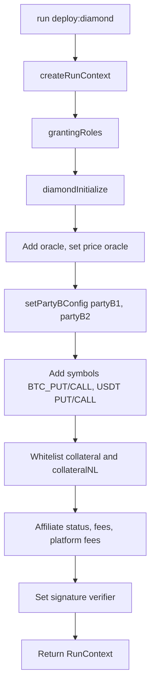

# Testing

This guide describes the Hardhat test suite under `tests/`. It explains how the central fixture composes a Diamond + helper environment, what shapes the tests use, and how to add new behavior tests.

## Overview

The suite is organized as Mocha behavior groups (`shouldBehaveLike...`) registered from `tests/main.ts:17`. Each group:

-   Loads the same fixture (`initializeTestFixture`) through `loadFixture`, so each `it` starts from a deterministic snapshot.
-   Builds typed `PartyA` / `PartyB` model wrappers around signers (`tests/models/partyA.model.ts`, `tests/models/partyB.model.ts`).
-   Calls facets through the wrapper or directly, then asserts state using `ViewFacet` getters or `revertedWithCustomError` matchers.
-   Composes inputs through `builder-pattern` builders under `tests/models/builders/`.

There are no integration tests against live Muon/oracle infrastructure; signature checks are stubbed via the `FakeOracle` and the `update_sig_checks.py` toggle (see `utils/runTest.sh:1`).

## Running Tests

| Command                                                   | What it runs                                                                                                                                      |
| --------------------------------------------------------- | ------------------------------------------------------------------------------------------------------------------------------------------------- |
| `npx hardhat test`                                        | Full suite. Reads `TEST_MODE` from env; must equal `UNIT_TEST` (`tests/main.ts:18`).                                                              |
| `npx hardhat test tests/partyB-open-facet.behavior.ts`    | Single file.                                                                                                                                      |
| `npx hardhat test tests/deferred-partyb-sell.behavior.ts` | Deferred Party B sell escrow behavior.                                                                                                            |
| `npx hardhat coverage`                                    | Solidity coverage via `solidity-coverage`. Output: `coverage/` and `coverage.json`.                                                               |
| `yarn test`                                               | Wraps `npx hardhat test` inside `symsec --project options-core run` (`package.json:79`).                                                          |
| `yarn coverage`                                           | `hardhat coverage --testfiles "tests/**/*.ts"` (`package.json:76`).                                                                               |
| `./utils/runTest.sh`                                      | Toggles in-contract `// == SignatureCheck( ==` blocks off, runs `npm test`, restores them (`utils/runTest.sh:1`, `utils/update_sig_checks.py:5`). |

Environment requirements:

-   `TEST_MODE=UNIT_TEST` — only mode currently defined in `common/test-mode.enum.ts:1`.
-   `PRIVATE_KEY` is read for non-local networks only; the default `hardhat` network does not need it (`hardhat.config.ts:15`).
-   Mocha timeout is 100,000,000 ms (`hardhat.config.ts:71`) so long fixture chains do not time out.

The `yarn test` / `yarn coverage` / `yarn compile` scripts rely on the SymSec CLI; without it, drop the wrapper and call `npx hardhat ...` directly.

## Test Layout

| Test file                                             | Protocol area                                                                                                                                                           | Flow doc                                 |
| ----------------------------------------------------- | ----------------------------------------------------------------------------------------------------------------------------------------------------------------------- | ---------------------------------------- |
| `tests/account-facet.behavior.ts`                     | Deposits, withdrawals, allocations, cross balances, suspension.                                                                                                         | `flows/account-balances.md`              |
| `tests/partyA-open-facet.behavior.ts`                 | `sendOpenIntent`, `cancelOpenIntent`, `expireOpenIntent`.                                                                                                               | `flows/open-intents.md`                  |
| `tests/partyB-open-facet.behavior.ts`                 | `lockOpenIntent`, `unlockOpenIntent`, `fillOpenIntent`, `acceptCancelOpenIntent`.                                                                                       | `flows/open-intents.md`                  |
| `tests/deferred-partyb-sell.behavior.ts`              | Deferred Party B sell escrow: isolated lock, fill conversion to cross, partial fills with residual escrow, cancel/expire/force-cancel release, bound-Party-A rejection. | `flows/open-intents.md`                  |
| `tests/partyA-close-facet.behavior.ts`                | `sendCloseIntent`, `cancelCloseIntent`, `expireCloseIntent`.                                                                                                            | `flows/close-and-settlement.md`          |
| `tests/partyB-close-facet.behavior.ts`                | `fillCloseIntent`, `acceptCancelCloseIntent`.                                                                                                                           | `flows/close-and-settlement.md`          |
| `tests/lib-closeIntent.behavior.ts`                   | `LibCloseIntent` storage operations through `CloseIntentOpsMock`.                                                                                                       | `flows/close-and-settlement.md`          |
| `tests/trade-settlement.ts`                           | `TradeFacet` settlement, exercise, expiry, NFT sync.                                                                                                                    | `flows/close-and-settlement.md`          |
| `tests/force-action.behavior.ts`                      | `ForceActionsFacet.forceCancelOpenIntent` and timeouts.                                                                                                                 | `flows/liquidation-and-force-actions.md` |
| `tests/clearing-house.ts`                             | `ClearingHouseFacet` flagging, liquidation, confiscation.                                                                                                               | `flows/liquidation-and-force-actions.md` |
| `tests/bridge-facet.behavior.ts`                      | Bridge transfer windows, allowance checks.                                                                                                                              | `flows/account-balances.md`              |
| `tests/instant-action-open.behavior.ts`               | Instant create-and-fill open intents (Party B side).                                                                                                                    | `flows/instant-actions.md`               |
| `tests/instant-action-close.behavior.ts`              | Instant create-and-fill close intents.                                                                                                                                  | `flows/instant-actions.md`               |
| `tests/instant-actions-partyb-open-facet.behavior.ts` | Party B-signed instant fill paths (by-id and by-hash).                                                                                                                  | `flows/instant-actions.md`               |
| `tests/helpers/instant-layer.behavior.ts`             | `InstantLayer` template/batch execution, signed operations.                                                                                                             | `flows/instant-actions.md`               |
| `tests/helpers/multi-account.behavior.ts`             | `MultiAccount` deploy/forward, ERC-1271, InstantLayer routing.                                                                                                          | `flows/instant-actions.md`               |
| `tests/helpers/symmio-partyb.behavior.ts`             | `SymmioPartyB` selector restrictions, multicast, approvals.                                                                                                             | `flows/instant-actions.md`               |

Top-level `tests/main.ts:17` registers `describe.only("Instant Layer", ...)` (`tests/main.ts:55`); other groups under the `UNIT_TEST` branch only run when that `.only` is removed.

## The Central Fixture

`initializeTestFixture` (`tests/initialize-test.fixture.ts:9`) is the single entry point used by every behavior file. It composes three stages:



Stages and what they do:

| Stage                         | Source                                    | Effect                                                                                                                                                                                                                                                                                                                                               |
| ----------------------------- | ----------------------------------------- | ---------------------------------------------------------------------------------------------------------------------------------------------------------------------------------------------------------------------------------------------------------------------------------------------------------------------------------------------------- |
| `run("deploy:diamond", true)` | `tasks/deployment/diamond-deploy.task.ts` | Deploys `DiamondCutFacet`, `Diamond`, `DiamondInit`, all facets in `common/constants.ts:1`, and writes `deployed.json`.                                                                                                                                                                                                                              |
| `createRunContext(diamond)`   | `tests/run-context.ts:75`                 | Allocates signers, deploys mocks, oracle, signature verifier, two `FakeStablecoin` collaterals, hook handler. Deploys `InstantLayer`, `MultiAccount`, `SymmioPartyB`. Wires every facet to the diamond address.                                                                                                                                      |
| `grantingRoles(context)`      | `tests/granting-roles.ts:6`               | `setAdmin(admin)` then grants admin: PAUSER, UNPAUSER, MANAGER, TRUSTED, SETTER, SUSPENDER, DISPUTER, WINDOW_UPDATER, PARTY_B_MANAGER, AFFILIATE_MANAGER, AFFILIATE_FEE_MANAGER, ORACLE_MANAGER, SYMBOL_MANAGER, INSTANT_LAYER, CLEARING_HOUSE. Also grants `CLEARING_HOUSE_ROLE` to `signers.clearingHouse`.                                        |
| `diamondInitialize(context)`  | `tests/diamond-init.ts:4`                 | `unpauseGlobal`, sets cooldowns (deactive instant 120, unbinding 120), `maxConnectedCounterParties=10`, `maxTradePerPartyA=10`, balance limits `e(1_000_000)` per collateral, default fee collector, `maxCloseOrdersLength=10`, affiliate fees collector, `defaultReleaseInterval=12`.                                                               |
| Symbol/oracle/Party B config  | `tests/initialize-test.fixture.ts:16-44`  | `addOracle("test oracle", oracle)`, `setPriceOracleAddress(oracle)`, two `setPartyBConfig` calls (`partyB1` lossCoverage `e(0)`, `partyB2` `e(1)`, both `oracleId=1`), four `addSymbol` calls (ids 1-4), two `setPartyBSupportedSymbolTypes` calls, two `whiteListCollateral` calls, affiliate1 status + fees, `setSymbolsPlatformFees` for ids 1-4. |
| Verifier wiring               | `tests/initialize-test.fixture.ts:54`     | `setSignatureVerifier(signatureVerifier)`.                                                                                                                                                                                                                                                                                                           |

The function signature is:

```ts
export async function initializeTestFixture(): Promise<RunContext>;
```

It is always entered through `loadFixture(initializeTestFixture)` so Hardhat snapshots the post-fixture state and reverts after each `it` (no manual snapshot/revert is used in any test).

### Fixture Roles And Accounts

Allocated in `tests/run-context.ts:79`:

| Field                   | Index | Role in tests                                                              |
| ----------------------- | ----- | -------------------------------------------------------------------------- |
| `signers.admin`         | 0     | Owns all granted roles; default `msg.sender` for `controlFacet` calls.     |
| `signers.partyA1`       | 1     | Primary trader.                                                            |
| `signers.partyA2`       | 2     | Secondary trader / counter-party in CROSS scenarios.                       |
| `signers.feeCollector`  | 3     | Default fee collector + affiliate1 collector.                              |
| `signers.partyB1`       | 4     | Active Party B, `lossCoverage=e(0)`, `oracleId=1`.                         |
| `signers.partyB2`       | 5     | Active Party B, `lossCoverage=e(1)`, `oracleId=1`.                         |
| `signers.oracle1`       | 6     | Reserved for oracle-signer scenarios.                                      |
| `signers.affiliate1`    | 7     | Whitelisted affiliate (open `e(0.01)` / close `e(0.02)`).                  |
| `signers.bridge1/2`     | 8/9   | Bridge actors for `bridge-facet.behavior.ts`.                              |
| `signers.clearingHouse` | 10    | Holds `CLEARING_HOUSE_ROLE`.                                               |
| `signers.others[0..1]`  | 11/12 | Scratch signers (used for ad-hoc affiliates, third Party A in some tests). |

### Default Symbols

| id  | name       | option | collateral     | platformFee (after init)         |
| --- | ---------- | ------ | -------------- | -------------------------------- |
| 1   | `BTC_PUT`  | PUT    | `collateral`   | open `e(0.01)` / close `e(0.02)` |
| 2   | `BTC_CALL` | CALL   | `collateral`   | open `e(0.01)` / close `e(0.02)` |
| 3   | `USDT`     | PUT    | `collateralNL` | open `e(0.01)` / close `e(0.02)` |
| 4   | `USDT`     | CALL   | `collateralNL` | open `e(0.01)` / close `e(0.02)` |

`collateral` is the whitelisted FUSD; `collateralNL` is a second whitelisted token usually passed as `feeToken` (its name "NL" is historical: it was originally the not-listed token, but the fixture whitelists it at `tests/initialize-test.fixture.ts:39`).

## RunContext

Defined in `tests/run-context.ts:29`. Tests destructure the fields they need; common patterns:

| Field                                                                      | Use                                                                                                   |
| -------------------------------------------------------------------------- | ----------------------------------------------------------------------------------------------------- |
| `controlFacet`                                                             | Pause/unpause, role grants, parameter setters (admin runs by default).                                |
| `accountFacet`                                                             | `deposit`, `allocate`, `withdraw`. Wrap with `.connect(signer)` per call.                             |
| `partyAOpenFacet` / `partyBOpenFacet`                                      | Direct facet calls for Party A/B open-intent flows.                                                   |
| `partyACloseFacet` / `partyBCloseFacet`                                    | Close-intent flows.                                                                                   |
| `viewFacet`                                                                | Read-only assertions: `getIsolatedBalance`, `getOpenIntent`, `getTrade`, etc.                         |
| `tradeFacet`, `forceActionsFacet`, `clearingHouse`, `counterPartyRelation` | Specialty facets.                                                                                     |
| `instantLayer`, `multiAccount`, `symmioPartyB`                             | Helper-contract instances pre-deployed by the fixture.                                                |
| `collateral`, `collateralNL`                                               | Two `FakeStablecoin` instances; both whitelisted, both have `mint`.                                   |
| `oracle`                                                                   | `FakeOracle`; `getPrice` returns `1e18`, `verifyTSSAndGW` is a no-op.                                 |
| `mocks.libCloseIntentMock`                                                 | `CloseIntentOpsMock` for direct library testing (`contracts/libraries/mocks/LibCloseIntentMock.sol`). |
| `signatureVerifier`                                                        | `SignatureVerifier` registered with the diamond.                                                      |
| `common.chainId`, `common.diamondAddress`                                  | Used when hashing EIP-712-like structs (`tests/utils/hash.ts:28`).                                    |

## test-mode.enum.ts

`common/test-mode.enum.ts:1` defines a single mode:

```ts
export enum TestModeEnum {
	UNIT_TEST = "UNIT_TEST",
}
```

`tests/main.ts:18` reads `process.env.TEST_MODE` and only registers behavior groups when it equals `UNIT_TEST`; any other value throws. The enum is a placeholder for future modes (e.g. integration / fuzz) — at present every test in the suite is a "unit" behavior test.

## tests/models/

Higher-level wrappers for protocol actors and request-shape builders.

| File                                                                 | Purpose                                                                                                                                                                                                                                                                   |
| -------------------------------------------------------------------- | ------------------------------------------------------------------------------------------------------------------------------------------------------------------------------------------------------------------------------------------------------------------------- |
| `tests/models/partyEntitiy.ts:9`                                     | Base class. `setBalances(collateral?, mintAmount?, depositAmount?)` mints + approves + deposits. `setNativeBalance`, `sign`.                                                                                                                                              |
| `tests/models/partyA.model.ts:8`                                     | Party A actions: `sendOpenIntent`, `sendCancelOpenIntent`, `expireOpenIntent`, `sendCloseIntent`, `sendCancelCloseIntent`, `expireCloseIntent`, binding (`bindToCounterParty`, `initiateUnbindingFromPartyB`, ...), `activateInstantActionMode`, `forceCancelOpenIntent`. |
| `tests/models/partyB.model.ts:7`                                     | Party B actions: `lockOpenIntent`, `unlockOpenIntent`, `fillOpenIntent`, `acceptCancelOpenIntent`, `acceptCancelCloseIntent`, `fillCloseIntent`.                                                                                                                          |
| `tests/models/builders/send-open-intent.builder.ts:50`               | `openIntentRequestBuilder()` — default `OpenIntent` (symbolId 1, price `e(10)`, qty `e(1)`, `BUY`, `ISOLATED`, ZeroAddress affiliate/feeToken).                                                                                                                           |
| `tests/models/builders/close-intent.builder.ts:33`                   | `closeIntentBuilder()` for `CloseIntentStruct` (storage shape).                                                                                                                                                                                                           |
| `tests/models/builders/trade.builder.ts:51`                          | `tradeBuilder()` for `TradeStruct` (used by `lib-closeIntent.behavior.ts`).                                                                                                                                                                                               |
| `tests/models/builders/settlement.builder.ts:20`                     | `settlementSigBuilder()` for `SettlementPriceSigStruct`.                                                                                                                                                                                                                  |
| `tests/models/builders/signed-open-intent.builder.ts:28`             | `signedOpenIntentBuilder()` for `SignedOpenIntentStruct` (instant actions).                                                                                                                                                                                               |
| `tests/models/builders/signed-close-intent.builder.ts:15`            | `SignedCloseIntentBuilder()` for `SignedCloseIntentStruct`.                                                                                                                                                                                                               |
| `tests/models/builders/signed-fill-intent.builder.ts:15`             | `signedFillIntentBuilder()` for `SignedFillIntentStruct` (by intent hash).                                                                                                                                                                                                |
| `tests/models/builders/signed-fill-close-intent-by-id.builder.ts:15` | `SignedFillIntentByIdBuilder()` for `SignedFillIntentByIdStruct`.                                                                                                                                                                                                         |
| `tests/models/builders/signed-simple-action-intent.builder.ts:12`    | `signedSimpleActionIntentBuilder()` for cancel / accept-cancel signed actions.                                                                                                                                                                                            |

All builders use `builder-pattern`'s `Builder(defaults)` so `.field(value).build()` chains return a fully typed struct.

## tests/utils/

| File                     | Helpers                                                                                                                                                                                                                     |
| ------------------------ | --------------------------------------------------------------------------------------------------------------------------------------------------------------------------------------------------------------------------- |
| `tests/utils/hash.ts:28` | EIP-712-like prefixed `keccak256` encoders for every signed action: open, close, fill open/close (by hash and by id), cancel/accept-cancel open/close, lock/unlock. Each takes the struct, `chainId`, and `diamondAddress`. |
| `tests/utils/log.ts:1`   | `logger` — toggleable wrapper around `console.log` (`disable()` / `enable()`).                                                                                                                                              |

Top-level `utils/` is also used heavily from tests:

| File                           | Helpers                                                                                   |
| ------------------------------ | ----------------------------------------------------------------------------------------- |
| `utils/e.ts:3`                 | `e(value)` → `ethers.parseEther(value)`. Universal "to 18 decimals" helper.               |
| `utils/time.ts:4`              | `getLatestBlockTime()`, `moveTime(seconds)` (uses `evm_setNextBlockTimestamp`).           |
| `utils/tx.ts:1`                | `runTx(promise)` — awaits the tx and `.wait()`s; used by every `PartyA/PartyB` method.    |
| `utils/runTest.sh:1`           | Disables in-contract signature checks via `update_sig_checks.py 1`, runs tests, restores. |
| `utils/update_sig_checks.py:5` | Toggles `// == SignatureCheck( ==` … `// == ) ==` blocks in Solidity sources.             |

## tests/helpers/

Behavior tests for the off-Diamond helper contracts. They share the same fixture and `RunContext`.

| File                                         | Coverage                                                                                                                                                   |
| -------------------------------------------- | ---------------------------------------------------------------------------------------------------------------------------------------------------------- |
| `tests/helpers/instant-layer.behavior.ts:28` | `InstantLayer` template execution (`OperationStruct[]` + `SignedOperationStruct[]`), source-indices/insertion-points, replay protection, salts, deadlines. |
| `tests/helpers/multi-account.behavior.ts:18` | `MultiAccount` account creation, owner-vs-InstantLayer forwarding, ERC-1271 signature validation, account routing of open/lock/fill calldata.              |
| `tests/helpers/symmio-partyb.behavior.ts:27` | `SymmioPartyB` selector allow-list, multicast, token approvals, pause behavior, ERC-1271.                                                                  |

## Writing A New Behavior Test

1.  Create `tests/<area>.behavior.ts` exporting `shouldBehaveLike<Area>(): void`.
2.  Inside the function, declare context state and `beforeEach` that loads the fixture:

    ```ts
    let context: RunContext, partyA1: PartyA, partyB1: PartyB;
    beforeEach(async () => {
    	context = await loadFixture(initializeTestFixture);
    	partyA1 = new PartyA(context, context.signers.partyA1);
    	partyB1 = new PartyB(context, context.signers.partyB1);
    	await partyA1.setBalances(context.collateral, e(100000), e(50000));
    	await partyB1.setBalances(context.collateral, e(100000), e(50000));
    });
    ```

3.  Build inputs through a builder, override only what the case needs:

    ```ts
    const blockTime = await getLatestBlockTime();
    const request = openIntentRequestBuilder()
    	.partyBsWhiteList([partyB1.address])
    	.affiliate(context.signers.affiliate1)
    	.feeToken(context.collateralNL)
    	.deadline(blockTime + 120)
    	.expirationTimestamp(blockTime + 120)
    	.build();
    ```

4.  Execute via the model wrapper or facet directly:

    ```ts
    await partyA1.sendOpenIntent(request);
    await partyB1.lockOpenIntent(1);
    await partyB1.fillOpenIntent(1, request.quantity, request.price);
    ```

5.  Assert state through `viewFacet`, balance reads, or events:

    ```ts
    const trade = await context.viewFacet.getTrade(1);
    expect(trade.status).to.equal(TradeStatus.OPENED);
    ```

6.  Register the group in `tests/main.ts` inside the `UNIT_TEST` branch.

Each `it` starts from the fixture snapshot — there is no manual `snapshot()`/`revert()` in the suite (`@nomicfoundation/hardhat-network-helpers`'s `loadFixture` handles it).

## Common Assertion Patterns

| Pattern             | Example                                                                                                                            |
| ------------------- | ---------------------------------------------------------------------------------------------------------------------------------- |
| Custom-error revert | `await expect(tx).to.be.revertedWithCustomError(context.accountFacet, "DepositingPaused")` (`tests/account-facet.behavior.ts:41`). |
| Generic revert      | `await expect(tx).not.to.reverted` (`tests/account-facet.behavior.ts:74`).                                                         |
| Balance delta       | Compare `viewFacet.getIsolatedBalance` before/after (`tests/account-facet.behavior.ts:91`).                                        |
| ERC20 balance delta | `await context.collateral.balanceOf(addr)` before/after.                                                                           |
| Status enum         | Compare against `IntentStatus.LOCKED`, `TradeStatus.OPENED`, `CloseIntentStatus.PENDING`, etc. from `tests/option-enums.ts:1`.     |
| Event emission      | Use chai-matchers `.to.emit(facet, "EventName").withArgs(...)`.                                                                    |
| Time progression    | `await network.provider.send("evm_setNextBlockTimestamp", [t])` or `moveTime(seconds)`.                                            |

## Coverage

`npx hardhat coverage` (or `yarn coverage`) runs the full suite under `solidity-coverage`. Output:

-   `coverage/` — HTML and lcov reports.
-   `coverage.json` — istanbul JSON used by CI dashboards.

Gotchas:

-   `viaIR` is enabled (`hardhat.config.ts:63`) but coverage instrumentation falls back to its own pipeline; some inline-assembly branches may report as uncovered even when exercised.
-   `tests/main.ts:55` uses `describe.only`. Run coverage with that removed if you want all groups counted.
-   Coverage runs are slow — the Mocha timeout is already raised globally to 100,000,000 ms.

## Mocks

Solidity mocks live in two places:

| Mock                                                 | Why                                                                                                                                                                                                     |
| ---------------------------------------------------- | ------------------------------------------------------------------------------------------------------------------------------------------------------------------------------------------------------- |
| `contracts/mocks/fake-stablecoin.sol:6`              | Mintable ERC20 used as both `collateral` (FUSD) and `collateralNL` (NLUSD).                                                                                                                             |
| `contracts/mocks/fake-oracle.sol:6`                  | Returns `1e18` for `getPrice` and no-ops `verifyTSSAndGW`. Lets every Muon settlement signature pass without keys.                                                                                      |
| `contracts/mocks/mock-hook-handler.sol:4`            | No-op hook for transfer-target tests.                                                                                                                                                                   |
| `contracts/libraries/mocks/LibCloseIntentMock.sol:8` | Exposes `LibCloseIntentOps` internals (`register`, `expire`, `removeFromArray`) as external functions, plus `setTrade`/`setCloseIntent` to seed storage. Drives `tests/lib-closeIntent.behavior.ts:14`. |

The fixture deploys all four through dedicated tasks (`deploy:stablecoin`, `deploy:oracle`, `deploy:hookHandler`, `deploy:mocks`).

## Known Gaps

-   **No fuzz / property-based tests** (no Foundry, no Echidna). Every test is example-based.
-   **No integration with real Muon TSS/gateway**. `FakeOracle.verifyTSSAndGW` is empty; `update_sig_checks.py` further disables in-contract signature checks during the standard run path. End-to-end signature validity is not exercised.
-   **No TradeNFT integration in the fixture**: `MultiAccount` is deployed with `tradenftaddress=ZeroAddress` (`tests/run-context.ts:147`); NFT-flow paths in `TradeFacet.transferTradeFromNFT` are not covered through the fixture.
-   **`describe.only` in `tests/main.ts:55`** narrows the default run to the Instant Layer group; CI must remove it or the rest of the suite is skipped.
-   **`partyA.initiateUnbindingFromPartyB` / `completeUnbindingFromPartyB` / `cancelUnbindingFromPartyB`** in `tests/models/partyA.model.ts:57` accept a `partyB` arg but call the facet without it — works because the facet is parameterless, but the API is misleading.
-   No coverage for `BridgeFacet` paths beyond the basic transfer windows.

## CI Considerations

-   `.husky/_/pre-commit:5` runs `npm run precommit`, which is `yarn format && yarn compile && yarn test` wrapped in `symsec --project options-core run` (`package.json:84`). Every commit therefore re-runs the full suite.
-   `lint-staged` (`package.json:95`) runs `secretlint` over staged files.
-   There is no GitHub Actions config in this repo; CI is delegated to the SymSec pipeline that owns the `symsec --project options-core` wrapper.
-   `utils/runTest.sh` is the only path that mutates Solidity sources before testing — do not invoke it from CI without ensuring the post-run `update_sig_checks.py 0` step runs even on failure.

## Code Map

| File                                                  | Purpose                                                                                  |
| ----------------------------------------------------- | ---------------------------------------------------------------------------------------- |
| `tests/main.ts`                                       | Mocha entry. Registers every behavior group under `TEST_MODE=UNIT_TEST`.                 |
| `tests/initialize-test.fixture.ts`                    | Composes diamond, helpers, roles, oracle, symbols, fees, verifier into a `RunContext`.   |
| `tests/run-context.ts`                                | `RunContext` class + `createRunContext` (signers, contract handles, helper deploys).     |
| `tests/diamond-init.ts`                               | Post-deploy parameter setup (cooldowns, limits, fee collector, release interval).        |
| `tests/granting-roles.ts`                             | Grants every operational role to admin + `CLEARING_HOUSE_ROLE` to clearing-house signer. |
| `tests/option-enums.ts`                               | TS mirrors of on-chain enums (`IntentStatus`, `TradeStatus`, `MarginType`, etc.).        |
| `tests/account-facet.behavior.ts`                     | `AccountFacet` deposit/withdraw/allocate behavior.                                       |
| `tests/partyA-open-facet.behavior.ts`                 | Open-intent creation/cancellation by Party A.                                            |
| `tests/partyB-open-facet.behavior.ts`                 | Lock/unlock/fill/cancel-accept by Party B.                                               |
| `tests/partyA-close-facet.behavior.ts`                | Close-intent creation/cancellation by Party A.                                           |
| `tests/partyB-close-facet.behavior.ts`                | Close-intent fills and accept-cancel by Party B.                                         |
| `tests/lib-closeIntent.behavior.ts`                   | Direct `LibCloseIntent` storage operations through `CloseIntentOpsMock`.                 |
| `tests/trade-settlement.ts`                           | `TradeFacet` settlement, exercise, expiry, NFT sync.                                     |
| `tests/force-action.behavior.ts`                      | `ForceActionsFacet` timeout-based forced cancellations.                                  |
| `tests/clearing-house.ts`                             | `ClearingHouseFacet` liquidation lifecycle.                                              |
| `tests/bridge-facet.behavior.ts`                      | Bridge transfer windows.                                                                 |
| `tests/instant-action-open.behavior.ts`               | Instant create-and-fill open paths.                                                      |
| `tests/instant-action-close.behavior.ts`              | Instant create-and-fill close paths.                                                     |
| `tests/instant-actions-partyb-open-facet.behavior.ts` | Party B-signed instant fills (by id and by hash).                                        |
| `tests/helpers/instant-layer.behavior.ts`             | `InstantLayer` operation/template execution and signature handling.                      |
| `tests/helpers/multi-account.behavior.ts`             | `MultiAccount` account routing and ERC-1271.                                             |
| `tests/helpers/symmio-partyb.behavior.ts`             | `SymmioPartyB` selector restrictions, multicast, ERC-1271.                               |
| `tests/models/partyEntitiy.ts`                        | Base wrapper: balances, signing.                                                         |
| `tests/models/partyA.model.ts`                        | Party A method shortcuts.                                                                |
| `tests/models/partyB.model.ts`                        | Party B method shortcuts.                                                                |
| `tests/models/builders/*.ts`                          | `builder-pattern` defaults for every request/struct shape.                               |
| `tests/utils/hash.ts`                                 | EIP-712-like keccak encoders for signed actions.                                         |
| `tests/utils/log.ts`                                  | Toggleable logger.                                                                       |
| `utils/e.ts`, `utils/time.ts`, `utils/tx.ts`          | Shared math, timing, and tx-await helpers used by tests.                                 |
| `utils/runTest.sh`, `utils/update_sig_checks.py`      | Signature-check toggle wrapper for `npm run test`.                                       |
| `contracts/mocks/*`, `contracts/libraries/mocks/*`    | Solidity mocks consumed by the fixture.                                                  |
